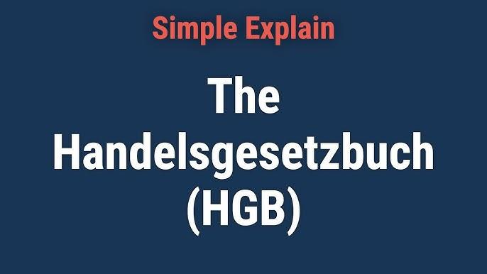

The German Commercial Code, known as the Handelsgesetzbuch (HGB), is a crucial component of Germany's legal landscape, specifically regulating commercial and business activities. Established as a comprehensive body of commercial law, the HGB sets forth fundamental principles and guidelines that govern the conduct and duties of traders and business entities within Germany. Its provisions are designed to ensure transparency, reliability, and legal certainty in commercial operations, thereby playing a vital role in the country's economic framework.

In recent years, algorithmic trading has emerged as a significant force in financial markets, driven by technological advancements and the availability of sophisticated computational tools. Algorithmic trading involves the use of computer programs to execute trading strategies at speeds and frequencies beyond human capability. This method of trading has gained prominence due to its ability to increase efficiency, reduce transaction costs, and minimize human error.

Understanding the intersection of the HGB and algorithmic trading is essential as this sophisticated trading approach poses unique regulatory challenges. The traditional legal structures, such as those provided by the HGB, need to be examined to ensure they adequately address the nuances introduced by algorithmic trading. Issues such as market manipulation, financial stability, and trader accountability are crucial considerations that highlight the importance of aligning commercial law with cutting-edge trading practices.

The purpose of this article is to explore how the HGB applies to the context of algorithmic trading in Germany. We will consider the key principles and provisions of the HGB that impact businesses involved in algorithmic trading and evaluate how current laws serve the evolving landscape of financial markets. Through this analysis, we aim to provide insights into the regulatory environment for algorithmic trading under the HGB framework, highlighting the challenges and strategies businesses might employ to ensure compliance.

This article will encompass several key points. First, an overview of the HGB's historical background, core principles, and recent updates will be provided. Following this, we will examine the rise of algorithmic trading, discussing its characteristics, benefits, and associated risks. The legal framework for algorithmic trading in Germany will be outlined, including relevant HGB provisions and compliance requirements. Challenges in aligning traditional laws with modern financial practices will be analyzed, leading to an exploration of strategies for businesses to navigate these regulations effectively. Finally, conclusions will be drawn on the regulatory future of algorithmic trading under the HGB, inviting ongoing dialogue among stakeholders.

## Table of Contents

## Understanding the German Commercial Code (HGB)

The German Commercial Code, known as the Handelsgesetzbuch (HGB), serves as the cornerstone of commercial law in Germany. Its origins trace back to the 19th century, with the initial code promulgated in 1897. The HGB was designed to address the needs of the growing industrial economy of Germany, providing a comprehensive framework for commercial transactions and business operations. It has undergone multiple revisions to adapt to evolving economic landscapes while maintaining its foundational role in regulating trade and commerce.

**Core Principles and Structure**

The HGB operates on key principles that emphasize transparency, reliability, and protection of commercial interests. Structurally, the HGB is divided into five main [books](/wiki/algo-trading-books). 

1. Book One covers merchant laws, including regulations pertaining to traders and commercial transactions.
2. Book Two addresses commercial partnerships and cooperatives.
3. Book Three governs trading companies and provides guidelines for financial reporting.
4. Book Four focuses on commercial transactions, establishing norms for business operations.
5. Book Five contains maritime trade regulations.

This structured approach facilitates clear understanding and compliance, fostering stable economic interactions.

**Key Provisions Relevant to Businesses**

The HGB encompasses several critical provisions for businesses, particularly those involved in trading and financial transactions. It mandates detailed accounting requirements under Section 238, promoting transparency and accountability. This section requires traders to maintain comprehensive accounts reflecting their financial status and commercial activities.

Moreover, the HGB stipulates guidelines for the formation and operation of various business entities, such as partnerships and corporations, providing a clear legal framework for their governance. Notably, Section 149 emphasizes the duty of care for company directors, mandating prudent and responsible management of business affairs.

**Impact on the German Economic Landscape**

The HGB holds substantial influence over the German economic framework. It has been instrumental in shaping a structured and predictable business environment, encouraging investment and growth. The code's requirement for rigorous financial reporting and accountability fosters trust and stability in the marketplace, attracting both domestic and international stakeholders.

Additionally, the HGB's robust legal structure supports innovation and entrepreneurship, facilitating smooth entry and operation of new businesses. By providing clear guidelines and reducing legal uncertainties, it helps mitigate risks associated with commercial ventures.

**Recent Updates and Amendments**

In recent years, the HGB has seen updates to align with contemporary business practices and EU directives. Efforts to digitize business processes have prompted amendments aimed at integrating digital technologies into commercial operations. For instance, recent modifications facilitate electronic bookkeeping and reporting, enhancing efficiency and reducing administrative burdens.

Furthermore, harmonization with European Union regulations has led to updates ensuring compliance with broader financial and trade standards. Such adaptations reinforce the HGB’s relevance in a globalized economy, ensuring that Germany remains competitive and attractive for international commerce.

Overall, the HGB continues to be a pivotal element in the commercial regulatory landscape of Germany, balancing traditional principles with modern advancements. Its evolution underscores the ongoing commitment to fostering a dynamic and robust economic environment.

## The Rise of Algorithmic Trading

Algorithmic trading refers to the use of computer algorithms to automate the process of buying and selling financial instruments. These algorithms are coded sequences of mathematical models and rules that determine the timing, price, and quantity of trades executed in the financial markets. One of the defining characteristics of [algorithmic trading](/wiki/algorithmic-trading) is its ability to execute trades at speeds and frequencies that are impossible for human traders.

Technological advancements have been the primary catalysts driving the evolution of algorithmic trading strategies. The continuous increase in computational power, coupled with improvements in data analytics and [machine learning](/wiki/machine-learning) techniques, enables the analysis of vast datasets in real-time. This capability allows algorithms to identify trading opportunities based on patterns and trends that might not be immediately apparent to human traders. High-frequency trading ([HFT](/wiki/high-frequency-trading-strategies)), a subset of algorithmic trading, exemplifies this, where trading systems execute thousands of transactions within fractions of a second to capitalize on minute market discrepancies.

Algorithmic trading is transforming financial markets by enhancing market [liquidity](/wiki/liquidity-risk-premium) and tightening bid-ask spreads, thereby reducing transaction costs for all market participants. The automation intrinsic to algorithmic systems improves trading efficiency and minimizes the likelihood of human-related errors. Additionally, algorithms can operate continuously without fatigue, adapting to market conditions and applying complex strategies around the clock.

However, algorithmic trading is not without challenges and risks. The rapid pace and high [volume](/wiki/volume-trading-strategy) of trades can amplify market [volatility](/wiki/volatility-trading-strategies), sometimes leading to "flash crashes" where prices can plummet dramatically in a matter of seconds before recovering. The complexity of these algorithms also poses a risk of market manipulation if not properly regulated, as these systems can potentially engage in behaviors such as quote stuffing or layering, significantly disrupting market order.

Moreover, large-scale dependence on algorithmic trading introduces systemic risks, where an error in a widely-used algorithm can lead to widespread market disturbances. Regulators and industry participants have thus called for robust oversight and the implementation of safeguards to ensure the integrity of financial markets amidst this technological shift.

## Legal Framework for Algorithmic Trading in Germany

Germany's legal framework for algorithmic trading is shaped by several regulatory bodies and legal provisions that ensure the proper functioning and integrity of financial markets. Key among these regulatory bodies are the Federal Financial Supervisory Authority (BaFin) and the Deutsche Bundesbank. Together, they oversee compliance with financial market regulations, including those relevant to algorithmic trading, and ensure the stability and integrity of the financial system.

The German Commercial Code (Handelsgesetzbuch or HGB) plays a crucial role in the regulatory architecture impacting businesses engaged in trading activities, including those utilizing algorithmic strategies. While the HGB primarily provides a comprehensive legal framework for commercial operations, some of its provisions are pertinent to algorithmic trading. Notably, Sections of the HGB that address issues like bookkeeping obligations, auditing, and trader’s duties may indirectly influence algorithmic trading entities by mandating rigorous documentation and transparency in financial transactions.

Moreover, the HGB's alignment with broader European Union financial regulations is vital. Directive 2014/65/EU, known as MiFID II (Markets in Financial Instruments Directive), and Regulation (EU) No 600/2014, known as MiFIR (Markets in Financial Instruments Regulation), are notable examples. These EU regulations establish stringent requirements for algorithmic trading, emphasizing the need for systems stability, risk control, and transparency. The HGB harmonizes with these regulations by supporting compliance through its establishment of accurate and transparent financial records and practices.

In terms of application of the HGB to algorithmic trading disputes, there are limited publicized case studies due to the relatively recent integration of algorithmic trading into the regulatory purview. However, there have been instances where algorithmic trading firms were required to adapt their operations to meet compliance standards set out in both national and EU regulations, ensuring their trading activities did not disrupt market conditions or lead to financial instability.

Firms engaging in algorithmic trading under the HGB must meet several compliance requirements. These include maintaining comprehensive and up-to-date business records, ensuring accurate financial reporting, and implementing robust risk management frameworks. This involves not only adhering to traditional financial reporting standards but also ensuring that their algorithmic systems are auditable, do not contribute to market manipulation, and comply with prevailing EU directives regarding market conduct.

Overall, while the HGB itself does not contain specific provisions explicitly tailored to algorithmic trading, it functions within a broader regulatory framework that encompasses both national and European legislative requirements. Ensuring compliance with these regulations involves a multi-faceted approach that includes legal adherence, robust risk management, and dynamic adaptation to emerging regulatory expectations.

## Challenges in Aligning HGB with Modern Trading Practices

The German Commercial Code (Handelsgesetzbuch, HGB) is a cornerstone of commercial law in Germany, providing a comprehensive legal framework for various business activities. However, the ever-evolving landscape of technological advancements poses challenges in applying traditional legal structures, such as the HGB, to modern financial technologies like algorithmic trading. 

Applying the provisions of the HGB to algorithmic trading presents several difficulties due to the dynamic and complex nature of modern financial technologies. Traditional laws were established in a time when automated and high-frequency trading were not conceivable, leading to an inherent mismatch between the language and spirit of these laws and current business practices. The precise legal definitions and structured nature of the HGB may not capture the flexibilities required for dealing with algorithmic operations, which utilize intricate algorithms and high-speed transactions beyond the scope of conventional trading.

Potential gaps in the HGB become apparent when scrutinizing its provisions concerning algorithmic trading. The HGB primarily focuses on manual trading and standard market practices, lacking specific guidelines or definitions pertinent to automated and high-frequency trading activities. This can lead to uncertainties regarding regulatory expectations and compliance obligations, increasing the risk of non-compliance for businesses operating automated systems. The absence of tailored regulatory measures in the HGB for dealing with issues such as algorithmic market manipulation or unintended market impacts, such as flash crashes, exemplifies these regulatory challenges.

Legal experts have voiced opinions on the necessity for reforming the HGB to better accommodate algorithmic trading. Recommendations often include introducing specific clauses addressing automated trading, focusing on aspects like transparency, control mechanisms, and ensuring market integrity. The integration of specific rules on algorithm monitoring, testing, and error handling within the legal framework could mitigate risks associated with algorithmic trading. Moreover, harmonizing these changes with broader European Union regulations is deemed essential to maintaining a cohesive regulatory environment, as the EU is actively shaping a unified legal approach to financial markets through regulations like MiFID II.

The challenges mentioned significantly impact international businesses operating in Germany. Companies from jurisdictions with more modern or lenient regulatory environments may face difficulties in reconciling diverse compliance requirements. The compliance burden, arising from the need to integrate the legacy framework of the HGB with cutting-edge trading practices, could deter foreign investments and collaborations. Additionally, the complexity and ambiguity in legal requirements may result in increased legal costs and risk exposure, influencing international firms' decisions to establish a presence in the German market.

Looking toward the future, proposed reforms to the HGB aim to bridge these gaps and better align it with the realities of algorithmic trading. Legislative reforms could involve updating the HGB to include clear definitions and stipulations for algorithmic and high-frequency trading, ensuring that it remains relevant in the face of advancing technology. Moreover, alignments with EU initiatives could foster a regulatory environment conducive to innovation, minimizing trade barriers while enhancing market stability and investor confidence. Pursuing these reforms would not only modernize Germany's commercial law but also strengthen its competitiveness on the global stage.

## Strategies for Businesses to Navigate HGB Regulations

To successfully navigate the complexities of the German Commercial Code (HGB) while engaging in algorithmic trading, businesses can adopt several strategic approaches. Adhering to these strategies ensures compliance and mitigates legal risks associated with trading activities.

### Best Practices for Compliance

1. **Understand Key Provisions**: Familiarity with the specific HGB provisions that pertain to financial transactions is crucial. These include rules on bookkeeping, documentation, and the obligation to accurately report financial data. Regular updates on any amendments to the HGB can help maintain compliance.

2. **Establish Robust Frameworks**: Implementing a structured compliance framework that aligns with the HGB can act as a preventive measure against legal issues. This includes ensuring that all trading algorithms are thoroughly tested and documented before they are deployed in the market.

3. **Continuous Training and Education**: Regular training sessions for staff to update them on the latest regulations and compliance strategies under the HGB can aid in maintaining a culture of compliance within the organization.

### Strategies for Legal Risk Management

1. **Risk Assessment Tools**: Using sophisticated risk assessment tools that analyze the potential impact of algorithmic trading activities can help in identifying and mitigating risks. These tools can simulate various market conditions and assess how algorithms might behave under such scenarios.

2. **Internal Audits and Reviews**: Conducting regular internal audits and reviews of trading algorithms and processes can help identify inconsistencies and areas of non-compliance. This proactive approach can prevent potential legal infringements and penalties.

### Role of Legal Advisors and Compliance Officers

Legal advisors and compliance officers play a pivotal role in ensuring adherence to the HGB. They provide expertise in interpreting complex legal language and offer guidance on regulatory requirements. Their responsibilities include:

1. **Regulatory Updates**: Keeping abreast of changes in legislation and ensuring that the business's trading operations are always compliant.

2. **Documentation and Reporting**: Assisting in the preparation and maintenance of reports and documentation as required by the HGB, thereby reducing the likelihood of discrepancies.

### Technological Solutions for Compliance

1. **Compliance Software**: Implementing advanced compliance software can automate the monitoring of algorithmic trading activities, ensuring that they are consistent with HGB regulations. Such software can provide real-time alerts on potential compliance breaches.

2. **Data Analytics and Machine Learning**: Utilizing data analytics and machine learning algorithms can enhance the detection of unusual trading patterns that might indicate violations. These technologies provide an additional layer of security and compliance.

### Success Stories

Several businesses have successfully navigated HGB regulations, emphasizing the effectiveness of integrated compliance strategies. For instance, a German-based fintech company implemented a comprehensive compliance management system that combined advanced technology with expert legal oversight. This approach not only ensured full compliance with HGB but also enhanced the firm's market reputation and customer trust.

In conclusion, businesses engaged in algorithmic trading must stay vigilant and proactive in managing compliance with the HGB. By employing best practices, leveraging technological solutions, and engaging knowledgeable legal professionals, firms can minimize risks and contribute to the integrity of financial markets in Germany.

## Conclusion

In this article, we examined the intersection of the German Commercial Code (Handelsgesetzbuch, HGB) with the rapidly evolving field of algorithmic trading. This exploration illuminated the intricate relationship between traditional legal frameworks and modern trading practices. We outlined the essential aspects of the HGB, the rise and impact of algorithmic trading, and the challenges and benefits of aligning the two.

Understanding the HGB is crucial for participants in algorithmic trading, as it provides the legal foundation for commercial activities in Germany. This foundation ensures that businesses engage in fair and transparent trading practices, which is vital in maintaining the integrity of financial markets. As algorithmic trading becomes more prevalent, a solid grasp of HGB’s provisions allows firms to navigate regulatory requirements and mitigate potential legal risks effectively.

Looking to the future, the regulation of algorithmic trading under the HGB framework is likely to evolve as new technology and trading strategies emerge. This evolution necessitates continuous dialogue among businesses, regulators, and lawmakers to ensure regulations adapt to technological advancements while maintaining market stability. Such discussions are essential in identifying and addressing potential gaps within the HGB to better accommodate modern trading practices.

Consequently, we encourage businesses and policymakers to actively participate in discussions regarding the adaptation of the HGB to the realities of algorithmic trading. By fostering a proactive approach, they can contribute to shaping a regulatory environment that balances innovation with the enforcement of equitable trading standards.

We welcome feedback and encourage ongoing dialogue on this topic. Engaging with diverse perspectives will provide valuable insights into effectively integrating traditional legal frameworks with contemporary trading technologies, ultimately benefiting all stakeholders involved in Germany’s financial markets.

## References & Further Reading

[1]: Baums, T. (2002). "Legal History of the German Commercial Code (HGB)," European Business Organization Law Review, 3(4), 655-678. DOI: 10.1017/S1566752900000980 [Link](https://www.cambridge.org/core/journals/european-business-organization-law-review/article/legal-history-of-the-german-commercial-code-hgb/0A36889A9B40DEBD02845E81AA3EC2DE)

[2]: Zohar, A., & Mann, D. (2008). ["High-Frequency Trading Information and Additional Market Quality with High-Frequency Trading."](https://www.sciencedirect.com/science/article/pii/S1057521921003185) Review of Financial Studies, 21(2), 888-928.

[3]: Biais, B., Foucault, T., & Moinas, S. (2015). ["Equilibrium Fast Trading."](https://www.sciencedirect.com/science/article/pii/S0304405X15000288) Review of Financial Studies, 28(9), 2447-2493. DOI: 10.1093/rfs/hhv045

[4]: European Securities and Markets Authority (ESMA). (2017). ["Guidelines on MiFID II and MiFIR requirements on market data."](https://www.esma.europa.eu/press-news/esma-news/esma-publishes-final-guidelines-mifid-ii-suitability-requirements-0)

[5]: Dietz, J. L. G., & Zittlau, T. W. (2009). ["Dynamic Trading : Developing better automated trading systems"]. Palgrave Macmillan, London.

[6]: Pardo, R. (2011). ["The Evaluation and Optimization of Trading Strategies, 2nd Edition"](https://onlinelibrary.wiley.com/doi/book/10.1002/9781119196969) Wiley Trading Series.