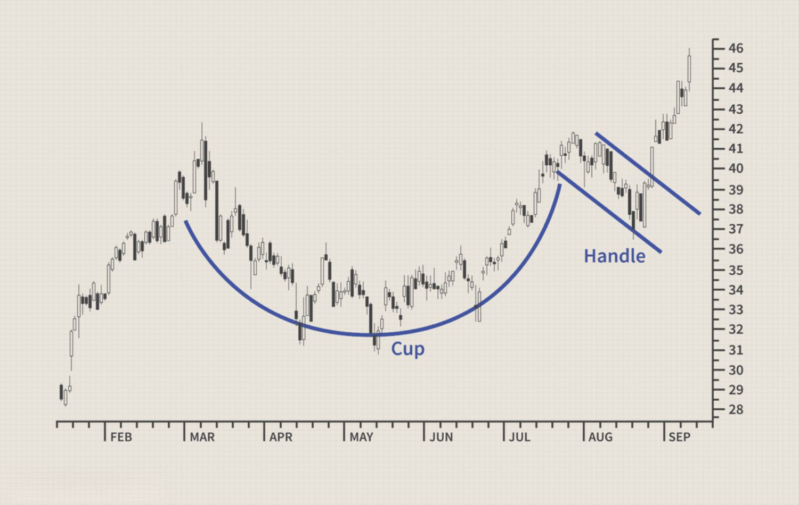

## Table of Contents

## What is a handle in trading?

A handle in trading is a term used to describe the whole number part of a stock's price. For example, if a stock is trading at $50.75, the handle would be 50. This term is especially common in the futures market where prices can change rapidly, and traders use it as a quick way to communicate about price levels.

Handles are important because they help traders quickly understand where the price of a security is, without getting into the details of the smaller changes. For instance, if someone says the handle of a stock moved from 50 to 51, it means the stock price went up from something like $50.xx to $51.xx. This can be useful in fast-paced trading environments where every second counts.

## How does a handle relate to stock prices?

A handle in trading is the big number part of a stock's price. If a stock costs $45.25, the handle is 45. It's like the main part of the price that traders watch closely. When the handle changes, it means the stock price has moved a lot. For example, if the handle goes from 45 to 46, the stock price went up from something like $45.xx to $46.xx.

Handles are important because they help traders talk about prices quickly and easily. In busy trading places, people need to understand prices fast. Saying "the handle moved" is a short way to say the price changed a lot. This helps traders make quick decisions without getting lost in small details.

## Can you explain the significance of a handle in the context of futures trading?

In futures trading, a handle is really important because it helps traders talk about prices quickly. If a futures contract is trading at $1250.50, the handle is 1250. When traders say the handle changed, it means the price moved a lot. For example, if the handle goes from 1250 to 1260, the price went up from $1250.xx to $1260.xx. This is useful in fast-moving markets where every second counts.

Handles make it easier for traders to understand big price changes without focusing on the smaller details. In a busy trading environment, saying "the handle moved" is a quick way to tell others that the price shifted significantly. This helps traders make fast decisions and keep up with the market's pace.

## What is the difference between the handle and the tick in trading?

In trading, the handle and the tick are two different ways to talk about price changes. The handle is the big number part of a price. For example, if a stock or futures contract is trading at $50.25, the handle is 50. It's like the main part of the price that traders watch closely. When the handle changes, it means the price has moved a lot, like from $50.xx to $51.xx.

The tick, on the other hand, is the smallest change in price that a security can make. For example, if a stock moves from $50.25 to $50.26, that change of one cent is a tick. Ticks are important for understanding the tiny movements in price, which can add up over time. While the handle tells you about big changes, ticks help traders see the small steps in between.

## How can traders use the handle to make trading decisions?

Traders can use the handle to make quick and smart trading decisions by watching for big changes in the price. If the handle of a stock or futures contract moves, it means the price has changed a lot. For example, if a stock's handle goes from 50 to 51, it shows the stock price went up from $50.xx to $51.xx. Traders can use this information to decide if it's a good time to buy or sell. If they see the handle moving up, they might think the price will keep going up and decide to buy. If the handle is going down, they might want to sell to avoid losing money.

Handles are also useful for talking about prices quickly with other traders. In a busy trading environment, saying "the handle moved" is a fast way to tell others that the price changed a lot. This helps traders work together and make decisions faster. By keeping an eye on the handle, traders can stay on top of big price movements and react before the market changes too much.

## What are some common strategies involving the handle in trading?

Traders often use the handle to spot big price moves and decide when to buy or sell. If the handle of a stock or futures contract goes up, like from 50 to 51, it means the price jumped a lot. Traders might see this and think the price will keep going up, so they buy. If the handle goes down, like from 51 to 50, traders might think the price will keep falling and decide to sell to avoid losing money. Watching the handle helps traders make quick decisions based on big changes in the market.

Another strategy is using the handle to set price targets. Traders might decide to buy a stock if the handle reaches a certain number, like 50, hoping it will go up to 51 or higher. They might also set a sell order if the handle drops to a certain level, like from 51 to 50, to limit their losses. By using the handle as a guide, traders can plan their trades and manage their risks better.

## How does the concept of a handle apply to different financial markets?

The idea of a handle is used in different financial markets like stocks, futures, and [forex](/wiki/forex-system). In the stock market, if a stock is trading at $45.25, the handle is the big number part, which is 45. Traders watch the handle to see big changes in the stock's price. If the handle moves from 45 to 46, it means the stock price went up a lot. This helps traders make quick decisions about buying or selling based on big price movements.

In the futures market, the handle is also important because prices can change very fast. If a futures contract is trading at $1250.50, the handle is 1250. Traders use the handle to talk about prices quickly and easily. If the handle goes from 1250 to 1260, it means the price jumped a lot. This helps traders in busy markets understand big price changes without getting lost in small details. In the forex market, the handle works the same way, helping traders spot big moves in currency prices and make fast trading decisions.

## What are the psychological impacts of handle changes on traders?

When the handle of a stock or futures contract changes, it can make traders feel different emotions. If the handle goes up, like from 50 to 51, traders might feel happy and excited because it means the price went up a lot. They might think the price will keep going up and decide to buy more. But if the handle goes down, like from 51 to 50, traders might feel worried or scared. They might think the price will keep falling and decide to sell to avoid losing money. These big changes in the handle can make traders feel strong emotions that affect their decisions.

Handles can also make traders feel more confident or nervous. When the handle moves, it's a clear sign that something big is happening in the market. Traders might feel more sure about their trades if they see the handle moving in the direction they expected. But if the handle moves against what they thought would happen, they might feel nervous and doubt their trading plan. Watching the handle can make traders feel like they need to act quickly, which can add to the stress and excitement of trading.

## Can you discuss any historical examples where handle changes significantly impacted the market?

One big example of handle changes affecting the market happened in the stock market crash of 1987, also known as Black Monday. On October 19, 1987, the Dow Jones Industrial Average dropped a lot, with the handle going down from around 2246 to 1738 in one day. This big drop in the handle made traders and investors very scared. They started selling their stocks quickly because they thought the prices would keep going down. This panic selling made the market crash even worse, showing how a big change in the handle can make people feel and act differently.

Another example is from the futures market, specifically the oil market in 2020. In April 2020, the price of oil futures went negative for the first time ever. The handle of the West Texas Intermediate (WTI) [crude oil](/wiki/crude-oil) futures contract went from around 18 to -37 in just a few weeks. This huge change in the handle shocked traders and investors. They had to quickly decide what to do with their oil contracts because they didn't want to take delivery of oil at a negative price. This big handle change showed how fast things can change in the futures market and how it can make people feel worried and unsure.

## How do electronic trading platforms display and handle changes?

Electronic trading platforms show handle changes in a clear way to help traders see big price moves quickly. When you look at a stock or futures contract on these platforms, the price is usually split into the handle and the smaller part. For example, if a stock is trading at $50.25, the platform might show "50" as the handle in a big, bold way, and "25" as the smaller part. If the handle changes, like from 50 to 51, the platform will make this change stand out so traders can see it right away. This helps traders know when the price has moved a lot and make fast decisions.

These platforms also use colors and sounds to show handle changes. If the handle goes up, the price might turn green, and if it goes down, it might turn red. Some platforms even make a sound when the handle changes, like a beep or a ding. This way, traders can hear the change even if they are not looking at the screen all the time. By using these visual and audio cues, electronic trading platforms make it easy for traders to keep track of big price movements and react quickly to the market.

## What advanced techniques can traders use to predict handle movements?

Traders can use technical analysis to predict handle movements. They look at charts and use tools like moving averages, trend lines, and support and resistance levels to see where the price might go next. If the price is close to a big support level and the handle is at 50, traders might think the handle will stay at 50 or go up to 51. They also watch for patterns like head and shoulders or double tops, which can show if the price is likely to move a lot. By studying these patterns and levels, traders can guess if the handle will change and plan their trades accordingly.

Another way to predict handle movements is by using [fundamental analysis](/wiki/fundamental-analysis). Traders look at news and reports about the company or the economy to see if the price might go up or down. If a company is doing well and the news is good, traders might think the handle will go up. If there's bad news or the economy is struggling, they might expect the handle to go down. By combining technical and fundamental analysis, traders can make better guesses about handle movements and make smarter trading decisions.

## How can understanding the handle improve risk management in trading?

Understanding the handle can help traders manage risk better by letting them see big price changes quickly. If the handle of a stock or futures contract moves, like from 50 to 51, it means the price went up a lot. Traders can use this information to set stop-loss orders, which are like safety nets that sell the stock if the price drops too much. By watching the handle, traders can decide where to put these stop-loss orders to limit their losses if the price goes down. This way, they can protect their money and not lose too much if the market moves against them.

Handles also help traders plan their trades and manage risk by setting clear price targets. If a trader thinks the handle will go up from 50 to 51, they can set a goal to sell the stock when it reaches 51. This helps them know when to take profits and not get too greedy. On the other hand, if the handle starts to go down, traders can use it as a sign to sell and cut their losses before they get too big. By using the handle to guide their trading decisions, traders can manage their risk better and make smarter choices about when to buy and sell.

## References & Further Reading

[1]: Lo, A. W. (2016). ["What is an Index? The View from Financial Economics."](https://www.pm-research.com/content/iijpormgmt/42/2/21) SSRN Electronic Journal.

[2]: Aldridge, I. (2013). ["High-Frequency Trading: A Practical Guide to Algorithmic Strategies and Trading Systems"](https://onlinelibrary.wiley.com/doi/pdf/10.1002/9781119203803.fmatter) (2nd ed.). Wiley.

[3]: Derman, E. (1999). ["The Mathematics of Financial Models."](https://emanuelderman.com/regimes-of-volatility-risk-april-1999/) Columbia University.

[4]: Kissell, R. (2014). ["The Science of Algorithmic Trading and Portfolio Management."](https://www.sciencedirect.com/book/9780124016897/the-science-of-algorithmic-trading-and-portfolio-management) Elsevier.

[5]: Hasbrouck, J., & Saar, G. (2013). ["Low-Latency Trading."](https://www.sciencedirect.com/science/article/abs/pii/S1386418113000165) The Review of Financial Studies, 24(5), 1507-1543.