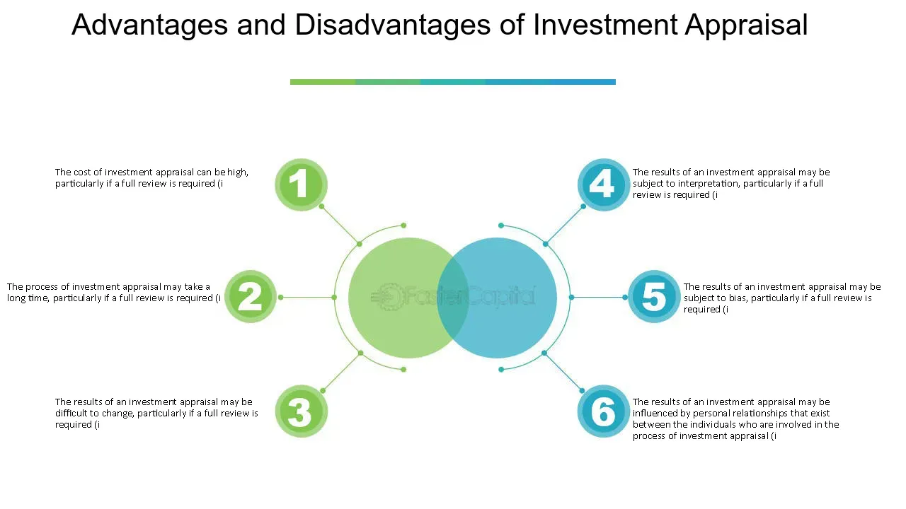

## Table of Contents

## What is a hands-off investment strategy?

A hands-off investment strategy is when you invest your money and then don't need to do much after that. It's like setting it and forgetting it. This type of strategy is good for people who don't want to spend a lot of time watching their investments or making decisions about them every day.

One common hands-off investment is a target-date fund. You pick a fund based on when you want to retire, and the fund managers take care of the rest. They change the investments over time to make sure your money is safe and growing. Another option is index funds, which track a part of the market like the S&P 500. You buy the fund and it automatically follows the market, so you don't have to do anything else.

## How does a hands-off investment strategy differ from an active investment strategy?

A hands-off investment strategy, also known as a passive strategy, is when you invest your money and then leave it alone to grow over time without much intervention. This approach is great for people who don't want to spend a lot of time managing their investments. With a hands-off strategy, you might choose investments like index funds or target-date funds, which require minimal action after the initial investment. The idea is to let the market do its thing and benefit from long-term growth without the need for constant adjustments.

On the other hand, an active investment strategy involves a lot more work and decision-making. People who use this approach often buy and sell investments frequently, trying to beat the market by [picking](/wiki/asset-class-picking) the right stocks or timing their trades perfectly. This requires a lot of research, monitoring, and sometimes quick decisions. Active investors believe that by being hands-on, they can achieve higher returns than they would with a passive strategy, but it also comes with higher risks and costs.

In summary, the main difference between the two strategies is the level of involvement. A hands-off strategy is about setting up your investments and then stepping back, while an active strategy is about constantly managing and adjusting your portfolio in an attempt to maximize returns. Both approaches have their pros and cons, and the best choice depends on your personal goals, time, and how much risk you're willing to take.

## What are the basic types of hands-off investments?

Hands-off investments are great for people who want to invest their money but don't want to spend a lot of time managing it. One common type of hands-off investment is an index fund. An index fund is a type of investment that follows a specific part of the market, like the S&P 500. When you invest in an index fund, you're basically buying a little bit of all the companies in that index. This means you don't have to pick individual stocks, and you can just let the fund grow over time.

Another type of hands-off investment is a target-date fund. This kind of fund is designed for people saving for retirement. You pick a fund based on the year you plan to retire, and the fund managers take care of the rest. They change the mix of investments over time to make sure your money is safe and growing. This means you can set it up and then not worry about it until you're ready to retire.

A third type of hands-off investment is a robo-advisor. A robo-advisor is a service that uses computer algorithms to manage your investments for you. You tell the robo-advisor about your goals and how much risk you're willing to take, and it picks and manages your investments automatically. This is a good option if you want some personalization but still don't want to do the work yourself.

## What are the potential advantages of a hands-off investment strategy for beginners?

A hands-off investment strategy is really good for beginners because it's easy to understand and doesn't take a lot of time. When you start investing, it can be hard to know what to do and how to do it. With a hands-off strategy, you can just pick an index fund, a target-date fund, or use a robo-advisor, and then you don't have to worry about it much after that. This means you can learn about investing without feeling overwhelmed by having to make a lot of decisions right away.

Another big advantage is that hands-off investing can help you avoid making mistakes. When you're new to investing, it's easy to get nervous and make quick decisions that might not be good for your money. By choosing a hands-off strategy, you're letting professionals or automatic systems handle your investments, which can lead to better results over time. Plus, it's less stressful because you're not constantly watching the market or trying to figure out what to do next.

## Can you explain the concept of passive income in relation to hands-off investing?

Passive income is money you earn without having to work for it actively every day. When you invest in a hands-off way, like with index funds or target-date funds, you're setting up a way to earn passive income. The idea is that you put your money into these investments, and over time, they grow and give you money back, either through interest, dividends, or by increasing in value. This means you can earn money without having to do much after your initial investment, which is why it's called passive income.

Hands-off investing is a great way to create passive income because it's easy to manage. You don't need to spend a lot of time watching your investments or making decisions about them. Instead, you can focus on other things in your life while your money works for you. This can be really helpful for beginners because it lets you start [earning](/wiki/earning-announcement) passive income without needing to be an expert in investing right away.

## What are the common fees associated with hands-off investment options?

When you choose hands-off investment options like index funds, target-date funds, or robo-advisors, you'll usually have to pay some fees. These fees can be different depending on what you choose. For index funds and target-date funds, you might pay something called an expense ratio. This is a small percentage of your investment that the fund takes each year to cover their costs. The good news is that these fees are often pretty low, especially for index funds, which can have expense ratios as low as 0.03% or even less.

Robo-advisors also charge fees, but they work a bit differently. Instead of an expense ratio, robo-advisors usually charge a percentage of the money you have invested with them. This fee can be around 0.25% to 0.50% of your total investment each year. Some robo-advisors might also charge extra for things like financial planning or tax advice. It's important to look at these fees because even though they might seem small, they can add up over time and affect how much money you make from your investments.

## How does diversification play a role in a hands-off investment strategy?

Diversification is really important in a hands-off investment strategy because it helps spread out your risk. When you invest in a hands-off way, like with index funds or target-date funds, you're usually putting your money into a bunch of different things all at once. This means if one investment doesn't do well, it's okay because you have other investments that might be doing better. It's like not putting all your eggs in one basket. By diversifying, you make your investments safer and more likely to grow over time without you having to do much.

For example, if you invest in an index fund that follows the S&P 500, you're automatically getting a piece of a lot of different companies. This spreads your risk across many businesses in different industries. Target-date funds also do this by mixing stocks, bonds, and other investments in a way that changes over time to keep your money safe. So, even though you're not actively picking and choosing your investments, diversification is still working for you in the background, making your hands-off strategy more effective and less risky.

## What are the risks and disadvantages of adopting a hands-off investment approach?

One of the main risks of a hands-off investment approach is that you might not get the highest possible returns. Since you're not actively managing your investments, you might miss out on opportunities to buy or sell at the best times. If the market goes down, your hands-off investments will go down too, and you won't be able to do much about it until things get better. Also, even though these investments are usually low-cost, you still have to pay fees like expense ratios or robo-advisor fees, which can eat into your returns over time.

Another disadvantage is that you have less control over your investments. With a hands-off strategy, you're trusting someone else or an algorithm to make decisions for you. If the fund managers or the robo-advisor make a bad choice, your money could be affected. Plus, if your financial goals or situation changes, it might be harder to adjust your investments quickly. You might need to wait for the fund to rebalance or for the robo-advisor to make changes, which could take time.

## How can one assess the performance of a hands-off investment portfolio?

To assess the performance of a hands-off investment portfolio, you should look at how much your investments have grown over time. This means checking the total value of your portfolio and comparing it to what you started with. You can do this by looking at your account statements or using an online investment platform that shows your portfolio's performance. It's also helpful to see if your investments are doing better than the overall market. For example, if you're invested in an S&P 500 index fund, you can compare your returns to how the S&P 500 has been doing.

Another way to assess your hands-off investment portfolio is by looking at the fees you're paying. Even though these investments are meant to be low-cost, the fees can still affect your returns. Make sure to check the expense ratio for funds or the management fee for robo-advisors. If these fees are too high, they might be eating into your profits. It's also a good idea to see if your portfolio is diversified enough. A well-diversified portfolio should have a mix of different types of investments, which can help reduce risk and improve performance over time.

## What are some advanced hands-off investment vehicles and how do they work?

One advanced hands-off investment vehicle is a robo-advisor with tax-loss harvesting. This is a fancy way of saying that the robo-advisor not only picks and manages your investments but also looks for ways to save you money on taxes. If one of your investments loses value, the robo-advisor might sell it to claim a tax loss, then buy a similar investment to keep your portfolio balanced. This can help lower your tax bill without you having to do anything. It's like having a smart computer that not only invests your money but also tries to save you money on taxes.

Another advanced option is a separately managed account (SMA). This is a bit like a personal investment account managed by professionals. With an SMA, you own the individual securities directly, but a professional manager makes the decisions for you. This can be more personalized than a typical hands-off investment because the manager can tailor the investments to your specific needs and goals. It's still hands-off because you don't have to make the day-to-day decisions, but it can be more expensive than simpler options like index funds or basic robo-advisors.

## How does tax efficiency factor into a hands-off investment strategy?

Tax efficiency is important in a hands-off investment strategy because it can help you keep more of your money. When you invest in things like index funds or target-date funds, you want to make sure you're not losing too much to taxes. Some investments are better at this than others. For example, index funds often have lower turnover, which means they buy and sell investments less often. This can lead to fewer capital gains taxes, which is good for you because you get to keep more of your returns.

Another way to make your hands-off investments more tax-efficient is by using a robo-advisor with tax-loss harvesting. This means the robo-advisor will look for chances to sell investments that have lost value, which can help lower your taxes. Then, it will buy similar investments to keep your portfolio balanced. This way, you don't have to do anything, but you still get the benefit of saving on taxes. So, even though you're not actively managing your investments, choosing the right hands-off options can still help you be smart about taxes.

## What are the long-term considerations and potential outcomes of a hands-off investment strategy?

A hands-off investment strategy can be a good choice for the long term because it's easy to stick with and doesn't require a lot of work. Over many years, these investments can grow a lot, especially if you keep adding money to them regularly. For example, if you invest in an index fund that follows the S&P 500, your money could grow at the same rate as the market, which historically has been around 7-10% per year on average. This means that over 20 or 30 years, your initial investment could turn into a much larger sum, helping you reach goals like retirement or buying a house.

However, there are also some things to think about in the long run. One is that hands-off investments might not give you the highest possible returns because you're not actively trying to beat the market. If the market goes through a bad period, your investments will go down too, and you won't be able to do much about it until things get better. Also, even though the fees are usually low, they can add up over time and take a bite out of your returns. But if you're okay with these risks and you want a simple way to invest for the future, a hands-off strategy can still help you build wealth over the long term without a lot of stress.

## References & Further Reading

[1]: Malkiel, B. G. (2003). ["A Random Walk Down Wall Street: The Time-Tested Strategy for Successful Investing"](https://yourknowledgedigest.org/wp-content/uploads/2020/04/a-random-walk-down-wall-street.pdf). W.W. Norton & Company.

[2]: Bogle, J. C. (1999). ["Common Sense on Mutual Funds: New Imperatives for the Intelligent Investor"](https://www.researchgate.net/publication/245704247_Common_Sense_on_Mutual_Funds_New_Imperatives_for_the_Intelligent_Investor). John Wiley & Sons.

[3]: Fama, E. F., & French, K. R. (1993). ["Common risk factors in the returns on stocks and bonds"](https://www.sciencedirect.com/science/article/pii/0304405X93900235). Journal of Financial Economics, 33(1), 3-56.

[4]: Sharpe, W. F. (1991). ["The Arithmetic of Active Management"](https://web.stanford.edu/~wfsharpe/art/active/active.htm). The Financial Analysts Journal, 47(1), 7-9.

[5]: Hougan, M., & Ferri, R. (2018). ["Index Funds: The 12-Step Recovery Program for Active Investors"](https://www.amazon.com/Index-Funds-12-Step-Recovery-Investors/dp/0976802317). Huff, Robeco.

[6]: Narang, R. K. (2009). ["Inside the Black Box: The Simple Truth About Quantitative Trading"](https://onlinelibrary.wiley.com/doi/book/10.1002/9781118267738). John Wiley & Sons.