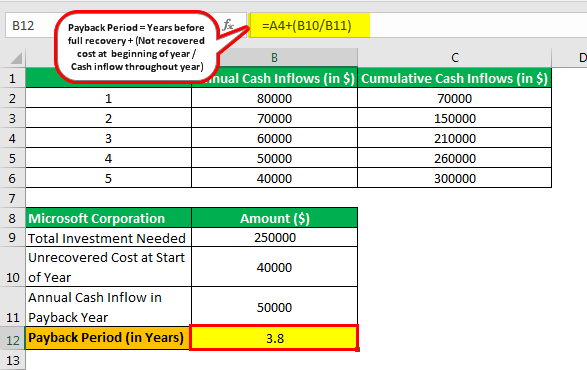

In the world of investing, strategies span a continuum from active management to fully passive investing. Active management involves frequent buying and selling of securities, aiming to outperform market indices through expert selection and timing. In contrast, passive investing is designed for those who prefer minimizing their day-to-day involvement in investment decisions. By focusing on long-term growth, passive strategies typically involve holding investments over extended periods, largely ignoring short-term market fluctuations and trends.

Passive investing advocates for a "buy and hold" approach, leveraging market efficiency rather than attempting to beat it. This method assumes that markets are generally efficient and that trying to identify mispriced securities through constant research and analysis is routinely less effective. As a result, passive investing usually incurs lower costs, since it avoids frequent trading expenses and extensive management fees associated with active approaches.



Index funds and exchange-traded funds (ETFs) are popular instruments used in passive investing. These funds aim to replicate the performance of a particular index, offering broad market exposure with minimal trading activity. They enable investors to achieve diversified portfolios without the need for constant monitoring and decision-making, aligning with the passive investing philosophy.

This article explores the hands-off approach of passive investing, highlighting its benefits and drawbacks. It considers how algorithmic trading, a technological advancement, can further enhance a passive strategy by automating the investment process and reducing the need for human intervention. The role of algorithmic tools is examined to illustrate their effectiveness in maintaining a disciplined investment approach. Through an exploration of these facets, we aim to equip modern investors with the knowledge to determine if passive investing aligns with their financial goals and lifestyle.

## Table of Contents

## What is Passive Investing?

Passive investing is an investment strategy characterized by the minimization of trading activities and a focus on achieving long-term gains through a 'buy and hold' approach. This strategy hinges on the belief that markets are generally efficient, making it difficult for investors to consistently outperform market indices through active trading.

The primary vehicles utilized in passive investing include index funds and Exchange-Traded Funds (ETFs). These instruments are designed to replicate the performance of specific market indices, offering investors broad exposure to different sectors or asset classes. For example, an index fund might track the performance of the S&P 500, which represents a diverse spectrum of 500 large U.S. companies. By investing in these funds, investors can achieve a level of diversification that would be challenging to replicate through individual stock selection.

The appeal of passive investing lies largely in its simplicity and cost-effectiveness. Management fees for index funds and ETFs are typically lower than those associated with actively managed funds. This is because passive funds merely aim to mirror the performance of an index, rather than attempting to beat it through frequent trading or strategic stock [picking](/wiki/asset-class-picking). Consequently, investors benefit from reduced transaction costs and fewer administrative fees, which can significantly enhance net returns over time.

Furthermore, passive investing aligns well with the Efficient Market Hypothesis (EMH), which posits that asset prices reflect all available information and thus represent their true value. Proponents of this hypothesis argue that it is difficult for investors to achieve consistently better-than-market returns, as available information is already factored into stock prices. As a result, passive investors typically avoid the pitfalls of market timing and emotional decision-making, which can lead to suboptimal performance.

This approach is particularly advantageous for investors who prefer a hands-off strategy, allowing them to focus on other aspects of their financial and personal lives without constant monitoring of their investments. By adhering to a long-term perspective, passive investors can potentially reap the benefits of compound interest and market growth over time, providing a reliable path to wealth accumulation.

## The Hands-Off Investor

A hands-off investor is characterized by their minimal engagement in the continuous management of their investment portfolio. This style aligns with the philosophy of market efficiency, which posits that financial markets are capable of reflecting all available information at any given time, thereby ensuring that securities are fairly priced. Consequently, hands-off investors embrace the belief that financial markets, over the long term, exhibit a natural upward trajectory. Historical data supports this notion, demonstrating that despite short-term [volatility](/wiki/volatility-trading-strategies), major stock indices tend to appreciate in value over extended periods.

Such investors predominantly rely on a "buy and hold" strategy, where investments are purchased with the intent of retaining them for an extended duration. This inclination stems from the understanding that frequent trading can incur higher transaction fees and may expose investors to increased risks arising from market fluctuations and emotional decision-making.

The characteristics of hands-off investors are well-suited to individuals with limited time or expertise for active investment management. They often possess a disciplined approach, preferring set-and-forget strategies that require infrequent monitoring, thereby allowing their investments to compound over time. Tools like index funds and exchange-traded funds (ETFs) are popular among these investors because they offer diversification and exposure to entire market segments or indices with minimal oversight.

For those not proficient in evaluating individual stocks or economic trends, hands-off investing provides a viable pathway to market participation without the need to constantly follow market news or assess trading opportunities. This strategy is particularly practical for those who are busy with careers or personal commitments that preclude active investing. Moreover, the psychological benefit of a passive approach helps to insulate investors from the stress and volatility that can occur with more active trading strategies.

## Benefits of Passive Investing

Passive investing offers several advantages, making it a popular choice among investors seeking long-term gains with minimal involvement. Research indicates that passive investors often achieve superior returns compared to their active counterparts primarily due to lower costs and diminished emotional biases. 

One of the most significant benefits of passive investing is the reduction in transaction fees. Active trading strategies often involve frequent buying and selling of securities, which can accumulate substantial transaction costs over time. In contrast, passive investing usually entails lower turnover, thus minimizing these expenses and enhancing overall returns. For instance, index funds, a common passive investment vehicle, are designed to mimic the performance of a benchmark index. This structure inherently results in fewer transactions and consequently lower fees.

Reduced market timing risks also contribute to the appeal of passive investing. Active investors often attempt to time the market, buying low and selling high, which requires predicting market movements. This approach can be fraught with error, as even seasoned investors may struggle to consistently predict short-term market fluctuations. Passive investors, on the other hand, adopt a "buy and hold" strategy. By maintaining their investments over extended periods, they can capitalize on the historical upward trend of markets, thus sidestepping the pitfalls associated with market timing.

Portfolio diversification is a further advantage offered by passive investing. Vehicles such as index funds and exchange-traded funds (ETFs) inherently provide broad market exposure, encompassing a wide array of sectors and industries. This diversification helps mitigate risk since the performance of the portfolio is not overly reliant on any single asset or sector.

There are common misconceptions about passive investing, particularly concerning market underperformance. Critics often argue that passive strategies inherently limit potential gains by adhering to a benchmark. However, empirical studies suggest that due to their lower fees and consistent exposure to market gains, passive investments frequently outperform actively managed funds, especially over longer periods.

In summary, the benefits of passive investing include lower transaction costs, reduced market timing risks, and inherently diversified portfolios. These advantages, supported by empirical research, often result in better long-term returns compared to active management. By adopting a passive approach, investors can effectively align their portfolios with market trends, ensuring consistent and disciplined exposure to financial markets.

## Drawbacks of Passive Investing

Passive investing, while advantageous for many, is not without its drawbacks. One of the primary concerns is its inherent lack of flexibility in asset allocation. Unlike active strategies that dynamically adjust holdings to leverage market conditions, passive investing largely adheres to predefined asset allocations. This rigidity can result in missed opportunities during periods of market volatility or when specific sectors outperform others.

Another potential pitfall is the possibility of underperformance during certain market fluctuations. Because passive strategies typically follow indices or broad market trends, they may not be nimble enough to respond to rapid changes. For example, in a bull market dominated by a few high-[growth stocks](/wiki/growth-stocks), a broad market index fund may lag behind more concentrated portfolios that hold those outperforming stocks.

Moreover, passive investors may miss out on short-term gains. Active trading strategies can capitalize on market inefficiencies and short-term price movements that are typically ignored by passive strategies. While the buy-and-hold philosophy champions long-term growth over short-term speculation, it may not appeal to investors looking to benefit from short-term market conditions.

It is also worth considering the issue of tracking error. While index funds aim to replicate the performance of a given index, various factors such as fund expenses and cash holdings can lead to deviations from the index's performance. Although tracking error is generally minimal, it can be an important consideration for investors seeking precise index replication.

Ultimately, potential passive investors should weigh these drawbacks against the benefits to determine if this strategy aligns with their investment goals and risk tolerance. While passive investing provides a structured approach to building wealth with reduced effort and cost, its passive nature may not satisfy all investors' strategies or financial objectives.

## Algorithmic Trading and Passive Investing

Algorithmic trading can significantly enhance a passive investing strategy by incorporating automation into the investment process. This technology-driven approach uses algorithms to automate the buying and selling of securities based on pre-set parameters such as market conditions, risk tolerance, and investment goals. This not only streamlines the execution process but also ensures that the strategy remains disciplined and free from emotional biases that can negatively affect investment decisions.

Trading algorithms are designed to execute trades at optimal times by analyzing vast amounts of market data in real-time. This capability aligns well with passive investing, which typically emphasizes long-term market participation over short-term gains. By employing algorithms, passive investors can maintain a consistent investment strategy without the need for constant manual monitoring and adjustment. This consistency is particularly beneficial in passive investing, where the goal is to track market indices or sectors over time, minimizing deviations from the desired asset allocation.

Technology plays a crucial role in enabling these strategies. Algorithmic trading platforms typically offer tools for [backtesting](/wiki/backtesting), which allow investors to assess the potential performance of an algorithm-based strategy using historical data. This feature helps refine algorithms before they are deployed in live market environments, ensuring they are robust and tailored to meet specific investment objectives. Additionally, automated systems reduce the likelihood of human error and emotional trading, as decisions are based purely on data and preset rules.

Common algorithmic tools include Moving Average Crossover strategies, where a buy or sell decision is triggered when a short-term moving average crosses a long-term moving average, indicating a potential change in trend. Another example is the use of [momentum](/wiki/momentum) strategies, which buy securities that have performed well over a certain period while selling those that have underperformed. These tools are not exclusive to active traders but are increasingly being adopted by passive investors to maintain their investment stance with minimal intervention.

Moreover, the integration of [artificial intelligence](/wiki/ai-artificial-intelligence) and [machine learning](/wiki/machine-learning) in [algorithmic trading](/wiki/algorithmic-trading) platforms is further enhancing their applicability in passive strategies. These technologies enable algorithms to learn from market conditions and adapt over time, potentially improving the predictive power of investment models and allowing a more refined approach to maintaining asset allocations.

Overall, algorithmic trading serves as a valuable extension to the passive investing toolkit by offering a level of automation that complements the hands-off nature of this investment strategy. By minimizing human intervention, maintaining discipline, and utilizing advanced technological tools, passive investors can potentially enhance their portfolio performance while adhering to their long-term investment plans.

## Rebalancing for Hands-Off Investors

Regular portfolio rebalancing is a crucial aspect of passive investing, ensuring that the desired asset allocations remain intact over time. While passive investing embraces a 'buy and hold' philosophy, market fluctuations can naturally cause an investor's portfolio to deviate from its original allocation. Rebalancing addresses these shifts, aligning the portfolio with predetermined long-term investment goals.

The importance of rebalancing lies in its ability to manage risk and maintain a strategic allocation of assets. As time progresses, differing asset class returns can lead to an unbalanced portfolio, increasing exposure to riskier asset classes or reducing the potential for growth from more stable ones. Rebalancing prevents such drifts, reinforcing investment discipline and mitigating the effects of market volatility.

Several methods exist for effective portfolio rebalancing. 

1. **Calendar Rebalancing**: This method involves setting specific intervals, such as quarterly or annually, to examine and adjust the portfolio. While simple, it may not account for significant market movements that occur between these intervals.

2. **Threshold Rebalancing**: Rather than relying on time alone, this technique focuses on relative asset weight changes. Rebalancing is triggered when an asset class deviates beyond a predefined threshold, such as 5% from its target allocation. This ensures timely adjustments based on market dynamics.

3. **Hybrid Rebalancing**: Combining elements of both calendar and threshold strategies, this approach reassesses the portfolio at set intervals, but only triggers rebalancing if assets exceed specific thresholds. It offers flexibility and responsiveness to market conditions.

For hands-off investors, rebalancing can be seamlessly integrated into a passive investing strategy through automation. Many brokerage firms and robo-advisors offer automated rebalancing services that execute transactions based on user-defined parameters, reducing the need for investor intervention. This automation aligns with the core principles of passive investing, utilizing technology to maintain strategic asset allocations without extensive manual oversight.

In Python, for example, automated rebalancing can be programmed as follows:

```python
def rebalance_portfolio(portfolio, target_allocations, threshold):
    for asset, current_percentage in portfolio.items():
        target_percentage = target_allocations.get(asset, 0)
        if abs(current_percentage - target_percentage) > threshold:
            # Logic to buy/sell assets to rebalance
            print(f'Rebalancing {asset}: current {current_percentage}%, target {target_percentage}%')

portfolio = {'stocks': 60, 'bonds': 30, 'cash': 10}
target_allocations = {'stocks': 50, 'bonds': 40, 'cash': 10}
threshold = 5
rebalance_portfolio(portfolio, target_allocations, threshold)
```

This simple function assesses current allocations against targets, triggering rebalancing actions if deviations exceed the threshold. Such methods illustrate how hands-off investors can leverage automation in maintaining their investment strategies.

Rebalancing is an essential tool for maintaining the integrity and objectives of a passive investment portfolio. By systematically restoring asset allocations to their intended proportions, investors can enjoy the benefits of reduced risk and consistent alignment with financial goals.

## Tax Considerations

Passive investing offers numerous advantages, including simplicity and reduced costs, but it is crucial to consider the tax implications to maximize net returns. Tax considerations can significantly influence the effectiveness of a passive strategy, particularly for hands-off investors who may not regularly engage with their portfolios. Key areas of focus include capital gains, tax-efficient funds, and strategies like tax-loss harvesting.

### Capital Gains

Capital gains are the profits realized when an asset is sold for more than its purchase price. In the context of passive investing, understanding how and when these gains are taxed is essential. The United States tax code distinguishes between short-term and long-term capital gains: 

- **Short-term capital gains**: These apply to assets held for one year or less and are typically taxed at ordinary income tax rates, which can be as high as 37%.
- **Long-term capital gains**: Assets held for more than one year qualify for long-term capital gains tax rates, significantly lower, ranging from 0% to 20% depending on an individual's taxable income.

To minimize tax impact, passive investors should aim to hold investments for more than a year, thereby qualifying for long-term capital gains treatment. This aligns well with the buy-and-hold strategy central to passive investing.

### Tax-Efficient Funds

Tax-efficient funds help investors minimize the tax impact on their returns. These funds are structured to reduce taxable events, such as frequent buying and selling, and often distribute lower dividends and capital gains. Index funds and exchange-traded funds (ETFs) are popular choices for passive investors due to their inherent tax efficiency:

- **Index Funds**: These funds track specific market indices, resulting in less turnover and, therefore, fewer taxable events.
- **ETFs**: Offer additional tax efficiency through the "in-kind" creation and redemption process, which allows investors to shuffle holdings without triggering capital gains.

By opting for these tax-efficient vehicles, passive investors can optimize their tax liabilities and enhance their after-tax returns.

### Tax-Loss Harvesting

Tax-loss harvesting is a strategy where investors sell securities at a loss to offset capital gains from other investments, thereby reducing taxable income. For passive investors, especially those who may not actively manage their portfolios, engaging with this strategy can lead to notable tax savings. Here is a brief example in Python to illustrate the concept:

```python
def calculate_tax_savings(loss, tax_rate):
    return loss * tax_rate

# Assume a loss of $5,000 and a tax rate of 25%
loss = 5000
tax_rate = 0.25
tax_savings = calculate_tax_savings(loss, tax_rate)
print(f"Tax savings from harvesting losses: ${tax_savings}")
```

In this example, a $5,000 loss at a 25% tax rate results in $1,250 in tax savings. By strategically timing these losses, investors can further minimize their tax burdens.

### Managing Investments in Taxable Accounts

When managing a portfolio, it is vital to consider the type of account in which assets are held. Taxable accounts subjects the investor to capital gains tax whenever a sale transaction occurs, while tax-advantaged accounts, like IRAs and 401(k)s, offer deferred tax benefits. To optimize tax outcomes in taxable accounts, investors should:

- Prioritize holding tax-efficient funds.
- Implement tax-loss harvesting when applicable.
- Aim for long-term holding periods to benefit from lower tax rates.

By carefully selecting investment vehicles and employing strategies to minimize taxes, passive investors can improve their net returns and effectively manage their portfolios with minimal intervention.

## Conclusion: Is Passive Investing for You?

Passive investing might not be for everyone, but it offers a compelling option for those who seek minimal involvement in their investment activities while gaining disciplined market exposure. This strategy is particularly appealing to individuals who prefer a long-term approach, relying on the historical trend of market growth to build wealth.

The decision to adopt passive investing depends on an individual's financial objectives, risk tolerance, and personal preferences. One of the key advantages of passive investing is its cost efficiency. Due to lower transaction costs and management fees, passive investing can potentially yield higher net returns over time compared to active investing, which involves frequent buying and selling. Moreover, passive investors can avoid the emotional biases often associated with market timing and stock picking.

On the other hand, passive investing may not suit those who desire more control over their investment choices or those who thrive on actively managing their portfolios. During short-term market fluctuations, passive funds may underperform compared to actively managed ones, which might take advantage of specific market conditions. Moreover, the lack of flexibility in asset allocation can be a consideration for investors looking for more tailored solutions.

As you consider whether passive investing aligns with your financial strategy, it's crucial to evaluate your available resources, willingness to accept market risks, and how much time you can dedicate to monitoring and adjusting your investments. Your risk appetite plays a significant role in this decision. If you're comfortable with a strategy that embraces the broader market's ups and downs, passive investing can be a prudent choice. However, if your financial goals require a more hands-on approach with opportunities for rapid adjustments, active management might better suit your needs.

In conclusion, determining if passive investing is right for you involves careful thought about your long-term financial plan and personal circumstances. Weighing the pros and cons will guide you in selecting an approach that best fits your life situation and investment goals. Whether you prioritize reduced involvement, lower costs, or greater control over your portfolio, aligning these factors with your objectives will help in making a well-informed decision about your investment strategy.

## References & Further Reading

[1]: Malkiel, B. G. (2003). ["A Random Walk Down Wall Street: The Time-Tested Strategy for Successful Investing"](https://yourknowledgedigest.org/wp-content/uploads/2020/04/a-random-walk-down-wall-street.pdf). W.W. Norton & Company.

[2]: Bogle, J. C. (1999). ["Common Sense on Mutual Funds: New Imperatives for the Intelligent Investor"](https://www.researchgate.net/publication/245704247_Common_Sense_on_Mutual_Funds_New_Imperatives_for_the_Intelligent_Investor). John Wiley & Sons.

[3]: Fama, E. F., & French, K. R. (1993). ["Common risk factors in the returns on stocks and bonds"](https://www.sciencedirect.com/science/article/pii/0304405X93900235). Journal of Financial Economics, 33(1), 3-56.

[4]: Sharpe, W. F. (1991). ["The Arithmetic of Active Management"](https://web.stanford.edu/~wfsharpe/art/active/active.htm). The Financial Analysts Journal, 47(1), 7-9.

[5]: Hougan, M., & Ferri, R. (2018). ["Index Funds: The 12-Step Recovery Program for Active Investors"](https://www.amazon.com/Index-Funds-12-Step-Recovery-Investors/dp/0976802317). Huff, Robeco.

[6]: Narang, R. K. (2009). ["Inside the Black Box: The Simple Truth About Quantitative Trading"](https://onlinelibrary.wiley.com/doi/book/10.1002/9781118267738). John Wiley & Sons.