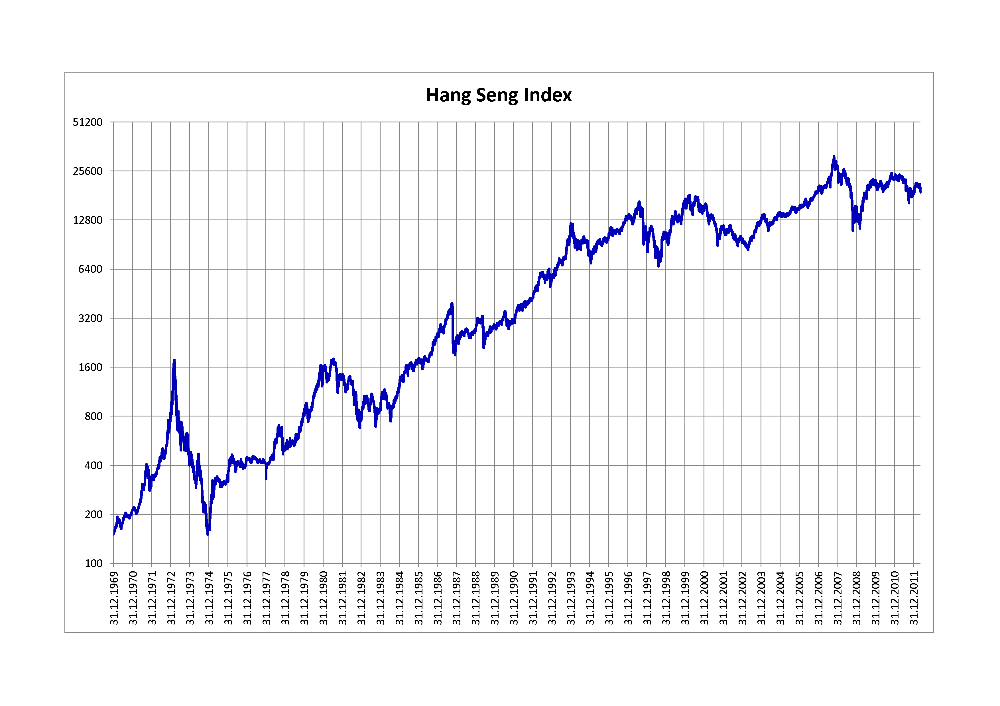

## Table of Contents

## What is the Hang Seng Index?

The Hang Seng Index is a stock market index that measures the performance of the largest companies listed on the Hong Kong Stock Exchange. It is like a scorecard that shows how well these big companies are doing. People use it to understand the overall health of the Hong Kong stock market and the economy.

The index includes around 50 companies from different industries, like finance, real estate, and technology. It is calculated using the prices of these companies' stocks. When the Hang Seng Index goes up, it usually means that the stock market and the economy are doing well. When it goes down, it can mean that there are problems or worries in the market.

## How is the Hang Seng Index calculated?

The Hang Seng Index is calculated using a method called the free-float adjusted market capitalization-weighted method. This means that the index takes into account the total value of the companies included in it, but only counts the shares that are available for the public to buy and sell. Each company's influence on the index depends on its size and how many of its shares are freely available.

To calculate the index, you start with a base value set at a specific point in time. Then, you track the changes in the total market value of the companies in the index. If the total value goes up, the index goes up. If the total value goes down, the index goes down. The index is updated every few seconds during trading hours to reflect the latest stock prices.

This method helps make sure that the Hang Seng Index accurately shows how the Hong Kong stock market is doing. It gives more weight to bigger companies and those with more shares available to the public, which makes the index a good reflection of the overall market performance.

## What companies are included in the Hang Seng Index?

The Hang Seng Index includes about 50 of the biggest companies listed on the Hong Kong Stock Exchange. These companies come from different industries, like banking, real estate, and technology. Some well-known companies in the index are HSBC Holdings, which is a big bank, and AIA Group, which is an insurance company. Another important company is Tencent Holdings, known for its technology and social media services.

The list of companies in the Hang Seng Index changes sometimes. A special group called the Hang Seng Index Advisory Committee decides which companies should be in the index. They look at things like how big the company is and how much its shares are traded. This helps make sure the index always shows a good picture of the Hong Kong stock market.

## How often is the Hang Seng Index updated?

The Hang Seng Index is updated very often during the trading day. It gets a new value every few seconds when the Hong Kong Stock Exchange is open. This means that if you are watching the index during trading hours, you will see its value change many times as the prices of the stocks in the index go up and down.

Outside of trading hours, the Hang Seng Index keeps the last value it had when the market closed. So, if you check the index after the market has closed for the day, you will see the same number until trading starts again the next day. This way, people can always have the latest information about how the index is doing when the market is open.

## What is the historical performance of the Hang Seng Index?

The Hang Seng Index has had many ups and downs over the years. It started in 1969 with a base value of 100. Since then, it has seen big growth, especially during the 1980s and 1990s when Hong Kong's economy was booming. For example, in the late 1990s, the index reached over 16,000 points, which was a record at that time. However, it also faced big drops, like during the Asian Financial Crisis in 1997 when it fell sharply due to economic problems in the region.

In more recent years, the Hang Seng Index has continued to go through big changes. It reached an all-time high of over 33,000 points in early 2018, showing strong growth in Hong Kong's stock market. But it has also seen big falls, like during the global financial crisis in 2008 and during the COVID-19 pandemic in 2020. These ups and downs show how the index is affected by both local and global economic events. Overall, the Hang Seng Index gives a good picture of how the Hong Kong stock market has performed over time.

## How does the Hang Seng Index influence the Hong Kong economy?

The Hang Seng Index is like a report card for the Hong Kong economy. When the index goes up, it often means that people feel good about the economy and are willing to invest in companies in Hong Kong. This can help businesses grow because they can get more money to expand and create jobs. On the other hand, if the index goes down, it can make people worried about the economy. This might make them less likely to invest, which can slow down business growth and affect the economy negatively.

The index also affects how people around the world see Hong Kong. If the Hang Seng Index is doing well, it can make other countries think that Hong Kong is a good place to invest. This can bring more money into the city, which helps the economy grow. But if the index is not doing well, it might make people from other countries less interested in investing in Hong Kong. So, the Hang Seng Index is important because it not only shows how the local economy is doing but also influences how the rest of the world sees Hong Kong's economic health.

## What are the criteria for a company to be included in the Hang Seng Index?

To be included in the Hang Seng Index, a company must meet certain rules set by the Hang Seng Index Advisory Committee. One important rule is that the company must be one of the biggest in Hong Kong, based on how much its shares are worth. Another rule is that the company's shares must be traded a lot, so people buy and sell them often. The company also needs to have a good amount of its shares available for the public to buy and sell, not just kept by the company or a few big investors.

The committee also looks at how the company fits into different industries in Hong Kong. They want the index to show a good mix of companies from banking, real estate, technology, and other important areas. This helps make sure the index gives a true picture of the whole Hong Kong economy. The committee checks these rules regularly and can change which companies are in the index to keep it up to date with the market.

## How does the Hang Seng Index compare to other major stock indices like the Dow Jones or the Nikkei?

The Hang Seng Index, the Dow Jones Industrial Average, and the Nikkei 225 are all important stock market indices, but they represent different markets and economies. The Hang Seng Index shows how the biggest companies in Hong Kong are doing. It includes about 50 companies from different industries like banking and technology. The Dow Jones, on the other hand, is based in the United States and tracks 30 big companies, mostly from industries like finance and technology. The Nikkei 225 is from Japan and follows the performance of 225 large companies listed on the Tokyo Stock Exchange.

These indices can move differently because they are affected by different things. For example, the Hang Seng Index might go up or down because of news about China or Hong Kong's economy. The Dow Jones might change because of news about the U.S. economy or big American companies. The Nikkei 225 could be influenced by events in Japan or changes in the global economy. Even though they all show how stock markets are doing, they each give a picture of a different part of the world.

## What are the major factors that affect the Hang Seng Index?

The Hang Seng Index is affected by many things, both from inside Hong Kong and from around the world. One big [factor](/wiki/factor-investing) is what's happening in China's economy because Hong Kong is closely connected to China. If China's economy is doing well, it can help the companies in the Hang Seng Index grow and make the index go up. But if there are problems in China, like a slowdown or trade issues, it can make the index go down. Another important factor is how people feel about the economy. If investors think the future looks good, they will buy more stocks, which pushes the index up. If they are worried, they might sell their stocks, making the index go down.

Global events also play a big role in the Hang Seng Index. For example, if there is a big financial crisis somewhere else in the world, like the one in 2008, it can make the index drop because investors get scared and pull their money out of the market. Changes in interest rates set by big countries like the United States can also affect the index. If interest rates go up, it can make borrowing more expensive for companies, which might slow down their growth and affect the index. Overall, the Hang Seng Index is influenced by a mix of local and global factors, making it go up and down based on what's happening in the economy and the world.

## How can investors use the Hang Seng Index to make investment decisions?

Investors can use the Hang Seng Index to understand how the Hong Kong stock market is doing overall. If the index is going up, it might mean that the economy is doing well and it could be a good time to invest in companies listed on the Hong Kong Stock Exchange. On the other hand, if the index is going down, it might be a sign that there are problems in the economy, and investors might want to be careful or wait before putting their money into stocks. By watching the index, investors can get a sense of whether it's a good time to buy, sell, or hold onto their investments.

Another way investors can use the Hang Seng Index is by looking at the performance of different industries within the index. Since the index includes companies from banking, real estate, technology, and other sectors, investors can see which parts of the economy are doing well and which ones are not. If the technology companies in the index are doing better than others, for example, an investor might decide to put more money into tech stocks. By paying attention to these trends, investors can make smarter choices about where to invest their money based on what the Hang Seng Index is showing them about the market.

## What are the different sub-indices within the Hang Seng Index and what do they represent?

The Hang Seng Index has several sub-indices that help investors understand different parts of the Hong Kong market. One important sub-index is the Hang Seng Finance Index, which shows how banks and other financial companies are doing. Another one is the Hang Seng Properties Index, which tracks the performance of real estate companies. There's also the Hang Seng Utilities Index, which focuses on companies that provide services like electricity and water. These sub-indices give investors a closer look at specific industries within the Hong Kong economy.

Another set of sub-indices includes the Hang Seng Commerce & Industry Index, which covers companies in trade and manufacturing. The Hang Seng Technology Index is also important because it follows the performance of tech companies, which are a big part of the Hong Kong market these days. By looking at these sub-indices, investors can see which sectors are doing well and which ones might be facing challenges. This helps them make better decisions about where to put their money, depending on what's happening in different parts of the economy.

## How has the methodology of the Hang Seng Index evolved over time?

The way the Hang Seng Index is calculated has changed over time to make it better at showing how the Hong Kong market is doing. When it started in 1969, the index used a simple way of adding up the prices of the stocks. But as time went on, the people who manage the index decided to use a new method called the free-float adjusted market capitalization-weighted method. This new way looks at how much the companies are worth but only counts the shares that people can actually buy and sell. This change made the index more accurate because it gave more weight to bigger companies and those with more shares available to the public.

Another big change happened in how the companies in the index are picked. At first, the index just included the biggest companies in Hong Kong. But now, the Hang Seng Index Advisory Committee looks at more things like how often the stocks are traded and how well they fit into different industries. This helps make sure the index shows a good mix of companies from banking, real estate, technology, and other important areas. These changes have helped the Hang Seng Index stay up to date and give a true picture of the Hong Kong economy.

## References & Further Reading

[1]: ["Hang Seng Indexes Company Limited"](https://www.hsi.com.hk/) - Official website of the Hang Seng Indexes Company, providing detailed information about index composition, performance, and methodology.

[2]: Fabozzi, F. J., Focardi, S. M., & Kolm, P. N. (2010). ["Quantitative Equity Investing: Techniques and Strategies."](https://www.semanticscholar.org/paper/Quantitative-Equity-Investing%3A-Techniques-and-Fabozzi-Focardi/1c49a2a53919f7e65cb96f16691b8ff726fd3cd7) John Wiley & Sons.

[3]: ["Advances in Financial Machine Learning"](https://www.amazon.com/Advances-Financial-Machine-Learning-Marcos/dp/1119482089) by Marcos Lopez de Prado - Explores machine learning techniques and their applications in trading strategies.

[4]: "Algorithmic Trading" by Ernie Chan (2013) - Offers insights into creating automated strategies and includes examples relevant to multiple indices, including Asian markets.

[5]: ["Machine Learning for Algorithmic Trading"](https://github.com/stefan-jansen/machine-learning-for-trading) by Stefan Jansen - An in-depth resource covering machine learning methodologies for constructing advanced trading strategies.