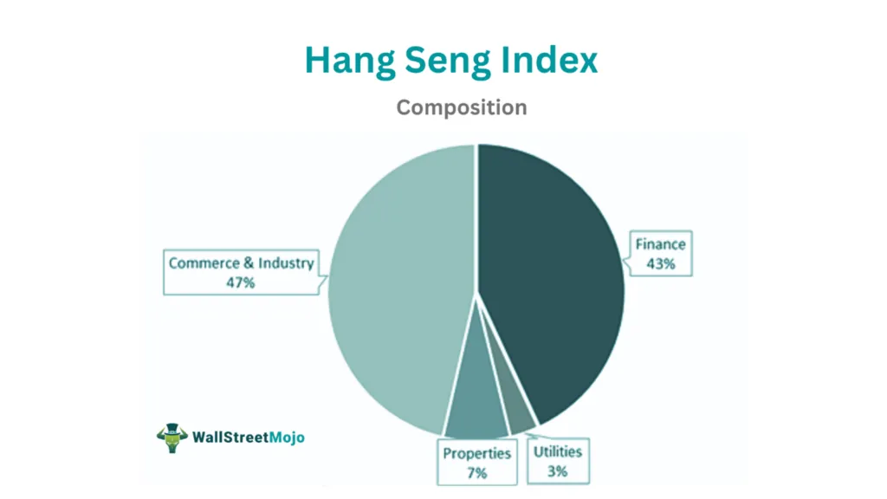

The Hang Seng Index (HSI) stands as a prominent financial index, representing the largest and most liquid companies listed on the Hong Kong Stock Exchange. Established in 1969, the HSI serves as a key benchmark for tracking the performance of the Hong Kong stock market, often reflecting the economic health and market sentiment of Hong Kong and its integration with the global financial system.

In recent years, algorithmic trading has garnered increased attention and adoption within the financial sector. This sophisticated approach utilizes pre-programmed instructions or algorithms to execute trades, allowing for enhanced speed, accuracy, and efficiency. Algorithmic trading enables traders to exploit market opportunities at a scale and speed that is unattainable for human traders alone. This growth in algorithmic trading is driven by advancements in technology and a more data-driven approach to financial markets.



The purpose of this article is to explore the intricacies of the Hang Seng Index and its relevance within the context of algorithmic trading. Understanding the HSI is crucial for algorithmic traders because it provides insights into market movements, trends, and opportunities specific to the Hong Kong Stock Exchange. By comprehensively understanding financial indices like the HSI, algorithmic traders can devise more informed trading strategies, optimize their algorithms’ performance, and potentially improve their market outcomes.

## Table of Contents

## Understanding the Hang Seng Index

The Hang Seng Index (HSI) is a prominent financial indicator, launched on November 24, 1969, by HSI Services Limited, a wholly-owned subsidiary of Hang Seng Bank. Its creation was driven by the need for a reliable benchmark to represent the Hong Kong stock market. Historically, the HSI holds significant importance as it reflects the performance of the largest and most liquid companies in Hong Kong. It aims to capture 60% of the total market capitalization on the Hong Kong Stock Exchange (HKEX).

The HSI is composed of a selection of companies based on their market capitalization, ensuring that only the most influential entities are represented. As of the latest updates, the index is made up of 64 constituent companies, covering a broad spectrum of the Hong Kong economy. These components are regularly reviewed to ensure they accurately reflect the business environment.

Functioning as a barometer, the HSI provides insights into the health and trends of the Hong Kong stock market. Due to Hong Kong’s status as a major financial hub in Asia, the HSI is often viewed as a proxy for investor sentiment in the region. Fluctuations in the HSI can indicate economic trends, investment flows, and potential geopolitical impacts affecting the region.

The HSI encompasses various sectors, offering a diversified representation of the market. These sectors include Finance, Utilities, Properties, and Commerce & Industry. The Finance sector typically holds a substantial weight within the index, reflecting Hong Kong's strong position in global banking and financial services. Properties include real estate and related services, indicative of Hong Kong’s dynamic real estate market. The Utilities sector covers essential services like electricity and gas, while Commerce & Industry captures entities involved in a range of industries including telecommunications, technology, and consumer goods.

In summary, the Hang Seng Index serves not only as a gauge for the Hong Kong stock market but also as an essential tool for investors and analysts worldwide seeking to understand the economic landscape of one of Asia’s key financial centers.

## Algorithmic Trading: An Overview

Algorithmic trading, often referred to as algo trading, is a method of executing trades using pre-programmed instructions that account for variables such as timing, price, and [volume](/wiki/volume-trading-strategy). By leveraging algorithms, traders can automatically execute orders at optimal conditions without the need for manual intervention, thereby improving efficiency and effectiveness in financial markets. This style of trading plays a significant role in modern finance due to its ability to enhance trade execution quality and manage complex trading strategies that would be challenging to handle manually.

One of the primary benefits of [algorithmic trading](/wiki/algorithmic-trading) is speed. Algorithms can process market data and execute trades at a fraction of a second, significantly faster than any human trader. This speed advantage allows traders to capitalize on short-lived opportunities that arise from market movements. Furthermore, algorithmic trading enhances accuracy by removing human error from trade execution. Once programmed correctly, these algorithms stick to their predefined strategies without deviation, ensuring a consistent approach to trading.

Scalability is another significant advantage of algorithmic trading. An algorithm can simultaneously monitor multiple markets and asset classes, allowing for a diversified trading strategy without the need for additional personnel. This capability enables traders and institutions to manage large portfolios efficiently.

Algorithmic trading strategies vary widely and can be tailored to specific market conditions or objectives. Common strategies include:

1. **Trend Following**: This strategy involves algorithms that identify and capitalize on trends in market prices. It is based on the assumption that securities that have performed well in the past will continue to do so.

2. **Arbitrage**: Algorithms seek to exploit price discrepancies between different markets or instruments. By executing trades that offset these discrepancies, they can lock in risk-free profits.

3. **Market Making**: This strategy involves providing liquidity to the market by simultaneously offering to buy and sell certain securities and profiting from the spread between buy and sell prices.

4. **Statistical Arbitrage**: This involves using statistical models to find pricing inefficiencies in correlated stocks or assets and executing trades to profit from these inefficiencies.

5. **Mean Reversion**: This strategy is based on the notion that prices will revert to their historical averages over time. Algorithms identify when a security is deviating significantly from its average and execute trades to benefit from the expected reversion.

The rise of algorithmic trading can be attributed to advancements in technology and the availability of vast amounts of market data. Global financial markets have increasingly adopted electronic trading platforms that support algorithmic trading, further driving its growth. This evolution is particularly evident in high-frequency trading ([HFT](/wiki/high-frequency-trading-strategies)), where firms use sophisticated algorithms to conduct numerous trades at exceptionally high speeds.

The growing complexity of financial instruments also necessitates the use of algorithmic trading. With markets becoming more interconnected and instruments more elaborate, traders rely on algorithms to navigate this complexity and exploit new trading opportunities. This trend is expected to continue as technology advances further, making algorithmic trading an integral part of the global trading landscape.

## Algo Trading on the Hang Seng Index

Algorithmic trading, a method that uses computer algorithms to execute trades at high speed and precision, is increasingly being applied to the Hang Seng Index (HSI). This is due to the index's significant role in the financial markets, representing the performance of the largest companies listed on the Stock Exchange of Hong Kong. Here’s how algorithmic trading is leveraged on the HSI, the strategies commonly employed, and the regulatory environment that governs these activities.

### Application of Algorithmic Trading on the Hang Seng Index

Algorithmic trading on the HSI leverages various trading strategies designed to exploit market inefficiencies, capture trends, and enhance [liquidity](/wiki/liquidity-risk-premium). Due to the breadth of the index and its diversified sectoral representation, traders employ sophisticated algorithms capable of analyzing large datasets and executing trades with minimal human intervention. These algorithms operate based on pre-defined criteria or adaptive [machine learning](/wiki/machine-learning) models, and they can capitalize on minute market movements that are imperceptible to human traders.

### Popular Algorithmic Trading Strategies on HSI

Common algorithmic trading strategies applied to the Hang Seng Index include:

1. **Statistical Arbitrage**: This strategy involves identifying pricing inefficiencies between correlated assets. By using statistical models, traders execute trades to profit from mean-reverting relationships in the HSI's constituent stocks.

2. **Market Making**: Algorithmic market makers provide liquidity to the market by simultaneously quoting buy and sell prices. On the HSI, this strategy helps in narrowing bid-ask spreads and increasing market efficiency.

3. **Trend Following**: Implementing mathematical models, such as moving averages or momentum indicators, trend-following algorithms identify and exploit the directional movement in the HSI.

4. **Pair Trading**: This strategy pairs two statistically correlated stocks from the HSI, betting on their price convergence or divergence. 

Python code for a simple moving average crossover strategy might look like this:

```python
import pandas as pd

# Fetch HSI data
data = pd.read_csv('hsi_data.csv')

# Calculate short-term and long-term moving averages
data['short_mavg'] = data['close'].rolling(window=40, min_periods=1).mean()
data['long_mavg'] = data['close'].rolling(window=100, min_periods=1).mean()

# Generate buy/sell signals
data['signal'] = 0
data['signal'][40:] = np.where(data['short_mavg'][40:] > data['long_mavg'][40:], 1, -1)

# Generate trading orders
data['positions'] = data['signal'].diff()

# Display signals
print(data.tail())
```

### Challenges and Opportunities in Algo Trading on the Hang Seng Index

**Challenges**: Algorithmic trading on the HSI faces risks such as market volatility, and slippage due to lag in execution, and the need for continuous refinement of trading algorithms amid changing market conditions. Technical glitches and data latency can also impact the effectiveness of strategies.

**Opportunities**: With the integration of big data and machine learning, there are opportunities to enhance predictive accuracy and expand trading strategies. The availability of high-frequency trading (HFT) platforms and real-time data feeds allows traders to deploy and monitor their strategies effectively.

### Regulatory Considerations

Algorithmic trading on the HSI must adhere to the regulatory framework set by the Hong Kong Securities and Futures Commission (SFC). The SFC mandates that traders implement adequate risk management measures and maintain a transparent audit trail for all executed trades. Regulations are designed to ensure market integrity and prevent market abuses such as spoofing or quote stuffing. Traders must also comply with the local securities laws and guidelines related to electronic trading and disclosure requirements.

By understanding these applications, strategies, challenges, and regulatory mandates, traders can better navigate the complexities of algo trading on the Hang Seng Index.

## Case Studies of Successful HSI Algo Trading

Algorithmic trading, with its ability to process large volumes of data at remarkable speeds, has shown significant success in various stock markets, including the Hang Seng Index (HSI). This section provides case studies of successful algorithmic trading strategies implemented on the HSI, analyzes contributing factors to their success, and discusses valuable lessons for current and aspiring algorithmic traders.

### Examples of Successful Algorithmic Trading Strategies on HSI

1. **Statistical Arbitrage**: One successful approach on the HSI has been statistical arbitrage. This strategy involves identifying price inefficiencies between correlated securities and executing trades to exploit these discrepancies. A notable success was achieved by a hedge fund that employed pair trading, taking long and short positions on correlated Hong Kong-listed stocks. By strategically leveraging historical price correlations, the fund generated consistent profits over an extended period.

2. **Market Making**: This strategy thrives on high liquidity and volatility, both of which characterize the Hang Seng Index. A quantitative trading firm successfully utilized market-making strategies by continuously providing buy and sell quotes for HSI constituent stocks. They capitalized on the bid-ask spread and enhanced their models with machine learning algorithms to predict short-term price movements, resulting in a robust trading strategy that profited in various market conditions.

3. **Momentum Trading**: Momentum trading strategies, which capitalize on the continuation of existing trends, have also shown success on the HSI. By identifying stocks within the index that exhibit strong upward or downward trends, algorithmic systems automatically initiate trades. One notable case involved a trading system that employed a moving average convergence divergence (MACD) strategy, which effectively captured momentum shifts, leading to significant gains.

### Factors Contributing to Success

The success of algorithmic trading strategies on the Hang Seng Index can be attributed to a few key factors:

- **Advanced Data Analysis**: Leveraging data analytics and machine learning techniques to process vast amounts of market data allowed traders to identify actionable patterns and optimize trading decisions.

- **Technological Infrastructure**: Cutting-edge technology, including low-latency trading platforms and real-time data feeds, enabled these trading systems to operate with minimal delays, ensuring timely execution.

- **Risk Management**: Effective risk management protocols were integral to these strategies, ensuring that potential losses were curtailed through mechanisms such as stop-loss orders and diversification.

### Lessons Learned

Aspiring algorithmic traders can glean several important lessons from these successful strategies:

- **Continuous Adaptation**: The dynamic nature of financial markets necessitates continuous refinement of trading algorithms. Staying abreast of technological advancements and market trends is crucial.

- **Emphasis on Research and Backtesting**: A robust research framework combined with extensive backtesting can significantly enhance the reliability of trading strategies. Historical data analysis helps detect patterns and potential pitfalls.

- **Importance of Market-Specific Knowledge**: Understanding HSI-specific market dynamics, including regulatory considerations and stock-specific behavior, can provide traders with a competitive edge.

In summary, successful algorithmic trading on the Hang Seng Index demonstrates the importance of adopting sophisticated analysis tools, technological innovation, and prudent risk management. These strategies serve as a benchmark for current and emerging traders seeking to leverage algorithmic trading in dynamic financial markets.

## Tools and Technologies for Algo Trading

Algorithmic trading on the Hang Seng Index (HSI) involves the use of sophisticated software tools to execute trading strategies quickly and efficiently. These tools leverage the power of modern technology to aid trading operations.

### Popular Software Tools for Algorithmic Trading on HSI

Several software tools are widely used for algorithmic trading on HSI:

1. **MetaTrader 5 (MT5):** This platform provides advanced technical analysis tools, algorithmic trading applications, and a flexible trading system, making it popular among traders for HSI.

2. **QuantConnect:** An open-source, cloud-based algorithmic trading platform offering data for HSI, enabling traders to develop and backtest their strategies using the Python programming language.

3. **TradeStation:** Known for its robust trading environment, TradeStation offers a suite of tools for strategy development, backtesting, and deployment, all applicable to HSI.

4. **NinjaTrader:** This software is favored for its powerful charting, market analysis instruments, and algorithmic strategy execution capabilities, allowing traders to operate in the HSI market effectively.

### Technological Advancements Facilitating Algorithmic Trading

The field has seen rapid technological advancements enhancing the capabilities of trading algorithms:

- **High-Frequency Trading (HFT):** Innovations in network speeds and computing power allow HFT strategies to execute thousands of trades per second, optimizing profitability on small price movements.

- **Cloud Computing:** Platforms like AWS and Azure provide scalable computing resources, enabling traders to process large volumes of data and complex computations necessary for developing high-performance trading algorithms.

- **Application Programming Interfaces (APIs):** APIs facilitate quick integration of external data sources and trading platforms, streamlining automated trade executions and strategy customizations.

### Importance of Data Analytics and Machine Learning

Data analytics and machine learning are crucial for crafting effective trading algorithms:

- **Data Analytics:** Analyzing historical and real-time data helps in recognizing trading patterns and evaluating strategy effectiveness. Techniques such as regression analysis or time-series forecasting are commonly used.

- **Machine Learning:** Algorithms powered by machine learning, like Random Forests or Neural Networks, analyze vast datasets to predict stock movements. They refine predictions over time as they learn from new data inputs.

For example, consider using a decision tree classifier in Python to predict market movements:

```python
from sklearn.tree import DecisionTreeClassifier
from sklearn.model_selection import train_test_split
from sklearn.metrics import accuracy_score

# Sample data set
features = [...]  # Features such as price movements, volume, etc.
labels = [...]    # Labels indicating market direction

# Train-test split
X_train, X_test, y_train, y_test = train_test_split(features, labels, test_size=0.3, random_state=42)

# Initializing and training the classifier
clf = DecisionTreeClassifier()
clf.fit(X_train, y_train)

# Making predictions
predictions = clf.predict(X_test)
accuracy = accuracy_score(y_test, predictions)

print(f"Model Accuracy: {accuracy}")
```

### Tools and Resources for Beginners

For beginners interested in algorithmic trading on HSI, several resources provide a strong foundation:

- **Interactive Brokers API:** Offers direct market access and trading system integration, allowing for development and testing of algorithms on HSI.

- **Python and Quantitative Finance Libraries:** Libraries such as NumPy, pandas, and TA-Lib are essential for data manipulation and technical analysis.

- **Educational Platforms:** Websites like Coursera and edX offer courses in algorithmic trading, covering basics to advanced levels. These include instruction on how to deploy strategies on indices like HSI.

These tools and technologies empower traders to navigate and leverage the opportunities within the HSI for potentially higher returns.

## The Future of Algo Trading and HSI

The landscape of algorithmic trading is undergoing rapid evolution, particularly concerning the Hang Seng Index (HSI). As technology advances, several key trends and innovations are shaping the future of algo trading, which can offer significant implications for strategies associated with the HSI.

### Predicting Trends in Algorithmic Trading for the HSI

The increasing integration of [artificial intelligence](/wiki/ai-artificial-intelligence) (AI) and machine learning (ML) in trading algorithms is a trend poised to redefine algorithmic trading. AI and ML can process vast datasets to identify patterns and make decisions, leading to more adaptive and predictive trading strategies. For example, algorithms that use [reinforcement learning](/wiki/reinforcement-learning) models can self-improve by continuously analyzing new data from the HSI, adjusting their strategies in real-time to optimize trading outcomes.

Moreover, the emergence of quantum computing holds the potential to revolutionize algorithmic trading. Quantum computing can perform complex calculations at unprecedented speeds, enabling traders to solve optimization problems more efficiently and explore vast spaces of potential strategies. Although quantum computing is still in its nascent stage, its application in financial markets might provide a competitive edge in the future.

Another significant trend is the increasing adoption of decentralized finance (DeFi) platforms, which could influence algorithmic trading strategies on indices like the HSI. DeFi platforms offer decentralized and transparent trading environments that can lead to new models of liquidity provision and [market making](/wiki/market-making), impacting how algos interact with traditional markets.

### Potential Innovations and Impacts on Trading Strategies

Innovations such as predictive analytics and sentiment analysis are becoming integral to refining trading strategies on the HSI. Predictive analytics harnesses historical market data to project future market movements, potentially improving the accuracy of trading signals. Meanwhile, sentiment analysis examines financial news, social media, and other sources to gauge market sentiment, offering real-time adjustments to trading algorithms based on investor emotions and market perceptions.

Blockchain technology also presents innovative opportunities for algorithmic trading frameworks. Smart contracts on blockchain networks can automate trading processes with high reliability and security, ensuring that trades are executed precisely as coded without intermediary intervention.

### Future Challenges and Solutions

Despite these promising advancements, challenges persist. Data privacy and security concerns are critical as trading algorithms become increasingly reliant on external data sources. Traders must implement robust cybersecurity measures to safeguard sensitive trading data against breaches.

Regulatory compliance is another challenge, as governments and financial bodies continuously update laws around financial trading and data usage. Algo traders focusing on the HSI must remain informed about regulatory changes to ensure their strategies are compliant and adaptable to new legal frameworks.

Developing resilient strategies capable of handling market [volatility](/wiki/volatility-trading-strategies) is also essential. Employing risk management algorithms and [backtesting](/wiki/backtesting) practices are effective ways for traders to understand potential risks and prepare contingency plans.

In conclusion, the future of algorithmic trading on the Hang Seng Index is likely to be shaped by a confluence of technological innovations and regulatory developments. Staying ahead of these trends will require an ongoing commitment to learning and adaptation, enabling traders to harness new tools and approaches to maintain a competitive advantage in the dynamic financial markets.

## Conclusion

In summarizing the Hang Seng Index (HSI) and its relevance to algorithmic trading, several essential insights emerge. The HSI serves as a critical financial index, reflecting the overall health of the Hong Kong stock market and providing a succinct measure of market sentiment. For algorithmic traders, understanding the HSI is pivotal as it equips them with insights into market trends and dynamics.

Algorithmic trading presents a significant strategic advantage in today's fast-paced financial markets. The efficiency, speed, and accuracy provided by algorithms allow traders to execute complex strategies that would be impractical manually. This kind of trading is not only about speed but also about leveraging advanced technologies like machine learning and data analytics to enhance decision-making processes. As financial markets evolve, algorithmic trading strategies are becoming more nuanced and sophisticated, offering a competitive edge to those adept in these techniques.

For traders with an interest in the HSI, continuous learning and adaptation are crucial. The financial landscape is dynamic, and staying abreast of the latest advancements in trading technologies and methodologies can be a decisive [factor](/wiki/factor-investing) in achieving trading success. This involves not only understanding the intricacies of the HSI but also engaging with new tools and strategies that can optimize trading performance. As the trading environment continues to transform, those who commit to lifelong learning and adaptation will be better positioned to capitalize on the opportunities that the HSI and other financial indices present.

## References & Further Reading

[1]: ["Hang Seng Indexes Company Limited"](https://www.hsi.com.hk/) - Official website of the Hang Seng Indexes Company, providing detailed information about index composition, performance, and methodology.

[2]: Fabozzi, F. J., Focardi, S. M., & Kolm, P. N. (2010). ["Quantitative Equity Investing: Techniques and Strategies."](https://www.semanticscholar.org/paper/Quantitative-Equity-Investing%3A-Techniques-and-Fabozzi-Focardi/1c49a2a53919f7e65cb96f16691b8ff726fd3cd7) John Wiley & Sons.

[3]: ["Advances in Financial Machine Learning"](https://www.amazon.com/Advances-Financial-Machine-Learning-Marcos/dp/1119482089) by Marcos Lopez de Prado - Explores machine learning techniques and their applications in trading strategies.

[4]: "Algorithmic Trading" by Ernie Chan (2013) - Offers insights into creating automated strategies and includes examples relevant to multiple indices, including Asian markets.

[5]: ["Machine Learning for Algorithmic Trading"](https://github.com/stefan-jansen/machine-learning-for-trading) by Stefan Jansen - An in-depth resource covering machine learning methodologies for constructing advanced trading strategies.