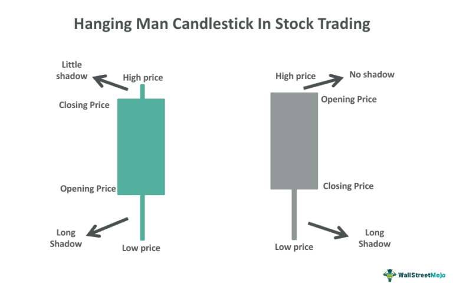

Candlestick patterns are widely recognized as a fundamental tool for traders seeking to analyze and forecast market movements. Originating from Japan in the 18th century, these patterns provide visual cues about market sentiment and potential future price movements based on the historical behavior of a particular asset. Among the myriad of candlestick patterns, the Hanging Man stands out as a crucial indicator often signaling a bearish reversal. Characterized by its small body and long lower shadow with little to no upper shadow, the Hanging Man appears after a price uptrend, suggesting a potential shift from bullish sentiment to bearish pressure as sellers gain strength.

Algorithmic trading has revolutionized financial markets by enabling the execution of orders based on pre-programmed strategies, using speed and efficiency beyond human capability. These systems scan vast datasets, identifying patterns and optimizing execution strategies with unparalleled precision. Integrating traditional patterns like the Hanging Man into algorithmic trading represents a fusion of historical market wisdom and modern technological prowess. This approach enables traders to harness the predictive power of candlestick patterns while benefiting from the efficiency and scalability of automated systems.



The purpose of this article is to bridge the gap between the traditional analysis of candlestick patterns and the advanced methodologies applied in algorithmic trading. By exploring the nuances of the Hanging Man pattern within the context of algorithmic trading, traders can develop sophisticated strategies that leverage the best of both worlds, enhancing decision-making and potentially improving trading outcomes.

## Table of Contents

## Understanding the Hanging Man Pattern

The Hanging Man candlestick pattern is a key indicator used by traders to predict potential bearish reversals in the financial markets. This pattern appears during uptrends and signals a possible shift in market sentiment from bullish to bearish, which can be valuable for traders seeking to identify profit-taking opportunities or anticipate market corrections.

The Hanging Man pattern is characterized by three primary components:

1. **Small Body**: The body of the candlestick is small, indicating that the closing and opening prices of the trading period are close to one another. This small body reflects a period of indecision in which there is not much difference between where the market opened and where it closed.

2. **Long Lower Shadow**: The pattern has a long lower shadow, generally at least twice the length of the body. This long shadow shows that the market has experienced significant selling pressure during the period, pushing the price substantially lower before closing near its opening level.

3. **Minimal or No Upper Shadow**: The Hanging Man usually features little to no upper shadow, indicating that the higher prices were not tested significantly during the period. This absence of an upper shadow underscores the dominance of selling pressure over buying interest.

**Psychological Implications**: The Hanging Man pattern reveals a critical shift in market sentiment. While the market opens and closes at similar levels, the long lower shadow indicates that a substantial sell-off occurred, which was subsequently bought up (or reversed to some extent) before the close. This suggests weakening bullish momentum as buyers struggle to maintain higher price levels, providing an initial warning of a possible downturn.

**Comparison with Similar Patterns**:

- **Hammer**: Although structurally similar to the Hanging Man, the Hammer appears at the bottom of downtrends and signals a potential bullish reversal. The context in which these patterns occur is crucial; while both have identical formations, the Hanging Man is a bearish signal within uptrends, whereas the Hammer is bullish within downtrends.

- **Shooting Star**: The Shooting Star also indicates a bearish reversal, but it differs in shape. It has a small body, a long upper shadow, and little to no lower shadow. The Shooting Star forms during uptrends and signifies that the market rejected higher prices, increasing the likelihood of reversal.

Understanding the context and formation of these patterns is essential for traders. Recognizing the Hanging Man’s characteristics and their psychological implications can effectively warn traders of potential reversals, helping them make informed decisions.

## Incorporating Hanging Man in Algo Trading

Algorithmic trading plays a pivotal role in modern financial markets due to its speed, efficiency, and ability to handle large volumes of data systematically. This technological advancement allows traders to execute complex strategies with minimal human intervention, providing a significant edge in the fast-paced trading environment. A key advantage of [algorithmic trading](/wiki/algorithmic-trading) is its capability to rapidly analyze massive datasets, make split-second decisions, and execute orders at optimal prices, thereby reducing latency and human error.

Integrating the Hanging Man pattern into algorithmic trading systems involves several steps. First, a deep understanding of the Hanging Man's characteristics is crucial. This candlestick pattern, typically indicative of a potential bearish reversal, is identified by a small real body at the upper end of the trading range, a long lower shadow, and little or no upper shadow. The emotional component, reflecting a shift from bullish to potentially bearish sentiment, is captured by this formation and can be transcribed into an algorithm for automated trading.

To incorporate this pattern, one must write code to scan historical and real-time data for occurrences of the Hanging Man. Python, a preferred language for algorithmic trading due to its extensive libraries and ease of use, can be employed for this task. Utilizing libraries such as `pandas` for data manipulation and `matplotlib` for visualization, a trader can efficiently program the detection of the Hanging Man pattern.

Here is a simplified example using Python:

```python
import pandas as pd

def identify_hanging_man(df):
    # Define conditions for a Hanging Man pattern
    condition1 = (df['Close'] < df['Open'])  # Small body, typically a red candle
    condition2 = (df['Open'] - df['Close'] < 0.1 * (df['High'] - df['Low']))  # Small body relative to shadow
    condition3 = (df['Low'] < min(df['Open'], df['Close'], (df['Open'] + df['Close']) / 2))  # Long lower shadow

    # Find rows meeting the conditions
    hanging_man_df = df[condition1 & condition2 & condition3]

    return hanging_man_df

# Example usage
data = pd.DataFrame({'Open': [100, 105, 110], 'High': [110, 110, 115], 'Low': [90, 95, 90], 'Close': [95, 100, 100]})
hanging_man_patterns = identify_hanging_man(data)
print(hanging_man_patterns)
```

Despite the advantages, pattern recognition in algorithmic systems poses challenges. The primary difficulty lies in accurately identifying patterns amidst market noise and false signals. Patterns like the Hanging Man can be subject to interpretation and may not always lead to the predicted market movement. Additionally, implementing these detections requires precise coding and validation to ensure the algorithm interprets the data correctly.

Market conditions can further complicate pattern recognition, as changes in [volatility](/wiki/volatility-trading-strategies) or [liquidity](/wiki/liquidity-risk-premium) might produce patterns that deviate from historical norms. Consequently, continual algorithm refinement and [backtesting](/wiki/backtesting) are essential to accommodate evolving market dynamics and enhance pattern detection accuracy. This iterative approach helps to minimize false positives and ensures robust and adaptive trading strategies. 

Through careful integration and thoughtful application of the Hanging Man candlestick pattern in algorithmic trading, traders can leverage traditional analysis techniques enhanced by the speed and precision of modern technology.

## Hanging Man Trading Strategies

The Hanging Man candlestick pattern is a potent tool for traders aiming to predict bearish reversals in the market. Its effectiveness can be enhanced when combined with other technical indicators, such as the Relative Strength Index (RSI) and moving averages, alongside [volume](/wiki/volume-trading-strategy) analysis and market sentiment.

A fundamental strategy utilizing the Hanging Man involves identifying this pattern in an uptrend and confirming potential reversals through complementary indicators. For example, the RSI, a [momentum](/wiki/momentum) oscillator that measures the speed and change of price movements, can be paired with the Hanging Man to gauge overbought conditions (typically RSI > 70). When a Hanging Man appears while the asset is overbought, it suggests a stronger likelihood of an impending bearish reversal.

Moving averages, particularly the 50-day and 200-day simple moving averages (SMA), can also be leveraged to confirm trends. If a Hanging Man forms below these moving averages, it serves as a further indication of bearish sentiment. The crossing of a shorter-term SMA below a longer-term SMA also supports this interpretation, known widely as a "death cross."

Volume analysis offers additional verification for the Hanging Man pattern's predictions. An increase in trading volume on the day the Hanging Man forms highlights a more significant shift in sentiment. For example, utilizing Python, a trader could assess volume changes as follows:

```python
import pandas as pd

# Assume df is your DataFrame with columns: 'Close', 'Volume'
df['Volume_Change'] = df['Volume'].pct_change()

# Identify Hanging Man pattern and check for volume increase
def is_hanging_man(row):
    body = abs(row['Close'] - row['Open'])
    lower_shadow = row['Low'] - min(row['Close'], row['Open'])
    upper_shadow = max(row['Close'], row['Open']) - row['High']

    return lower_shadow > 2 * body and upper_shadow <= 0.1 * body

df['Hanging_Man'] = df.apply(is_hanging_man, axis=1)
df['High_Volume'] = df['Volume_Change'] > 0.2

# Filter for days with the Hanging Man pattern and increased volume
hanging_man_days = df[(df['Hanging_Man']) & (df['High_Volume'])]
```

Supporting market sentiment indicators, such as news sentiment analysis and investor sentiment surveys, can further corroborate the expected bearish move. Platforms offering sentiment scores based on news feed analyses serve this purpose.

Risk management plays a crucial role in the effective use of Hanging Man strategies. Setting stop losses just above the upper shadow of the Hanging Man can help mitigate potential losses if the anticipated reversal does not materialize. Profit targets might be set using recent support levels, ensuring a favorable risk-reward ratio. Traders should calibrate these parameters based on historical data and volatility to optimize their strategies effectively.

Overall, while the Hanging Man is a traditional technical indicator, its integration with modern analytical tools and risk management practices can make it a valuable component of a comprehensive trading strategy.

## Backtesting and Strategy Optimization

Backtesting is a critical component in the development and evaluation of trading strategies, enabling traders and algorithm developers to assess the viability of their approaches using historical data. For the Hanging Man candlestick pattern, backtesting serves as a tool to determine its effectiveness as a bearish reversal signal under varying market conditions.

The importance of backtesting lies in its ability to simulate trading strategies against historical market data, offering insights into how these strategies would have performed in the past. By doing so, traders can identify potential weaknesses and optimize strategies to enhance future performance. Effective backtesting involves not only testing for profitability but also evaluating risk metrics such as drawdowns, volatility, and Sharpe ratios.

Several tools and software platforms are available for backtesting strategies that incorporate the Hanging Man pattern. Popular platforms include MetaTrader, TradingView, and specialized software such as QuantConnect and Zipline, which allow for extensive customization and support for languages like Python. These tools offer features such as strategy execution, automated testing, and visualization of results, simplifying the backtesting process.

Implementing backtesting for a Hanging Man pattern strategy typically involves a few key steps:

1. **Data Acquisition**: Collect historical market data with high granularity to ensure accurate pattern detection.
2. **Strategy Definition**: Define the parameters of the Hanging Man pattern within the algorithm, including determining the length of the lower shadow relative to the body.
3. **Algorithm Development**: Develop an algorithm that can scan historical data and identify instances of the Hanging Man pattern.
4. **Execution and Analysis**: Execute the strategy over the data set, analyzing outcomes such as win rates, and refining entry and exit rules.

An example of a Python script for identifying the Hanging Man pattern using a data analysis library like Pandas might include:

```python
import pandas as pd

def detect_hanging_man(data):
    signals = []
    for i in range(1, len(data)-1):
        current = data.iloc[i]
        prev_close = data.iloc[i-1]['Close']
        is_hanging_man = (current['Close'] < current['Open'] and
                          (current['Open'] - current['Close']) < (current['Low'] - current['Close']) * 0.3 and 
                          (current['High'] - max(current['Open'], current['Close'])) < (current['Open'] - current['Close']) * 0.3)
        if is_hanging_man and current['Close'] < prev_close:
            signals.append(current.name)
    return signals

data = pd.read_csv('historical_data.csv')
signals = detect_hanging_man(data)
print("Signal dates: ", signals)
```

Historical data analysis and scenario testing are crucial for refining these strategies. By analyzing test results under different market conditions, traders can gain insights into pattern effectiveness and adjust parameters to account for regular market events, such as news releases or abrupt trend changes.

Case studies highlighting successful implementations often illustrate that using the Hanging Man pattern can yield substantial returns when combined with other technical indicators. For example, a study might show enhanced strategy performance when integrating the Hanging Man with indicators like RSI or MACD, which help filter out false signals.

Successful backtesting not only validates the reliability of using a Hanging Man pattern in real market situations but also provides a foundation for strategy optimization. By iterating on the algorithm and continuously revising based on empirical data, traders can significantly improve the robustness and predictability of their trading activities.

## Challenges and Limitations

Candlestick patterns, like the Hanging Man, are widely used in trading due to their potential to indicate market reversals. However, employing these patterns in algorithmic trading systems presents several challenges and limitations. One of the primary challenges lies in the potential inaccuracies in pattern recognition and the subsequent execution of trades based on these patterns. The Hanging Man, characterized by a small real body at the upper end of the trading range with a long lower shadow and little to no upper shadow, might be misidentified due to variations in candlestick formation or data quality issues. These inaccuracies can lead to incorrect trade signals, impacting the effectiveness of the strategy.

Market conditions significantly influence the reliability of Hanging Man signals. In environments with high volatility or low trading volumes, the pattern's reliability can diminish, leading to false signals or ineffective strategies. High volatility can cause dramatic price movements that overshadow traditional pattern formations, while low trading volumes may not provide sufficient data for accurate pattern recognition. These conditions necessitate robust filtering mechanisms in algorithmic systems to differentiate between valid signals and noise.

To address these challenges, it is essential to adapt trading strategies to cope with changing market dynamics. This adaptation might involve refining the criteria used to identify the Hanging Man pattern or incorporating additional confirmation indicators. Traders often use other technical indicators, such as the Relative Strength Index (RSI) or moving averages, to confirm Hanging Man signals before executing trades. This multi-layered approach helps mitigate the risk of relying solely on a single pattern for trade decisions.

Continuous testing and strategy refinement hold paramount importance in addressing the challenges associated with trading strategies based on the Hanging Man pattern. Backtesting, using historical data to simulate trading strategies, is critical for evaluating the potential effectiveness of these strategies under varying market conditions. Through backtesting, traders can gain insights into how their strategies perform and identify areas for improvement. Alongside testing, ongoing strategy refinement ensures that algorithms remain effective despite evolving market conditions. This iterative process may involve adjusting parameters, updating the criteria for pattern recognition, or integrating new data sources to enhance decision-making.

Incorporating [machine learning](/wiki/machine-learning) could further enhance the accuracy and adaptability of pattern recognition systems. By training models on large datasets, algorithms can improve their ability to recognize patterns even in complex or unusual market conditions. However, this approach requires significant computational resources and expertise in machine learning techniques. Overall, addressing the challenges and limitations associated with incorporating Hanging Man patterns in algorithmic trading systems requires a comprehensive approach that emphasizes accuracy, adaptability, and continuous enhancement.

## Conclusion

The Hanging Man candlestick pattern serves as a pivotal signal in predicting potential bearish reversals in financial markets. As traders delve into this pattern, several key takeaways emerge. First, understanding the nuances of the Hanging Man—characterized by its small body, long lower shadow, and minimal or no upper shadow—is crucial for accurately interpreting shifts in market sentiment from bullish to bearish. This pattern frequently signifies a weakening bullish trend and the potential onset of selling pressure.

In the evolving landscape of trading technologies, candlestick patterns like the Hanging Man continue to maintain their relevance. The development of algorithmic trading has introduced new complexities and efficiencies into the market. While traditional trading relied heavily on manual analysis, algorithmic trading facilitates rapid data processing and enhanced decision-making. By programming algorithms to recognize the Hanging Man pattern, traders can quickly identify potential reversals and execute trades accordingly.

For robust decision-making, it is imperative that traders integrate comprehensive analysis into their strategies. This involves not just recognizing patterns but also combining them with other indicators, such as the Relative Strength Index (RSI) and moving averages, to corroborate signals. Volume analysis and market sentiment are also essential components that should be considered when devising trading strategies involving the Hanging Man pattern.

The integration of technology and traditional analysis techniques is not merely advantageous but necessary. By leveraging the strengths of both approaches, traders can optimize their strategies for greater accuracy and effectiveness. As markets become increasingly sophisticated, the symbiotic relationship between algorithmic systems and human intuition will lay the foundation for successful trading endeavours. Continuous learning and adaptation in the face of new technologies and market conditions will be key to maintaining a competitive edge in trading using candlestick patterns.

## FAQs

### Common questions about the reliability and use of Hanging Man patterns

**Q: How reliable are Hanging Man patterns in predicting market reversals?**

Hanging Man patterns are considered a reliable indicator of potential bearish reversals, particularly when they occur after a prolonged uptrend. Their reliability, however, increases when confirmed by other technical indicators or patterns. The presence of a long lower shadow suggests that sellers have taken control, despite the overall upward trend, indicating a possible shift in market sentiment. Nonetheless, reliance solely on Hanging Man patterns is discouraged due to potential false signals; it is advisable to use them in conjunction with other technical analysis tools.

**Q: How can one integrate the Hanging Man pattern into algorithmic trading systems?**

Integrating the Hanging Man pattern into algorithmic trading involves several steps. Primarily, the trading algorithm must be programmed to identify the specific characteristics of the pattern: a small real body, a long lower shadow, and minimal or no upper shadow at the end of an uptrend. In Python, libraries such as TA-Lib or pandas can facilitate the identification process. For instance, the following Python snippet demonstrates a basic implementation:

```python
import pandas as pd

def identify_hanging_man(data):
    condition_1 = (data['Close'] < data['Open'])  # Small real body
    condition_2 = ((data['Open'] - data['Low']) > 2 * abs(data['Close'] - data['Open']))  # Long lower shadow
    condition_3 = ((data['High'] - max(data['Open'], data['Close'])) < 0.1 * abs(data['Close'] - data['Open']))  # Minimal upper shadow
    return condition_1 & condition_2 & condition_3

# Assuming 'data' is a DataFrame containing 'Open', 'High', 'Low', and 'Close' prices
hanging_man_signals = identify_hanging_man(data)
```

**Q: What are the expected outcomes when implementing a strategy using the Hanging Man pattern?**

When implemented effectively, trading strategies utilizing the Hanging Man pattern aim to capitalize on the anticipated bearish reversals following the pattern’s identification. Expected outcomes include initiation of short positions or the liquidation of long positions to mitigate potential losses. However, the outcomes can vary depending on market conditions, timeframe, and confirmation with additional indicators. Traders should be prepared for possible false signals and adaptively modify strategies as necessary.

**Q: What additional resources are recommended for an in-depth understanding of the Hanging Man pattern and algorithmic trading?**

For further reading and comprehensive study:

1. **Books**:
   - "Japanese Candlestick Charting Techniques" by Steve Nison for a detailed analysis of candlestick patterns.
   - "Algorithmic Trading: Winning Strategies and Their Rationale" by Ernie Chan for insights into developing algorithmic trading strategies.

2. **Online Resources**:
   - Investopedia’s [Candlestick Analysis](https://www.investopedia.com/candlestick-charting-analysis-4778554) for beginner-to-advanced level guides.
   - Technical Analysis platforms such as [TradingView](https://www.tradingview.com/) for practical chart pattern recognition and discussion forums. 

3. **Courses**:
   - Online courses on platforms like Coursera or udemy focusing on both technical analysis and algorithmic trading.

By exploring these resources, traders can gain a deeper understanding of not just the Hanging Man pattern, but also how it fits into a broader trading strategy utilizing algorithmic systems.

## References & Further Reading

[1]: Nison, S. (1991). ["Japanese Candlestick Charting Techniques."](https://drive.google.com/file/d/0B_CADMk621uLNDEyZTEzZjYtMmZjOS00ZmUyLTlhYmYtN2E1YTViOWRiOTdi/view) New York Institute of Finance.

[2]: Chan, E. P. (2009). ["Algorithmic Trading: Winning Strategies and Their Rationale."](https://github.com/ftvision/quant_trading_echan_book) John Wiley & Sons.

[3]: Aronson, D. R. (2007). ["Evidence-Based Technical Analysis: Applying the Scientific Method and Statistical Inference to Trading Signals."](https://www.amazon.com/Evidence-Based-Technical-Analysis-Scientific-Statistical/dp/0470008741) John Wiley & Sons.

[4]: Lopez de Prado, M. (2018). ["Advances in Financial Machine Learning."](https://www.amazon.com/Advances-Financial-Machine-Learning-Marcos/dp/1119482089) Wiley.

[5]: Jansen, S. (2020). ["Machine Learning for Algorithmic Trading."](https://github.com/stefan-jansen/machine-learning-for-trading) Packt Publishing.