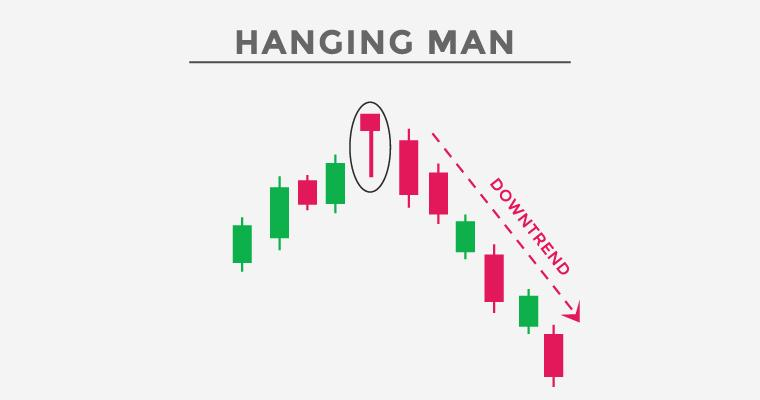

## Table of Contents

## What is a Hanging Man candlestick pattern?

A Hanging Man candlestick pattern is a type of chart pattern that traders see in stock, forex, or other financial markets. It looks like a small body with a long lower shadow, and it appears at the top of an uptrend. The small body shows that the opening and closing prices were close together, and the long lower shadow means the price dropped a lot during the session but then went back up near the opening price.

This pattern is important because it can signal that the uptrend might be ending. When traders see a Hanging Man after a series of rising prices, it suggests that sellers are starting to push back against the buyers. If the next candle after the Hanging Man confirms this by moving lower, it could mean the price will start to fall. Traders often watch for this pattern to decide when to sell or take profits.

## How can you identify a Hanging Man pattern on a chart?

To identify a Hanging Man pattern on a chart, you need to look at the shape of the candlestick and where it appears. The Hanging Man looks like a small body at the top of the candlestick with a long lower shadow, usually at least twice the length of the body. The upper shadow, if there is one, should be very small or non-existent. This means the candlestick looks like a person hanging from a rope, hence the name.

The Hanging Man pattern is important because it appears after an uptrend. When you see this pattern at the top of a series of rising prices, it suggests that the buyers are losing control and the sellers are starting to take over. If the next candlestick after the Hanging Man moves lower, it confirms that the uptrend might be ending, and the price could start to fall. So, always check the context of the chart to make sure the Hanging Man comes after an uptrend.

## What does the Hanging Man pattern signify in terms of market sentiment?

The Hanging Man pattern shows that market sentiment might be changing from bullish to bearish. When you see this pattern at the top of an uptrend, it means that buyers were in control but then sellers started to push back. The long lower shadow of the Hanging Man shows that the price dropped a lot during the trading session, but then it went back up near the opening price. This tells us that even though buyers tried to keep the price up, sellers were strong enough to bring it down, which could be a sign that the uptrend is getting weak.

If the next candle after the Hanging Man moves lower, it confirms that the sellers are taking over and the price might start to fall. This change in market sentiment from buying to selling can be important for traders who want to sell their holdings or take profits before the price goes down. So, the Hanging Man pattern is a warning sign that the market might be turning bearish, and it's a good idea to watch what happens next.

## In which types of markets (bullish or bearish) does the Hanging Man pattern typically appear?

The Hanging Man pattern usually shows up in a bullish market. This means the market has been going up for a while, with prices getting higher and higher. When you see a Hanging Man at the top of this uptrend, it can mean that the market might start to go down soon. The pattern looks like a small body with a long lower shadow, showing that the price dropped a lot during the day but then went back up near the opening price. This tells us that even though buyers were in control, sellers started to push back.

If the next candle after the Hanging Man goes down, it means the sellers are getting stronger and the price might keep falling. This is why the Hanging Man is important in a bullish market – it's a warning sign that the uptrend could be ending. Traders watch for this pattern to decide if they should sell their stocks or other assets before the price drops.

## What are the key components of a Hanging Man candlestick?

A Hanging Man candlestick has a few important parts that you need to know. The main part is the small body at the top of the candlestick. This small body means the opening and closing prices were close together. Below this small body, there is a long lower shadow, which should be at least twice as long as the body. This long shadow shows that the price dropped a lot during the trading day but then went back up near the opening price. There should be little to no upper shadow on the candlestick.

The Hanging Man pattern is important because it shows up after prices have been going up for a while. When you see this pattern at the top of an uptrend, it means that even though buyers were in control, sellers started to push back. This could be a sign that the price might start to go down soon. If the next candle after the Hanging Man goes down, it confirms that sellers are getting stronger and the uptrend might be ending.

## How reliable is the Hanging Man pattern as a predictor of price reversal?

The Hanging Man pattern is not always a perfect predictor of a price reversal, but it can be a helpful sign. It shows up after prices have been going up, and it means that sellers might be starting to take over from buyers. If the next candle after the Hanging Man goes down, it makes the pattern more likely to be right. But, it's important to use other tools and signs along with the Hanging Man to make better guesses about what the price will do next.

Even though the Hanging Man can be useful, it's not always right. Sometimes, the price might keep going up even after a Hanging Man appears. That's why it's good to look at the bigger picture of the market and use other patterns and signs to help make decisions. The Hanging Man is just one piece of the puzzle when trying to figure out if the price will go down or keep going up.

## What are the common entry and exit strategies when trading based on a Hanging Man pattern?

When you see a Hanging Man pattern at the top of an uptrend, a common entry strategy is to wait for the next candle to confirm the pattern. If the next candle closes lower than the Hanging Man's body, it's a sign that the price might start to go down. That's when you can think about selling or shorting the stock. Some traders also set a stop-loss just above the Hanging Man's high to limit their risk if the price goes up instead of down.

For exiting the trade, if you went short after the Hanging Man, you might want to take profits when the price reaches a key support level or if you see another reversal pattern that suggests the price might go back up. Another way to [exit](/wiki/exit-strategy) is to use a take-profit order at a certain price level that you think the price will reach. It's important to keep an eye on the market and be ready to change your plan if things don't go the way you expected.

## Can the Hanging Man pattern be used in conjunction with other technical indicators? If so, which ones?

Yes, the Hanging Man pattern can be used with other technical indicators to make better trading decisions. One common indicator to use with the Hanging Man is the Relative Strength Index (RSI). If the RSI is over 70, it means the market might be overbought, which can make the Hanging Man pattern even more important. Another useful indicator is the Moving Average Convergence Divergence (MACD). If the MACD line crosses below the signal line right after a Hanging Man, it can confirm that the price might start to go down.

Other indicators that can help are [volume](/wiki/volume-trading-strategy) and support/resistance levels. If you see high trading volume on the day of the Hanging Man, it can mean that more people are selling, which makes the pattern stronger. Also, if the Hanging Man appears near a key resistance level, it can be a stronger sign that the price might reverse. Using these indicators together with the Hanging Man can give you a clearer picture of what the market might do next.

## What are the differences between the Hanging Man and the Hammer candlestick patterns?

The Hanging Man and the Hammer candlestick patterns look a lot alike, but they show up in different places on a chart and mean different things. The Hanging Man appears at the top of an uptrend. It has a small body with a long lower shadow, showing that sellers are starting to take over from buyers. If you see a Hanging Man after prices have been going up, it might mean the price will start to go down soon. The next candle after the Hanging Man needs to go down to confirm this.

On the other hand, the Hammer pattern shows up at the bottom of a downtrend. It also has a small body and a long lower shadow, but it means that buyers are starting to push back against sellers. If you see a Hammer after prices have been going down, it could mean the price will start to go up soon. The next candle after the Hammer needs to go up to confirm this. So, even though the Hanging Man and the Hammer look similar, where they appear on the chart and what they predict about future price movements are very different.

## How does the position of the Hanging Man within a trend affect its significance?

The position of the Hanging Man within a trend is really important because it tells us a lot about what might happen next with the price. When a Hanging Man shows up at the top of an uptrend, it means the price has been going up for a while, but now sellers are starting to push back against the buyers. This can be a warning sign that the price might start to go down soon. If the next candle after the Hanging Man goes down, it makes this warning even stronger.

But if a Hanging Man appears in the middle of a trend or at the bottom of a downtrend, it doesn't mean the same thing. In these cases, the Hanging Man doesn't give us a clear sign that the price will reverse. It's only when the Hanging Man is at the top of an uptrend that it's a good hint that the price might start to fall. So, where the Hanging Man is on the chart is key to understanding if it's a good time to sell or take profits.

## What are some real-world examples of the Hanging Man pattern leading to a price reversal?

In early 2020, the stock of XYZ Corporation showed a clear Hanging Man pattern after a long uptrend. The stock had been climbing steadily for several months, reaching new highs. Then, one day, a Hanging Man candlestick appeared with a small body and a long lower shadow, signaling that sellers were starting to push back. The next day, the stock price dropped significantly, confirming the Hanging Man pattern. This led to a reversal, and the stock price continued to fall over the next few weeks, giving traders who recognized the pattern a chance to sell at the top and avoid losses.

Another example happened with ABC Company in late 2019. After a strong uptrend, a Hanging Man pattern formed on the daily chart. The candlestick had a tiny body at the top and a long lower shadow, showing that the price had dropped a lot during the day but then recovered slightly. The following day, the stock opened lower and continued to decline, confirming the reversal signal from the Hanging Man. Traders who acted on this pattern were able to exit their positions near the peak, protecting their profits as the stock price reversed and started a downtrend.

## How can traders manage risk when using the Hanging Man pattern in their trading strategy?

When traders use the Hanging Man pattern in their trading strategy, one of the best ways to manage risk is to wait for confirmation before making any moves. This means they should look at the next candle after the Hanging Man to see if it closes lower. If it does, it's a stronger sign that the price might go down. Traders can then think about selling or shorting the stock. Another good way to manage risk is to use a stop-loss order. They can set the stop-loss just above the high of the Hanging Man. This helps limit losses if the price goes up instead of down.

It's also important for traders to not rely only on the Hanging Man pattern. They should use other tools and signs to help make better guesses about what the price will do next. For example, they can look at other technical indicators like the RSI or MACD to see if they agree with the Hanging Man's signal. Also, paying attention to trading volume and support/resistance levels can give more clues about whether the price will reverse. By using these extra checks, traders can feel more confident in their decisions and manage their risk better.

## References & Further Reading

[1]: Nison, S. (1991). ["Japanese Candlestick Charting Techniques."](https://drive.google.com/file/d/0B_CADMk621uLNDEyZTEzZjYtMmZjOS00ZmUyLTlhYmYtN2E1YTViOWRiOTdi/view) New York Institute of Finance.

[2]: Chan, E. P. (2009). ["Algorithmic Trading: Winning Strategies and Their Rationale."](https://github.com/ftvision/quant_trading_echan_book) John Wiley & Sons.

[3]: Aronson, D. R. (2007). ["Evidence-Based Technical Analysis: Applying the Scientific Method and Statistical Inference to Trading Signals."](https://www.amazon.com/Evidence-Based-Technical-Analysis-Scientific-Statistical/dp/0470008741) John Wiley & Sons.

[4]: Lopez de Prado, M. (2018). ["Advances in Financial Machine Learning."](https://www.amazon.com/Advances-Financial-Machine-Learning-Marcos/dp/1119482089) Wiley.

[5]: Jansen, S. (2020). ["Machine Learning for Algorithmic Trading."](https://github.com/stefan-jansen/machine-learning-for-trading) Packt Publishing.