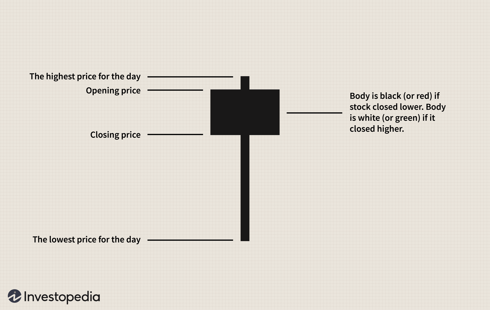

Algorithmic trading, often referred to as algo trading, represents a method of executing orders using automated and pre-programmed trading instructions. These instructions account for variables such as time, price, and volume, and they are essential for conducting large-volume trades that are often difficult to execute manually. Algo trading has surged in popularity due to its efficiency and the precision with which trades can be executed, minimizing human emotion and error.

In this sophisticated environment, chart patterns assume a critical role. These patterns, which are formations created by the price movements of an asset, provide traders with insights into potential future price movements. One such pattern is the Hanging Man candlestick pattern, recognized for its significance in forecasting market trends. The Hanging Man pattern is particularly noteworthy as a bearish reversal indicator within an ascending market trend. It signifies a potential uptrend reversal when it appears at the top of a trend, hinting that sellers may soon outnumber buyers, pushing prices downward.



The Hanging Man is identified by a single candlestick, which typically displays a small real body at the upper end with a long lower shadow and little to no upper shadow. Its appearance is a visual testament to the shift in control from buyers to sellers, often signaling to algorithmic traders the possibility of an impending downturn.

The integration of technical analysis tools like the Hanging Man pattern into algorithmic trading is pivotal for making informed trading decisions. Technical indicators, including candlestick patterns, contribute to the development of robust algorithms that support traders in assessing market conditions and executing trades with higher confidence. By systematically incorporating these indicators, algo traders can optimize their strategies, reduce risk, and enhance their chances of success within diverse trading scenarios.

Traders are encouraged to leverage the Hanging Man pattern, among other technical tools, to refine their algo trading tactics. Doing so not only augments their ability to anticipate market movements but also empowers them to construct more comprehensive trading systems that merge various analytics for superior decision-making.

## Table of Contents

## Understanding the Hanging Man Chart Pattern

The Hanging Man chart pattern is a specific type of candlestick formation used in technical analysis to signal a potential bearish reversal during an uptrend. Its distinctive anatomy is characterized by a small real body located at the upper end of the trading range, accompanied by a long lower shadow and little to no upper shadow. This formation suggests that, despite bullish momentum driving prices higher, a significant intraday decline occurred, indicating increased selling pressure.

Visually, the Hanging Man is similar to the Hammer candlestick pattern; however, their implications diverge based on the market context. While the Hanging Man appears in an uptrend signaling potential reversal, the Hammer occurs in a downtrend, suggesting a bullish reversal. Thus, distinguishing between the two requires careful assessment of the preceding price movements.

The psychological implications behind the Hanging Man pattern reflect a shift in market sentiment. As prices open near the session high and then fall significantly, only to recover partially, it implies initial buyer dominance being overshadowed by emerging seller strength. This transition may indicate that bulls are losing control, setting the scene for a downturn if market participants act on these cues.

An essential aspect of the Hanging Man's predictive nature lies in its ability to suggest an impending price decline or reversal. While the pattern alone is not a guarantee of reversal, its occurrence at an uptrend's peak serves as a cautionary indicator. Traders typically seek additional confirmation, such as a subsequent price decline or bearish signals from other technical indicators, before making trading decisions based on the Hanging Man pattern.

## The Role of Algo Trading

Algorithmic trading, or algo trading, involves the automation of trading activities using pre-established rules and strategies which dictate when and how trades are executed in financial markets. This form of trading has gained significant traction due to its ability to process large volumes of data at speeds much faster than human capabilities, thereby facilitating more timely and informed decision-making processes.

One of the critical components in developing effective [algorithmic trading](/wiki/algorithmic-trading) systems is the incorporation of chart patterns. Chart patterns are graphical representations of historical price movements and can signal potential future market behavior. Among these patterns, the Hanging Man pattern is recognized for its implications in predicting bearish reversals in an uptrend. By analyzing such patterns, algorithms can gain a predictive edge in identifying market trends and executing trades accordingly.

The integration of the Hanging Man pattern into algorithmic trading systems involves the accurate identification of this pattern among vast datasets. This process can be efficiently achieved through coding in languages like Python, where algorithms are designed to scan trading data in real-time. A simple approach to identify a Hanging Man pattern in Python might involve using a library like `pandas` to process candlestick data, alongside logic to check for specific characteristics that define the pattern: a small real body at the upper end of the trading range and a long lower shadow, with little or no upper shadow.

Here's a basic example of how such a script could be structured to identify the Hanging Man pattern:

```python
import pandas as pd

def is_hanging_man(open_price, close_price, high_price, low_price):
    body = abs(close_price - open_price)
    lower_shadow = min(open_price, close_price) - low_price
    upper_shadow = high_price - max(open_price, close_price)

    # Typical conditions for a Hanging Man
    if lower_shadow > 2 * body and upper_shadow < 0.1 * body:
        return True
    return False

# Sample data
data = {
    'Open': [100, 102, 104],
    'Close': [101, 101.5, 103],
    'High': [103, 104, 105],
    'Low': [98, 99, 102]
}

df = pd.DataFrame(data)

df['HangingMan'] = df.apply(lambda row: is_hanging_man(row['Open'], row['Close'], row['High'], row['Low']), axis=1)

print(df)
```

This code checks for defining aspects of the Hanging Man pattern in each row of trading data. Such logic can be incorporated into larger algorithmic frameworks that continuously scan live data, thereby enabling timely and potentially profitable trading decisions.

Additionally, identifying chart patterns through algorithms can be enhanced by [machine learning](/wiki/machine-learning) techniques, which use historical data to refine pattern recognition. Machine learning models can be trained to improve accuracy in distinguishing genuine patterns from false signals, thereby increasing the reliability of the trading system.

In conclusion, the incorporation of chart patterns like the Hanging Man into algorithmic trading provides a structured and efficient means of leveraging technical analysis. By automating the detection and integration of such patterns, traders can significantly enhance their trading strategies and adapt quickly to changing market conditions, ensuring a competitive advantage in the fast-paced world of financial markets.

## Identifying the Hanging Man Pattern in Algo Trading

To identify the Hanging Man pattern in algorithmic trading, it is essential to develop algorithms that can efficiently spot these patterns within real-time trading data. The process involves several key steps that ensure the accurate identification of this bearish reversal signal, thus enabling traders to optimize their strategies.

**Steps on How to Program Algorithms to Spot Hanging Man Patterns**

1. **Data Input and Preprocessing:** 
   - First, obtain real-time candlestick data from a reliable data source. Each dataset should include open, high, low, and close prices within a specified time frame.
   - Clean and preprocess the data to ensure there are no missing values or anomalies which may skew pattern detection.

2. **Pattern Detection Logic:**
   - A Hanging Man pattern is characterized by a small body at the top with a long lower shadow and little or no upper shadow. This can be mathematically described using conditions:
     - The lower shadow is at least twice the size of the candle’s body.
     - The upper shadow is small or nonexistent.
   - Implement these conditions using a programming language like Python:

     ```python
     def is_hanging_man(open_price, high_price, low_price, close_price):
         body_size = abs(open_price - close_price)
         lower_shadow = open_price - low_price if open_price > close_price else close_price - low_price
         upper_shadow = high_price - close_price if open_price > close_price else high_price - open_price

         # Check if the pattern fits the Hanging Man criteria
         return (lower_shadow >= 2 * body_size) and (upper_shadow <= 0.1 * body_size)
     ```

3. **Setting the Context for Valid Pattern Recognition:**
   - The Hanging Man pattern is most valid in an established uptrend. Thus, the algorithm should include a trend identification component.
   - Utilize moving averages or other trend indicators to confirm the uptrend prior to identifying the pattern.

**Machine Learning and Historical Data for Enhanced Pattern Recognition**

To improve pattern recognition accuracy, employing machine learning models can be beneficial. These models can be trained using historical data to distinguish between genuine and false Hanging Man patterns.

1. **Data Collection for Training:**
   - Compile historical data featuring examples of confirmed Hanging Man patterns and other candlestick patterns.

2. **Feature Selection and Model Training:**
   - Extract features such as shadow lengths, body ratio, and preceding price trends.
   - Train classification models (e.g., Decision Trees, Random Forest, or Neural Networks) to predict the occurrence of a Hanging Man pattern.

   ```python
   from sklearn.ensemble import RandomForestClassifier
   from sklearn.model_selection import train_test_split

   # Assuming features and labels are ready
   X_train, X_test, y_train, y_test = train_test_split(features, labels, test_size=0.2, random_state=42)

   model = RandomForestClassifier(n_estimators=100, random_state=42)
   model.fit(X_train, y_train)

   accuracy = model.score(X_test, y_test)
   print(f"Model accuracy: {accuracy}")
   ```

3. **Continuous Model Validation:**
   - Continuously validate the model with new data to ensure its predictive accuracy remains high over time.

By integrating these steps, traders can effectively program algorithmic systems to identify the Hanging Man pattern, leveraging both rule-based logic and advanced machine learning techniques for optimal trading outcomes.

## Implementing Hanging Man Pattern in Trading Strategies

The Hanging Man pattern, recognized as a bearish reversal signal, plays a significant role in algorithmic trading strategies by indicating potential shifts in market trends. Traders utilize various strategies to effectively harness this pattern, with one predominant approach being trend reversal strategies. These strategies capitalize on the anticipation of a market downturn following the establishment of an uptrend where the Hanging Man appears.

To implement the Hanging Man pattern effectively within trading strategies, integration into broader trading systems is crucial. This entails combining the Hanging Man with other technical indicators, such as moving averages or Relative Strength Index (RSI), to enhance the reliability of signals. For instance, a trader might wait for the RSI to indicate an overbought condition before confirming the bearish sentiment suggested by the Hanging Man pattern. Such confluence of signals provides a stronger basis for making trading decisions, thereby improving the robustness of the strategy.

Despite its potential, trading based on the Hanging Man pattern is not without risks and pitfalls. One of the primary challenges is the occurrence of false signals. The pattern, like other candlestick patterns, can be prone to misinterpretation, especially in volatile markets or thinly traded assets. Therefore, effective risk management strategies are essential. Traders can manage risk by setting stop-loss orders slightly above the high of the Hanging Man candlestick, ensuring that losses are minimized if the market defies expectations and continues to rise.

Moreover, it's crucial to consider the context in which the Hanging Man pattern appears. For it to be deemed reliable, the pattern typically needs to form at the top of a significant uptrend. Its appearance in other contexts, such as within a sideways market, might not provide the necessary conviction for a bearish reversal. Hence, algorithmic systems should be programmed to consider historical trend strength when identifying the Hanging Man pattern, potentially utilizing machine learning to refine the detection and validation process further.

Here is an example of how an algorithm might be designed in Python to identify and trade based on the Hanging Man pattern, incorporating additional indicators for confirmation:

```python
import pandas as pd
import numpy as np

def is_hanging_man(open, high, low, close):
    body = abs(close - open)
    lower_shadow = abs(low - min(open, close))
    return body < lower_shadow and (high - max(open, close)) < body

# Sample dataframe with market data
data = pd.DataFrame(...)  # Replace with actual market data

data['HangingMan'] = data.apply(lambda row: is_hanging_man(row['Open'], row['High'], row['Low'], row['Close']), axis=1)

# Additional confirmation: RSI
window_length = 14
data['Change'] = data['Close'].diff()
data['Gain'] = np.where(data['Change'] > 0, data['Change'], 0)
data['Loss'] = np.where(data['Change'] < 0, -data['Change'], 0)
data['AvgGain'] = data['Gain'].rolling(window=window_length, min_periods=1).mean()
data['AvgLoss'] = data['Loss'].rolling(window=window_length, min_periods=1).mean()
data['RS'] = data['AvgGain'] / data['AvgLoss']
data['RSI'] = 100 - (100 / (1 + data['RS']))

# Trading signal: Hanging Man with RSI > 70 (overbought)
data['Signal'] = np.where((data['HangingMan']) & (data['RSI'] > 70), 'Sell', np.nan)
```

In this approach, the algorithm flags potential sell signals when a Hanging Man pattern is detected, bolstered by confirmation from the RSI indicating overbought conditions. This strategic blend enhances decision-making and mitigates reliance on single-pattern signals, preparing traders for varied market scenarios while managing risk effectively.

## Backtesting the Hanging Man Pattern

Backtesting trading strategies is a critical step in evaluating the effectiveness and potential profitability of any algorithmic trading approach. It involves simulating trades based on historical data to understand how a strategy might perform in real market conditions. When applying the Hanging Man pattern, a bearish reversal candlestick indicator, [backtesting](/wiki/backtesting) helps ensure that the strategy is robust and capable of adapting to various market scenarios.

### Tools and Software for Backtesting

There are numerous tools and software platforms available for backtesting algorithmic strategies, each offering different capabilities and levels of sophistication. Popular platforms include:

1. **MetaTrader 4/5**: Known for its extensive community and resources, MetaTrader allows users to create and backtest trading algorithms using its proprietary MQL language. The platform offers comprehensive historical data and a detailed strategy tester.

2. **Python Libraries (e.g., Backtrader, Zipline)**: Python provides powerful libraries dedicated to backtesting. For instance, Backtrader is a versatile library that supports multiple data feeds, indicators, and strategies, making it ideal for testing the Hanging Man pattern. Zipline, another library, offers a trading algorithm framework with a focus on cross-sectional data analysis.

3. **TradingView**: This web-based platform provides a suite of tools for backtesting strategies through its Pine Script language. TradingView is well-known for its user-friendly interface and extensive community of traders sharing custom scripts.

4. **Amibroker**: A software package catering to technically sophisticated traders, offering the capability to test and optimize advanced strategies. Amibroker's AFL (Amibroker Formula Language) is powerful for designing custom indicators like the Hanging Man.

### Insights from Historical Data Analysis

Backtesting using these tools involves the analysis of historical market data to gauge the performance of the Hanging Man pattern. By simulating trades, traders can identify potential signals, validate them, and measure their outcomes against different market conditions.

**Example of Successful Implementation**:

An analysis could incorporate the following steps in Python using Backtrader:

```python
import backtrader as bt

class HangingManStrategy(bt.Strategy):
    def __init__(self):
        self.candles = bt.indicators.CandlestickFinder(self.data)

    def next(self):
        if self.is_hanging_man():
            self.sell()

    def is_hanging_man(self):
        return self.data.close[-1] > self.data.open[-1] and \
               (self.data.open[-1] - self.data.low[-1]) > 2 * abs(self.data.close[-1] - self.data.open[-1]) and \
               (self.data.close[-1] - self.data.high[-1]) < 0.1 * abs(self.data.close[-1] - self.data.open[-1])

# Initialize Cerebro engine
cerebro = bt.Cerebro()
cerebro.addstrategy(HangingManStrategy)

# Load data
data = bt.feeds.YahooFinanceData(dataname='AAPL', fromdate=datetime(2020,1,1), todate=datetime(2020,12,31))
cerebro.adddata(data)

# Run the backtest
cerebro.run()
```

This code sets up a simple backtest for the Hanging Man pattern on Apple's stock data from 2020. Through such simulations, traders can assess the reliability of signals and adjust their parameters for enhanced precision.

### Successful Examples

An insightful case might include observing that the Hanging Man pattern, when appearing at the peak of a prolonged uptrend and confirmed by [volume](/wiki/volume-trading-strategy) indicators, provided lucrative shorting opportunities in tech stocks during volatile periods. By blending this pattern with other technical indicators, traders can improve their confidence in pattern-based signals and optimize their algorithms for better risk-adjusted returns.

In conclusion, backtesting allows traders to refine their strategies, reduce the risk of false positives, and enhance the overall performance of their algo trading systems leveraging the Hanging Man pattern.

## Case Studies and Real-world Applications

Algorithmic trading, particularly when employing candlestick patterns like the Hanging Man, has demonstrated varying degrees of success across different market environments. By examining real-world cases, traders can glean insights into the effectiveness and challenges associated with integrating the Hanging Man pattern into their trading strategies.

One notable example involves the application of the Hanging Man pattern in equity markets. During a bullish market phase in technology stocks, an algorithm was designed to identify the Hanging Man pattern as a potential indicator of market reversals. Employing historical price data, this strategy was backtested across several leading tech stocks. When the pattern appeared following a significant uptrend, the algorithm triggered sell signals, recommending closing long positions or initiating short ones. The strategy yielded positive returns, particularly in situations where the pattern coincided with other bearish indicators, such as declining volume or negative divergences in relative strength index (RSI) readings.  

In contrast, a case study involving commodities highlights some challenges. An algorithm was developed to trade futures contracts and relied heavily on the Hanging Man pattern to predict price downturns. While successful in certain scenarios, such as energy markets, false signals were prevalent in the agricultural sector. One contributing [factor](/wiki/factor-investing) was the [volatility](/wiki/volatility-trading-strategies) inherent in agricultural commodities, often driven by unpredictable weather patterns and geopolitical events. This led to a series of stop-loss triggers, eroding the strategy's profitability. Traders learned the importance of using multiple confirmations from other technical indicators or incorporating fundamental analyses to reduce false positives.

In foreign exchange ([forex](/wiki/forex-system)), the Hanging Man pattern was utilized in a multi-currency trading strategy. The algorithm identified the pattern in major currency pairs, including EUR/USD and USD/JPY, after sustained upward trends. The strategy's success varied, largely depending on the prevailing economic conditions. During periods of significant central bank interventions or geopolitical tensions, the reliability of the Hanging Man pattern diminished, necessitating adaptive measures in the algorithm. This included incorporating real-time news sentiment analysis to adjust stop-loss and take-profit margins dynamically.

Lessons from these case studies emphasize the Hanging Man pattern's potential as part of a broader strategy. Algorithmic traders learned that while the pattern can be indicative of potential reversals, its effectiveness improves when combined with other technical and fundamental analyses. The need for robust backtesting and scenario simulations across various asset classes became evident, stressing the importance of adaptability in trading systems to cope with ever-changing market dynamics.

## Challenges and Limitations

Relying solely on the Hanging Man pattern in algorithmic trading presents several challenges and limitations. This candlestick pattern, while significant in technical analysis as a bearish reversal indicator, should not be the only factor considered when formulating trading strategies. One of the primary limitations is the potential for inaccuracies in pattern recognition, which can impact trading outcomes.

### Potential Inaccuracies in Pattern Recognition

Identifying the Hanging Man pattern requires precision in recognizing its specific characteristics: a small body, a long lower shadow, and little or no upper shadow. Algorithmic systems tasked with detecting such patterns may face difficulties due to these stringent criteria, especially in low-[liquidity](/wiki/liquidity-risk-premium) markets where price movements can be abrupt and erratic. Moreover, different datasets and chart intervals can lead to varying interpretations of the pattern, confusing algorithms trained on inconsistent data.

Such technical inaccuracies can be represented using false positive and false negative scenarios:

- **False Positives**: The algorithm identifies a Hanging Man pattern where none exists, potentially prompting premature bearish signals.

- **False Negatives**: A Hanging Man pattern is present, but the algorithm fails to detect it, missing a pivotal trading signal.

To mitigate these inaccuracies, robust machine learning techniques can be employed. For instance, using convolutional neural networks (CNNs) designed for image recognition might enhance the detection of candlestick patterns in trading charts.

### Market Conditions with False Signals

The efficacy of the Hanging Man pattern largely depends on the prevailing market conditions, and there are scenarios where it might produce false signals:

- **Range-Bound Markets**: In conditions where the market lacks a clear directional trend, the Hanging Man pattern may often appear without signaling an actual reversal. Here, price consolidations might result in frequent appearances of patterns that do not necessarily indicate significant bearish reversals.

- **High Volatility Phases**: Sudden price movements influenced by external factors like economic events or geopolitical issues can distort candlestick formations, leading to erroneous interpretations. Algorithms might need to factor in additional volatility measures or external data sources to adjust their sensitivity to these conditions.

- **Low Volume Trading Days**: On days with low trading volume, patterns like the Hanging Man may form due to random price fluctuations rather than genuine market sentiment shifts. This could result in higher incidences of false reversal signals.

To better accommodate these conditions, it is beneficial for traders to include additional technical indicators along with the Hanging Man pattern. Indicators such as moving averages, RSI, or MACD can provide confirmation and reduce the dependency on a single pattern, enhancing the robustness of the algorithmic trading strategy.

Here's a basic Python example that outlines a scenario where a trader might combine indicators:

```python
import talib
import numpy as np

def detect_hanging_man(candlestick_data):
    # Assumes candlestick_data is a structured array with 'open', 'high', 'low', 'close' fields
    hanging_man = talib.CDLHANGINGMAN(candlestick_data['open'], 
                                      candlestick_data['high'], 
                                      candlestick_data['low'], 
                                      candlestick_data['close'])
    return hanging_man

def confirm_with_rsi(candlestick_data):
    rsi = talib.RSI(candlestick_data['close'], timeperiod=14)
    return rsi < 30  # Use RSI confirmation for oversold conditions

def trading_signal(candlestick_data):
    pattern_signal = detect_hanging_man(candlestick_data)
    rsi_confirmation = confirm_with_rsi(candlestick_data)

    combined_signal = pattern_signal and rsi_confirmation

    return combined_signal
```

By understanding the intricacies and limitations of the Hanging Man pattern, traders can design more effective strategies that account for various market scenarios, thereby improving the reliability of their algorithmic trading systems.

## Conclusion

The Hanging Man pattern serves as a significant indicator of potential bearish reversals, making it a valuable tool in algorithmic trading. Recognizing its ability to signal price declines provides traders with opportunities to enhance trading strategies when combined with algorithmic systems. By identifying the Hanging Man pattern, traders can anticipate market shifts and adjust their trading positions accordingly, optimizing outcomes in uptrends.

To maximize the efficacy of the Hanging Man pattern, it is crucial for traders to integrate it with other technical analysis tools and indicators. This comprehensive approach allows for more robust trading strategies that are capable of filtering out false signals and providing greater confidence in trading decisions. The incorporation of additional indicators such as moving averages, RSI, or Fibonacci retracement levels can offer insights into market [momentum](/wiki/momentum) and support more informed trading decisions.

The future of candlestick patterns in algorithmic trading is promising, especially as technology continues to evolve. Advances in machine learning and data analysis techniques enhance the ability to recognize complex patterns and execute trades with precision. As trading strategies become more sophisticated, algorithmic systems will likely become more adept at integrating various signals from candlestick patterns, leading to improved strategy refinement and execution.

Furthermore, the continuous evolution of trading strategies necessitates ongoing adaptation and testing of algos. Backtesting remains a critical component, providing traders with insights into the performance and reliability of their strategies before implementation in live markets. As the financial landscape evolves, so too will the integration of Hanging Man patterns in algorithmic trading, driving innovation and potentially offering traders a competitive edge.

## FAQs

**FAQs**

**1. How reliable is the Hanging Man pattern in algorithmic trading?**

The Hanging Man pattern, while a notable bearish reversal indicator, does not guarantee price declines with infallible accuracy. Its reliability depends significantly on the context in which it appears. For example, it is best validated when occurring after a prolonged uptrend and accompanied by a confirmation on the following trading day, such as a gap down or a red candlestick. However, traders should be cautious as relying solely on this pattern can lead to false signals due to market noise or misinterpretation, underscoring the necessity of supportive technical indicators for improved reliability.

**2. How can the Hanging Man pattern be integrated into algorithmic trading systems?**

Integrating the Hanging Man pattern into an algorithmic trading system involves programming algorithms that can recognize the specific characteristics of this candlestick pattern—namely, a small real body at the upper end of the trading range with a long lower shadow and minimal or no upper shadow. Utilizing a platform like Python, traders can write scripts using libraries such as TA-Lib or pandas to scan for this pattern in historical data. Here's a simple Python script snippet for identifying a Hanging Man:

```python
import pandas as pd

# Example function to identify Hanging Man pattern
def identify_hanging_man(data):
    body_threshold = 0.002  # Define a threshold for body size
    lower_shadow_threshold = 0.02  # Minimum length for lower shadow
    result = []

    for i in range(1, len(data)):
        body = abs(data['Close'][i] - data['Open'][i])
        lower_shadow = data['Open'][i] - data['Low'][i] if data['Close'][i] > data['Open'][i] else data['Close'][i] - data['Low'][i]
        upper_shadow = data['High'][i] - data['Close'][i] if data['Close'][i] > data['Open'][i] else data['High'][i] - data['Open'][i]

        if body <= body_threshold and lower_shadow >= lower_shadow_threshold and upper_shadow <= body:
            result.append(True)
        else:
            result.append(False)
    return result

# Sample data for demonstration (open, high, low, and close prices)
data = pd.DataFrame({
    'Open': [1.10, 1.12, 1.11],
    'High': [1.15, 1.14, 1.13],
    'Low': [1.05, 1.08, 1.09],
    'Close': [1.09, 1.12, 1.10]
})

# Identify the pattern
print(identify_hanging_man(data))
```

**3. What outcomes can traders expect from using the Hanging Man pattern in their strategies?**

Traders employing the Hanging Man pattern in their strategies can anticipate spotting potential market turning points, especially in overbought conditions during an uptrend. However, expected outcomes can vary greatly based on market conditions, the time frame considered, and complementary analysis performed alongside the pattern. A well-integrated use of the Hanging Man, with confirmed signals, can improve a strategy's responsiveness to market shifts, although it must be part of a broader system to manage risk and optimize decision-making processes effectively. Successful outcome expectations hinge on backtesting, robust risk management, and adaptive strategies to minimize the impact of potential false signals.

## References & Further Reading

[1]: Bergstra, J., Bardenet, R., Bengio, Y., & Kégl, B. (2011). ["Algorithms for Hyper-Parameter Optimization."](https://dl.acm.org/doi/10.5555/2986459.2986743) Advances in Neural Information Processing Systems 24.

[2]: ["Advances in Financial Machine Learning"](https://www.amazon.com/Advances-Financial-Machine-Learning-Marcos/dp/1119482089) by Marcos Lopez de Prado

[3]: ["Evidence-Based Technical Analysis: Applying the Scientific Method and Statistical Inference to Trading Signals"](https://www.amazon.com/Evidence-Based-Technical-Analysis-Scientific-Statistical/dp/0470008741) by David Aronson

[4]: ["Machine Learning for Algorithmic Trading"](https://github.com/stefan-jansen/machine-learning-for-trading) by Stefan Jansen

[5]: ["Quantitative Trading: How to Build Your Own Algorithmic Trading Business"](https://books.google.com/books/about/Quantitative_Trading.html?id=j70yEAAAQBAJ) by Ernest P. Chan