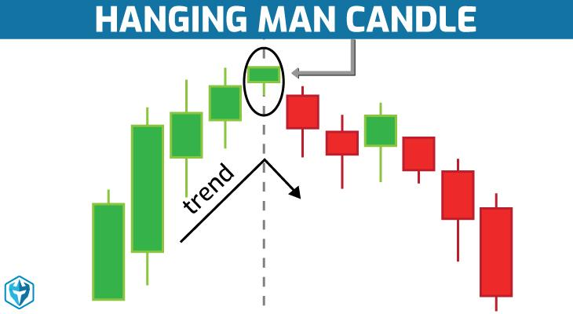

## Table of Contents

## What is a Hanging Man candlestick pattern?

A Hanging Man candlestick pattern is a type of bearish reversal pattern that appears in an uptrend. It looks like a small body with a long lower shadow and little to no upper shadow. The small body shows that the opening and closing prices were close together, while the long lower shadow indicates that the price dropped significantly during the session but then bounced back up near the open.

This pattern suggests that the buyers were initially in control, pushing the price up. However, sellers stepped in and drove the price down sharply. The fact that the price recovered to close near the open shows that buyers were still present but might be losing strength. If the next candle confirms the reversal by closing lower, it could signal that the uptrend is ending and a downtrend might start.

## What does a Hanging Man pattern look like on a chart?

A Hanging Man pattern on a chart looks like a single candle with a small body at the top and a long lower shadow. The body can be either green or red, meaning the candle can close higher or lower than it opened. The key feature is the long lower shadow, which is at least twice the length of the body. There should be little to no upper shadow, making the candle look like a person hanging from a noose.

When you see this pattern on a chart, it often appears after a series of rising candles in an uptrend. The small body near the top of the candle shows that the price didn't move much from open to close. The long lower shadow tells you that during the trading session, the price dropped a lot but then bounced back up to close near the open. This suggests that sellers tried to take control but couldn't keep the price down, hinting that the uptrend might be weakening.

## In what type of market trend does a Hanging Man typically appear?

A Hanging Man typically appears in an uptrend. This means the price of the stock or asset has been going up over time before the Hanging Man shows up. The uptrend could be short or long, but the important thing is that the price has been rising.

When you see a Hanging Man in an uptrend, it can be a warning sign that the trend might be about to change. The pattern looks like a small body with a long lower shadow, showing that the price dropped a lot during the session but then bounced back up near the open. This suggests that sellers tried to push the price down but couldn't keep it there, hinting that the buying pressure might be weakening.

## What is the significance of the Hanging Man in technical analysis?

The Hanging Man is important in technical analysis because it can tell traders that a price trend might be changing. When you see a Hanging Man, it means the price was going up for a while, but then it dropped a lot during one trading day. Even though the price came back up by the end of the day, this shows that sellers were trying to take over. This can be a warning sign that the trend of rising prices might be getting weaker.

If the next day's price goes down after a Hanging Man, it can confirm that the trend is changing. Traders use this pattern to decide when to sell their stocks or other investments. By watching for a Hanging Man, they can try to get out of their positions before the price starts to fall a lot. So, the Hanging Man helps traders make decisions based on what the price might do next.

## How can you identify a valid Hanging Man pattern?

To identify a valid Hanging Man pattern, you need to look at a few things. First, the pattern should show up after the price has been going up for a while. This means you should see a series of candles with higher highs and higher lows before the Hanging Man appears. The Hanging Man itself should have a small body at the top of the candle, which means the opening and closing prices were close together. The color of the body doesn't matter; it can be green or red.

The most important part of the Hanging Man is the long lower shadow. This shadow should be at least twice as long as the body of the candle. It shows that during the trading day, the price dropped a lot but then came back up near the opening price. There should be little to no upper shadow, making the candle look like a person hanging from a noose. If you see all these things together, you might have a valid Hanging Man pattern.

To confirm that the Hanging Man is a sign of a trend change, you need to watch what happens next. If the price goes down after the Hanging Man, it can mean that the uptrend is over and a downtrend might start. This confirmation is important because the Hanging Man by itself is just a warning sign. It's the next day's price action that tells you if the pattern is really valid and if you should think about selling your investment.

## What are the key components of a Hanging Man candlestick?

A Hanging Man candlestick has a few important parts that you need to look at. The first thing is that it should show up after the price has been going up for a while. This means you will see a series of candles with higher highs and higher lows before the Hanging Man appears. The Hanging Man itself should have a small body at the top of the candle. This small body means the opening and closing prices were close together. The color of the body doesn't matter; it can be green or red.

The most important part of the Hanging Man is the long lower shadow. This shadow should be at least twice as long as the body of the candle. It shows that during the trading day, the price dropped a lot but then came back up near the opening price. There should be little to no upper shadow, making the candle look like a person hanging from a noose. If you see all these things together, you might have a valid Hanging Man pattern.

## What is the psychological interpretation behind the Hanging Man pattern?

The Hanging Man pattern shows what traders are thinking and feeling during a trading day. When you see this pattern, it means that the price was going up for a while, but then it suddenly dropped a lot. This drop shows that some traders who were buying the stock got scared and started selling it. They might have thought the price was too high or they heard bad news about the stock. This sudden selling makes the price go down a lot during the day.

But then, other traders who still believe in the stock start buying it again. They push the price back up near where it started at the beginning of the day. This tells us that even though some traders were scared and sold, there are still people who think the stock is a good buy. The Hanging Man is a warning sign that the people who want to buy the stock might be losing power. If the price keeps going down after the Hanging Man, it could mean that the sellers are starting to take over, and the price might keep falling.

## How does the Hanging Man differ from the Hammer pattern?

The Hanging Man and the Hammer look the same, but they show up in different times and mean different things. The Hanging Man comes after the price has been going up for a while. It has a small body at the top and a long lower shadow. This pattern warns that the price might start going down soon. The Hammer, on the other hand, shows up after the price has been going down. It also has a small body at the top and a long lower shadow, but it means the price might start going up soon.

The main difference between these two patterns is the trend they appear in. The Hanging Man is a bearish reversal pattern, which means it suggests that an uptrend might be ending and a downtrend could start. The Hammer is a bullish reversal pattern, meaning it suggests that a downtrend might be ending and an uptrend could start. Both patterns need the next day's price action to confirm if the trend is really changing. If the price goes down after a Hanging Man, it confirms the bearish reversal. If the price goes up after a Hammer, it confirms the bullish reversal.

## What are the potential trading strategies when a Hanging Man is identified?

When you see a Hanging Man pattern, it might be a good time to think about selling your stock or taking some profits. This pattern shows up after the price has been going up for a while, and it warns that the price might start going down soon. If you see a Hanging Man, you can wait for the next day to see if the price goes down. If it does, it confirms that the uptrend might be over, and you can sell your stock to avoid losing money as the price falls. Some traders might also use this as a signal to start short selling, which means they bet that the price will go down and they can make money from that.

Another strategy is to use the Hanging Man as a sign to be more careful with your trades. Instead of selling right away, you can set a stop-loss order just below the low of the Hanging Man. A stop-loss order is like a safety net that automatically sells your stock if the price drops to a certain level. This way, if the price does start going down, you can limit how much money you lose. If the price doesn't go down and keeps going up, you can keep your stock and maybe make more money. So, the Hanging Man can help you decide when to be more cautious and protect your investments.

## Can a Hanging Man pattern be confirmed by other technical indicators?

Yes, a Hanging Man pattern can be confirmed by other technical indicators. Traders often look at things like the Relative Strength Index (RSI), Moving Averages, and [volume](/wiki/volume-trading-strategy) to see if the Hanging Man is a real sign that the price might go down. For example, if the RSI is over 70, it means the stock might be overbought, which fits with the idea that the price could start falling soon. If the volume is high on the day the Hanging Man appears, it shows that a lot of people were trading, which can make the pattern more important.

Using these other indicators can help traders feel more sure about what the Hanging Man means. If the Moving Averages start to cross in a way that shows the price might go down, or if the volume stays high after the Hanging Man, it can confirm that the uptrend is really ending. By looking at these other signs, traders can make better decisions about when to sell their stocks or start short selling, helping them avoid big losses if the price does start to fall.

## What are common mistakes traders make when interpreting the Hanging Man pattern?

One common mistake traders make when looking at a Hanging Man pattern is not waiting for confirmation. The Hanging Man by itself is just a warning sign that the price might start going down. But if traders sell their stocks right away without waiting to see what happens next, they might miss out on more gains if the price keeps going up. It's important to wait for the next day's price action to see if it goes down, which would confirm that the uptrend is really over.

Another mistake is not looking at the bigger picture. The Hanging Man should show up after the price has been going up for a while. If traders see a candle that looks like a Hanging Man but it's not in an uptrend, it might not mean anything. Also, traders sometimes forget to check other technical indicators like the RSI or volume. These can help confirm if the Hanging Man is a real sign of a trend change. By not using all the information available, traders might make bad decisions and lose money.

## How reliable is the Hanging Man pattern in predicting market reversals?

The Hanging Man pattern can be a helpful sign for traders, but it's not always right about when the market will change direction. It's like a warning that the price might start going down after it's been going up for a while. But to know for sure, traders need to wait and see what happens the next day. If the price does go down, then the Hanging Man was a good hint. If the price keeps going up, then the pattern didn't work this time.

Traders also need to look at other things to make sure the Hanging Man is a good sign. They should check if the stock was really going up before the Hanging Man showed up, and they should look at other signs like the RSI or how many people were trading that day. These things can help confirm if the Hanging Man is a real warning. But even with all these checks, the Hanging Man doesn't always predict the market perfectly. It's just one tool traders use to make better guesses about what might happen next.

## References & Further Reading

[1]: Bergstra, J., Bardenet, R., Bengio, Y., & Kégl, B. (2011). ["Algorithms for Hyper-Parameter Optimization."](https://dl.acm.org/doi/10.5555/2986459.2986743) Advances in Neural Information Processing Systems 24.

[2]: ["Advances in Financial Machine Learning"](https://www.amazon.com/Advances-Financial-Machine-Learning-Marcos/dp/1119482089) by Marcos Lopez de Prado

[3]: ["Evidence-Based Technical Analysis: Applying the Scientific Method and Statistical Inference to Trading Signals"](https://www.amazon.com/Evidence-Based-Technical-Analysis-Scientific-Statistical/dp/0470008741) by David Aronson

[4]: ["Machine Learning for Algorithmic Trading"](https://github.com/stefan-jansen/machine-learning-for-trading) by Stefan Jansen

[5]: ["Quantitative Trading: How to Build Your Own Algorithmic Trading Business"](https://books.google.com/books/about/Quantitative_Trading.html?id=j70yEAAAQBAJ) by Ernest P. Chan