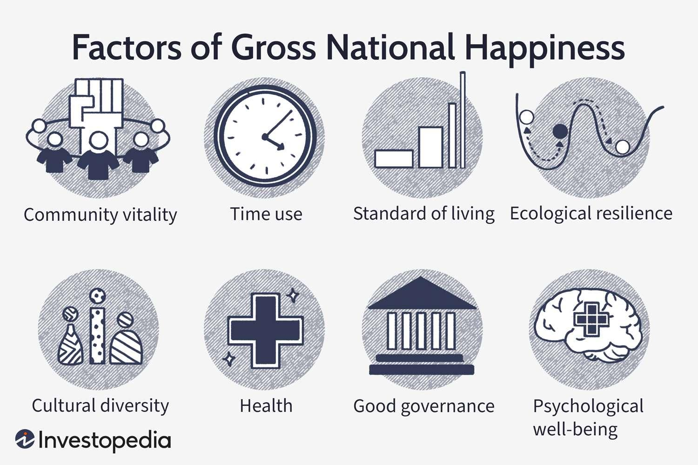

## Table of Contents

## What is Happiness Economics?

Happiness Economics is a field that studies how happy people are and what makes them happy. It looks at things like money, jobs, and where people live to see if these things make a difference in their happiness. Economists in this field use surveys and other data to measure happiness and see how it relates to economic factors.

This field is important because it helps governments and businesses understand what really matters to people. Instead of just focusing on how much money people make, Happiness Economics looks at the quality of life. By understanding what makes people happy, leaders can make better decisions about policies and programs that improve people's lives.

## How is happiness measured in economic terms?

Happiness in economic terms is often measured using surveys where people rate how happy or satisfied they are with their lives. These surveys might ask people to rate their happiness on a scale, like from 1 to 10, or to answer questions about different parts of their lives, like their job, family, and health. Economists then take all these answers and turn them into a number that can be used to compare happiness across different groups of people or countries.

One common way to measure happiness is the Gross National Happiness (GNH) index, which was first used in Bhutan. The GNH looks at things like how healthy people are, how much they can learn, how they use their time, and how connected they feel to their community. By looking at these different areas, the GNH gives a fuller picture of happiness than just looking at money. Economists also use other measures like the World Happiness Report, which ranks countries based on factors like income, social support, and freedom to make life choices.

## What are the key indicators used to assess happiness in economics?

In economics, happiness is often measured by looking at several key indicators. One important indicator is income. Economists believe that having more money can make people happier because it helps them buy things they need and want. But it's not just about money. Another big indicator is having a good job. A job that pays well and is satisfying can make people feel happy and fulfilled. Social support is also crucial. This means having friends and family who can help and support you when you need it. People who feel connected to others tend to be happier.

Other indicators include health and freedom. Being healthy makes it easier to enjoy life and do the things you love. Freedom to make your own choices is also important. When people feel they can control their lives, they are usually happier. Finally, trust in government and the community plays a role. If people trust that their leaders are making good decisions and that their community is safe and supportive, this can boost their happiness. All these indicators together give economists a good idea of how happy people are and what might make them happier.

## How does Happiness Economics differ from traditional economic theories?

Happiness Economics is different from traditional economic theories because it focuses on more than just money. Traditional economics often measures success by looking at things like GDP (Gross Domestic Product), which is the total value of everything a country makes. It assumes that if a country is making more money, the people there must be doing better. But Happiness Economics says that money is not the only thing that matters. It looks at how happy people feel in their everyday lives, not just how much money they have.

Happiness Economics also pays attention to things like having good friends, a job you like, and being healthy. These things might not show up in traditional economic measures, but they can make a big difference in how happy people are. Traditional economics might say that a country is doing well if its businesses are making a lot of money, but Happiness Economics would ask if the people in that country feel happy and satisfied with their lives. By looking at happiness, this field helps us see what really makes life better for people, beyond just the numbers in a bank account.

## What role does income play in happiness according to Happiness Economics?

In Happiness Economics, income plays an important role in how happy people feel, but it's not the only thing that matters. Having more money can make people happier because it helps them buy things they need, like food and a place to live. It also lets them enjoy things they want, like going on vacations or buying nice things. But after a certain point, more money doesn't make people much happier. This is called the "diminishing returns" of income. Once people have enough money to live comfortably, extra money doesn't add much to their happiness.

What's more important than just having a lot of money is how people feel about their income. If people feel like they are paid fairly and can meet their needs, they tend to be happier. But if they feel like they are not [earning](/wiki/earning-announcement) enough compared to others, or if they are always worried about money, their happiness can go down. So, while income is important, Happiness Economics shows that it's just one part of the puzzle. Other things like having good friends, a job you like, and being healthy are also key to feeling happy.

## Can public policy influence happiness? If so, how?

Yes, public policy can influence happiness. Governments can make rules and programs that help people feel happier. For example, they can make sure everyone has good healthcare so people stay healthy. They can also create jobs that pay well and are satisfying, which makes people feel good about their work. Another way is by making sure everyone has a safe place to live and enough money to buy what they need. When people don't have to worry about these things, they can be happier.

Public policy can also help by making communities stronger. Governments can support programs that bring people together, like community centers or parks. When people feel connected to others, they are usually happier. Policies that make education better can also help because learning new things can make people feel good about themselves. By focusing on these areas, governments can make a big difference in how happy their people are.

## What are some notable studies or findings in the field of Happiness Economics?

One famous study in Happiness Economics is the World Happiness Report. This report comes out every year and looks at how happy people are in different countries. It uses things like how much money people make, how healthy they are, and how much they trust their government to figure out happiness. The report has found that countries like Finland, Denmark, and Switzerland are often at the top of the list because they have good social support, freedom, and people trust their governments. This shows that happiness is not just about money, but also about feeling safe and connected to others.

Another important finding comes from research on income and happiness. Economists have found that while having more money can make people happier, there is a point where more money doesn't help much. This is called the "Easterlin Paradox," named after the economist Richard Easterlin. He found that once people have enough money to live comfortably, extra money doesn't make them much happier. Instead, things like having good friends, a job you like, and being healthy are more important for happiness. This shows that public policy should focus on more than just making people richer; it should also help them live better lives in other ways.

## How do cultural differences impact the study of Happiness Economics?

Cultural differences can change how people think about happiness and what makes them happy. In some cultures, being happy might mean having a lot of money and things. In other cultures, happiness might come from being with family and friends or feeling part of a community. Because of this, what makes people happy in one country might not be the same in another country. When economists study happiness, they need to think about these differences. They might use different questions in their surveys or look at different things to understand happiness in different places.

For example, in some Asian cultures, happiness might be more about harmony and balance in life. People might feel happy when they have good relationships with others and feel at peace. In Western cultures, happiness might be more about personal success and feeling good about yourself. These different views can make it hard to compare happiness across cultures. Economists need to be careful and use methods that fit each culture to get a true picture of happiness. By understanding these differences, they can help make better policies that really improve people's lives in different parts of the world.

## What are the criticisms or limitations of Happiness Economics?

Happiness Economics has some problems that people talk about. One big problem is that it's hard to measure happiness. People might say they are happy, but what makes them happy can be different. Also, how people answer surveys can change based on their mood that day or what they think the survey is for. This makes it hard to trust the numbers. Another problem is that happiness can mean different things in different cultures. What makes someone happy in one country might not be the same in another. This makes it hard to compare happiness across the world.

Another criticism is that Happiness Economics might focus too much on how people feel right now and not enough on the future. For example, a policy might make people happy today, but it could hurt them later. Also, some people say that happiness is too personal and hard to use for making big decisions like government policies. They think it's better to look at things like money and jobs, which are easier to measure. But even with these problems, Happiness Economics helps us see that money isn't everything and that other things like health and friends are important too.

## How can businesses apply principles of Happiness Economics to improve employee satisfaction?

Businesses can use Happiness Economics to make their employees happier by focusing on more than just money. They can make sure employees have good jobs that they enjoy and feel good about. This means giving them work that is interesting and letting them have a say in what they do. Businesses can also help employees feel connected to each other by having team activities or social events. When people feel like they are part of a team, they are usually happier at work.

Another way businesses can use Happiness Economics is by taking care of their employees' health and well-being. This can mean offering good health insurance or having programs that help people stay healthy, like gym memberships or wellness classes. Businesses can also make sure employees have a good balance between work and their personal life. This means not making them work too much and giving them time off to relax and be with their families. By focusing on these things, businesses can make their employees happier, which can make the whole company do better.

## What is the relationship between economic growth and happiness?

Economic growth means that a country is making more money and things. People often think that if a country grows economically, its people will be happier. But Happiness Economics shows that it's not that simple. Having more money can make people happier because they can buy things they need and want. But after a certain point, more money doesn't make people much happier. This is because other things like having good friends, a job you like, and being healthy are also important for happiness.

So, while economic growth can help make people happier, it's not the only thing that matters. If a country focuses only on making more money and forgets about things like health and community, people might not feel happier. Happiness Economics says that governments should think about all these things when they make plans for the future. By making sure people have enough money but also good lives in other ways, countries can help their people be truly happy.

## What future research directions are promising in Happiness Economics?

In the future, Happiness Economics could look more at how different cultures see happiness. Right now, most studies are done in rich countries. But happiness might mean different things in different places. By studying happiness in more countries, we can learn what really makes people happy everywhere. This can help make better rules and programs that fit each place.

Another good idea for future research is to see how happiness changes over time. Right now, we mostly look at how happy people are right now. But happiness can change as people get older or as the world changes. By studying happiness over many years, we can see what makes people happy at different times in their lives. This can help us make plans that keep people happy as they grow and change.

## References & Further Reading

[1]: Easterlin, R. A. (1974). "Does Economic Growth Improve the Human Lot? Some Empirical Evidence." In David, P. A., & Reder, M. W. (Eds.), Nations and Households in Economic Growth: Essays in Honor of Moses Abramovitz. 

[2]: Helliwell, J. F., Layard, R., & Sachs, J. (2023). ["World Happiness Report 2023."](https://worldhappiness.report/ed/2023/) Sustainable Development Solutions Network.

[3]: Kahneman, D., & Deaton, A. (2010). "High income improves evaluation of life but not emotional well-being." Proceedings of the National Academy of Sciences, 107(38), 16489-16493.

[4]: Bollen, J., Mao, H., & Zeng, X. (2011). "Twitter mood predicts the stock market." Journal of Computational Science, 2(1), 1-8.

[5]: Frey, B. S., & Stutzer, A. (2002). "What Can Economists Learn from Happiness Research?" Journal of Economic Literature, 40(2), 402-435.

[6]: "Gross National Happiness," Center for Bhutan & GNH Studies. Retrieved from [https://www.bhutanstudies.org.bt](https://bhutanstudies.org.bt/gross-national-happiness-a-set-of-discussion-papers/)

[7]: Richard H. Thaler, Cass R. Sunstein (2009). "Nudge: Improving Decisions About Health, Wealth, and Happiness." Yale University Press.

[8]: "Advances in Financial Machine Learning" by Marcos Lopez de Prado.