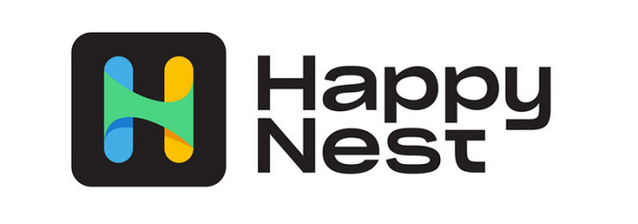

## Table of Contents

## What is HappyNest 2024?

HappyNest 2024 is a special event that happens every year. It's all about making homes better and more fun to live in. People come together to share ideas and learn new ways to make their living spaces happier and more comfortable. It's like a big party where everyone talks about home stuff, from cool furniture to smart gadgets that make life easier.

At HappyNest 2024, you can see lots of new things for your home. There are workshops where you can learn how to fix things or decorate your space. Experts give talks about the latest trends in home design and technology. It's a great place to get inspired and find new ways to make your home a happier place to be.

## How does HappyNest 2024 differ from previous versions?

HappyNest 2024 is different from past events because it focuses more on smart technology for homes. This year, there are more gadgets and devices that can make your home easier to live in. For example, you can see new kinds of lights that change color or fridges that can tell you what food you need to buy. People who come to HappyNest 2024 can learn how to use these smart things to make their homes happier and more comfortable.

Another big change is that HappyNest 2024 has more workshops for everyone. In the past, some workshops were hard to understand if you were not an expert. But this year, the workshops are made for everyone, no matter if you know a lot about home stuff or just a little. You can learn simple things like how to paint a room or how to choose the right furniture. This makes HappyNest 2024 a friendlier place where more people can join in and have fun.

## What are the key features of HappyNest 2024?

HappyNest 2024 is all about making homes happier and more comfortable. This year, it's focusing a lot on smart technology. You can see lots of new gadgets like lights that change color or fridges that can tell you what food to buy. These smart things can make your home easier to live in. People at HappyNest 2024 can learn how to use these gadgets to make their homes more fun and cozy.

Another key feature of HappyNest 2024 is that it has more workshops for everyone. In the past, some workshops were hard to understand if you weren't an expert. But this year, the workshops are made simple so anyone can join in. You can learn easy things like how to paint a room or how to pick the right furniture. This makes HappyNest 2024 a friendly place where everyone can come and learn new ways to make their home a happier place to be.

## How easy is it to set up HappyNest 2024?

Setting up HappyNest 2024 is pretty easy because it's all about making things simple for everyone. You just need to find a place where you can show off all the cool new stuff for homes. Once you have the space, you can start setting up areas for the smart gadgets, like the lights that change color or the smart fridges. It's fun because you get to see all these new things come together.

The workshops are also easy to set up. You just need to find people who know a lot about home stuff and can teach others in a simple way. They can talk about easy things like painting a room or picking the right furniture. Once you have the teachers, you can set up the workshop spaces where everyone can learn and have fun. It's all about making HappyNest 2024 a friendly and easy place for everyone to enjoy.

## What are the system requirements for HappyNest 2024?

HappyNest 2024 doesn't need special computer stuff to work. You just need a place where you can show off all the cool home gadgets and have workshops. This could be a big room or a hall where people can walk around and see everything. You'll also need tables and chairs for the workshops so people can sit and learn comfortably.

For the smart gadgets, you might need some simple things like electricity and maybe Wi-Fi if some of the gadgets need to connect to the internet. But it's not hard to set up because the gadgets are made to be easy to use. Just plug them in and turn them on, and they'll be ready to show off at HappyNest 2024.

## How does HappyNest 2024 perform in terms of user experience?

HappyNest 2024 is great for people because it's easy to enjoy. When you come to the event, you see all kinds of cool new things for your home. The smart gadgets are set up in a way that's easy to understand, so you can see how they work and how they can make your home better. The people who run the event make sure everything is simple and fun, so you don't need to be an expert to enjoy it.

The workshops at HappyNest 2024 are also really good for everyone. They are made simple so anyone can learn, no matter if you know a lot about home stuff or just a little. You can sit down, listen to the experts, and learn easy things like how to paint a room or pick the right furniture. This makes the whole event feel friendly and welcoming, so you can have a good time and learn new ways to make your home happier.

## What are the security features included in HappyNest 2024?

HappyNest 2024 takes care of your safety while you enjoy the event. There are people who watch over the place to make sure everyone is safe. They check that all the gadgets and things shown at the event are safe to use. If you have any questions or feel worried, you can talk to them, and they will help you feel better.

The event also makes sure your personal stuff is safe. When you come to HappyNest 2024, you can leave your things at a safe place if you need to. This way, you can walk around and see everything without worrying about your bag or coat. HappyNest 2024 wants everyone to have a fun and safe time.

## Can HappyNest 2024 integrate with other smart home devices?

HappyNest 2024 is all about making your home smarter and happier. One cool thing about it is that many of the gadgets you see can work with other smart home devices you already have. For example, if you have a smart light system at home, the new lights at HappyNest 2024 might be able to connect and work together with them. This means you can control all your lights from one app or even tell them to change color at the same time.

The event also shows you how easy it is to set up these connections. The people at HappyNest 2024 make sure to explain how different gadgets can talk to each other. So, if you have a smart thermostat or a smart speaker, you can learn how to make them work with the new gadgets from the event. This way, your whole home can become smarter and more fun to live in, all thanks to what you learn and see at HappyNest 2024.

## What are the common issues reported by users of HappyNest 2024?

People who go to HappyNest 2024 sometimes say they have trouble understanding how to use some of the smart gadgets. Even though the event tries to make things simple, some gadgets can be tricky to set up or use at home. People might need more help or clearer instructions to make sure they can enjoy the new things they see at the event.

Another common issue is that the workshops can get very busy. Because HappyNest 2024 is popular, lots of people want to join the workshops to learn new things. This can make it hard to find a seat or get the attention of the experts. People wish there were more spots or more times for the workshops so everyone could learn without feeling rushed or left out.

## How does HappyNest 2024 handle data privacy and compliance?

HappyNest 2024 takes data privacy very seriously. They make sure that any information you share at the event, like your name or email, is kept safe. They follow rules about how to handle your data so that it's not used in ways you don't want. If you sign up for a workshop or leave your contact info, HappyNest 2024 will only use it to tell you about the event or other things you might like, and they won't share it with others without your okay.

The event also makes sure to follow all the laws about data privacy. This means they have to be careful with how they collect and use your information. They tell you clearly what they will do with your data and ask for your permission before they do anything with it. This way, you can feel safe knowing that HappyNest 2024 is doing everything right to protect your privacy while you enjoy learning about new ways to make your home happier.

## What advanced customization options are available in HappyNest 2024?

HappyNest 2024 has lots of cool ways to make your home just the way you like it. You can see gadgets that let you change the colors of your lights to match your mood or the time of day. There are also smart fridges that can help you plan your meals by suggesting recipes based on what you have inside. If you want to make your home more personal, you can learn how to set up these gadgets to work together and do things just the way you want.

The event also shows you how to make your furniture and decorations special. Workshops teach you how to paint or decorate your furniture in fun ways. You can learn to add your own touch to your home by choosing colors and styles that show who you are. HappyNest 2024 makes sure you have all the tools and ideas you need to make your home a happy, personalized space.

## How does HappyNest 2024 compare to its competitors in the market?

HappyNest 2024 stands out from its competitors because it focuses a lot on making homes happier and more comfortable. While other events might just show you new gadgets, HappyNest 2024 goes further by teaching you how to use these gadgets to make your home better. The workshops are made simple so everyone can learn, no matter if you know a lot about home stuff or just a little. This makes HappyNest 2024 a friendly place where more people can join in and have fun.

Compared to other events, HappyNest 2024 also puts a big emphasis on smart technology. You can see lots of new gadgets like lights that change color or fridges that can tell you what food to buy. These smart things can make your home easier to live in, and the event shows you how to connect them with the gadgets you already have. This way, your whole home can become smarter and more fun to live in, all thanks to what you learn and see at HappyNest 2024.

## What is Algorithmic Trading at HappyNest?

Algorithmic trading refers to the use of computer algorithms to automate trading decisions in financial markets. These algorithms execute trades at speeds and frequencies that surpass human capability, based on predefined criteria such as timing, price, and quantity. By eliminating the human emotional component, [algorithmic trading](/wiki/algorithmic-trading) aims for precision, efficiency, and the exploitation of minute price discrepancies.

HappyNest integrates algorithmic trading into its investment strategies by employing a diverse range of sophisticated algorithms that cater to different market conditions and investor preferences. These algorithms are developed to optimize trading performance and can operate on various data inputs and trading paradigms.

Typically, HappyNest utilizes several types of algorithms, including but not limited to:

1. **Trend-Following Algorithms**: These algorithms capitalize on market trends by identifying and investing in assets that exhibit strong momentum in a particular direction. They often employ moving averages and other technical indicators to signal buy or sell decisions.
$$
   \text{Moving Average (MA)} = \frac{\sum_{i=1}^{n} P_i}{n}

$$

   - Where $P_i$ is the price at each time period $i$, and $n$ is the number of time periods.

2. **Machine Learning Models**: Machine learning algorithms at HappyNest analyze vast amounts of historical and real-time data to predict market movements. These models learn from data patterns and can adapt to new, unseen data for enhanced prediction accuracy. Techniques such as regression analysis, decision trees, and neural networks are commonly used.

   - Example Python code snippet for a simple machine learning regression model might look like:

     ```python
     from sklearn.linear_model import LinearRegression
     import numpy as np

     # Dataset (example data)
     X = np.array([[1], [2], [3], [4], [5]])
     y = np.array([100, 200, 300, 400, 500])

     # Create and train the model
     model = LinearRegression()
     model.fit(X, y)

     # Make a prediction
     prediction = model.predict(np.array([[6]]))
     ```

HappyNest allows users to customize these algorithms to align with their individual investment goals and risk appetites. This includes modifying parameters like investment amounts, risk tolerance levels, and specific market indicators. The platform offers an intuitive interface where investors can tweak algorithm settings without needing extensive programming knowledge.

Case studies of algorithmic trades executed on HappyNest demonstrate the platform's efficacy. For instance, a trend-following strategy deployed in a bullish market scenario effectively captured substantial gains by automating buys and sells based on predefined [momentum](/wiki/momentum) thresholds. Another example includes a [machine learning](/wiki/machine-learning)-powered [arbitrage](/wiki/arbitrage) algorithm that successfully identified and leveraged price discrepancies across multiple exchanges, yielding consistent profits.

By integrating cutting-edge algorithms with a user-focused design, HappyNest empowers investors to participate in algorithmic trading, harnessing technology to make informed and efficient trading decisions.

## What are the future prospects for HappyNest?

As algorithmic trading continues to gain traction, several predicted trends indicate how platforms like HappyNest must adapt to remain relevant and effective for modern investors. The future of algorithmic trading is increasingly being shaped by advancements in machine learning and [artificial intelligence](/wiki/ai-artificial-intelligence) (AI), greater data accessibility, and evolving regulatory environments. HappyNest is poised to respond to these trends by focusing on integrating cutting-edge technology, refining their current algorithmic models, and expanding their service offerings.

HappyNest plans to focus on the development of proprietary algorithms that leverage machine learning to provide more robust predictive analytics. These algorithms aim to improve real-time decision-making capabilities by utilizing vast datasets and sophisticated statistical models. An example formula for a predictive model could be:

$$
\hat{y} = \beta_0 + \beta_1 x_1 + \beta_2 x_2 + ... + \beta_n x_n
$$

where $\hat{y}$ represents the predicted investment outcome, and $x_1, x_2, ..., x_n$ are various input features influencing the outcome, while $\beta_0, \beta_1, ..., \beta_n$ are the model's parameters.

Additionally, HappyNest is expected to introduce advanced customization options that will allow users to tailor trading algorithms to their specific needs, enhancing user engagement and strategy personalization. This shift to a more platform-as-a-service model will be crucial in attracting a diverse range of investors.

The company envisions substantial growth and market expansion over the next few years, with a focus on diversifying their user base beyond institutional investors to attract more individual traders. This includes the potential introduction of educational tools and resources to assist new users in understanding and leveraging algorithmic trading.

To remain competitive, HappyNest must overcome challenges such as maintaining technological agility in a rapidly evolving digital landscape, ensuring compliance with changing regulations, and managing risks associated with market volatility. The platform's capacity to ensure data privacy and implement robust risk management protocols will be critical to its sustained success.

Expert forecasts suggest that HappyNest has significant potential to capitalize on current trends in algorithmic trading. By continuing to innovate and adapt, the platform can maintain its competitive edge and deliver significant value to its users. Their focus on technological integration, market expansion, and user experience positions them well for future growth and success in the field of investment platforms.

## References & Further Reading

[1]: Bergstra, J., Bardenet, R., Bengio, Y., & Kégl, B. (2011). ["Algorithms for Hyper-Parameter Optimization."](https://papers.nips.cc/paper/4443-algorithms-for-hyper-parameter-optimization) Advances in Neural Information Processing Systems 24.

[2]: ["Advances in Financial Machine Learning"](https://www.amazon.com/Advances-Financial-Machine-Learning-Marcos/dp/1119482089) by Marcos Lopez de Prado

[3]: ["Evidence-Based Technical Analysis: Applying the Scientific Method and Statistical Inference to Trading Signals"](https://www.amazon.com/Evidence-Based-Technical-Analysis-Scientific-Statistical/dp/0470008741) by David Aronson

[4]: ["Machine Learning for Algorithmic Trading"](https://github.com/stefan-jansen/machine-learning-for-trading) by Stefan Jansen

[5]: ["Quantitative Trading: How to Build Your Own Algorithmic Trading Business"](https://books.google.com/books/about/Quantitative_Trading.html?id=j70yEAAAQBAJ) by Ernest P. Chan