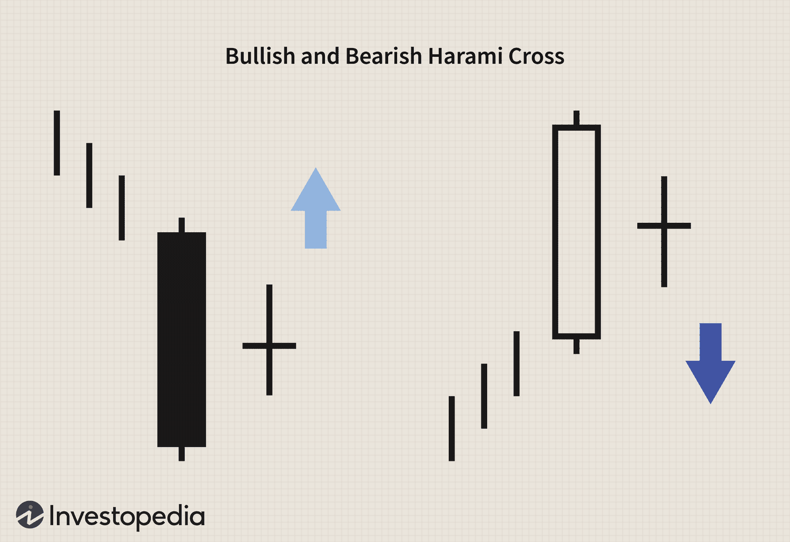

Algorithmic trading has revolutionized the financial markets by allowing traders to execute trades with precision and speed using predefined criteria. Among the myriad technical patterns utilized in these automated strategies is the harami cross, a well-known candlestick pattern. Recognized for its potential to signal market reversals, the harami cross becomes a valuable tool within technical analysis, providing traders with insights into possible shifts in market momentum.

The core concept of algorithmic trading involves leveraging algorithms to make systematic trading decisions. These algorithms can incorporate various technical indicators, including candlestick patterns, to optimize trading strategies. The harami cross pattern, with its distinctive formation, offers traders an opportunity to anticipate reversals in market trends. While it can be identified manually by traders, integrating it into algorithmic frameworks enhances its utility, offering a systematic approach to decision-making.



This pattern is particularly significant because it can serve as an early warning for potential reversals, offering traders a glimpse into market indecisiveness. Whether anticipating a bullish reversal during a downtrend or a bearish reversal during an uptrend, the harami cross can provide critical insights. Thus, understanding its mechanics and practical application in algorithmic systems can enable traders to effectively predict and react to market changes, improving their overall strategic outcomes.

## Table of Contents

## What is a Harami Cross Pattern?

A Harami Cross is a key candlestick pattern commonly utilized in technical analysis to anticipate market reversals. This pattern emerges from Japanese candlestick charting techniques, which offer powerful visual indicators for market sentiments. Characteristically, the Harami Cross consists of two candles. First, a large candlestick appears, which captures a significant movement in the market. This is followed by a doji candlestick, where the opening and closing prices are nearly identical, forming a cross-like shape. The doji signifies a pause or uncertainty in the market trend.

The presence of a Harami Cross in a chart is interpreted as a signal of market indecision. The psychology behind this pattern is straightforward: the first candlestick represents a strong trend either upward or downward, while the following doji signifies that the driving force behind the trend is weakening. This loss of momentum raises the possibility of a reversal.

The Harami Cross can have different implications depending on its position within the existing trend. When a Harami Cross forms during a downtrend, it typically suggests a potential bullish reversal. Conversely, its occurrence during an uptrend may indicate a bearish reversal. Traders often regard the Harami Cross as significant due to its potential to signal these changes early, enabling more informed decision-making.

Despite its utility, the Harami Cross, like all technical indicators, should not be used in isolation. It is most effective when combined with other forms of analysis or corroborative trading signals, providing a more comprehensive market outlook. Properly identifying and interpreting the Harami Cross can equip traders to navigate market fluctuations with greater confidence.

## Mechanics and Formations

A bullish harami cross, a candlestick pattern used in technical analysis, emerges during a downtrend. It consists of a down candle with a lengthy body followed by a doji—a candlestick where the open and close prices are nearly identical. This formation suggests that although the selling pressure was significant during the initial period, the subsequent period's doji indicates indecision among traders. This may signal a potential reversal in the bearish trend.

Conversely, a bearish harami cross develops during an uptrend and is characterized by an upward candle followed by a doji. Here, the initial strong upward movement is succeeded by a doji, suggesting that the buying [momentum](/wiki/momentum) has stalled, leading to uncertainty in continuing the upward trend.

Both the bullish and bearish harami crosses symbolize a potential halting of the existing trend's momentum. These formations are particularly noteworthy because they highlight a shift from certainty in market direction to uncertainty, which could lead to a reversal.

From a technical perspective, identifying these patterns involves recognizing the transition from a long-bodied candle to the doji. Traders can automate the recognition of these patterns using programming tools. For instance, using Python and libraries like Pandas and Matplotlib, traders can develop algorithms to detect harami crosses within market data:

```python
import pandas as pd
import numpy as np

def identify_harami_cross(data):
    data['Is_Harami'] = ((data['Close'].shift(1) < data['Open'].shift(1)) & 
                         (data['Open'] > data['Close']) & 
                         (np.abs(data['Open'] - data['Close']) < 
                          0.1 * (data['High'] - data['Low'])))
    return data

# Example data is assumed to be a DataFrame with columns: Open, High, Low, Close
# data = pd.read_csv('market_data.csv')
# harami_cross_data = identify_harami_cross(data)
# harami_crosses = harami_cross_data[harami_cross_data['Is_Harami']]
```

This basic Python script demonstrates how traders might script the identification of harami cross patterns within their datasets. These patterns are key in signalling potential trend reversals, hence their significance in trading strategies.

## Using Harami Crosses in Algorithmic Trading

Incorporating harami cross patterns into trading algorithms can be a strategic approach to enhance decision-making capabilities for traders. These patterns, which are indicative of potential trend reversals, serve as valuable signals within [algorithmic trading](/wiki/algorithmic-trading) systems designed to analyze market data and execute trades without human intervention.

Algorithms can be programmed to detect harami cross formations by analyzing candlestick data. In essence, the algorithm scans for instances where a large candlestick is immediately followed by a doji within a given timeframe. A bullish harami cross, for instance, is identified when a long down candle is followed by a doji indicating possible bullish reversal, ideally absent any significant lower wick. Conversely, a bearish harami cross involves a long up candle succeeded by a doji, suggesting a potential bearish reversal. 

To effectively integrate this detection into trading algorithms, a simple programming structure can be employed. Here's an example in Python using the pandas library to process financial data:

```python
import pandas as pd

def detect_harami_cross(data):
    signals = []
    for i in range(1, len(data)):
        prev_candle = data.iloc[i - 1]
        current_candle = data.iloc[i]

        is_bullish_harami_cross = (prev_candle['Close'] < prev_candle['Open'] and
                                   current_candle['Open'] < current_candle['Close'] and
                                   current_candle['Close'] < prev_candle['Open'] and
                                   current_candle['Open'] > prev_candle['Close'] and 
                                   abs(current_candle['Close'] - current_candle['Open']) < 0.1 * (prev_candle['Open'] - prev_candle['Close']))

        is_bearish_harami_cross = (prev_candle['Close'] > prev_candle['Open'] and
                                   current_candle['Open'] > current_candle['Close'] and
                                   current_candle['Close'] > prev_candle['Open'] and
                                   current_candle['Open'] < prev_candle['Close'] and
                                   abs(current_candle['Close'] - current_candle['Open']) < 0.1 * (prev_candle['Open'] - prev_candle['Close']))

        if is_bullish_harami_cross:
            signals.append('Bullish Harami Cross Detected')
        elif is_bearish_harami_cross:
            signals.append('Bearish Harami Cross Detected')
        else:
            signals.append('No Signal')

    return signals

# Example usage
data = pd.DataFrame({
    'Open': [10, 8, 7, 12, 11],
    'Close': [7, 8, 7.1, 11, 12]
})

signals = detect_harami_cross(data)
print(signals)
```

Backtesting these strategies is crucial to ascertain their validity and effectiveness across various market conditions. Backtesting involves running the algorithm on historical data to simulate how the trading strategy would have performed. This process helps determine not only the success rate of identifying true reversal signals but also the profitability of executing such trades over a specified time period. 

Various platforms and software tools facilitate [backtesting](/wiki/backtesting), providing visual analysis and statistical data on trade outcomes. This historical evaluation highlights potential adjustments needed in the algorithm to adapt to different assets or market environments, such as adding additional filters or combining the harami cross pattern with other technical indicators.

Ultimately, integrating harami cross patterns into algorithmic trading systems requires balancing the simplicity of detection with robust verification through backtesting. This method optimizes trading algorithms to better respond to potential market reversals, enhancing decision-making in fast-paced trading environments.

## Advantages and Limitations

The harami cross pattern, a recognizable feature of technical analysis, offers notable advantages due to its simplicity and accessibility. Its distinct formation, consisting of a large candlestick followed by a smaller doji, makes it straightforward to identify even for those new to trading. This ease of recognition allows it to serve as an accessible tool for traders aiming to integrate technical patterns into their decision-making processes.

Despite these advantages, one must approach the harami cross with caution. The pattern can produce false signals, particularly in highly volatile markets, where price movements might not adhere to expected trends. In these environments, the market's inherent noise increases the likelihood of mistaking random fluctuations for significant trend reversals. As such, sole reliance on the harami cross could lead to suboptimal trading outcomes.

To mitigate the risk of false signals, it is advisable to use the harami cross pattern in conjunction with other technical indicators or confirmatory signals. Combining it with moving averages, the Relative Strength Index (RSI), or support and resistance levels can provide a more comprehensive picture of market dynamics. For example, a harami cross appearing in tandem with a divergence in RSI can offer a stronger indication of a potential reversal. 

Incorporating multiple indicators can also be facilitated through algorithmic trading. Designing algorithms that require multiple confirmations before executing a trade can enhance reliability. A sample Python code snippet for incorporating a simple harami cross detection with additional RSI confirmation might look like this:

```python
def detect_harami_cross(candles):
    for i in range(1, len(candles)):
        prev_candle = candles[i-1]
        current_candle = candles[i]
        if prev_candle['close'] > prev_candle['open'] and abs(prev_candle['close'] - prev_candle['open']) > abs(current_candle['close'] - current_candle['open']):
            if current_candle['open'] == current_candle['close']:
                return True
    return False

def rsi(values, period=14):
    deltas = np.diff(values)
    seed = deltas[:period+1]
    up = seed[seed >= 0].sum()/period
    down = -seed[seed < 0].sum()/period
    rs = up/down
    rsi = np.zeros_like(values)
    rsi[:period] = 100. - 100./(1.+rs)

    for i in range(period, len(deltas)):
        delta = deltas[i]
        if delta > 0:
            upval = delta
            downval = 0.
        else:
            upval = 0.
            downval = -delta

        up = (up*(period-1) + upval)/period
        down = (down*(period-1) + downval)/period

        rs = up/down
        rsi[i] = 100. - 100./(1.+rs)

    return rsi

# Sample usage
candles = [{'open': 100, 'close': 102}, {'open': 101, 'close': 101}]  # Example candles data
prices = [100, 102, 101]  # Corresponding price data
if detect_harami_cross(candles) and rsi(prices)[-1] < 30:  # RSI < 30 indicating oversold
    print("Potential bullish reversal with harami cross detected!")
```

In summary, while the harami cross is a valuable pattern due to its ease of identification, its limitations necessitate the use of additional confirmations to enhance trading reliability. By integrating multiple indicators or signals, traders can better navigate the complexities of market [volatility](/wiki/volatility-trading-strategies) and increase the robustness of their trading strategies.

## Examples and Case Studies

Case studies offer practical insights into the effectiveness of harami cross patterns in predicting significant price movements. One notable example involves American Airlines Group Inc. (NASDAQ: AAL). Historical price data analyses demonstrate how harami cross patterns can forewarn major market shifts, assisting traders in refining their strategies.

Historically, multiple instances of harami cross patterns have appeared in the trading charts of American Airlines, particularly during pivotal market phases. For example, on June 20, 2020, the stock formed a bullish harami cross pattern following a prolonged downtrend, suggesting a potential reversal. Traders who recognized this pattern early saw an appreciation in the stock's price over subsequent weeks. This occurrence emphasizes the harami cross's predictive capability.

Another example can be seen during the economic impact of the COVID-19 pandemic. At the onset of the market's recovery phase in April 2020, American Airlines exhibited a bearish harami cross pattern amidst rising trading volumes. This signaled a temporary stalling of buying momentum, allowing traders to anticipate and prepare for a subsequent retracement in prices.

Applying the harami cross pattern involves backtesting and analyzing past price data to understand its effectiveness in varying market conditions. Python can be a valuable tool for this process, as it allows traders to automate the pattern recognition process using libraries like pandas and matplotlib. Below is a simplified demonstration of identifying a harami cross pattern in historical stock data:

```python
import pandas as pd
import matplotlib.pyplot as plt

# Load your data file containing Date, Open, High, Low, Close columns
data = pd.read_csv('AAL_stock_data.csv')

# Simple function to detect Harami Cross
def detect_harami_cross(data):
    patterns = []
    for i in range(1, len(data) - 1):
        prev_candle = data.iloc[i - 1]
        doji_candle = data.iloc[i]

        # Check if previous candle is long
        if abs(prev_candle['Open'] - prev_candle['Close']) > (prev_candle['High'] - prev_candle['Low']) / 5:
            # Check for the doji
            if abs(doji_candle['Open'] - doji_candle['Close']) < (doji_candle['High'] - doji_candle['Low']) / 5:
                patterns.append(doji_candle['Date'])

    return patterns

# Get the dates of Harami Cross patterns
harami_cross_dates = detect_harami_cross(data)

# Plotting
plt.figure(figsize=(14,7))
plt.plot(data['Date'], data['Close'], label='Close Price')
plt.scatter(data.loc[data['Date'].isin(harami_cross_dates), 'Date'], 
            data.loc[data['Date'].isin(harami_cross_dates), 'Close'], 
            label='Harami Cross', color='red')
plt.title('AAL Harami Cross Patterns')
plt.xlabel('Date')
plt.ylabel('Price')
plt.legend()
plt.show()
```

By identifying these patterns and leveraging past data, traders can develop robust algorithms keen on finding harami cross formations and initiating trades based on these events. While these case studies with American Airlines demonstrate the pattern's practical application, traders must consider that each market environment is unique. Therefore, combining harami cross patterns with other technical indicators enhances signal reliability and reduces the risk of false positives, leading to more informed trading decisions.

## Conclusion

Mastering the harami cross pattern provides significant advantages for manual and algorithmic traders by offering an early warning system for potential market reversals. Recognizing this pattern involves identifying specific candlestick formations that signal market indecision and possible shifts in trend direction. As a result, traders can use the harami cross as a predictive tool to anticipate changes before they occur, allowing for more informed trading decisions.

Integrating the harami cross into trading strategies involves more than merely recognizing the pattern. It necessitates a balanced approach that combines theoretical knowledge of the pattern with practical application. Traders should familiarize themselves with the nuances of the harami cross and its history in various market contexts to maximize its utility. Moreover, traders should consider developing and backtesting algorithmic strategies that incorporate the detection of harami crosses to automate responses to these formations, thereby minimizing human error and enhancing trading efficiency.

For successful implementation, traders should complement the harami cross with other technical indicators or signals to reduce the likelihood of false positives, especially in volatile markets. By using additional tools, traders can increase the reliability of signals generated by the harami cross.

Overall, the harami cross serves as a valuable component within a broader technical analysis toolset. Its effective use requires a combination of theoretical understanding, practical application, and an integrated approach that leverages complementary technical indicators to confirm signals and strengthen trading decisions.

## References & Further Reading

[1]: Bergstra, J., Bardenet, R., Bengio, Y., & Kégl, B. (2011). ["Algorithms for Hyper-Parameter Optimization."](https://dl.acm.org/doi/10.5555/2986459.2986743) Advances in Neural Information Processing Systems 24.

[2]: ["Advances in Financial Machine Learning"](https://www.amazon.com/Advances-Financial-Machine-Learning-Marcos/dp/1119482089) by Marcos Lopez de Prado

[3]: ["Evidence-Based Technical Analysis: Applying the Scientific Method and Statistical Inference to Trading Signals"](https://www.amazon.com/Evidence-Based-Technical-Analysis-Scientific-Statistical/dp/0470008741) by David Aronson

[4]: ["Machine Learning for Algorithmic Trading"](https://github.com/stefan-jansen/machine-learning-for-trading) by Stefan Jansen

[5]: ["Quantitative Trading: How to Build Your Own Algorithmic Trading Business"](https://www.amazon.com/Quantitative-Trading-Build-Algorithmic-Business/dp/1119800064) by Ernest P. Chan