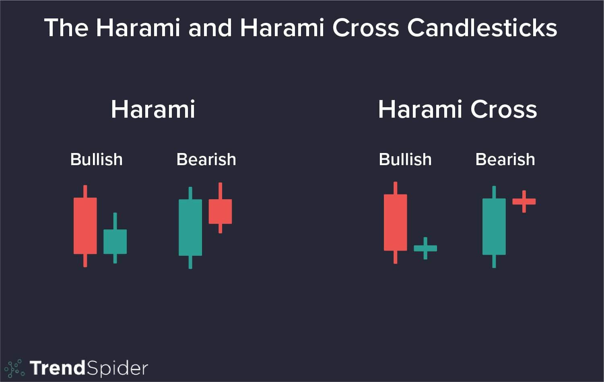

## Table of Contents

## What is a Harami Cross pattern in trading?

A Harami Cross pattern is a type of candlestick pattern that traders use to predict future price movements in financial markets. It is made up of two candles: a large candle followed by a small candle, which is called a Doji. The Doji has a very small body, showing that the opening and closing prices are almost the same. This pattern suggests that the market might be getting ready for a change in direction. If the Harami Cross appears during an uptrend, it could mean the price might start going down. If it appears during a downtrend, it could mean the price might start going up.

Traders look for the Harami Cross because it can help them decide when to buy or sell. When they see this pattern, they might think the current trend is losing strength. For example, if the market has been going up and a Harami Cross appears, traders might start selling their assets because they think the price will soon drop. On the other hand, if the market has been going down and a Harami Cross shows up, traders might start buying because they think the price will soon rise. It's important for traders to use other tools and indicators along with the Harami Cross to make better trading decisions.

## How does a Harami Cross differ from a regular Harami pattern?

A Harami Cross and a regular Harami pattern are both candlestick patterns that traders use to predict changes in the market. The main difference between them is the shape of the second candle. In a regular Harami pattern, the second candle is smaller than the first one, but it still has a noticeable body. This means the opening and closing prices of the second candle are different. On the other hand, a Harami Cross has a Doji as the second candle. A Doji is a candle with a very small body, where the opening and closing prices are almost the same.

Both patterns suggest that the market might be getting ready for a change in direction. When you see a regular Harami, it means the current trend might be losing strength, and a reversal could be coming. The same goes for a Harami Cross, but because the second candle is a Doji, it shows even more uncertainty in the market. This can make the Harami Cross a stronger signal of a possible trend reversal. Traders use these patterns to decide when to buy or sell, but they also look at other indicators to make sure their decisions are well-informed.

## What are the key components that form a Harami Cross?

A Harami Cross is made up of two candles. The first candle is big and shows the current trend, either up or down. The second candle is a Doji, which is a small candle where the opening and closing prices are almost the same. The Doji is completely inside the body of the first candle, which means it doesn't go beyond the high or low of the first candle.

This pattern suggests that the market might be getting ready to change direction. If the Harami Cross appears during an uptrend, it could mean the price might start going down. If it appears during a downtrend, it could mean the price might start going up. Traders look for this pattern to help them decide when to buy or sell, but they also use other tools to make sure their decisions are good.

## Can you explain the psychology behind the formation of a Harami Cross?

When a Harami Cross forms, it shows that the market is feeling unsure. The first big candle means the market was moving strongly in one direction, either up or down. But then, the second candle, which is a Doji, shows that the market couldn't decide where to go next. The Doji means the opening and closing prices were almost the same, which tells us that the strong trend from the first candle is losing its power. Traders see this and start to think that the market might be ready to change direction.

The psychology behind the Harami Cross is about the shift in what traders are thinking. At first, everyone is following the trend, but then the Doji shows that some traders are starting to doubt it. This doubt can make more traders change their minds, leading to a possible reversal in the market's direction. If the Harami Cross happens during an uptrend, it might mean the price will start to go down because traders are losing confidence in the upward movement. If it happens during a downtrend, it might mean the price will start to go up because traders are losing confidence in the downward movement.

## In which market conditions is a Harami Cross most likely to occur?

A Harami Cross is most likely to occur when the market is getting ready to change direction. This often happens after a strong trend, either up or down, has been going on for a while. When the market has been moving in one direction for a long time, traders start to feel unsure about whether the trend will keep going. This uncertainty can lead to the formation of a Harami Cross, where the first big candle shows the strong trend and the second small Doji candle shows that the market is starting to doubt the trend.

The Harami Cross is more common in markets that are not moving too fast or too slow. If the market is moving very quickly, it might be hard for a Harami Cross to form because the trend is too strong. But if the market is moving very slowly, there might not be enough action to create the big first candle needed for the pattern. So, a Harami Cross is most likely to happen in markets that are moving at a medium pace, where there is enough action to create a strong trend but also enough uncertainty to cause a pause in the trend.

## How reliable is the Harami Cross as a trading signal?

The Harami Cross can be a helpful signal for traders, but it's not perfect. It shows that the market might be ready to change direction, which can help traders decide when to buy or sell. But, it's important to remember that no single pattern can predict the market perfectly. The Harami Cross works best when used with other tools and indicators. This way, traders can get a better idea of what might happen next in the market.

The reliability of the Harami Cross can also depend on the market conditions. It tends to be more useful in markets that are moving at a medium pace, where there's enough action to create a strong trend but also enough uncertainty to cause a pause. In very fast or very slow markets, the Harami Cross might not be as reliable. Traders should always look at the bigger picture and use other information to make the best trading decisions.

## What are the steps to identify a Harami Cross on a price chart?

To spot a Harami Cross on a price chart, first look for a big candle. This candle can be going up or down and shows the current trend. The body of this candle should be large, meaning there was a strong move in the market. Next, find a small candle right after the big one. This small candle is called a Doji, and it should be completely inside the body of the big candle. The Doji has a very tiny body, showing that the opening and closing prices are almost the same.

Once you see these two candles, check if the Doji is fully within the range of the big candle's body. This means the Doji's high and low should not go beyond the big candle's high and low. If all these things are true, you have found a Harami Cross. Remember, this pattern suggests the market might be ready to change direction, but it's a good idea to use other tools and indicators to make sure your trading decisions are well-informed.

## How should a trader confirm a Harami Cross signal before making a trade?

When a trader sees a Harami Cross on a chart, they should not rush to make a trade right away. It's important to confirm the signal with other tools and indicators to make sure it's a good time to buy or sell. One way to do this is by looking at other candlestick patterns or technical indicators like moving averages, the Relative Strength Index (RSI), or the Moving Average Convergence Divergence (MACD). These can help show if the market is really getting ready to change direction.

Another good idea is to wait for the next candle after the Harami Cross to see what it does. If the next candle moves in the direction the Harami Cross suggests, it can be a stronger sign that the market is changing. For example, if the Harami Cross appears during an uptrend and the next candle starts going down, it might be a good time to sell. But if the next candle doesn't move in the expected direction, it might be better to wait for more signs before making a trade.

## What are the common entry and exit strategies when trading a Harami Cross?

When trading a Harami Cross, a common entry strategy is to wait for the candle right after the Harami Cross to confirm the signal. If the Harami Cross appears during an uptrend and the next candle starts to go down, a trader might decide to sell or go short. If it appears during a downtrend and the next candle starts to go up, a trader might decide to buy or go long. It's important to use other tools like moving averages or the RSI to make sure the signal is strong before entering a trade.

For exiting a trade based on a Harami Cross, traders often set a stop-loss to limit their risk. If they entered a short position after a Harami Cross in an uptrend, they might set a stop-loss just above the high of the Harami Cross pattern. If they entered a long position after a Harami Cross in a downtrend, they might set a stop-loss just below the low of the pattern. To take profits, traders might use a take-profit level based on key support or resistance levels, or they might use a trailing stop to let the trade run as long as the market keeps moving in their favor.

## Can the Harami Cross be used effectively in conjunction with other technical indicators?

Yes, the Harami Cross can be used effectively with other technical indicators to make better trading decisions. When a trader sees a Harami Cross, they can look at other tools like moving averages to see if the market is really changing direction. For example, if the Harami Cross appears during an uptrend and the price is also below a key moving average, it might be a stronger sign that the price will start going down. Using the Relative Strength Index (RSI) can also help. If the RSI shows the market is overbought when a Harami Cross appears in an uptrend, it can confirm that it might be a good time to sell.

Another useful indicator to use with the Harami Cross is the Moving Average Convergence Divergence (MACD). If the MACD line crosses below the signal line right after a Harami Cross in an uptrend, it can be a strong signal to sell. On the other hand, if the MACD line crosses above the signal line after a Harami Cross in a downtrend, it can be a good sign to buy. By combining the Harami Cross with these other indicators, traders can get a clearer picture of what the market might do next and make more informed trading choices.

## How does the timeframe affect the interpretation of a Harami Cross?

The timeframe you use to look at a Harami Cross can change how you see it. If you look at a short timeframe, like a 5-minute chart, a Harami Cross might show a quick change in the market. But, these quick changes can be less important and might not last long. So, if you trade on short timeframes, you need to be ready for the market to move fast and be okay with more risk.

On the other hand, if you look at a longer timeframe, like a daily or weekly chart, a Harami Cross can show a bigger change in the market. These changes can be more important and might last longer. Traders who use longer timeframes might see the Harami Cross as a stronger sign to buy or sell. But, they need to be patient and wait for the market to move in the direction they expect.

## What are some real-world examples of successful trades using the Harami Cross pattern?

One real-world example of a successful trade using the Harami Cross pattern happened in the stock market with Company ABC. The stock had been going up for weeks, but then a Harami Cross appeared on the daily chart. The first candle was big and green, showing the strong uptrend. The second candle was a small Doji, completely inside the first candle's body. Seeing this, a trader waited for the next candle to confirm the signal. The next day, the stock started to go down, so the trader sold their shares and went short. The stock kept going down for the next few days, and the trader made a good profit by selling at the right time.

Another example is from the [forex](/wiki/forex-system) market, where a trader used the Harami Cross to trade the EUR/USD pair. The pair had been in a downtrend for a while, but then a Harami Cross showed up on the 4-hour chart. The first candle was a big red one, showing the strong downtrend. The second candle was a small Doji, fully inside the first candle. The trader waited for the next candle to confirm the signal. When the next candle started to go up, the trader bought the EUR/USD pair. The pair then started to rise, and the trader made a profit by buying at the right time and holding until the price went up enough.

## References & Further Reading

[1]: Bergstra, J., Bardenet, R., Bengio, Y., & Kégl, B. (2011). ["Algorithms for Hyper-Parameter Optimization."](https://dl.acm.org/doi/10.5555/2986459.2986743) Advances in Neural Information Processing Systems 24.

[2]: ["Advances in Financial Machine Learning"](https://www.amazon.com/Advances-Financial-Machine-Learning-Marcos/dp/1119482089) by Marcos Lopez de Prado

[3]: ["Evidence-Based Technical Analysis: Applying the Scientific Method and Statistical Inference to Trading Signals"](https://www.amazon.com/Evidence-Based-Technical-Analysis-Scientific-Statistical/dp/0470008741) by David Aronson

[4]: ["Machine Learning for Algorithmic Trading"](https://github.com/stefan-jansen/machine-learning-for-trading) by Stefan Jansen

[5]: ["Quantitative Trading: How to Build Your Own Algorithmic Trading Business"](https://www.amazon.com/Quantitative-Trading-Build-Algorithmic-Business/dp/1119800064) by Ernest P. Chan