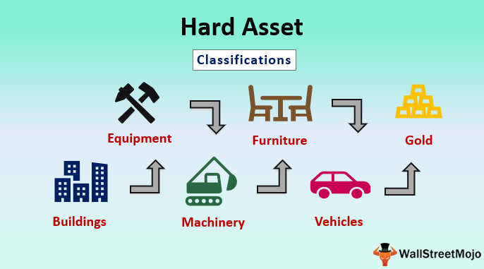

In today's dynamic financial landscape, where markets are often characterized by volatility and complexity, a fundamental understanding of assets becomes an indispensable tool for investors. Assets, representing resources that hold economic value, are foundational to any financial strategy. This piece aims to examine the various types of assets available to investors, with a specific emphasis on hard assets and their significance in contemporary finance.

Hard assets, which are tangible in nature, include items like real estate, commodities, and machinery. These assets are known for their intrinsic value and their role as a protective hedge against inflation and economic instability. Their physical presence and essential utility have made them an attractive option for those seeking stability and resilience in investment portfolios.



With the rise of technology, particularly algorithmic trading, the management and trading of assets have been revolutionized. Algorithmic trading employs sophisticated algorithms to automate the trading process, thereby enhancing precision and speed. This technology has opened new avenues for asset management, enabling investors to systematically and efficiently execute large volumes of trades while minimizing human errors inherent to manual trading.

Through examining various asset types and illustrating their integration with algorithmic strategies, we aim to provide readers with a comprehensive understanding of strategic asset management. This exploration will highlight how leveraging technology alongside a clear grasp of asset distinctions can empower investors to construct robust financial strategies tailored to the demands of modern markets.

## Table of Contents

## Understanding Assets: A Brief Overview

Assets are resources with economic value owned by individuals, companies, or governments, and they play a crucial role in financial management. The importance of assets lies in their ability to be converted into cash or to generate income streams, forming the foundation of economic activity and financial planning. Assets are broadly classified into two categories: tangible (hard assets) and intangible (soft assets), each possessing unique features and serving differing roles in financial planning and portfolio management.

Tangible assets, also known as hard assets, are physical items that have inherent value. These include real estate, machinery, vehicles, and commodities such as gold and oil. The value of hard assets typically stems from their physical presence and utility. For instance, real estate is valued for its contribution to shelter or commercial activities, while commodities are valued for their role in production processes and consumption. Hard assets often serve as effective hedges against inflation and economic uncertainty, as their tangible nature provides intrinsic value that is less susceptible to market volatility.

In contrast, intangible assets are non-physical resources that represent potential future benefits. Examples of soft assets include patents, trademarks, brand recognition, and intellectual property. While these assets lack physical substance, they can significantly enhance a company's valuation by contributing to future revenue streams. For example, a strong brand can enable a company to charge premium prices, while patented technology can safeguard a firm's competitive advantage. However, the value of intangible assets can be more volatile and subject to market perceptions, regulatory changes, or competitive pressures.

Understanding these asset types is essential for effective portfolio management and risk assessment. A well-diversified portfolio typically includes a mix of tangible and intangible assets to balance potential returns against associated risks. Tangible assets provide stability and protection against inflation, whereas intangible assets offer growth potential and innovative opportunities. Recognizing the characteristics and valuations of both asset types aids investors in constructing a balanced investment strategy, optimizing their portfolios in line with financial goals and market conditions.

Effective asset management requires a strategic approach that considers the distinct nature of each asset type, assessing their potential contributions to portfolio performance. Investors and financial managers must evaluate the economic landscape, asset-specific risks, and long-term objectives to develop robust investment strategies. This comprehensive understanding of assets enhances decision-making processes, informs risk management practices, and drives successful financial outcomes.

## Exploring Hard Assets

Hard assets are tangible assets with intrinsic value, meaning their value is derived from their physical properties and utility. Common examples of hard assets include real estate, machinery, commodities such as gold, and vehicles. These assets play a significant role in financial portfolios, primarily due to their ability to provide a hedge against inflation and economic instability.

One of the key characteristics of hard assets is their physical form, which contrasts with intangible assets that hold value in non-physical forms such as intellectual property or brand recognition. The intrinsic value of hard assets means they are less susceptible to sudden changes in market sentiment, making them a stable choice amidst economic turbulence.

Real estate is a prominent example of a hard asset. Its value is driven by factors such as location, availability, and the demand for property. Real estate tends to appreciate over time, making it a favored choice for long-term investment. Additionally, it generates income through rental yields, which can provide a consistent cash flow to asset holders.

Machinery and vehicles, often categorized under business assets, are critical for production and service delivery in various industries. The depreciation of these assets is predictable and can be managed through accounting strategies, thereby preserving capital value over time. Their utility in business operations often translates into direct revenue-generating potential.

Commodities like gold have been traditionally considered a safe store of value. Gold and other precious metals serve as a hedge against inflation because their value generally increases during times of economic uncertainty and currency devaluation. This stems from their finite availability and ongoing demand as investment and industrial materials.

Hard assets are also favored for their ability to diversify investment portfolios. The tangible nature of these assets and their distinct value drivers help mitigate risks associated with market [volatility](/wiki/volatility-trading-strategies) often seen in equities and intangible assets. For instance, investors often balance portfolios by complementing stock investments with real estate or commodities, reducing the overall risk exposure.

In summary, hard assets are crucial elements in financial strategies due to their stability and utility. They provide tangible value and can protect against economic fluctuations, making them a reliable choice for investors seeking to safeguard and grow their wealth. Their longstanding role in hedging inflation underscores their significance in comprehensive asset management approaches.

## Differentiating Asset Types

Assets can be broadly categorized into two types: hard assets and soft assets. Hard assets, also known as tangible assets, have a physical form and intrinsic value. Examples include real estate, machinery, and commodities such as gold and oil. These assets are generally valued for their physical presence and utility, and their worth is often considered more stable than that of soft assets.

Soft assets, or intangible assets, lack a physical presence but can hold significant economic value. These assets include patents, brand recognition, and intellectual property. The valuation of soft assets is inherently more complex due to their intangible nature and often relies on subjective measures such as potential revenue generation and market influence. For instance, a company's brand value may fluctuate based on consumer perception, reflected through metrics like brand equity.

The intrinsic stability of hard assets arises from their physical utility and essential nature, which provide a hedge against economic volatilities. Conversely, the value of soft assets is generally more sensitive to market dynamics and consumer trends. This fluctuation is evident in the pricing of intellectual property, which can vary with technological advancements or changes in consumer preferences.

Understanding the distinctions between these asset types aids investors in crafting balanced portfolios, accounting for the inherent benefits and vulnerabilities associated with each. Both asset types contribute uniquely to financial planning, with hard assets providing stability and soft assets offering growth potential through innovation and brand strength.

## Algorithmic Trading and Asset Management

Algorithmic trading employs sophisticated algorithms to automate the execution of trades, significantly improving precision and speed in financial transactions. This method leverages mathematical models and computational power to analyze market data, identify trading opportunities, and execute trades automatically. By doing so, it minimizes the need for human intervention, thus reducing the likelihood of errors traditionally associated with manual trading.

The core advantage of [algorithmic trading](/wiki/algorithmic-trading) in asset management lies in its ability to handle large volumes of trade effortlessly and efficiently. Algorithms can process vast amounts of data at speeds much faster than any human trader, making them exceptionally well-suited for managing highly liquid assets, such as stocks, exchange-traded funds (ETFs), and derivatives. This efficiency allows for systematic investment strategies that can be executed with high precision, offering investors the ability to capitalize on market opportunities in real-time.

Beyond speed and [volume](/wiki/volume-trading-strategy), algorithmic trading enhances decision-making by applying consistent, data-driven strategies. The algorithms are designed to follow a set of predetermined rules based on various factors, including timing, price, quantity, or any mathematical model. For instance, a simple trading algorithm might be based on the moving average crossover strategy:

```python
# Python example of a moving average crossover strategy
def moving_average_crossover(data, short_window, long_window):
    data['short_mavg'] = data['Close'].rolling(window=short_window, min_periods=1).mean()
    data['long_mavg'] = data['Close'].rolling(window=long_window, min_periods=1).mean()

    data['signal'] = 0
    data['signal'][short_window:] = np.where(data['short_mavg'][short_window:] > data['long_mavg'][short_window:], 1, 0)
    data['positions'] = data['signal'].diff()

    return data

# Example usage
# Assuming data is a Pandas DataFrame containing stock prices with a 'Close' column
moving_average_crossover(data, short_window=40, long_window=100)
```

This code illustrates how algorithms can systematically generate trading signals. When the short-term moving average crosses above the long-term moving average, the algorithm generates a buy signal; conversely, it generates a sell signal when the short-term average crosses below the long-term average.

Algorithmic trading significantly contributes to risk management by allowing traders to test strategies against historical data with [backtesting](/wiki/backtesting) methodologies. This pre-analysis enables the identification of potential pitfalls and optimization of strategies before they are deployed in live markets, ensuring that the strategies are robust and adaptable to different market conditions.

Overall, the integration of algorithmic trading in asset management represents a transformation in how trading operations are conducted. By enhancing precision, speed, and decision-making processes, it enables a more strategic approach to handling various asset types, ultimately aiming for improved asset performance and optimized investment returns.

## Examples of Assets in Algorithmic Trading

Algorithmic trading, by leveraging high [liquidity](/wiki/liquidity-risk-premium) markets like stocks, ETFs (Exchange Traded Funds), and derivatives, has revolutionized asset management. While traditionally associated with these instruments, the integration of hard assets into algorithmic trading systems marks an innovative shift in investment strategies.

Hard assets such as commodities, real estate securities, and precious metals can be tapped into through algorithmic trading. These assets, inherently having tangible value and acting as a hedge against inflation, enhance portfolio diversity. Commodities markets, for instance, benefit from algorithmic systems due to their typically high liquidity and standardized trading units. Using algorithms, traders can systematically execute buy and sell orders for commodities like gold or oil, minimizing market impacts and optimizing trade execution times.

Real estate, though less liquid compared to stocks or commodities, is also beginning to see algorithmic trading applications through Real Estate Investment Trusts (REITs). REITs allow investors to trade shares of real estate portfolios in a stock exchange environment. Algorithmic models can assess market trends, property values, and economic indicators, enabling timely transactions in REITs to maximize returns.

A real-life example is the use of algorithms in trading commodity futures. These systems analyze market data and historical trends to forecast price movements. Algorithmic trading can capitalize on [arbitrage](/wiki/arbitrage) opportunities in different exchanges, optimizing cross-border commodity trading. Such models require intricate programming and comprehensive datasets, often involving [machine learning](/wiki/machine-learning) techniques to refine predictive accuracy.

Python, favored in algorithmic trading for its robust libraries and flexibility, often underpins these strategies. For instance, a Python algorithm may use libraries like `pandas` for data manipulation, `NumPy` for numerical computations, and `scikit-learn` for machine learning. Here’s a simple setup of a Python code snippet for trading commodity futures using moving average crossovers:

```python
import pandas as pd
import numpy as np
import matplotlib.pyplot as plt

# Load commodity futures data
data = pd.read_csv('commodity_futures.csv')
data['MA50'] = data['Close'].rolling(50).mean()
data['MA200'] = data['Close'].rolling(200).mean()

# Define signals
data['Buy_Signal'] = np.where(data['MA50'] > data['MA200'], 1, 0)
data['Sell_Signal'] = np.where(data['MA50'] < data['MA200'], -1, 0)

# Plotting
plt.figure(figsize=(12,6))
plt.plot(data['Close'], label='Commodity Price')
plt.plot(data['MA50'], label='50-Day Moving Average')
plt.plot(data['MA200'], label='200-Day Moving Average')
plt.title('Commodity Futures with Moving Averages')
plt.legend()
plt.show()
```

This simple strategy involves calculating moving averages over two different periods (50-day and 200-day) and generating buy/sell signals based on their crossovers. This logic can be part of a larger system that integrates real-time data feeds, risk management protocols, and execution platforms for automated order placement.

Despite the benefits of integrating hard assets into algorithmic trading, these strategies come with challenges like data accuracy and the need for domain-specific knowledge to interpret asset behaviors correctly. Adopting robust algorithms combined with human expertise in assessing market dynamics ensures effective portfolio management, underlining the transformative potential of technology in asset trading.

## Challenges and Considerations in Algo Trading

Algorithmic trading, while highly advantageous, presents several challenges that require careful consideration. One primary concern is over-optimization. In developing trading algorithms, there is a risk of fitting models too closely to historical data, leading to an effect known as "curve fitting." This can result in strategies that perform exceptionally well on past data but fail in real-market conditions because they cannot adapt to unforeseen market dynamics.

Technical failures pose another significant challenge. Algorithmic trading systems depend heavily on technological infrastructure, which includes servers, networks, and hardware components. A malfunction in any part of this infrastructure can result in significant financial losses. For instance, latency issues, software bugs, or hardware failures can interrupt trading processes, leading to missed opportunities or unintended trade executions.

Regulatory compliance is also critical when implementing algorithmic trading strategies. Different markets have specific regulations to ensure fair trading practices and prevent market manipulation. Traders need to stay updated on regulatory changes and ensure that their algorithms comply with laws to avoid legal issues. This could involve measures such as maintaining audit trails of trading activities, implementing controls to prevent market abuse, and adhering to financial reporting requirements.

Developing robust risk management frameworks is imperative to counteract the unpredictability of financial markets. These frameworks should incorporate strategies like setting stop-loss orders, diversifying portfolios, and creating algorithms that can adjust positions based on real-time data. For example, trading systems can incorporate machine learning models to predict market volatility and adjust positions proactively.

Balancing automation with human oversight is crucial for successful trading strategies, especially in volatile markets. While algorithms can process vast amounts of data and execute trades within milliseconds, human intuition is invaluable in interpreting complex market signals that might not be apparent through data alone. Thus, a hybrid approach, where traders supervise algorithmic processes and intervene when necessary, can mitigate risks associated with fully automated systems.

In conclusion, despite the efficiency and precision brought about by algorithmic trading, traders must navigate challenges like over-optimization, technical failures, regulatory compliance, and the essential balance between automation and human oversight to leverage the full potential of this technology. These considerations play a crucial role in crafting resilient and adaptable trading strategies.

## Conclusion

Hard assets, when effectively integrated with algorithmic trading, offer a robust framework for asset management. By combining the physical stability of hard assets with the precision and speed of algorithmic trading, investors can navigate financial markets more strategically. This synergy promotes a diversified investment approach, leveraging the strengths of each asset type to mitigate risks and enhance returns.

Algorithmic trading, driven by advancements in computing technology, provides investors with the capability to manage large volumes of transactions efficiently. This technological advancement allows for improved execution timing, reducing the impact of market volatility. Algorithms can quickly analyze vast datasets to identify optimal trading opportunities, thus maximizing the potential returns from both tangible and intangible assets.

Furthermore, understanding the nuances of different asset types, such as the inherent stability of hard assets compared to the fluctuating nature of soft assets, empowers investors to construct resilient portfolios. Incorporating hard assets in algorithmic models introduces a layer of security against inflation and economic upheavals, given their intrinsic value.

For investors to thrive in today's dynamic markets, staying abreast of technological developments in algorithmic trading is crucial. Innovations in machine learning and [artificial intelligence](/wiki/ai-artificial-intelligence) continue to refine trading strategies, offering increasingly sophisticated tools for asset management. As these technologies evolve, they expand the horizon of possibilities within financial markets, allowing for more informed decision-making processes.

In conclusion, the integration of hard assets with algorithmic trading facilitates a comprehensive and adaptive approach to managing investments. By embracing technological innovations and understanding the diverse characteristics of asset types, investors can optimize their financial strategies, ensuring sustained growth and resilience in the challenging landscape of global markets.

## References & Further Reading

[1]: Bergstra, J., Bardenet, R., Bengio, Y., & Kégl, B. (2011). ["Algorithms for Hyper-Parameter Optimization."](https://dl.acm.org/doi/10.5555/2986459.2986743) Advances in Neural Information Processing Systems 24.

[2]: ["Advances in Financial Machine Learning"](https://www.amazon.com/Advances-Financial-Machine-Learning-Marcos/dp/1119482089) by Marcos Lopez de Prado

[3]: ["Evidence-Based Technical Analysis: Applying the Scientific Method and Statistical Inference to Trading Signals"](https://www.amazon.com/Evidence-Based-Technical-Analysis-Scientific-Statistical/dp/0470008741) by David Aronson

[4]: ["Machine Learning for Algorithmic Trading"](https://github.com/stefan-jansen/machine-learning-for-trading) by Stefan Jansen

[5]: ["Quantitative Trading: How to Build Your Own Algorithmic Trading Business"](https://github.com/LucindaYa/quant-resources/blob/master/Quantitative%20Trading%20How%20to%20Build%20Your%20Own%20Algorithmic%20Trading%20Business.pdf) by Ernest P. Chan