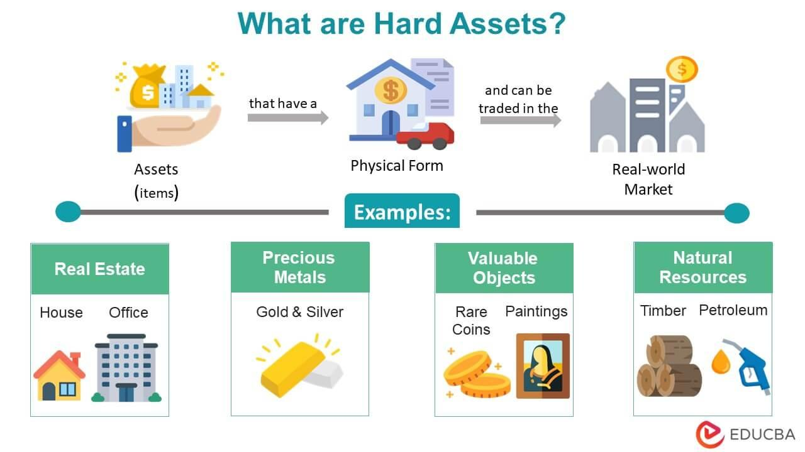

## Table of Contents

## What are hard assets?

Hard assets are physical items that have value and can be touched. They include things like buildings, land, machinery, and vehicles. These assets are important because they can be used to make money or sold if needed. For example, a company might use a factory to make products, or a person might sell their car if they need cash.

Hard assets are different from soft assets, which are not physical. Soft assets include things like stocks, bonds, and patents. Hard assets are often seen as more reliable because they have a clear value and can be used or sold easily. However, they can also lose value over time due to wear and tear or changes in the market. For instance, a piece of land might become less valuable if a new highway is built nearby, making it less desirable.

## How do hard assets differ from soft assets?

Hard assets are things you can touch and see, like a house, a car, or a piece of land. They are physical items that have value and can be used to make money or sold if you need cash. For example, a company might use a factory to make products, or a person might sell their car to get money. Hard assets are often seen as more reliable because they have a clear value and can be used or sold easily. However, they can also lose value over time because they can wear out or because the market changes.

Soft assets are different because they are not physical. They include things like stocks, bonds, and patents. These assets are important because they can also make money, but in different ways. For example, stocks can go up in value, and patents can be used to make money by letting others use the idea for a fee. Soft assets can be harder to value because their worth can change a lot based on what is happening in the market or the economy. They are often seen as riskier than hard assets, but they can also offer bigger rewards if things go well.

## What are the common types of hard assets?

Common types of hard assets include real estate, which means land and buildings. People and companies buy real estate to live in, work in, or to make money by renting it out or selling it later. Another type of hard asset is machinery and equipment, like the machines used in factories to make things or the tools used by workers. These are important because they help businesses make products or provide services.

Vehicles are also hard assets. This includes cars, trucks, and even airplanes. People use vehicles to get around, and businesses use them to move goods or people. Lastly, there are commodities, which are things like gold, oil, and agricultural products like wheat. These are valuable because they can be used or sold, and their prices can go up and down based on what is happening in the world.

## Can you provide examples of tangible hard assets?

Tangible hard assets are things you can touch and see. They include real estate like houses and land. For example, someone might own a house to live in or a piece of land to build on or sell later. Another example is machinery and equipment, like the big machines in factories that make cars or the tools a carpenter uses to build things. These assets help people and businesses do their work.

Vehicles are also tangible hard assets. This includes cars that people drive every day, trucks that companies use to move goods, and even airplanes that airlines use to fly passengers. Lastly, commodities like gold, oil, and wheat are tangible hard assets. Gold can be used to make jewelry or as an investment, oil is used to power cars and heat homes, and wheat is used to make bread and other foods. These assets are valuable because they can be used or sold.

## What are the benefits of investing in hard assets?

Investing in hard assets can be a good idea because they have a clear value and can be used or sold easily. For example, if you own a house, you can live in it, rent it out to others, or sell it if you need money. This makes hard assets feel more reliable than other types of investments. They also tend to keep their value over time, even if the economy is not doing well. This can help protect your money from losing value due to inflation or other economic problems.

Another benefit of hard assets is that they can provide a steady income. For instance, if you own a rental property, you can earn money from the rent that tenants pay each month. This can be a good way to make money without having to work for it. Hard assets can also be a good way to diversify your investments. By putting your money into different types of assets, like real estate, machinery, or commodities, you can spread out your risk and increase your chances of making money over time.

## How do hard assets serve as a hedge against inflation?

Hard assets can help protect your money from losing value because of inflation. Inflation means that the prices of things go up over time, so the money you have now will buy less in the future. Hard assets like real estate, gold, and commodities often go up in price when inflation happens. This means that if you own these things, their value can grow faster than the rate of inflation, helping to keep your money's worth.

For example, if you own a house, the price of the house might go up as inflation rises. This can help you because even though the cost of living goes up, the value of your house goes up too. This way, your investment in the house keeps its value or even grows, protecting you from the effects of inflation. So, by investing in hard assets, you can make sure your money stays valuable even when prices are rising.

## What are the risks associated with investing in hard assets?

Investing in hard assets can have risks. One big risk is that hard assets can lose value over time. For example, a house might need repairs that cost a lot of money, or a piece of land might become less valuable if something bad happens nearby, like a factory closing down. Also, the value of commodities like gold or oil can go up and down a lot because of what is happening in the world, like wars or changes in the economy.

Another risk is that hard assets can be hard to sell quickly. If you need money fast, it might take a long time to find someone who wants to buy your house or your machinery. This can be a problem if you need cash right away. Also, hard assets need to be taken care of. For example, a car needs regular maintenance, and a building might need repairs. These costs can add up and make it harder to make money from your investment.

## How can one evaluate the value of hard assets?

Evaluating the value of hard assets involves looking at different things. For real estate, you might look at what similar houses or land have sold for recently in the same area. This is called the market value. You also need to think about the condition of the property. A house that needs a lot of repairs might be worth less than one that is in good shape. For machinery and equipment, you can look at how old it is and how much it would cost to replace it. If the machine is old and might break soon, it might not be worth as much as a newer one.

For vehicles, you can check what similar cars or trucks are selling for and consider the mileage and condition of the vehicle. A car with high mileage might be worth less than one with low mileage. Commodities like gold or oil can be trickier. Their value can change a lot based on what is happening in the world. You can look at the current market price for these items and think about what might happen in the future that could change their value. Overall, evaluating hard assets means looking at what they are worth now and what might affect their value in the future.

## What role do hard assets play in portfolio diversification?

Hard assets can help make your investment portfolio more diverse. When you have different types of investments, like stocks, bonds, and hard assets, you spread out your risk. If one type of investment goes down in value, the others might still be doing well. This can help protect your money. For example, if the stock market is not doing well, the value of your real estate or gold might stay the same or even go up. This way, you don't lose all your money if one thing goes wrong.

Adding hard assets to your portfolio can also help you make money in different ways. Real estate can give you rental income, and commodities like oil or gold can go up in value when other investments are not doing well. By having a mix of hard assets and other types of investments, you can have a more stable and balanced portfolio. This can help you feel more secure about your investments and make it easier to reach your financial goals.

## How do taxes affect the ownership and sale of hard assets?

Taxes can have a big impact on owning and selling hard assets. When you own things like a house or a car, you might have to pay property taxes every year. These taxes are based on the value of what you own. If you own a rental property, you might also have to pay taxes on the money you make from rent. This can make owning hard assets more expensive, but you can sometimes deduct these costs from your taxes, which can help.

When you sell a hard asset, you might have to pay capital gains tax. This tax is on the profit you make from selling something for more than you paid for it. For example, if you bought a house for $200,000 and sold it for $300,000, you would have to pay tax on the $100,000 profit. The tax rate can be different depending on how long you owned the asset and what type of asset it is. Knowing about these taxes can help you plan better when you buy and sell hard assets.

## What are some advanced strategies for investing in hard assets?

One advanced strategy for investing in hard assets is to use leverage. This means borrowing money to buy more hard assets than you could with just your own money. For example, you might take out a loan to buy more rental properties. This can help you make more money because you can earn rent from more places. But it's risky because if the value of the properties goes down or if you can't pay back the loan, you could lose a lot of money. So, it's important to be careful and make sure you can handle the payments.

Another strategy is to invest in hard assets that are likely to go up in value because of trends or changes in the world. For example, you might buy land in an area where a new factory is being built, because that could make the land more valuable. Or you might invest in commodities like oil or gold if you think their prices will go up because of what's happening in the world. This can be a good way to make money, but it's also risky because it's hard to predict the future. You need to do a lot of research and be ready for things to not go as planned.

## How have historical trends influenced the performance of hard assets?

Historical trends have had a big impact on how well hard assets do. For example, during times when the economy is growing, people often buy more houses and land. This can make real estate prices go up. Also, when there are big changes in the world, like wars or new technology, the prices of commodities like oil and gold can change a lot. If people think there will be a war, they might buy more gold because it's seen as a safe investment. These trends can make hard assets more valuable or less valuable, depending on what is happening.

Another way historical trends affect hard assets is through changes in technology and laws. For example, when new technology makes it easier to find oil, the price of oil might go down because there is more of it. Also, if the government changes the rules about buying and selling land, that can change how much people are willing to pay for it. Over time, these trends can make hard assets a good investment or a bad one. It's important to know about these trends if you want to invest in hard assets and make good choices.

## References & Further Reading

[1]: Bergstra, J., Bardenet, R., Bengio, Y., & Kégl, B. (2011). ["Algorithms for Hyper-Parameter Optimization."](https://dl.acm.org/doi/10.5555/2986459.2986743) Advances in Neural Information Processing Systems 24.

[2]: ["Advances in Financial Machine Learning"](https://www.amazon.com/Advances-Financial-Machine-Learning-Marcos/dp/1119482089) by Marcos Lopez de Prado

[3]: ["Evidence-Based Technical Analysis: Applying the Scientific Method and Statistical Inference to Trading Signals"](https://www.amazon.com/Evidence-Based-Technical-Analysis-Scientific-Statistical/dp/0470008741) by David Aronson

[4]: ["Machine Learning for Algorithmic Trading"](https://github.com/stefan-jansen/machine-learning-for-trading) by Stefan Jansen

[5]: ["Quantitative Trading: How to Build Your Own Algorithmic Trading Business"](https://github.com/LucindaYa/quant-resources/blob/master/Quantitative%20Trading%20How%20to%20Build%20Your%20Own%20Algorithmic%20Trading%20Business.pdf) by Ernest P. Chan