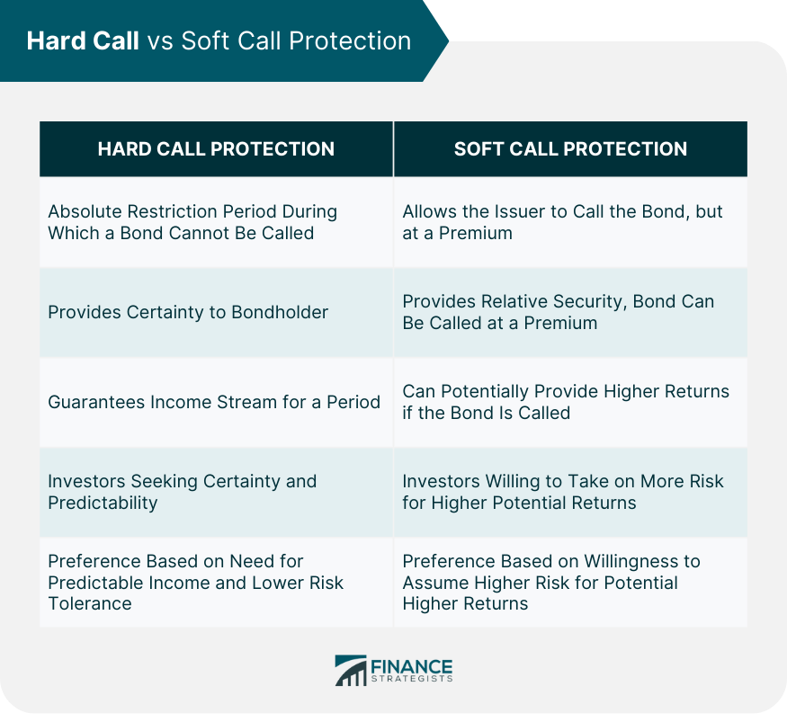

## Table of Contents

## What is hard call protection in finance?

Hard call protection in finance is a feature of some bonds that prevents the issuer from buying back or redeeming the bond before a certain date. This means that once you buy a bond with hard call protection, you can be sure that the issuer cannot take it back early. This is good for investors because it gives them a predictable income stream for a longer period of time.

For example, if you buy a bond with hard call protection that lasts for five years, the issuer cannot redeem the bond until after those five years are up. This protection is important because it helps investors plan their finances better, knowing exactly when they will get their money back. Without hard call protection, issuers might choose to redeem bonds early if interest rates drop, leaving investors to reinvest at lower rates.

## How does hard call protection benefit bondholders?

Hard call protection helps bondholders by making sure they get to keep their bonds for a certain time. This means the company that issued the bond can't take it back early. This is good for bondholders because they know they will get the interest payments for the whole time the bond is protected. It's like having a promise that their money will keep earning at the same rate for a while.

This protection also helps bondholders plan their money better. If they know the bond won't be called back early, they can count on that money coming in regularly. Without hard call protection, the company might decide to pay back the bond early if interest rates go down. This would mean bondholders would have to find a new place to invest their money, maybe at a lower [interest rate](/wiki/interest-rate-trading-strategies). So, hard call protection gives bondholders more control and security over their investments.

## What is the difference between hard call and soft call protection?

Hard call protection and soft call protection are two ways to protect bondholders, but they work differently. Hard call protection means the company that issued the bond can't buy it back before a certain date. This gives bondholders a guarantee that they will get their interest payments for a set time, no matter what happens with interest rates. It's like a strong promise that the bond will stay with the investor for the protected period.

Soft call protection, on the other hand, allows the issuer to buy back the bond early, but only under certain conditions. Usually, this happens if the company can refinance the bond at a lower interest rate. So, soft call protection gives the issuer more flexibility, but it still offers some protection to bondholders because the bond can't be called back just anytime. It's a bit like a weaker promise compared to hard call protection.

In simple terms, hard call protection is stricter and gives bondholders more security, while soft call protection is less strict and gives the issuer more options. Both types of protection help bondholders by setting rules about when the bond can be bought back, but hard call protection is more in favor of the bondholder, and soft call protection is more balanced between the issuer and the bondholder.

## Can you explain the typical duration of hard call protection?

Hard call protection usually lasts for a set number of years. This time can be different depending on the bond, but it's often between 5 to 10 years. The exact length of the protection is written in the bond's rules when it's first sold. This means that if you buy a bond with hard call protection, you know exactly how long you'll get to keep it before the company can take it back.

This protection is important because it gives bondholders a clear idea of how long they'll get their interest payments. For example, if a bond has hard call protection for 7 years, the company can't buy it back until after those 7 years are over. This helps people who own the bond plan their money better, knowing they have a steady income from the bond for a certain time.

## How does hard call protection affect the yield of a bond?

Hard call protection can affect the yield of a bond by making it more attractive to investors. When a bond has hard call protection, it means the company can't buy it back early. This gives investors a sense of security because they know they will get their interest payments for a set time. Because of this extra safety, investors might be willing to accept a lower yield on bonds with hard call protection compared to bonds without it. They feel more comfortable with the bond because it's less risky.

On the other hand, if interest rates drop after the bond is issued, the company can't take advantage of lower rates to buy back the bond early. This means investors can keep [earning](/wiki/earning-announcement) the higher interest rate for the whole protected period. So, while the yield might start lower because of the added safety, the bond can still be a good deal for investors because they get to keep that yield for longer. This balance between safety and yield makes bonds with hard call protection a popular choice for many investors.

## What are the implications of hard call protection for issuers?

Hard call protection can make it harder for issuers to manage their debt. If interest rates go down after they issue a bond, they can't buy it back early to save money. They have to keep paying the higher interest rate until the hard call protection period is over. This means they might end up paying more in interest than they would if they could call the bond back and issue a new one at a lower rate.

On the other hand, hard call protection can help issuers sell their bonds more easily. Investors like the safety that comes with knowing they will get their interest payments for a set time. This can make the bond more attractive, so issuers might be able to sell it at a better price or with a lower yield. Even though it limits their flexibility, the added security can help them raise money more effectively.

## In what types of bonds is hard call protection commonly found?

Hard call protection is often found in corporate bonds. These are bonds that companies issue to raise money. Investors like hard call protection in corporate bonds because it gives them a sense of safety. They know the company can't take the bond back early, so they can count on getting their interest payments for a set time. This makes corporate bonds with hard call protection more attractive to people who want a steady income.

Hard call protection can also be found in some municipal bonds. These are bonds issued by cities, states, or other local governments to fund projects like schools or roads. Just like with corporate bonds, hard call protection in municipal bonds helps investors feel more secure. They know they will get their interest payments for the whole protected period, which can make these bonds a good choice for people looking for a safe investment.

## How does the presence of hard call protection influence bond pricing?

Hard call protection can make a bond more valuable to investors. When a bond has hard call protection, it means the company that issued it can't buy it back early. This gives investors a sense of safety because they know they will get their interest payments for a set time. Because of this extra safety, investors might be willing to pay more for the bond. They feel more comfortable with the bond because it's less risky, so they might be okay with a lower yield compared to bonds without hard call protection.

On the other hand, the presence of hard call protection can also affect how much the issuer has to pay to sell the bond. Since investors like the safety that comes with hard call protection, issuers might be able to sell their bonds at a better price or with a lower yield. This can help them raise money more effectively. However, it also means they can't take advantage of lower interest rates to buy back the bond early, which could cost them more in interest payments over time.

## What are the legal considerations surrounding hard call protection?

Hard call protection is a promise written into the bond's rules that the company can't buy the bond back early. This promise is a legal agreement between the company and the people who buy the bonds. If the company tries to break this promise and buy the bond back before the hard call protection period is over, the bondholders can take legal action. They can go to court to make sure the company follows the rules and keeps paying the interest until the protection period ends.

The legal details of hard call protection are usually found in the bond's indenture, which is like a contract that explains all the rules about the bond. This indenture is very important because it tells everyone what the company can and can't do with the bond. If there's ever a disagreement about the bond, lawyers and judges will look at the indenture to decide who is right. So, it's really important for both the company and the bondholders to understand the legal terms in the indenture to make sure everyone follows the rules.

## How might changes in interest rates impact the effectiveness of hard call protection?

Hard call protection helps bondholders by stopping the company from buying back the bond early. If interest rates go down after the bond is issued, the company can't take advantage of the lower rates to buy back the bond and issue a new one. This means bondholders keep getting the higher interest rate for the whole time the bond is protected. So, hard call protection is very useful when interest rates drop because it keeps the bond safe and keeps the money coming in for bondholders.

On the other hand, if interest rates go up, hard call protection doesn't really change much for bondholders. The company still can't buy back the bond early, but bondholders are stuck with the lower interest rate they agreed to when they bought the bond. In this case, hard call protection might not seem as helpful because bondholders can't take advantage of the higher rates. But it still gives them the security of knowing their bond won't be called back early, which can be important for planning their money.

## Can hard call protection be negotiated or altered after a bond is issued?

Hard call protection is usually set when the bond is first issued and written into the bond's rules. This means it's hard to change it after the bond is sold. Both the company that issued the bond and the people who bought it have to follow these rules. If the company wants to change the hard call protection, they would need to get everyone who owns the bond to agree. This can be very hard to do because it means convincing a lot of people to go along with the change.

Sometimes, though, if the bond's rules allow it, the company might be able to change the hard call protection. This could happen if there's a special clause in the bond's contract that lets the company ask bondholders to vote on changes. But even then, it's not easy because most bondholders like the safety that hard call protection gives them. They might not want to give up that safety, so they might say no to any changes.

## What are some advanced strategies investors use in response to hard call protection?

Investors who know about hard call protection might use it to their advantage. They might buy bonds with hard call protection when they think interest rates will go down. This way, they can keep getting the higher interest rate for the whole time the bond is protected. They know the company can't buy the bond back early, so they can plan their money better. This strategy helps them get a steady income for a longer time, which can be really helpful for people who need a reliable source of money.

Another strategy is to look at the bond's yield compared to other bonds without hard call protection. Since bonds with hard call protection are safer, they might have a lower yield. But if an investor thinks the safety is worth it, they might choose these bonds even if the yield is a bit lower. This can be a smart move if they want to avoid the risk of the company calling the bond back early and leaving them to find a new place to invest their money at a lower rate.

## References & Further Reading

[1]: Mehta, N. J., & Malhotra, R. (2020). ["Algorithmic Trading in Financial Markets: A Comprehensive Review."](https://www.researchgate.net/publication/378287610_Machine_learning_in_financial_markets_A_critical_review_of_algorithmic_trading_and_risk_management) Annals of Operations Research, 292(2), 453-487.

[2]: ["Quantitative Financial Risk Management: Theory and Practice"](https://onlinelibrary.wiley.com/doi/book/10.1002/9781119080305) by Constantin Zopounidis and Emilios Galariotis.

[3]: ["Fixed Income Securities: Tools for Today's Markets"](https://www.amazon.com/Fixed-Income-Securities-Markets-Finance/dp/1119835550) by Bruce Tuckman and Angel Serrat.

[4]: Hendershott, T., & Riordan, R. (2013). ["Algorithmic Trading and the Market for Liquidity."](https://www.jstor.org/stable/43303831) Journal of Financial and Quantitative Analysis, 48(4), 1001-1024.

[5]: ["The Handbook of Fixed Income Securities"](https://www.amazon.com/Handbook-Fixed-Income-Securities-Ninth/dp/1260473899) by Frank J. Fabozzi.