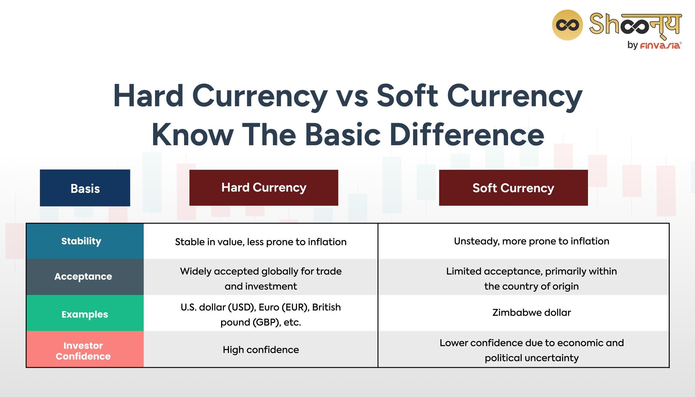

## Table of Contents

## What is the basic definition of hard currency?

Hard currency is money that is widely accepted around the world and is considered stable and reliable. It usually comes from countries with strong economies, like the United States, the European Union, and Japan. The U.S. dollar, the Euro, and the Japanese yen are examples of hard currencies. People trust these currencies because they are not likely to lose value quickly.

Countries often keep hard currencies in reserve to help stabilize their own economies. For example, if a country's own currency is weak, it can use hard currency to buy things from other countries. This can help the country's economy stay strong. Hard currencies are also important for international trade because they make it easier for different countries to do business with each other.

## What is the basic definition of soft currency?

Soft currency is money from a country that is not as strong or stable as hard currency. It comes from countries with weaker economies, and people might not trust it as much. Examples of soft currencies include the currencies of some developing countries. Because soft currencies can lose value quickly, they are not used as much for international trade.

Countries with soft currencies often have a hard time buying things from other countries because their money is not as trusted. They might need to use hard currencies to do business with other countries. This can make it harder for them to grow their economies. Soft currencies can also make it difficult for people in those countries to travel or buy things from abroad because their money might not be accepted everywhere.

## What are some examples of hard currencies?

Hard currencies are money from countries with strong economies. People trust these currencies because they don't lose value quickly. Some examples of hard currencies are the U.S. dollar, the Euro, and the Japanese yen. The U.S. dollar is used a lot around the world, and many countries keep it in their reserves. The Euro is used by countries in the European Union, and it's also very stable. The Japanese yen is another hard currency that people trust.

These hard currencies are important for international trade. When countries trade with each other, they often use hard currencies because they are reliable. For example, if a country wants to buy oil from another country, it might pay in U.S. dollars. This makes it easier for both countries to do business. Hard currencies also help countries keep their own economies stable. If a country's own currency is weak, it can use hard currency to buy things it needs from other countries.

## What are some examples of soft currencies?

Soft currencies come from countries with weaker economies. They are not as trusted as hard currencies because they can lose value quickly. Some examples of soft currencies are the currencies of countries like Argentina, Turkey, and some African nations. The Argentine peso, for example, has had a lot of ups and downs, making it hard for people to trust it. The Turkish lira is another soft currency that has lost value over time.

Because soft currencies are not as stable, they are not used as much for international trade. If a country with a soft currency wants to buy things from another country, it might have to use a hard currency like the U.S. dollar. This can make it harder for countries with soft currencies to grow their economies. People in these countries might also find it difficult to travel or buy things from abroad because their money is not accepted everywhere.

## How does the stability of a currency affect its classification as hard or soft?

The stability of a currency is really important when deciding if it's a hard or soft currency. Hard currencies come from countries with strong economies. These currencies don't lose value quickly, so people trust them. For example, the U.S. dollar, the Euro, and the Japanese yen are hard currencies because they are stable. When a currency is stable, it's easier for countries to use it for international trade. They can buy and sell things without worrying about the money losing value.

On the other hand, soft currencies come from countries with weaker economies. These currencies can lose value quickly, so people don't trust them as much. Examples of soft currencies include the Argentine peso and the Turkish lira. Because soft currencies are not stable, they are not used as much for international trade. Countries with soft currencies might have to use hard currencies to buy things from other countries. This can make it harder for them to grow their economies and for their people to travel or buy things from abroad.

## What role does a country's economic health play in determining if its currency is hard or soft?

A country's economic health is really important when deciding if its currency is hard or soft. If a country has a strong economy, its currency is usually hard. This means people trust the currency because it doesn't lose value quickly. For example, countries like the United States, Germany, and Japan have strong economies, so their currencies—the U.S. dollar, the Euro, and the Japanese yen—are hard currencies. When a country's economy is strong, it can keep its currency stable, which helps in international trade and makes it easier for other countries to do business with them.

On the other hand, if a country has a weak economy, its currency is usually soft. Soft currencies come from countries where the economy is not as strong, and the currency can lose value quickly. This makes people less likely to trust the currency. For example, countries like Argentina and Turkey have weaker economies, so their currencies—the Argentine peso and the Turkish lira—are soft currencies. When a country's economy is weak, it can be hard for them to use their currency for international trade. They might need to use hard currencies to buy things from other countries, which can make it harder for them to grow their economies.

## How do interest rates influence the classification of a currency as hard or soft?

Interest rates can affect whether a currency is seen as hard or soft. When a country has high interest rates, it can attract more foreign money because investors want to earn more on their savings. This can make the country's currency stronger and more stable, which might help it be seen as a hard currency. For example, if the U.S. raises its interest rates, more people might want to invest in U.S. dollars, making it even more of a hard currency.

On the other hand, if a country has low interest rates, it might not attract as much foreign money. This can make the currency weaker and less stable, which could lead to it being seen as a soft currency. For example, if a country like Argentina keeps its interest rates low, it might struggle to keep its currency, the peso, stable. This can make the peso a soft currency because people might not trust it as much. So, interest rates play a big role in how strong and trusted a currency is.

## What impact does inflation have on the distinction between hard and soft currencies?

Inflation can really affect whether a currency is seen as hard or soft. When a country has low inflation, its currency tends to be more stable. This makes people trust the currency more, and it can be seen as a hard currency. For example, countries like the United States and Japan usually have low inflation, which helps keep their currencies, the U.S. dollar and the Japanese yen, strong and reliable. Low inflation means that the value of the currency doesn't go down quickly, so it's good for international trade and helps the country's economy stay strong.

On the other hand, high inflation can make a currency less stable and less trusted, which might lead to it being seen as a soft currency. When a country has high inflation, the value of its money can go down fast. This makes people less likely to want to use or hold onto that currency. For example, countries like Argentina and Turkey have had high inflation, which has made their currencies, the Argentine peso and the Turkish lira, weaker and less trusted. High inflation can make it hard for these countries to do business with other countries and can make it harder for their economies to grow.

## How do geopolitical factors affect the perception of a currency as hard or soft?

Geopolitical factors can really change how people see a currency as hard or soft. If a country is stable and has good relationships with other countries, its currency is more likely to be seen as hard. For example, the U.S. dollar is trusted around the world because the United States is a big and stable country. When countries trust each other, they are more likely to use each other's currencies for trade. This makes the currency stronger and more reliable.

On the other hand, if a country has a lot of political problems or is not getting along well with other countries, its currency might be seen as soft. For example, if a country is going through a war or has a lot of protests, people might not trust its currency as much. This can make the currency weaker and less stable. When people don't trust a currency, they might not want to use it for international trade, which can make it harder for the country to grow its economy.

## What are the implications of holding hard versus soft currencies for international investors?

For international investors, holding hard currencies like the U.S. dollar, the Euro, or the Japanese yen can be a good choice. These currencies are from countries with strong economies and are seen as stable and reliable. When investors hold hard currencies, they don't have to worry as much about the value of their money going down quickly. This makes it easier for them to plan their investments and do business with other countries. Hard currencies are also more widely accepted around the world, so investors can use them to buy things or invest in different countries without many problems.

On the other hand, holding soft currencies like the Argentine peso or the Turkish lira can be riskier for international investors. These currencies come from countries with weaker economies and can lose value quickly. This means that if investors hold soft currencies, they might lose money if the currency's value goes down. It can also be harder to use soft currencies for international trade because not as many countries trust them. So, investors might have to change their soft currency into a hard currency to do business with other countries, which can be more complicated and costly.

## How do hard and soft currencies affect trade balances between countries?

Hard and soft currencies can really change how countries trade with each other. When a country has a hard currency like the U.S. dollar or the Euro, it can buy things from other countries more easily. Other countries trust hard currencies, so they are happy to accept them in trade. This can help the country with the hard currency have a better trade balance because it can buy more things without worrying about its money losing value. For example, if the U.S. wants to buy oil from Saudi Arabia, it can pay in U.S. dollars, which Saudi Arabia trusts and accepts.

On the other hand, a country with a soft currency like the Argentine peso or the Turkish lira might have a harder time trading with other countries. Soft currencies are not as trusted, so other countries might not want to accept them in trade. This can make it harder for the country with the soft currency to buy things it needs from other countries. They might have to use hard currencies to do business, which can be more complicated and expensive. This can lead to a worse trade balance for the country with the soft currency because it might not be able to buy as much as it wants or needs.

## What advanced strategies can be used to hedge against the risks associated with soft currencies?

One advanced strategy to hedge against the risks of soft currencies is to use currency swaps. In a currency swap, two parties agree to exchange currencies for a certain period of time. This can help protect against the risk of a soft currency losing value. For example, if a company in Argentina needs to pay for goods in U.S. dollars, it can swap its pesos for dollars now and then swap back later. This way, the company knows exactly how many pesos it will need to get the dollars it needs, even if the peso's value changes.

Another strategy is to use forward contracts. A forward contract is an agreement to buy or sell a currency at a set price on a future date. This can help businesses and investors protect themselves from changes in the value of a soft currency. For example, if a Turkish company knows it will need to pay for imports in Euros in six months, it can use a forward contract to lock in today's exchange rate. This means the company won't have to worry about the Turkish lira losing value against the Euro before it needs to make the payment.

A third strategy is to diversify investments across different currencies. By holding a mix of hard and soft currencies, investors can reduce the risk of losing money if one currency loses value. For example, an investor might hold some U.S. dollars, some Euros, and some Turkish liras. If the Turkish lira loses value, the investor's other currencies might stay strong, helping to balance out the loss. This way, the investor is not putting all their money into one currency that might be risky.

## References & Further Reading

[1]: Rasiel, E. (1996). ["The McKinsey Way: Using the Techniques of the World's Top Strategic Consultants to Help You and Your Business."](https://archive.org/details/mckinseywayusing0000rasi) McGraw-Hill Education.

[2]: ["Advances in Financial Machine Learning"](https://www.amazon.com/Advances-Financial-Machine-Learning-Marcos/dp/1119482089) by Marcos Lopez de Prado

[3]: ["International Finance: Theory and Policy"](https://open.umn.edu/opentextbooks/textbooks/18) by Paul Krugman and Maurice Obstfeld

[4]: ["Machine Learning for Algorithmic Trading"](https://github.com/stefan-jansen/machine-learning-for-trading) by Stefan Jansen

[5]: Jurek, J., & Stafford, E. (2015). ["Currency Carry Trades and Global Liquidity."](https://onlinelibrary.wiley.com/doi/10.1111/jofi.12269) National Bureau of Economic Research.

[6]: ["Quantitative Trading: How to Build Your Own Algorithmic Trading Business"](https://www.amazon.com/Quantitative-Trading-Build-Algorithmic-Business/dp/1119800064) by Ernest P. Chan