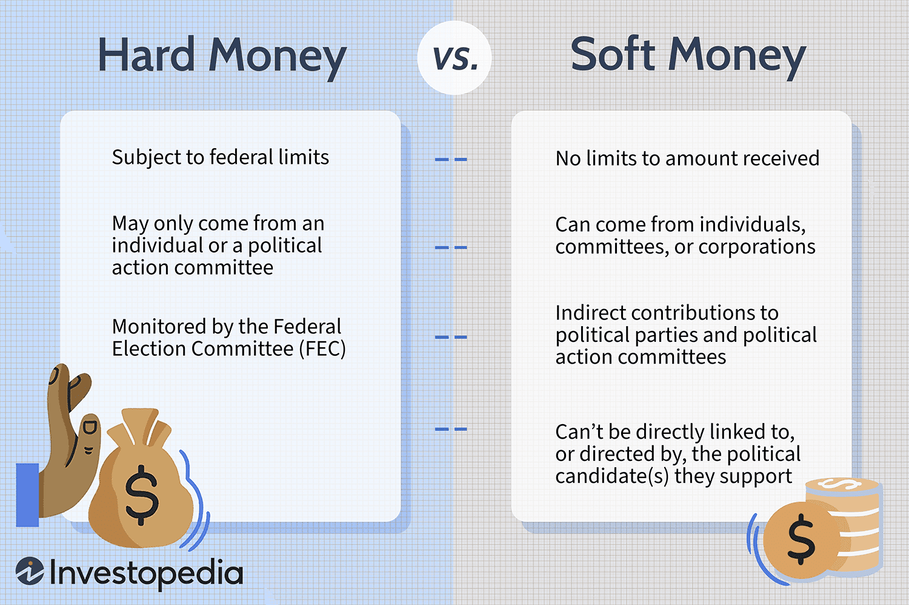

In a rapidly globalizing world, grasping the intricacies of currency dynamics is vital for both individuals and businesses. Different currencies play essential roles in international trade, investment, and financial strategy. They are not just units of exchange but also indicators of a nation's economic and political health. Generally, currencies can be categorized into two primary types: hard and soft, each with unique characteristics and substantial implications for the global economy.

Hard currencies, such as the US Dollar, Euro, or Swiss Franc, are characterized by their stability, strength, and widespread acceptance in international transactions. These currencies typically originate from countries with strong, stable economies and transparent political environments, boosting their reliability in global markets. Investors often trust hard currencies, which further reinforces their strength and recognition worldwide.



Conversely, soft currencies are often subject to volatility and limited international acceptance. They usually derive from regions with less economic stability, characterized by higher inflation rates and fluctuating exchange conditions. Currencies like the Venezuelan Bolivar or the Zimbabwean Dollar exemplify the challenges faced by soft currencies, as they experience rapid devaluation and are often shunned in international commerce.

Understanding the distinction between hard and soft currencies is crucial for engaging in global economic activities and developing sound financial strategies. This comprehension aids in currency comparison and algorithmic trading, where traders seek to maximize profits or hedge against potential losses based on currency stability and market conditions. As the global market continues to evolve, staying informed about these dynamics empowers individuals and businesses to navigate economic uncertainties effectively.

## Table of Contents

## Understanding Currency Types

Hard currency, often referred to as a "strong currency," is characterized by its stability, reliability, and widespread acceptance in the international market. These currencies are considered stable because they originate from countries with robust economic and political systems. The United States Dollar (USD) is a prime example of a hard currency. The USD is supported by the world's largest economy, extensive global trade, and significant foreign exchange reserves held by various central banks. This widespread acceptance and trust make the USD a commonly used currency in international transactions and a preferred reserve currency.

In contrast, soft currency is typically associated with economic instability and is less accepted in international markets. These currencies are prone to volatile exchange rates and inflation, which can erode their value over time. A prominent example of a soft currency is the Venezuelan Bolivar. Due to Venezuela's economic challenges, including hyperinflation and political turmoil, the Bolivar has experienced significant depreciation, making international transactions difficult and leading to a lack of confidence among global investors and traders.

The classification of a currency as hard or soft has substantial economic implications. Hard currencies facilitate smoother international trade, as businesses are more willing to engage in transactions using a stable and trusted medium. Conversely, soft currencies can hinder trade and investment due to the risks posed by their [volatility](/wiki/volatility-trading-strategies). Countries with soft currencies may struggle to attract foreign investment, as investors are wary of the potential losses arising from currency instability. This can lead to a cycle of economic challenges, further entrenching the currency's soft status.

Understanding these distinctions is essential for investors and businesses operating in global markets. Recognizing the attributes and risks associated with hard and soft currencies informs decisions related to international transactions, foreign exchange risk management, and multicurrency investment strategies.

## Economic Factors Influencing Currency Status

Economic stability, political environment, and global market perception are critical determinants of a currency's classification as hard or soft. A stable and transparent political system is often associated with a currency's strength and reliability. When a country maintains consistent economic growth, low inflation rates, and a balanced fiscal policy, its currency is likely to be perceived as stable and strong, contributing to its classification as a hard currency. This perception is often supported by a country's credit rating, which indicates the likelihood of default and impacts investor confidence.

A transparent political environment ensures that policies affecting the currency are predictable and based on sound economic principles. Countries with a history of political stability and adherence to the rule of law generally have stronger currencies. For instance, the Swiss Franc and the US Dollar benefit from being issued by countries with stable political systems and robust economies.

Global market perception also plays a significant role in determining currency status. The factors influencing perception include geopolitical events, economic partnerships, and national policies. For example, countries heavily reliant on volatile commodity exports may see their currencies classified as soft due to perceived vulnerabilities to global market fluctuations.

Changes in these economic and political factors can prompt a reevaluation of a currency's classification and its standing in the global market. A country experiencing political turmoil, high inflation, or economic downturn may see its currency lose value and move towards classification as a soft currency. On the other hand, implementing reforms that improve fiscal responsibility and political transparency can bolster a currency's standing.

In summary, the interplay of economic stability, political environment, and global perception determines whether a currency is classified as hard or soft. These factors have significant implications for international trade, investment strategies, and economic policy-making.

## Impact on Currency Comparison

In the context of currency comparison, the classification of currencies into hard and soft categories plays a crucial role. Hard currencies, known for their stability and global acceptance, often serve as benchmarks in international markets. This status is primarily due to the economic stability and political reliability of their respective countries. For instance, currencies such as the US Dollar (USD), Euro (EUR), and Japanese Yen (JPY) are considered hard currencies and are frequently used as reference points for trade and investment decisions. Their widespread acceptance is attributed to the robust economic indicators of their economies, including high GDP, low inflation rates, and stable political environments.

GDP, or Gross Domestic Product, is a significant indicator when comparing currencies. It reflects the economic production and growth of a country, providing insights into its economic health. For example, a high GDP often indicates a strong economy, which, in turn, supports a stable currency. Inflation rates also play a vital role; lower inflation rates typically correlate with a stable value of money, thereby enhancing a currency’s reliability. Political stability further solidifies the status of hard currencies. Countries with stable governments and predictable economic policies inspire greater confidence in their currencies.

Conversely, soft currencies, such as the Venezuelan Bolivar or the Argentine Peso, are typically associated with higher volatility and lower levels of global acceptance. These currencies originate from regions with weaker economic indicators, higher levels of inflation, and less stable political systems. When comparing soft currencies to hard currencies, their fluctuating nature must be accounted for, complicating direct comparisons.

Economic indicators used in currency comparison are often analyzed through mathematical and statistical models. These models incorporate various data points, such as GDP growth rates, Consumer Price Index (CPI) for inflation, and political risk assessments, to determine currency values. In a Python analysis, for example, one might use libraries like `pandas` for data manipulation and `numpy` for numerical computations to perform such comparisons.

```python
import pandas as pd
import numpy as np

# Example of computing currency comparison metrics
data = {'Currency': ['USD', 'EUR', 'VEF', 'ARS'],
        'GDP': [21.43, 15.27, 0.48, 0.45],
        'Inflation': [1.4, 0.3, 3000, 40],
        'Political_Stability': [0.9, 0.88, 0.2, 0.5]}

df = pd.DataFrame(data)

# Calculating a basic currency stability index
df['Stability_Index'] = (df['GDP'] / df['Inflation']) * df['Political_Stability']
```

In this basic computation, the stability index is higher for hard currencies due to higher GDP values, lower inflation, and greater political stability, affirming their reliability as benchmarks. Soft currencies, with lower stability indices, highlight the risks and uncertainties inherent in countries with less robust economic conditions. These analyses are essential for investors, traders, and policymakers to make informed decisions within currency markets.

## Algorithmic Trading and Currency Types

Algorithmic trading employs sophisticated computer algorithms to analyze and execute trade orders on financial markets. It proves highly effective in the currency market, where it can process vast amounts of data, detect patterns, and respond to market fluctuations with speed and precision. The choice of currency type in [algorithmic trading](/wiki/algorithmic-trading)—hard or soft—plays a significant role in determining trading strategies.

Hard currencies, like the US Dollar (USD), Euro (EUR), or Swiss Franc (CHF), are renowned for their stability. This stability arises from the robust economic and political systems of the countries issuing them, contributing to lower volatility in currency exchange rates. Consequently, algorithmic traders often prefer using hard currencies for long-term trading strategies. This stability allows algorithms to make predictions with a greater degree of confidence over extended periods. For instance, a mean reversion strategy, which assumes that the price of a currency will revert to its historical average over time, benefits from the predictability of hard currencies. The strategy might identify price deviations from the average and execute trades to capitalize on expected corrections. In Python, a simplified version of such a strategy might look like this:

```python
import numpy as np
import pandas as pd

# Example currency data
currency_data = pd.Series([1.1, 1.09, 1.12, 1.08, 1.11])  # Placeholder data

mean_value = currency_data.mean()
deviations = currency_data - mean_value

# Identify buy and sell signals
buy_signals = deviations < -0.01
sell_signals = deviations > 0.01

# Execute trades based on signals
trades = np.where(buy_signals, "Buy", np.where(sell_signals, "Sell", "Hold"))

print(trades)
```

Soft currencies, such as the Venezuelan Bolivar (VEF) or the Argentine Peso (ARS), exhibit high volatility due to economic instability and fluctuating market confidence. This volatility poses a challenge for long-term predictions but offers opportunities in short-term trading strategies. Traders can capitalize on rapid price changes using algorithms that exploit market [momentum](/wiki/momentum) or [breakout](/wiki/breakout-trading) strategies. These short-term strategies focus on taking advantage of quick price movements, often requiring a higher tolerance for risk due to the unpredictable nature of soft currencies.

The choice between hard and soft currencies in algorithmic trading influences the design and application of trading strategies. Hard currencies lend themselves to algorithms that prioritize stability and consistency over time, while soft currencies require algorithms that can swiftly adapt to changing market conditions, leveraging volatility to generate short-term profits.

## Case Studies

Analysis of the Eurozone crisis demonstrates the profound impact of currency stability on trade and international relations. The Eurozone crisis, which peaked between 2009 and 2012, was largely characterized by the struggle of several European Union countries to repay their government debt without the assistance of third parties. The challenges faced by countries such as Greece, Spain, and Portugal underscore how vulnerable economies within a unified currency zone can affect the entire currency's stability. As the crisis unfolded, the Euro's depreciation led to decreased confidence and higher borrowing costs, indicating the significant ramifications a currency crisis can have on member states and the global economy at large. This situation emphasized the need for robust fiscal policies and effective financial governance to uphold currency stability.

In 2015, the Swiss Franc experienced a sudden and unexpected surge, which has become a case study in risk management for [forex](/wiki/forex-system) traders. On January 15, 2015, the Swiss National Bank (SNB) abruptly discontinued its policy of capping the Swiss Franc's exchange rate against the Euro. This decision, taken by surprise, led to a dramatic appreciation of the Swiss Franc, with the currency increasing in value by around 30% against the Euro within minutes. The surge caused massive volatility in global currency markets, leading to significant losses for some forex traders. The incident serves as a stark reminder of the inherent risks in currency trading, highlighting the importance of effective risk management and the need for traders to prepare for potential central bank interventions.

The Argentine Peso's fluctuations provide insights into the opportunities and risks inherent in soft currency markets. Historically, the Argentine Peso has been subject to significant volatility, influenced by factors such as political instability, inflation, and inconsistent economic policies. For example, from late 2019 to 2021, the Peso devalued heavily against the US Dollar due to high inflation rates and economic uncertainty, leading to increased costs of imported goods and exacerbating financial challenges for the country. However, this volatility also presents opportunities for traders who can anticipate market movements and apply short-term strategies effectively. The fluctuations in the Argentine Peso highlight the challenges associated with investing and trading in soft currencies, where economic unpredictability can lead to substantial risks but also potential rewards for informed and strategic market participants.

## Conclusion

Grasping the nuances of hard and soft currencies is essential for investors, traders, and policymakers. In an ever-evolving economic landscape, the ability to distinguish between these two types of currencies allows stakeholders to strategically navigate financial markets. Hard currencies, known for their stability and global acceptance, provide a reliable benchmark for long-term investments and hedging strategies. Their resilience against economic turbulence offers traders a foundation for constructing robust portfolios.

Conversely, soft currencies, while more volatile, present unique opportunities for short-term trading strategies. The rapid fluctuations in value may seem daunting but can be leveraged for substantial gains, provided the trader has a sound risk management plan. This volatility can be advantageous in algorithmic trading, where sophisticated algorithms can exploit minute price changes for profit—however, this requires a deep understanding of the underlying economic indicators influencing currency movements.

Informed decisions in currency trading are crucial. By analyzing indicators such as GDP growth, inflation rates, and political stability, investors can make educated predictions about future currency trends. Mathematical models and algorithms can support this analysis, allowing for data-driven decision-making. For instance, Python's libraries like Pandas and NumPy can be employed to model economic scenarios and evaluate their potential impact on currency performance.

Ultimately, the strategic differentiation between hard and soft currencies minimizes risk and enhances financial outcomes. Policymakers and traders who understand these distinctions are better equipped to safeguard against market uncertainties, craft informed investment strategies, and capitalize on the dynamic nature of global currency markets. The insights gained from mastering these concepts aid not only in optimizing current trading strategies but also in preparing for future shifts in the financial landscape.

## References & Further Reading

[1]: Rasiel, E. (1996). ["The McKinsey Way: Using the Techniques of the World's Top Strategic Consultants to Help You and Your Business."](https://archive.org/details/mckinseywayusing0000rasi) McGraw-Hill Education.

[2]: ["Advances in Financial Machine Learning"](https://www.amazon.com/Advances-Financial-Machine-Learning-Marcos/dp/1119482089) by Marcos Lopez de Prado

[3]: ["International Finance: Theory and Policy"](https://open.umn.edu/opentextbooks/textbooks/18) by Paul Krugman and Maurice Obstfeld

[4]: ["Machine Learning for Algorithmic Trading"](https://github.com/stefan-jansen/machine-learning-for-trading) by Stefan Jansen

[5]: Jurek, J., & Stafford, E. (2015). ["Currency Carry Trades and Global Liquidity."](https://onlinelibrary.wiley.com/doi/10.1111/jofi.12269) National Bureau of Economic Research.

[6]: ["Quantitative Trading: How to Build Your Own Algorithmic Trading Business"](https://www.amazon.com/Quantitative-Trading-Build-Algorithmic-Business/dp/1119800064) by Ernest P. Chan