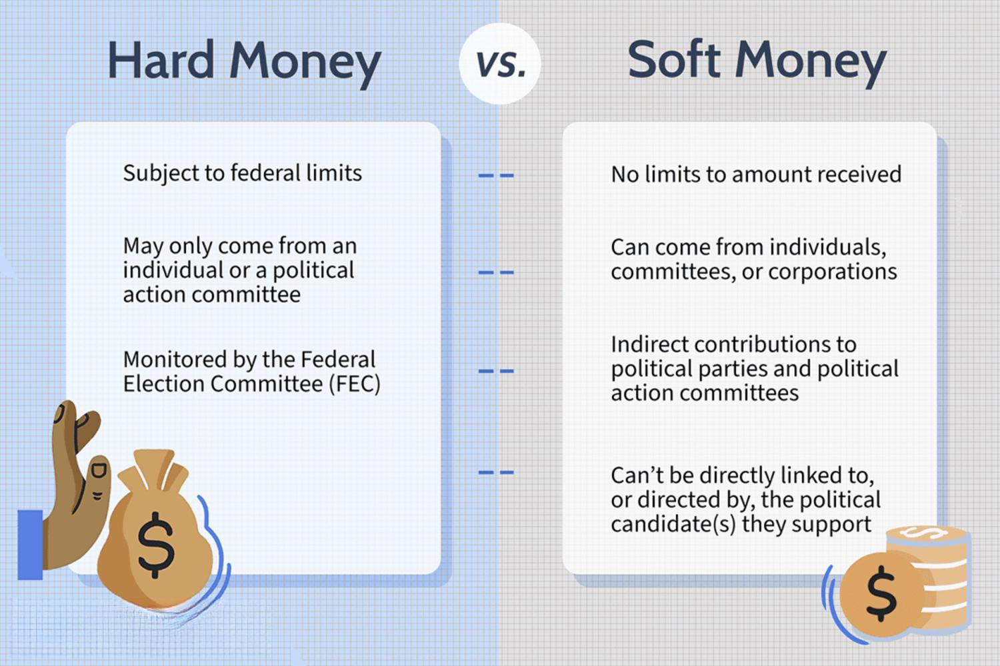

In today's highly competitive financial markets, understanding various payment structures is crucial for effective trading and investing. Payment structures define how financial services are compensated, which in turn influences the strategies and decisions of market participants. Among these structures, 'hard dollars' play a significant role, particularly within algorithmic trading.

Hard dollars refer to direct cash payments made by investors or customers to brokerage firms for specific services rendered. Unlike other payment methods that bundle various services into a single charge, hard dollars involve clear, itemized transactions. These payments generally cover services like trade execution, research, data provision, and account maintenance. This direct method of payment ensures transparency and can be easily tracked on financial statements, offering investors a clearer view of their expenses.

Algorithmic trading, which uses computer algorithms to automate trading decisions, aggressively pursues precision in managing costs and efficiency in execution. Given these priorities, the straightforward nature of hard dollar transactions provides a valuable framework for traders and firms. Precise cost management is vital for algorithmic trading strategies to succeed, as even small discrepancies in costs can significantly impact profitability in high-frequency trading scenarios.

This article will explore the definition and importance of hard dollars, compare them with soft dollars, and examine their application in algorithmic trading. Understanding these aspects of financial transactions will provide investors with the insights needed to navigate the evolving landscape of financial markets effectively. As the demand for transparency grows in alignment with regulatory shifts, the role of hard dollars becomes increasingly significant for maintaining clear and compliant financial operations.

## Table of Contents

## What Are Hard Dollars?

Hard dollars are defined as direct cash payments made by investors or customers to brokerage firms for specific services rendered. These payments are an essential component of financial arrangements, as they are pre-determined and explicitly cover costs associated with trade execution, research, data provision, and account maintenance. By standing in contrast to the concept of soft dollars, which are linked indirectly to trading commissions, hard dollars offer a clear structure in financial transactions.

In practice, hard dollar payments are outlined in clearly defined agreements between the investor and the brokerage firm. This transparency ensures that investors know the exact financial commitments they are undertaking. Unlike soft dollars, hard dollar transactions are straightforward; they do not embed the cost of services within trading commissions, which can often obscure the real expenses involved.

Hard dollars contribute to more precise financial planning and budgeting for investors. Since these transactions are clearly specified in cash terms, they allow both brokerage firms and investors to maintain transparent records that aid in financial reporting and accounting. Additionally, the explicit nature of hard dollar payments aligns with the need for clarity within the regulatory frameworks governing financial markets, enhancing compliance and reducing the risk of misinterpretation or misrepresentation of costs.

In summary, hard dollars represent cash payments that are clear, direct, and pre-determined, covering specific brokerage services and promoting transparency and straightforwardness in financial engagements.

## Understanding the Hard Dollar System

Hard dollar payments are fundamentally important in establishing transparency and clarity in financial transactions, particularly within the financial services industry. This mechanism involves direct cash payments made by investors or customers to brokerage firms as compensation for services rendered. These services often include trade execution, research, data provision, and account maintenance. The distinct characteristic of hard dollars is their straightforward nature, as they are not intermixed with trading commissions or other indirect payment methods.

The transparency offered by hard dollar payments is invaluable for financial firms aiming to maintain clear and accurate financial statements. By separating direct cash payments from trading commissions, firms can achieve a precise understanding of the expenses associated with various brokerage services. This separation allows firms to recognize and evaluate the true cost of services, which is especially critical for budget planning and financial reporting.

Moreover, hard dollar payments necessitate direct compensation for brokerage services without any bundling with trade commissions. This explicit financial arrangement supports firms in aligning their payments directly with the services received, thereby facilitating better cost analysis and resource allocation. It ensures that firms are not overly burdened by hidden or unanticipated costs, which may arise from bundled payment systems like soft dollars.

In summary, the hard dollar system fosters an environment where financial firms can maintain straightforward and transparent financial records. This system aids in evaluating the actual costs of services provided, supporting strategic financial decision-making and enhancing compliance with financial regulations. As a result, the hard dollar payment structure is a vital component in the operations of firms that prioritize accountability and financial clarity.

## Hard Dollars vs. Soft Dollars

In financial transactions, hard dollars and soft dollars serve different functions, primarily differentiated by their payment structures. Hard dollars are straightforward, involving direct cash payments from investors to brokerage firms for services such as trade execution, research, data provision, and account maintenance. These payments are explicit and predetermined, making it easy for firms to track expenses and manage financial statements transparently.

Conversely, soft dollars represent a more convoluted form of compensation. Instead of cash payments, they involve non-cash benefits or services provided in exchange for commission-based incentives. These arrangements often bundle additional services like research and analysis with trading commissions. As a result, the actual costs associated with research and execution may become masked, leading to potential discrepancies in understanding the real value of services received.

The structural differences between hard and soft dollars have significant implications for regulatory compliance. With their straightforward cash transactions, hard dollars offer a clearer path to compliance and transparency. Firms using hard dollar payments can easily demonstrate the costs incurred for specific services, aiding both internal financial audits and external regulatory reviews.

In contrast, soft dollar arrangements are subject to greater scrutiny due to their potential to obscure true costs and value transfers. Regulatory bodies have raised concerns regarding possible conflicts of interest when research and execution costs are bundled under soft dollar agreements. Consequently, the transparent nature of hard dollar transactions often makes them more favorable in terms of regulatory compliance. This clarity in financial dealings is becoming increasingly important as regulatory frameworks evolve, pushing for greater transparency and adherence to fair trading practices.

## The Role of Hard Dollars in Algorithmic Trading

Algorithmic trading, characterized by high-frequency and complex algorithms, necessitates precise cost management and efficient execution strategies. In this context, hard dollars become a vital component for controlling costs effectively. These direct cash payments provide a transparent framework for financial transactions without the complexities often associated with soft dollar arrangements, which are bundled with trading commissions.

The transparency offered by hard dollars is central to [algorithmic trading](/wiki/algorithmic-trading), where every decision involves a rigorous analysis of costs and potential returns. With hard dollars, traders can directly account for the expenses incurred in obtaining brokerage services, such as research, data provision, and account maintenance. This level of clarity is indispensable considering the rapid and repetitive nature of algorithmic trades, where marginal cost changes can significantly impact overall profitability.

Moreover, the transparency of hard dollars facilitates compliance with evolving trading regulations. Regulatory bodies increasingly demand detailed disclosures about the costs related to financial services, particularly research expenses. Hard dollar payments ensure that each service is documented and charged explicitly, reducing the risks associated with misinterpretation or non-compliance.

The precision in cost allocation that hard dollars provide is essential for evaluating the efficiency of trading algorithms. For instance, when algorithms are developed and tested, it is crucial to include explicit cost data in the [backtesting](/wiki/backtesting) process. This includes the fees associated with trade executions and any data or software licenses utilized in crafting the trading strategy. By incorporating hard dollar costs into these models, firms can better assess the net performance of their trading strategies, allowing for more informed strategic adjustments.

Additionally, hard dollars assist in the creation of more robust financial models and audits. When firms have precise data on the cash expenditures for specific services, it leads to enhanced forecasting and budgeting processes. For example, financial departments can use historical hard dollar costs to predict future expenses, aiding in the strategic allocation of resources.

In summary, the role of hard dollars in algorithmic trading cannot be overstated. They provide the necessary clarity and detail in financial transactions, enabling significant improvements in cost management, regulatory compliance, and analytical precision. As the demand for transparent financial practices intensifies, hard dollars will likely continue to be an indispensable tool in the toolkit of algorithmic traders.

## Hard Dollar Agreements and Industry Practices

Agreements involving hard dollar payments typically include specific terms that delineate the provision of services and the corresponding costs. These agreements often cover services such as trade execution, analytics, data provision, and account maintenance. By clearly specifying these elements, firms ensure that they receive value for the money spent on brokerage and research services, which can be critical in maintaining financial discipline and operational efficiency.

The transition towards hard dollar payments has been notably influenced by regulatory changes, including the Markets in Financial Instruments Directive II (MiFID II) implemented in the European Union. MiFID II mandates unbundling of research costs from trading commissions, prompting a shift from soft dollar to hard dollar arrangements. This regulatory requirement serves to enhance transparency in investment research payments, ensuring that investors are adequately informed about the costs incurred for financial research and advice. 

The move to hard dollar agreements aligns with an industry-wide demand for greater clarity and accountability. By employing clear payment structures, firms are better positioned to assess the value of services received, leading to more informed decision-making processes. This practice also facilitates compliance with regulations aimed at preventing conflicts of interest and promoting fair financial practices.

Overall, the adoption of hard dollar payments represents a significant trend in the finance industry, driven by both regulatory pressures and a broader push for clarity and transparency in financial dealings. This evolution underscores the importance of explicit cost accounting and the validation of services provided, supporting robust financial management and compliance frameworks.

## Conclusion

In summary, hard dollars are pivotal in offering transparency and clarity in financial transactions, especially within algorithmic trading. Direct cash payments are crucial for delineating the true economic cost of services rendered by brokerage firms, thus allowing for a transparent financial reporting process. As regulatory landscapes evolve and demand for transparency increases, the emphasis on hard dollar payments will likely continue to grow. These changes are driven by regulatory frameworks such as MiFID II, which prioritize investor protection and market efficiency through improved transparency and cost allocation clarity.

Investment firms leveraging hard dollar arrangements can significantly enhance operational efficiency. By having explicit cost structures, firms can better manage expenditures and optimize resource allocation. This clear delineation of costs not only ensures compliance with regulatory requirements but also facilitates improved financial forecasting and budgeting.

Moreover, fostering transparent relationships with brokers is paramount. Hard dollar payments eliminate ambiguities associated with bundled services and commissions, therefore promoting trust and accountability in broker-client relationships. Firms adopting these arrangements are well-positioned to adapt to the increasing demands for regulatory compliance and customer trust, ensuring sustainable growth and competitive advantage in the complex financial ecosystem.

## References & Further Reading

[1]: Harris, L. (2003). ["Trading and Exchanges: Market Microstructure for Practitioners."](https://www.amazon.com/Trading-Exchanges-Market-Microstructure-Practitioners/dp/0195144708) Oxford University Press.

[2]: ["Advances in Financial Machine Learning"](https://www.amazon.com/Advances-Financial-Machine-Learning-Marcos/dp/1119482089) by Marcos Lopez de Prado

[3]: Hasbrouck, J. (2007). ["Empirical Market Microstructure: The Institutions, Economics, and Econometrics of Securities Trading."](https://archive.org/details/empiricalmarketm0000hasb) Oxford University Press.

[4]: ["Best Execution and Soft Dollar Practices: A Guide to Broker/Dealer Compliance and Regulatory Issues"](https://fastercapital.com/content/Best-Execution--Achieving-Best-Execution--A-Deep-Dive-into-Soft-Dollar-Economics.html) by Wayne A. Thorp

[5]: Farmer, J. D., & Lo, A. W. (1999). ["Frontiers of Finance: Evolution and Efficient Markets."](https://www.pnas.org/doi/10.1073/pnas.96.18.9991) Proceedings of the National Academy of Sciences, 96(18), 9991-9992.

[6]: Mifid II: A New Framework for Safeguarding Financial Markets. (2018). ["The Impact of MiFID II in the Financial Markets."](https://eur-lex.europa.eu/EN/legal-content/summary/better-regulated-and-transparent-financial-markets.html) Reuters.

[7]: Jorion, P. (2007). ["Value at Risk: The New Benchmark for Managing Financial Risk."](https://link.springer.com/article/10.1007/s11408-007-0057-3) McGraw-Hill Education.