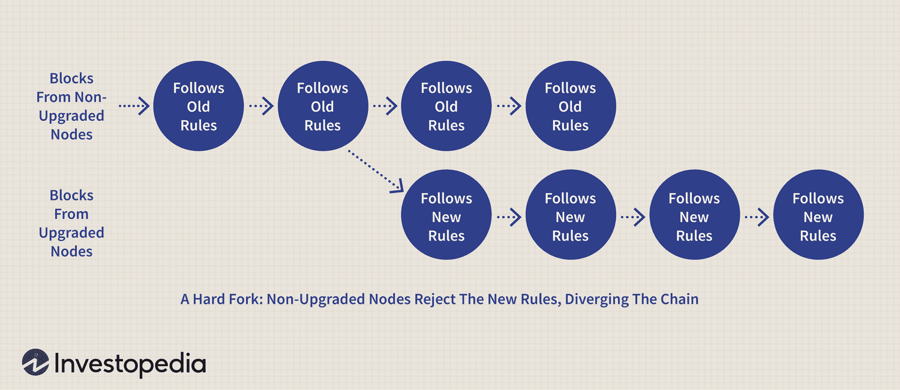

The cryptocurrency world is dynamic and ever-evolving, marked by frequent updates and changes that challenge both enthusiasts and investors. At the core of this transformation is blockchain technology, a decentralized and immutable digital ledger system. One of the critical aspects of blockchain technology is the occurrence of hard forks. These are significant events where changes in the underlying protocols result in the splitting of a blockchain network into two separate entities, often leading to the creation of new cryptocurrencies.

Simultaneously, the rise of algorithmic trading, commonly known as algo trading, has become a prevalent phenomenon within the cryptocurrency markets. This form of trading, which uses computer programs to execute trading strategies at optimal times, capitalizes on the extreme volatility and rapid price fluctuations characteristic of cryptocurrencies. The combination of blockchain hard forks and algorithmic trading presents unique opportunities and challenges for market participants.



In this article, we aim to explore the complexities surrounding blockchain hard forks and their impact on cryptocurrency algorithmic trading. By examining the mechanisms, implications, and strategies related to these developments, we seek to illuminate how these elements contribute to the shifting landscape of the cryptocurrency markets. Through understanding these dynamics, traders and developers can better navigate the uncertainties and harness the opportunities that arise in this exciting digital frontier.

## Table of Contents

## Understanding Blockchain Hard Forks

A blockchain hard fork represents a critical event where a single blockchain divides into two distinct paths due to modifications in the protocol's underlying code. This bifurcation occurs when updates or changes to the blockchain software introduce an incompatibility with the existing version, necessitating a split to accommodate the differing sets of rules. The result is the formation of two parallel blockchains: one that maintains allegiance to the original protocol (old rules) and another that incorporates the newly introduced changes (new rules).

### Causes of Hard Forks

Hard forks are initiated for several reasons:

1. **Software Upgrades**: As blockchain technology evolves, developers may implement upgrades to enhance functionality, scalability, or performance. These changes, if not backward compatible, result in a hard fork. For instance, updates that increase block size or change the consensus mechanism require all participating nodes to upgrade to the new version to remain part of the same network.

2. **Security Patches**: Critical security vulnerabilities may necessitate immediate protocol changes that are not backward compatible, prompting a hard fork to protect the network from potential exploits.

3. **Community Disagreements**: Diverging philosophies or strategic directions within a blockchain community can lead to contentious hard forks. Such disagreements might stem from opposing views on how to address scalability issues, governance policies, or resource allocation. 

### Types of Hard Forks

1. **Planned Hard Forks**: These are typically announced well in advance and occur as part of a roadmap for technological improvements. Planned hard forks typically have community consensus and are less likely to result in significant market disruption.

2. **Contentious Hard Forks**: Unlike planned forks, these arise from significant disagreements within the community. Contentious forks can lead to split communities and the creation of a new cryptocurrency. Notable examples include Bitcoin Cash and Ethereum Classic.

#### Examples

- **Bitcoin Cash**: This is a prominent example of a contentious hard fork. The fork was initiated on August 1, 2017, due to differing opinions on Bitcoin's scalability solutions. Proponents of Bitcoin Cash advocated for increasing the block size limit to allow for more transactions per block, in contrast to Bitcoin's Segregated Witness (SegWit) proposal.

- **Ethereum Classic**: Stemming from a security breach known as "The DAO Hack" in 2016, the Ethereum community decided to implement a hard fork to reverse the hack's financial damage. This decision was not agreed upon by all, leading to the continued existence of the original chain under the moniker Ethereum Classic, preserving the original transaction history.

In both examples, these hard forks led to the creation of new cryptocurrencies, reflecting differing philosophies and technical disagreements among community members. Understanding the complexities of hard forks is vital for participants in the blockchain ecosystem, as these events often lead to significant market shifts and create new dynamics within the digital currency landscape.

## Algorithmic Trading in Cryptocurrency

Algorithmic trading leverages sophisticated computer programs to automate and optimize the execution of trades in financial markets. This approach has become increasingly prevalent in the [cryptocurrency](/wiki/cryptocurrency) markets due to their inherent [volatility](/wiki/volatility-trading-strategies), which presents ample opportunities for profit through price fluctuations. Algorithmic trading in cryptocurrencies involves deploying pre-programmed instructions to analyze market data and execute trades at optimal times, aiming to capitalize on short-term trends and price movements.

Several strategies are commonly employed in cryptocurrency [algorithmic trading](/wiki/algorithmic-trading):

1. **Arbitrage**: This strategy exploits the price differentials of a cryptocurrency across different exchanges. For instance, if Bitcoin is trading at $10,000 on one exchange and at $10,050 on another, a trader can buy Bitcoin on the first exchange and simultaneously sell it on the second, capturing the $50 profit per Bitcoin, minus transaction costs. Arbitrage in the cryptocurrency market is particularly pertinent due to its fragmentation and the frequent occurrence of price discrepancies across exchanges.

    ```python
    def arbitrage_opportunity(exchange_a_price, exchange_b_price, transaction_cost):
        if exchange_a_price < exchange_b_price * (1 - transaction_cost):
            return "Buy on Exchange A, Sell on Exchange B"
        elif exchange_b_price < exchange_a_price * (1 - transaction_cost):
            return "Buy on Exchange B, Sell on Exchange A"
        else:
            return "No Arbitrage Opportunity"
    ```

2. **Market Making**: This involves providing liquidity to the market by placing buy and sell orders around the current market price. Market makers earn a profit from the spread between the buy and sell prices. This strategy requires speedy execution and constant market monitoring to adjust orders based on market dynamics.

3. **Trend Following**: Unlike arbitrage or market making, trend-following strategies capitalize on the momentum of price movements. These strategies typically use technical indicators such as moving averages or momentum oscillators to identify and follow trends until they exhibit signs of reversing. 

    Technical Analysis Example:
    - **Moving Average Crossover**: Buy when the short-term moving average crosses above the long-term moving average and sell when it crosses below.

      ```python
      def moving_average_crossover_strategy(prices, short_window, long_window):
          short_ma = prices.rolling(window=short_window).mean()
          long_ma = prices.rolling(window=long_window).mean()
          buy_signals = (short_ma > long_ma) & (short_ma.shift(1) <= long_ma.shift(1))
          sell_signals = (short_ma < long_ma) & (short_ma.shift(1) >= long_ma.shift(1))
          return buy_signals, sell_signals
      ```

In algorithmic trading, speed, efficiency, and execution accuracy are paramount. High-frequency trading ([HFT](/wiki/high-frequency-trading-strategies)) is a subset that relies on lightning-fast transaction speeds, often measured in microseconds, to gain advantages over slower market participants. Efficient execution minimizes market impact and slippage, ensuring better adherence to intended trading strategies. Cryptocurrencies, with their 24/7 trading environment and extreme volatility, offer unique challenges and opportunities for algorithmic traders to devise and implement strategies that can efficiently navigate and profit from rapid market movements.

## Impact of Hard Forks on Cryptocurrency Algo Trading

Hard forks can significantly influence cryptocurrency markets, primarily through the creation of new tokens and subsequent price volatility. Such events necessitate adjustments from algorithmic traders who must adapt to the altered market dynamics typically accompanying a fork. 

When a blockchain undergoes a hard fork, it effectively splits into two separate networks, leading to the creation of two distinct cryptocurrencies: the original and the newly forked one. This separation often results in pronounced price fluctuations as market participants re-evaluate the value and utility of the resulting cryptocurrencies. For algorithmic traders, these fluctuations can present both challenges and opportunities.

Algorithmic trading strategies are often finely tuned to the prevailing market conditions. Following a hard fork, these strategies may require reconfiguration to account for the new tokens and the shifted market landscape. For instance, traders might need to update algorithms to accommodate changes in trading [volume](/wiki/volume-trading-strategy), [liquidity](/wiki/liquidity-risk-premium) conditions, or altered price correlations between the original and forked assets. Such adaptability is crucial to maintain performance and capitalize on new market conditions.

One of the prominent opportunities arising from a hard fork is [arbitrage](/wiki/arbitrage). Since hard forks lead to the emergence of two related but distinct assets, differences in their valuations across various exchanges can create arbitrage opportunities. Traders can exploit these discrepancies by simultaneously buying the undervalued asset on one exchange and selling it at a premium on another. This strategy relies on rapid execution and precise algorithmic adjustments post-fork to manage the inherent risks and capture potential profits.

Moreover, the increased volatility and altered liquidity profiles that often accompany hard forks present added risks. Volatility can lead to rapid and unpredictable price swings, necessitating vigilant risk management to avoid significant losses. Similarly, changes in liquidity can impact the execution of trades, either causing slippage or impacting the ability to enter and [exit](/wiki/exit-strategy) positions swiftly. Algorithmic traders must, therefore, incorporate robust risk management protocols and maintain flexible algorithms to navigate the volatile environment efficiently.

In summary, while hard forks introduce complexities into cryptocurrency markets by creating new tokens and influencing price volatility, they simultaneously offer algorithmic traders distinct opportunities through valuation discrepancies and altered market dynamics. Successful traders will be those who can dynamically adjust their algorithms and strategies to capitalize on these changes while managing associated risks effectively.

## Challenges and Risks

Hard forks and algorithmic trading in the cryptocurrency market present various challenges and risks that need careful consideration by traders and developers. In the case of hard forks, achieving consensus within the blockchain community is vital. Failure to obtain broad agreement can lead to contentious forks that might result in parallel blockchains, causing community disputes and network splits. These splits can destabilize the network and create uncertainty about the future value of a cryptocurrency.

Moreover, when a hard fork occurs, it may lead to confusion regarding which chain represents the "official" continuation of the cryptocurrency, impacting user trust and market value. For example, Bitcoin Cash and Ethereum Classic emerged from disagreements, illustrating how a lack of consensus can result in entirely separate cryptocurrencies, each with its own economic implications.

On the algorithmic trading front, there are multiple risks associated with reliance on technology and market dynamics. Algorithmic trading systems depend heavily on sophisticated software and high-speed networks, which can be susceptible to technical failures or latency issues. Additionally, algorithms could inadvertently exacerbate market volatility if they trigger cascading sell-offs or buy orders due to unforeseen economic events or software bugs.

Market manipulation is another critical risk in algorithmic trading. Traders using algorithms may face the threat of malicious actors employing spoofing or wash trading tactics to create misleading market signals. Regulators worldwide, as noted in [1], are increasingly tightening scrutiny on algorithmic trading to prevent these practices and ensure market fairness. The evolving regulatory landscape necessitates that traders stay informed and adapt their strategies to comply with the latest guidelines.

To survive these challenges, traders must implement robust technological frameworks and develop informed trading strategies. This includes setting up redundant systems to handle potential technical failures and conducting thorough [backtesting](/wiki/backtesting) of algorithms to ensure reliability under various market conditions. Additionally, traders benefit from monitoring market sentiment and news to adjust their algorithms proactively. Programs like the following Python snippet can aid in real-time sentiment analysis using Twitter data, although ethical use must always be ensured:

```python
import tweepy
from textblob import TextBlob

# Initialize API
consumer_key = 'your_consumer_key'
consumer_secret = 'your_consumer_secret'
access_token = 'your_access_token'
access_token_secret = 'your_access_token_secret'

auth = tweepy.OAuthHandler(consumer_key, consumer_secret)
auth.set_access_token(access_token, access_token_secret)

api = tweepy.API(auth)

# Collect recent tweets on a topic
public_tweets = api.search('cryptocurrency hard fork')

# Analyze sentiment
for tweet in public_tweets:
    analysis = TextBlob(tweet.text)
    print(tweet.text)
    print(analysis.sentiment)
```

In summary, the synergistic effect of understanding the risks associated with hard forks and algorithmic trading, coupled with proactive strategy development, allows traders and developers to minimize potential losses and capitalize on market opportunities.

---

**References**  
1. FINRA (2023). "Algorithmic Trading: Rules and Regulations". [Link](https://www.finra.org/rules-guidance/key-topics/algorithmic-trading)

## Future Trends and Outlook

Looking ahead, blockchain hard forks and algorithmic trading are expected to continue exerting a profound influence on the cryptocurrency markets. As these elements evolve, several critical trends and factors are poised to impact the future landscape.

The role of governance in managing hard forks could be pivotal in maintaining a balance between innovation and stability in blockchain projects. Governance mechanisms are increasingly being integrated into blockchain platforms to facilitate decision-making processes that are transparent, democratic, and efficient. Decentralized Autonomous Organizations (DAOs) and on-chain voting are examples of governance systems that can offer a structured approach to handling hard forks, potentially reducing community conflicts and improving consensus during forks. Platforms such as Tezos and Cardano have implemented governance structures that allow stakeholders to propose and vote on protocol upgrades, highlighting the importance of managed evolution in blockchain technology.

Advancements in [artificial intelligence](/wiki/ai-artificial-intelligence) (AI) and [machine learning](/wiki/machine-learning) are likely to enhance the effectiveness of algorithmic trading. AI algorithms can process large volumes of data and identify trading patterns with greater speed and accuracy than human traders. Machine learning techniques, such as [deep learning](/wiki/deep-learning) and [reinforcement learning](/wiki/reinforcement-learning), are increasingly being employed to develop predictive models that can forecast price movements and detect arbitrage opportunities. For instance, neural networks can be trained on historical cryptocurrency data to predict future price trends, enabling traders to execute more informed decisions. The integration of natural language processing (NLP) can further extend the capabilities of trading algorithms by analyzing market sentiment from news articles and social media, providing additional data-driven insights.

Regulatory frameworks will play an essential role in ensuring fair and secure market practices. As the cryptocurrency markets mature, regulatory bodies worldwide are taking steps to establish guidelines that protect investors and maintain market integrity. These regulations aim to prevent market manipulation and fraud, ensuring a level playing field for all market participants. Clear regulatory environments could also increase institutional participation in the crypto markets, as the perceived risks associated with regulatory uncertainty diminish. Moreover, international cooperation among regulatory agencies may result in more cohesive global standards, potentially facilitating the seamless operation of cross-border cryptocurrency trading activities.

In summary, the future of blockchain hard forks and algorithmic trading will be shaped by governance innovations, technological advancements, and regulatory oversight. As these factors interact, they will likely define the trajectory of the cryptocurrency markets, presenting both opportunities and challenges for stakeholders involved.

## Conclusion

Blockchain hard forks and algorithmic trading are integral components of the cryptocurrency ecosystem. Hard forks, which can lead to network splits and the creation of new cryptocurrencies, introduce opportunities and challenges that require traders and developers to be astutely aware and adaptive. These events necessitate a thorough understanding of market dynamics and the ability to adjust trading algorithms swiftly to navigate newly introduced tokens and the resultant volatility.

Traders and developers must remain vigilant regarding hard fork events. This vigilance enables timely adjustments in their strategies, such as recalibrating algorithmic trading models to capitalize on the price disparities that often accompany forked cryptocurrencies. The ability to anticipate and respond to these changes can differentiate between capitalizing on potential arbitrage opportunities and facing financial losses due to unforeseen market shifts.

Understanding the interplay between blockchain hard forks and algorithmic trading allows market participants to harness the full spectrum of opportunities available in the crypto markets. Algorithmic trading can leverage the peculiar circumstances post-hard fork by preparing for liquidity changes, exploiting market inefficiencies, and ensuring timely execution of trades to maximize gains. Moreover, a deep comprehension of how these aspects influence one another helps in risk management and strategic planning.

As the cryptocurrency landscape continues to evolve rapidly, staying informed and agile is crucial for success. This environment demands a continuous learning approach, where adapting to technological advancements, such as those in blockchain protocols and algorithmic trading tools, becomes a regular endeavor. Being equipped with the latest insights and technologies ensures that traders and developers not only survive but thrive amidst the ever-changing tides of the cryptocurrency market.

## References & Further Reading

[1]: Bergstra, J., Bardenet, R., Bengio, Y., & Kégl, B. (2011). ["Algorithms for Hyper-Parameter Optimization."](https://papers.nips.cc/paper/4443-algorithms-for-hyper-parameter-optimization) Advances in Neural Information Processing Systems 24.

[2]: ["Advances in Financial Machine Learning"](https://www.amazon.com/Advances-Financial-Machine-Learning-Marcos/dp/1119482089) by Marcos Lopez de Prado

[3]: ["Evidence-Based Technical Analysis: Applying the Scientific Method and Statistical Inference to Trading Signals"](https://www.amazon.com/Evidence-Based-Technical-Analysis-Scientific-Statistical/dp/0470008741) by David Aronson

[4]: ["Machine Learning for Algorithmic Trading"](https://github.com/stefan-jansen/machine-learning-for-trading) by Stefan Jansen

[5]: ["Quantitative Trading: How to Build Your Own Algorithmic Trading Business"](https://www.amazon.com/Quantitative-Trading-Build-Algorithmic-Business/dp/1119800064) by Ernest P. Chan

[6]: Antonopoulos, A. M. (2015). ["Mastering Bitcoin: Unlocking Digital Cryptocurrencies,"](https://books.google.com/books/about/Mastering_Bitcoin.html?id=IXmrBQAAQBAJ) O'Reilly Media.

[7]: Narayanan, A., Bonneau, J., Felten, E., Miller, A., & Goldfeder, S. (2016). ["Bitcoin and Cryptocurrency Technologies: A Comprehensive Introduction,"](https://press.princeton.edu/books/hardcover/9780691171692/bitcoin-and-cryptocurrency-technologies) Princeton University Press.