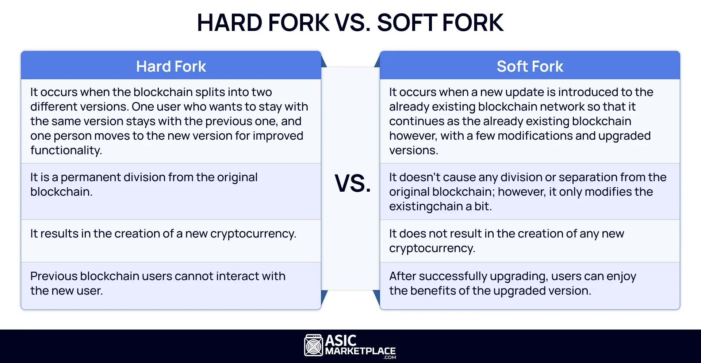

## Table of Contents

## What is a hard fork in blockchain?

A hard fork in blockchain is like a big change to the rules of a game that everyone has to follow. Imagine you're playing a board game and suddenly, the rules change so much that you need a new board to keep playing. In blockchain, a hard fork means the software is updated in a way that creates a new version of the blockchain. If people want to keep using the old rules, they can stay on the original blockchain, but if they want to use the new rules, they have to move to the new blockchain.

This can happen for many reasons, like fixing big problems or adding new features. When a hard fork happens, it can split the community because some people might like the old way better, while others might like the new changes. This split can lead to two different blockchains existing at the same time, each with its own group of users and its own set of rules. A famous example of a hard fork is when Bitcoin split into Bitcoin and Bitcoin Cash.

## How does a hard fork differ from a soft fork?

A hard fork and a soft fork are both ways to change the rules of a blockchain, but they work differently. A hard fork is like a big change where the new rules are so different that they can't work with the old rules. If you want to follow the new rules, you have to move to a new version of the blockchain. It's like if a game changed so much that you needed a whole new game board. Not everyone might want to make the change, so the old blockchain can keep going with the old rules, and the new blockchain goes on with the new rules. This can split the community into two groups.

A soft fork, on the other hand, is a smaller change where the new rules can still work with the old rules. It's like adding a new rule to a game that doesn't mess up the old rules. If you're playing with the new rules, you can still play with people using the old rules. Over time, more people might start using the new rules, but everyone can keep using the same blockchain. Soft forks are usually less disruptive because they don't force a split in the community.

## What are the basic steps involved in implementing a hard fork?

To implement a hard fork, the first step is to decide what changes need to be made to the blockchain. This could be fixing a big problem or adding a new feature that needs a big change. Once the changes are decided, the developers write new code that includes these changes. They then share this new code with the community and explain why the hard fork is needed. It's important for the community to agree on the changes because not everyone might want to switch to the new rules.

After the community agrees, the developers set a date and time for when the hard fork will happen. On that date, everyone who wants to follow the new rules needs to update their software to the new version. Once the hard fork happens, the blockchain splits into two: one that follows the old rules and one that follows the new rules. People can choose which blockchain they want to use. If many people choose the new blockchain, it can become the main one, but if not, both might keep going side by side.

## Can you explain the technical mechanism behind a hard fork?

A hard fork in blockchain happens when the rules of the blockchain are changed so much that the old rules and the new rules can't work together anymore. Imagine the blockchain as a long chain of blocks, where each block follows certain rules to be added to the chain. When a hard fork happens, the new rules change how blocks are made or what they can contain. For example, the new rules might say that blocks can be bigger or that different kinds of transactions are allowed. When the hard fork is activated, the blockchain splits into two paths: one that keeps following the old rules and another that starts following the new rules.

To make this happen, the developers write new code that includes the changes they want. They then tell everyone using the blockchain about the new code and when it will start working. On the set date, everyone who wants to use the new rules needs to update their software to the new version. After the update, when someone tries to add a new block to the chain, the software will use the new rules. If enough people update to the new rules, the blockchain following the new rules can become the main one. But if not, both the old and the new blockchains can keep going, each with its own group of users.

## What are some common reasons for initiating a hard fork?

One common reason for starting a hard fork is to fix big problems in the blockchain. Sometimes, there are mistakes or security issues that need to be fixed right away. If the fix is too big to work with the old rules, a hard fork is needed. This way, everyone can start using the new, safer version of the blockchain. Another reason is to add new features that the old rules can't handle. For example, if people want to make the blocks bigger to handle more transactions, a hard fork might be needed to change how the blockchain works.

Another reason for a hard fork is when different groups in the community want different things. Sometimes, people disagree about how the blockchain should work. If they can't agree, they might decide to split the blockchain into two, each following different rules. This can lead to two separate blockchains, each with its own group of users. A famous example is when Bitcoin split into Bitcoin and Bitcoin Cash because some people wanted bigger blocks and others didn't.

## How does a hard fork affect the existing blockchain and its users?

When a hard fork happens, it splits the existing blockchain into two separate paths: one that keeps following the old rules and another that starts following the new rules. For users, this means they have to decide which path to take. If they like the new changes, they need to update their software to the new version. If they prefer the old way, they can keep using the original blockchain without any changes. This split can cause confusion and disagreements in the community, as some people might feel strongly about sticking with the old rules while others want to move forward with the new changes.

The impact on the existing blockchain can be big. If a lot of people choose to follow the new rules, the new blockchain might become the main one, leaving the old blockchain with fewer users and less value. On the other hand, if most people stay with the old rules, the new blockchain might struggle to gain support. In some cases, both blockchains can keep going side by side, each with its own group of users and its own value. This can lead to a situation where the community is divided, but it also gives users more choices about which blockchain they want to use.

## What are the potential risks and challenges associated with a hard fork?

A hard fork can cause a lot of problems. One big risk is that it can split the community into two groups. Some people might like the new changes and want to use the new blockchain, while others might want to stick with the old rules. This can lead to arguments and disagreements, making it hard for everyone to work together. Another challenge is that if not enough people switch to the new blockchain, it might not be successful. It could end up with fewer users and less value, which can make it hard for the new blockchain to grow and be useful.

Another risk is that a hard fork can be confusing for users. They have to decide which blockchain to use, and if they don't update their software correctly, they might lose access to their money or data. This can be scary and stressful, especially for people who are new to using blockchains. Also, if the hard fork is done to fix a big problem, there's a risk that the fix might not work as planned. If something goes wrong, it could make the problem even worse, causing more headaches for everyone involved.

## Can you provide examples of notable hard forks in blockchain history?

One famous hard fork happened with Bitcoin in 2017. It split into Bitcoin and Bitcoin Cash. Some people wanted to make the blocks bigger so more transactions could happen faster. But not everyone agreed, so they decided to create a new blockchain called Bitcoin Cash with bigger blocks. People who owned Bitcoin before the fork got the same amount of Bitcoin Cash, so they could choose which one to use. This split caused a lot of talk and arguments in the Bitcoin community, but it also showed how hard forks can lead to new cryptocurrencies.

Another well-known hard fork was with Ethereum in 2016. It happened because of a big problem called the DAO hack, where a lot of money was stolen. To fix it, the Ethereum community decided to do a hard fork to get the stolen money back. This created two blockchains: Ethereum (ETH), which got the money back, and Ethereum Classic (ETC), which kept the old rules and didn't get the money back. This hard fork showed how a big problem can lead to a split, and it also made people think about what to do when things go wrong in a blockchain.

These examples show that hard forks can be used to fix problems or add new features, but they can also cause splits in the community. Each time a hard fork happens, people have to decide which blockchain to use, and this can lead to new cryptocurrencies being created.

## How do developers and the community decide when to execute a hard fork?

When developers and the community decide to do a hard fork, it usually starts with a big problem or a new idea that needs a big change. They talk a lot about it, trying to figure out if the change is really needed and if it's worth splitting the blockchain. They might use online forums, meetings, or special groups to discuss and vote on the idea. If most people agree that the change is important, they start planning the hard fork. They decide what the new rules will be and set a date for when the hard fork will happen.

Once the plan is set, the developers write the new code and share it with everyone. They explain why the hard fork is needed and how it will work. On the set date, people who want to use the new rules update their software. If a lot of people update, the new blockchain might become the main one. But if not many people update, the new blockchain might struggle. The whole process needs a lot of talking and agreeing, so everyone knows what's happening and can make their choice about which blockchain to use.

## What governance models are typically used to manage hard forks?

One common way to manage hard forks is through a decentralized governance model. In this model, everyone in the community gets to have a say in deciding if a hard fork should happen. They might talk about it on online forums or in special groups, and sometimes they vote on the idea. If most people agree that the change is good and needed, then the developers start planning the hard fork. This way, the decision is made by the community, and it helps make sure that the hard fork is what most people want.

Another way is through a more centralized governance model, where a smaller group of people, like the developers or a special committee, make the decisions. They might ask for feedback from the community, but they have the final say on whether a hard fork happens and how it's done. This can make the process faster and easier to manage, but it can also lead to disagreements if the community doesn't like the decisions being made. Both models have their pros and cons, and which one is used can depend on the specific blockchain and its community.

## How can a hard fork lead to the creation of a new cryptocurrency?

A hard fork can lead to the creation of a new [cryptocurrency](/wiki/cryptocurrency) because it splits the original blockchain into two separate paths. When a hard fork happens, the new rules are so different that they can't work with the old rules anymore. So, people who want to follow the new rules have to move to a new version of the blockchain. This new version becomes a different cryptocurrency because it has its own set of rules and its own community of users. For example, when Bitcoin hard forked into Bitcoin Cash, people who owned Bitcoin before the fork got the same amount of Bitcoin Cash, which they could then use as a new cryptocurrency.

This process can happen for different reasons, like fixing a big problem or adding new features that the old rules can't handle. When the community can't agree on the changes, the hard fork creates a split, and the new blockchain can become its own cryptocurrency. This gives people a choice between using the old blockchain or the new one. Sometimes, both can keep going side by side, each with its own value and users. This is how hard forks can lead to new cryptocurrencies being created, giving people more options in the world of blockchain.

## What advanced considerations should be taken into account when planning a hard fork?

When planning a hard fork, it's important to think about how it will affect everyone who uses the blockchain. You need to make sure that the new rules are clear and that people understand why the hard fork is happening. It's also a good idea to test the new code a lot to make sure it works right and doesn't cause new problems. You should also think about how to keep the blockchain safe during the hard fork, because it can be a time when hackers might try to cause trouble. Talking to the community and getting their feedback is really important, so everyone feels included in the decision.

Another thing to consider is what will happen to the value of the cryptocurrency after the hard fork. If a lot of people switch to the new blockchain, it might become more valuable, but if not many people switch, it could struggle. You also need to think about how to handle the money and data on the blockchain. For example, if people owned the old cryptocurrency before the fork, should they get the same amount of the new one? Planning for these things can help make the hard fork go smoothly and keep everyone happy.

## References & Further Reading

[1]: Bergstra, J., Bardenet, R., Bengio, Y., & Kégl, B. (2011). ["Algorithms for Hyper-Parameter Optimization."](https://papers.nips.cc/paper/4443-algorithms-for-hyper-parameter-optimization) Advances in Neural Information Processing Systems 24.

[2]: ["Advances in Financial Machine Learning"](https://www.amazon.com/Advances-Financial-Machine-Learning-Marcos/dp/1119482089) by Marcos Lopez de Prado

[3]: ["Evidence-Based Technical Analysis: Applying the Scientific Method and Statistical Inference to Trading Signals"](https://www.amazon.com/Evidence-Based-Technical-Analysis-Scientific-Statistical/dp/0470008741) by David Aronson

[4]: ["Machine Learning for Algorithmic Trading"](https://github.com/stefan-jansen/machine-learning-for-trading) by Stefan Jansen

[5]: ["Quantitative Trading: How to Build Your Own Algorithmic Trading Business"](https://www.amazon.com/Quantitative-Trading-Build-Algorithmic-Business/dp/1119800064) by Ernest P. Chan

[6]: Antonopoulos, A. M. (2015). ["Mastering Bitcoin: Unlocking Digital Cryptocurrencies,"](https://books.google.com/books/about/Mastering_Bitcoin.html?id=IXmrBQAAQBAJ) O'Reilly Media.

[7]: Narayanan, A., Bonneau, J., Felten, E., Miller, A., & Goldfeder, S. (2016). ["Bitcoin and Cryptocurrency Technologies: A Comprehensive Introduction,"](https://press.princeton.edu/books/hardcover/9780691171692/bitcoin-and-cryptocurrency-technologies) Princeton University Press.