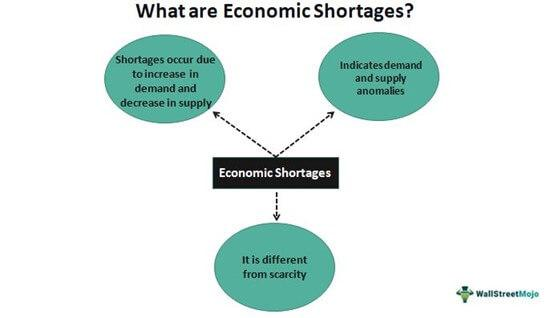

The complexities of the global economy often lead to cycles of growth and contraction, phenomena that have been studied extensively across various disciplines. Economic systems are dynamic and comprised of numerous moving parts including policies, market behaviors, and external shocks. These systems are inherently cyclical, experiencing phases of expansion and contraction. This cyclical nature gives rise to periods of economic prosperity and, conversely, to periods of recession and downturn.

Recently, several terms have gained prominence in economic discussions: recession, economic downturn, economic hard landing, and algorithmic trading. A recession is characterized by a sustained decline in economic activity, typically identified by a fall in Gross Domestic Product (GDP) over two consecutive quarters. During such times, indicators like unemployment rates increase, and consumer spending declines. An economic downturn is more general and describes any reduction in the rate of economic growth or a decline in economic output. 



An economic hard landing refers to a scenario where efforts to decrease inflation result in a sudden and significant slowdown in economic growth, often following aggressive monetary policy measures. These scenarios can be particularly challenging for economies as they can trigger recessions if not managed carefully.

The advent of algorithmic trading, using computer programs to execute trades based on predetermined criteria, has added another layer of complexity to modern economies. While algorithmic trading offers efficiency and speed in trade execution, it can also exacerbate market volatility, especially during economic downturns. These trading systems can react to market signals much faster than human traders, leading to rapid buy-sell actions that might amplify market fluctuations.

This article aims to explore these interconnected concepts, providing insight into how they affect and shape modern economies. Additionally, it will discuss the interaction between algorithmic trading and economic downturns, highlighting both the challenges and opportunities that arise in such environments. Understanding these interactions is crucial for policymakers, investors, and traders as they navigate the ever-evolving landscape of the global economy.

## Table of Contents

## Understanding Recessions

A recession represents a notable reduction in economic activity across a broad spectrum of the economy, typically persisting for an extended period, generally more than a few months. This downturn is quantitatively assessed through various macroeconomic indicators. Gross Domestic Product (GDP) serves as a primary metric, reflecting the overall economic production and consumption within a country's borders. A sustained decline in GDP is a critical signpost of a recession.

Employment [statistics](/wiki/bayesian-statistics) provide another significant measure. During a recession, unemployment rates tend to increase as companies reduce their workforce in response to decreased demand for goods and services. Consequently, job creation slows, and job losses escalate, further dampening consumer confidence and spending.

Manufacturing activity, often considered the lifeblood of economic growth, also diminishes during a recession. Indicators such as the Purchasing Managers' Index (PMI) can show contractions in manufacturing, signifying reduced production, inventory adjustments, and declining new orders, which are symptomatic of broader economic challenges.

Several factors can precipitate recessions. High-interest rates are a commonly cited cause; they increase the cost of borrowing, thereby curbing consumer spending and business investment. The following equation illustrates the relationship between interest rates and investment:

$$
I = C - r \times S
$$

Where:
- $I$ is investment,
- $C$ is consumer spending,
- $r$ is the interest rate,
- $S$ is savings.

As the [interest rate](/wiki/interest-rate-trading-strategies) ($r$) increases, investment ($I$) typically decreases as borrowing becomes more costly.

Reduced consumer confidence is another significant contributor. When consumers anticipate economic difficulties, they often curtail spending, leading to lower demand for goods and services. This behavior can exacerbate economic contraction as businesses respond by cutting production and employment.

Falling asset prices, particularly in real estate and stocks, can also trigger recessions. Declines in these markets can lead to a negative wealth effect, where consumers feel less wealthy and hence reduce their spending. This can create a feedback loop, further depressing economic activity.

In summary, understanding the multifaceted nature of recessions involves examining key economic indicators and recognizing the underlying causes, such as elevated interest rates, diminished consumer confidence, and depreciating asset values, all of which interplay to impact the broader economy negatively.

## Economic Downturn and Hard Landing

Economic downturn refers to a general slowdown in economic activity, typically characterized by reduced consumer spending, decreased industrial production, rising unemployment rates, and lower corporate profits. It signifies a period during which economic growth weakens, slowing down the expansion of GDP and other economic indicators. While economic downturns can be triggered by various factors, such as financial crises or geopolitical tensions, they often manifest as a natural part of the business cycle.

A hard landing, in contrast, is a more severe form of economic downturn. It describes a scenario where an economy undergoes a rapid correction that results in an abrupt and painful halt to its growth. This situation frequently arises when aggressive monetary policies, intended to curb inflation, inadvertently bring about economic contraction. Central banks may implement such policies by significantly increasing interest rates to combat rising prices, which can consequently dampen consumer spending and business investments, precipitating a sharp economic decline.

The term "hard landing" is opposed to a "soft landing," where the economy slows down just enough to avoid a recession, often viewed as the ultimate challenge for policymakers aiming to control inflation without stifling growth. The distinction between soft and hard landings is crucial, as the latter typically involves higher unemployment rates, more substantial declines in consumer confidence, and often requires more drastic measures for economic recovery.

In essence, while both economic downturns and hard landings signal a decline in economic performance, the intensity and rapidity of this decline are distinguishing factors. Understanding these concepts aids in preparing for potential fiscal and monetary responses that might mitigate the adverse impacts of such scenarios.

## Soft Landing vs. Hard Landing

A soft landing is a scenario where the economy slows gradually without slipping into a recession. This outcome is considered ideal by economists and policymakers as it allows for the stabilization of growth without causing significant economic disruptions. During a soft landing, economic indicators such as GDP growth, employment rates, and inflation levels slow down moderately, allowing markets to adjust without major shocks. This gradual slowdown is often the result of carefully calibrated monetary policies, where central banks may adjust interest rates to temper economic overheating or inflation, without halting growth entirely.

In contrast, a hard landing is characterized by a sharp economic slowdown that often leads to a recession. Such a scenario typically follows a period of rapid economic expansion, where aggressive monetary or fiscal tightening measures are implemented to curb inflation or address overheating. These measures can include significant interest rate hikes or abrupt cutbacks in government spending, which, if not managed carefully, can lead to a sudden halt in growth. The rapid deceleration in economic activity can cause declines in consumer spending, investment, and industrial production, leading to increased unemployment and reduced income levels.

The main challenge for policymakers is to manage economic conditions in such a way as to achieve a soft landing rather than a hard landing. This involves striking a delicate balance between slowing inflation and sustaining growth. Policymakers must continuously analyze economic data and trends, making adjustments to interest rates and fiscal policies as needed to guide the economy towards a soft landing. Advanced economic modeling and scenario analysis are typically employed to forecast potential outcomes and make informed policy decisions.

Achieving a soft landing is often complicated by external factors such as global economic trends, geopolitical tensions, and unexpected shocks like financial crises or pandemics. These factors can exacerbate economic conditions and make policy adjustments more challenging. Thus, while a soft landing is the desired outcome, the complex nature of economic systems requires adaptive strategies and a nimble approach to policy implementation.

## The Role of Algorithmic Trading

Algorithmic trading is a method of executing orders using automated pre-programmed trading instructions, allowing large transactions to be completed without human intervention. It relies on complex algorithms that consider various factors including timing, price, and quantity, which are typically beyond the scope of manual trading. These algorithms are designed to scan the market for trading opportunities and execute trades at speeds and frequencies that are impossible for a human trader.

During economic downturns, the markets often experience heightened [volatility](/wiki/volatility-trading-strategies) due to a rapid flux in supply and demand dynamics. In such conditions, [algorithmic trading](/wiki/algorithmic-trading) can amplify movements in the market. Algorithms react to market data almost instantaneously and execute large volumes of trades in seconds, sometimes triggering further automated responses from other algorithms, thereby increasing volatility. As a result, trading [volume](/wiki/volume-trading-strategy) can spike, and price swings become more pronounced. This phenomenon became particularly evident during past downturns, such as during the 2008 financial crisis, where algorithmic trading played a significant role in the pace and intensity of market reactions.

Despite the potential for increased volatility, algorithmic trading offers significant opportunities. Algorithms are adept at identifying and exploiting irregularities in the market, known as market inefficiencies. These inefficiencies might include price discrepancies, [arbitrage](/wiki/arbitrage) opportunities, or patterns that deviate from historical trends. Algorithms can be programmed to detect patterns or anomalies that human traders might overlook, allowing traders to capitalize on even slight mispricings before they disappear.

Additionally, the ability of algorithms to process vast amounts of data quickly allows traders to adapt their strategies to evolving market conditions. For example, a basic Python script could be programmed to monitor and react to key economic indicators as follows:

```python
import requests

# Example function to determine trading signal based on economic data
def get_trading_signal(economic_indicator):
    if economic_indicator < threshold:
        return 'Buy'
    elif economic_indicator > threshold:
        return 'Sell'
    else:
        return 'Hold'

# Fetch economic data (simulated for demonstration purposes)
endpoint = "https://api.example.com/economic_data"
response = requests.get(endpoint)
data = response.json()
indicator_value = data['indicator']

# Decision based on the analysis
signal = get_trading_signal(indicator_value)
```

This simplistic algorithm fetches economic data and determines a trading signal based on specified criteria. In practice, more complex models and [machine learning](/wiki/machine-learning) techniques are applied to refine predictions and enhance strategy outcomes.

In conclusion, while algorithmic trading can exacerbate market volatility during downturns, it also provides sophisticated tools to navigate and exploit market inefficiencies. The interplay of rapid computation, adaptive strategies, and comprehensive data analysis offers traders a competitive edge in volatile environments. As such, algorithmic trading remains an integral part of modern financial markets, especially in times of economic uncertainty.

## Impact of Economic Downturn on Algorithmic Trading

Economic downturns exert a significant influence on the strategies employed in algorithmic trading. During these periods, the predictability of markets diminishes, presenting unique challenges and opportunities.

Volatility, a hallmark of recessions, necessitates adjustments in trading algorithms to handle elevated risk levels. Volatility is often measured using standard deviation or other statistical measures, reflecting the degree to which asset prices deviate from their expected returns. Algorithmic traders might adjust their models to account for increased volatility, using techniques such as dynamic stop-loss limits or volatility-based position sizing.

Algorithmic trading systems often rely on historical data to predict future market behaviors. However, in the uncertain conditions of an economic downturn, past performance may no longer be a reliable indicator. Traders may employ machine learning models that can adapt to new patterns by constantly retraining with the latest market data. For instance, [reinforcement learning](/wiki/reinforcement-learning) algorithms can be used to develop adaptive strategies. A simple implementation in Python might look like this:

```python
from stable_baselines3 import A2C

# Define the environment and model
env = create_custom_environment()  # Placeholder for custom trading environment
model = A2C('MlpPolicy', env, verbose=1)

# Train the algorithm
model.learn(total_timesteps=10000)

# Deploy the model for trading
obs = env.reset()
while True:
    action, _states = model.predict(obs)
    obs, rewards, done, info = env.step(action)
    if done:
        obs = env.reset()
```

Despite inherent challenges, economic downturns can reveal opportunities for algorithmic traders to capitalize on market inefficiencies that arise. For example, sudden shifts in asset prices may provide arbitrage opportunities that algorithms can exploit swiftly and efficiently. Furthermore, during recessions, there might be increased mispricing in assets due to panic selling or herd behavior. Traders equipped with sophisticated algorithms can leverage [statistical arbitrage](/wiki/statistical-arbitrage) strategies to identify and profit from these discrepancies.

Traders must also consider correlations between assets, which often increase during economic stress, influencing portfolio diversification strategies. Adjusting algorithmic models to take into account time-varying correlations can enhance risk management.

In summary, economic downturns compel algorithmic traders to recalibrate their strategies to address the unpredictability and heightened volatility characteristic of these periods. While this presents challenges, it also opens avenues for discovering inefficiencies and new strategies that might not be apparent under normal market conditions.

## Strategies for Investors During Economic Downturns

During economic downturns, investors face heightened uncertainties and risks, making it crucial to adopt strategies that safeguard their investments. A fundamental approach to navigating these turbulent periods involves diversifying portfolios to mitigate risks. Diversification helps spread exposure across various asset classes, sectors, and geographic regions, reducing reliance on any single investment. This strategy aims to achieve more stable returns even when certain segments of the market underperform.

Defensive stocks, typically characterized by their ability to provide consistent dividends and stable earnings regardless of economic conditions, can offer a measure of stability. These stocks belong to industries such as utilities, healthcare, and consumer staples, which tend to exhibit less volatility during downturns due to their essential nature. Investing in bonds, particularly government or high-quality corporate bonds, can further stabilize a portfolio, as these instruments often correlate negatively with stocks during market declines, providing a potential hedge.

Algorithmic trading strategies tailored to fluctuating market conditions can also offer investors significant advantages during economic downturns. Algorithms can process vast amounts of market data rapidly and execute trades with precision based on predefined criteria. By dynamically adjusting trading parameters in response to increased market volatility, algorithms can help investors capitalize on short-term opportunities and manage risks. 

For instance, trend-following algorithms can adjust their positions based on prevailing market trends, while mean-reversion strategies might identify overbought or oversold conditions for potential profit. Here's a simple Python example demonstrating a mean-reversion strategy using historical price data:

```python
import numpy as np
import pandas as pd
import matplotlib.pyplot as plt

# Load historical price data
data = pd.read_csv('price_data.csv')  # Replace with actual file path
prices = data['Close']

# Calculate rolling mean and standard deviation
window = 20
rolling_mean = prices.rolling(window).mean()
rolling_std = prices.rolling(window).std()

# Define entry and exit points for mean-reversion strategy
entry_z_score = -2
exit_z_score = 0

# z-score calculation
z_scores = (prices - rolling_mean) / rolling_std

# Generate buy and sell signals
signals = np.where(z_scores < entry_z_score, 1, np.where(z_scores > exit_z_score, -1, 0))

# Plot signals
plt.figure(figsize=(14, 7))
plt.plot(prices.index, prices, label='Price')
plt.plot(prices.index, rolling_mean, label='Rolling Mean', linestyle='--')
plt.scatter(prices.index, prices.where(signals == 1), label='Buy Signal', marker='^', color='g')
plt.scatter(prices.index, prices.where(signals == -1), label='Sell Signal', marker='v', color='r')
plt.title('Mean-Reversion Strategy Signals')
plt.legend()
plt.show()
```

In summary, during economic downturns, strategic diversification, investing in defensive stocks and bonds, and leveraging adaptive algorithmic trading can be effective in managing risk and seeking returns. By optimizing portfolio composition and employing sophisticated trading techniques, investors can better withstand volatile market conditions.

## Conclusion

The interplay between economic downturns and trading strategies is characterized by its nuanced and evolving nature. Recessionary trends often introduce complexities that challenge both traditional and contemporary methods of trading, thereby compelling traders to be agile and proactive. Algorithmic trading, which utilizes computer algorithms to execute trades based on predetermined criteria, becomes particularly relevant in such scenarios. While the increased market volatility typical of economic downturns can exacerbate risks, it also presents opportunities for profit through the identification and exploitation of market inefficiencies.

Traders must keep abreast of recession indicators, such as GDP shrinkage, declining employment rates, and diminished manufacturing activity, to align their algorithms with the prevailing economic conditions. The ability to modify algorithms to absorb or mitigate sudden market shifts can transform a potential obstacle into a strategic advantage. For instance, during periods of heightened volatility, algorithms can be adjusted to favor short-term trades, capitalizing on rapid price movements which might otherwise pose a risk to longer-term investment strategies.

Moreover, maintaining a well-diversified portfolio becomes crucial. Diversification across asset classes, such as equities, bonds, and commodities, serves as a hedge against concentrated risk exposure. This diversification can be further optimized by using trading algorithms that dynamically adapt portfolio allocations based on real-time data analysis. 

In essence, the primary challenge lies in balancing risk and reward amid fluctuating market conditions. By adapting trading strategies and leveraging computational advancements, traders can not only weather economic downturns but also thrive within them. The ultimate goal is to maintain a resilient and diversified investment approach, ensuring stability and potential growth even during periods of economic uncertainty.

## References & Further Reading

[1]: Bergstra, J., Bardenet, R., Bengio, Y., & Kégl, B. (2011). ["Algorithms for Hyper-Parameter Optimization."](https://dl.acm.org/doi/10.5555/2986459.2986743) Advances in Neural Information Processing Systems 24.

[2]: ["Advances in Financial Machine Learning"](https://www.amazon.com/Advances-Financial-Machine-Learning-Marcos/dp/1119482089) by Marcos Lopez de Prado

[3]: ["Evidence-Based Technical Analysis: Applying the Scientific Method and Statistical Inference to Trading Signals"](https://www.amazon.com/Evidence-Based-Technical-Analysis-Scientific-Statistical/dp/0470008741) by David Aronson

[4]: ["Machine Learning for Algorithmic Trading"](https://github.com/stefan-jansen/machine-learning-for-trading) by Stefan Jansen

[5]: ["Quantitative Trading: How to Build Your Own Algorithmic Trading Business"](https://www.amazon.com/Quantitative-Trading-Build-Algorithmic-Business/dp/1119800064) by Ernest P. Chan