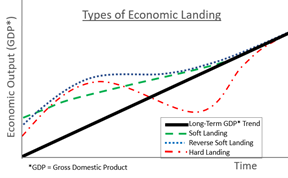

## Table of Contents

## What is a hard landing in economics?

A hard landing in economics happens when a country's economy slows down very quickly after a period of fast growth. This sudden slowdown can lead to big problems like high unemployment and businesses shutting down. It's like a car going from fast to stopped suddenly, which can cause a lot of damage.

Governments and central banks try to avoid a hard landing by carefully managing the economy. They might change interest rates or spend more money to keep the economy growing steadily. But sometimes, despite their efforts, a hard landing can still happen, causing a lot of trouble for everyone.

## How does a hard landing differ from a soft landing?

A hard landing and a soft landing are two different ways an economy can slow down after growing quickly. A hard landing is when the economy slows down very fast, like a car slamming on the brakes. This can cause big problems like lots of people losing their jobs and businesses closing down. It's tough for everyone because the change is so sudden and harsh.

On the other hand, a soft landing is when the economy slows down gently, like a car slowing down smoothly before stopping. This is what governments and central banks aim for because it's much easier on people and businesses. With a soft landing, the economy cools down without causing too much trouble, so fewer people lose their jobs and businesses can keep running. It's a much smoother and less painful process than a hard landing.

## What are the common causes of a hard landing?

A hard landing can happen because of many reasons, but one big reason is when the economy grows too fast for too long. When this happens, prices can go up a lot, which is called inflation. To stop inflation, the government or the central bank might raise interest rates a lot. This makes borrowing money more expensive, so people and businesses spend less. If the interest rates go up too fast or too high, it can slow down the economy very suddenly, causing a hard landing.

Another reason for a hard landing is when there's a big shock to the economy, like a financial crisis or a big drop in the stock market. These shocks can make people and businesses lose confidence and stop spending money. When spending drops a lot, it can lead to a sharp slowdown in the economy. Also, if the government or central bank doesn't react quickly enough to these shocks, the slowdown can turn into a hard landing.

Sometimes, problems in other countries can also cause a hard landing. If a big trading partner's economy slows down, it can affect a country's exports and lead to a sudden drop in its own economy. For example, if a country relies a lot on selling things to another country and that country's economy crashes, it can cause a hard landing at home. So, what happens in the global economy can also play a big role in causing a hard landing.

## Can you provide historical examples of hard landings?

One famous example of a hard landing happened in the United States in the early 1980s. The economy was growing fast, but prices were going up too much. To stop the high prices, the Federal Reserve, which is like the country's central bank, raised interest rates a lot. This made borrowing money very expensive, and people and businesses started spending less. The economy slowed down very quickly, causing a lot of people to lose their jobs. It was a hard landing because the slowdown was so sudden and painful.

Another example of a hard landing was in Japan during the early 1990s. Japan's economy was booming in the 1980s, but then the prices of things like houses and stocks got too high. The government tried to cool things down by raising interest rates, but it was too late. The bubble burst, and the economy crashed. This led to a long period of slow growth and lots of problems for businesses and people. It was a hard landing because the economy went from growing fast to slowing down very suddenly.

A more recent example is the hard landing in Russia in the late 1990s. After the fall of the Soviet Union, Russia's economy was struggling. In 1998, the government couldn't pay its debts and the value of the Russian currency dropped a lot. This caused a big financial crisis, and the economy slowed down very quickly. Many people lost their jobs, and businesses went bankrupt. It was a hard landing because the economic crash was so sudden and caused a lot of pain for the people of Russia.

## What are the economic indicators that signal a hard landing might be approaching?

Economic indicators that can signal a hard landing might be approaching include a sharp rise in interest rates. When the central bank raises interest rates a lot, it makes borrowing money more expensive. This can make people and businesses spend less, which can slow down the economy quickly. Another indicator is a big drop in consumer spending. If people suddenly stop buying things, it can hurt businesses and lead to a sharp slowdown in the economy.

Another important indicator is a rapid increase in unemployment. If lots of people start losing their jobs in a short time, it can mean the economy is slowing down fast. Also, a big drop in the stock market can signal a hard landing. When the stock market crashes, it can make people lose confidence and stop spending money, which can lead to a sudden economic slowdown. These indicators can help economists and policymakers see that a hard landing might be coming and try to do something to stop it.

## How do hard landings affect employment and unemployment rates?

Hard landings can cause a lot of people to lose their jobs quickly. When the economy slows down fast, businesses don't make as much money. To save money, they might have to let some workers go. This makes the unemployment rate go up a lot in a short time. People who lose their jobs might have a hard time finding new ones because other businesses are also struggling.

When unemployment goes up because of a hard landing, it can make the economy even worse. People without jobs don't have money to spend on things they need or want. This means businesses sell less, which can lead to more job cuts. It can turn into a cycle where more and more people lose their jobs, making the hard landing even harder on everyone.

## What are the impacts of a hard landing on inflation and interest rates?

A hard landing can affect inflation in a big way. When the economy slows down fast, people and businesses don't spend as much money. This can make prices go down, which is called deflation. Deflation can be bad because it can make people wait to buy things, hoping they will get even cheaper. But if the hard landing comes after a time of high inflation, it might help bring prices down to a more normal level. So, a hard landing can either fight inflation or cause deflation, depending on what's happening in the economy.

Interest rates can also change a lot because of a hard landing. Before a hard landing, the central bank might raise interest rates to stop the economy from growing too fast and to fight inflation. But when the hard landing happens, the central bank might quickly lower interest rates to try to help the economy. Lower interest rates can make borrowing money cheaper, which can encourage people and businesses to spend more. This can help the economy start growing again, but it takes time and might not fix everything right away.

## How do policymakers attempt to prevent or mitigate a hard landing?

Policymakers try hard to stop a hard landing from happening. They watch the economy closely and look for signs that things might be growing too fast or that a big slowdown is coming. If they see these signs, they might change interest rates to help keep the economy growing at a steady pace. For example, if the economy is growing too fast and prices are going up a lot, they might raise interest rates to make borrowing money more expensive. This can slow down spending and help keep prices in check. But they have to be careful not to raise rates too much, or it could cause a hard landing.

If a hard landing does start to happen, policymakers will try to make it less painful. They might quickly lower interest rates to make borrowing money cheaper, which can encourage people and businesses to spend more. They might also spend more government money on things like building roads or helping people who are out of work. This can help keep the economy going and stop the slowdown from getting worse. It's a tough job, but policymakers do their best to keep the economy stable and avoid a hard landing.

## What are the long-term effects of a hard landing on an economy?

A hard landing can have big effects on an economy that last a long time. When the economy slows down fast, lots of people lose their jobs and businesses close down. This can make people feel less confident about spending money, which can keep the economy from growing for a long time. It can also make it hard for businesses to get loans because banks might be worried about lending money during tough times. This can slow down new business ideas and make it harder for the economy to get back on its feet.

Over time, a hard landing can also change how people think about the economy. If people go through a hard landing, they might be more careful with their money even after things get better. This can make the economy grow more slowly than it could. Also, if the government had to spend a lot of money to help during the hard landing, it might have more debt. This can make it harder for the government to spend money on things like schools and hospitals in the future. So, a hard landing can leave a mark on the economy that lasts for many years.

## How can businesses prepare for and survive a hard landing?

Businesses can get ready for a hard landing by saving money and not spending too much. When they see signs that the economy might slow down fast, they can try to keep more money in the bank. This money can help them keep going even if people stop buying their products or services. Businesses can also look at their costs and see if there are ways to spend less money. This might mean finding cheaper ways to make things or cutting back on things that aren't needed. By being careful with money, businesses can be ready for tough times.

During a hard landing, businesses need to be smart about how they work. They might have to change what they do to match what people need or want. For example, if people are spending less money, a business might sell cheaper products or offer special deals. It's also important for businesses to talk to their customers and keep them happy. Even in hard times, if customers like a business, they will keep coming back. By staying flexible and listening to what people need, businesses can survive a hard landing and be ready to grow again when things get better.

## What role do international trade and global economic conditions play in a hard landing?

International trade and global economic conditions can make a hard landing more likely or worse. If a country sells a lot of things to other countries and those countries' economies slow down, it can hurt the first country's economy too. When other countries buy less, it means fewer jobs and less money for businesses at home. This can lead to a sudden slowdown in the economy, which is a hard landing. Also, if there are big problems in the world economy, like a financial crisis, it can spread to other countries and cause a hard landing.

Global economic conditions can also affect how bad a hard landing is. If the world economy is doing well, it might help a country recover from a hard landing faster. But if the world economy is also struggling, it can make things even harder. For example, if interest rates are going up in many countries, it can make borrowing money more expensive everywhere. This can slow down spending and make a hard landing worse. So, what happens in the global economy can play a big role in whether a hard landing happens and how long it lasts.

## What advanced economic models are used to predict and analyze hard landings?

Economists use advanced models to try to predict and understand hard landings. One common model is the dynamic stochastic general equilibrium (DSGE) model. This model looks at how different parts of the economy, like people's spending and businesses' investments, work together. It uses math to show how changes in one part can affect the whole economy. By putting in different numbers and seeing what happens, economists can guess if a hard landing might be coming and how bad it could be.

Another model that economists use is the vector autoregression (VAR) model. This model looks at past data to find patterns that might help predict the future. It can show how things like interest rates, unemployment, and spending have changed together in the past. By studying these patterns, economists can see if the economy is heading towards a hard landing. Both of these models help economists understand what might happen and give them a better chance to stop a hard landing or make it less painful if it does happen.

## What is Understanding Recessions?

A recession represents a notable reduction in economic activity across a broad spectrum of the economy, typically persisting for an extended period, generally more than a few months. This downturn is quantitatively assessed through various macroeconomic indicators. Gross Domestic Product (GDP) serves as a primary metric, reflecting the overall economic production and consumption within a country's borders. A sustained decline in GDP is a critical signpost of a recession.

Employment [statistics](/wiki/bayesian-statistics) provide another significant measure. During a recession, unemployment rates tend to increase as companies reduce their workforce in response to decreased demand for goods and services. Consequently, job creation slows, and job losses escalate, further dampening consumer confidence and spending.

Manufacturing activity, often considered the lifeblood of economic growth, also diminishes during a recession. Indicators such as the Purchasing Managers' Index (PMI) can show contractions in manufacturing, signifying reduced production, inventory adjustments, and declining new orders, which are symptomatic of broader economic challenges.

Several factors can precipitate recessions. High-interest rates are a commonly cited cause; they increase the cost of borrowing, thereby curbing consumer spending and business investment. The following equation illustrates the relationship between interest rates and investment:

$$
I = C - r \times S
$$

Where:
- $I$ is investment,
- $C$ is consumer spending,
- $r$ is the interest rate,
- $S$ is savings.

As the [interest rate](/wiki/interest-rate-trading-strategies) ($r$) increases, investment ($I$) typically decreases as borrowing becomes more costly.

Reduced consumer confidence is another significant contributor. When consumers anticipate economic difficulties, they often curtail spending, leading to lower demand for goods and services. This behavior can exacerbate economic contraction as businesses respond by cutting production and employment.

Falling asset prices, particularly in real estate and stocks, can also trigger recessions. Declines in these markets can lead to a negative wealth effect, where consumers feel less wealthy and hence reduce their spending. This can create a feedback loop, further depressing economic activity.

In summary, understanding the multifaceted nature of recessions involves examining key economic indicators and recognizing the underlying causes, such as elevated interest rates, diminished consumer confidence, and depreciating asset values, all of which interplay to impact the broader economy negatively.

## References & Further Reading

[1]: Bergstra, J., Bardenet, R., Bengio, Y., & Kégl, B. (2011). ["Algorithms for Hyper-Parameter Optimization."](https://dl.acm.org/doi/10.5555/2986459.2986743) Advances in Neural Information Processing Systems 24.

[2]: ["Advances in Financial Machine Learning"](https://www.amazon.com/Advances-Financial-Machine-Learning-Marcos/dp/1119482089) by Marcos Lopez de Prado

[3]: ["Evidence-Based Technical Analysis: Applying the Scientific Method and Statistical Inference to Trading Signals"](https://www.amazon.com/Evidence-Based-Technical-Analysis-Scientific-Statistical/dp/0470008741) by David Aronson

[4]: ["Machine Learning for Algorithmic Trading"](https://github.com/stefan-jansen/machine-learning-for-trading) by Stefan Jansen

[5]: ["Quantitative Trading: How to Build Your Own Algorithmic Trading Business"](https://www.amazon.com/Quantitative-Trading-Build-Algorithmic-Business/dp/1119800064) by Ernest P. Chan