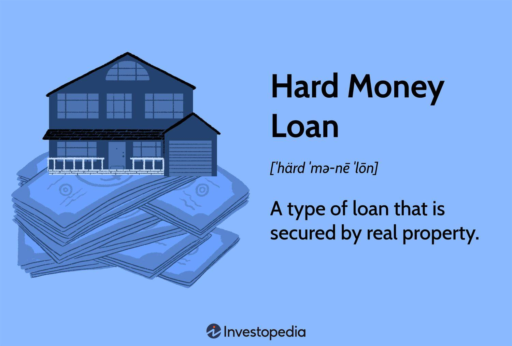

## Table of Contents

## What is a hard loan?

A hard loan is a type of loan that is given based on the value of an asset, like a house or a piece of land, rather than the borrower's creditworthiness. This means that if the borrower cannot pay back the loan, the lender can take the asset as payment. Hard loans are often used by people who need money quickly or who cannot get a loan from a bank because of a bad credit history.

These loans usually have higher interest rates than regular loans because they are riskier for the lender. The lender might not get their money back if the asset's value goes down. Hard loans are common in real estate, where investors use them to buy and fix up properties quickly. Even though they can be helpful, hard loans can be risky for borrowers because of the high costs and the chance of losing their asset.

## How does a hard loan differ from a soft loan?

A hard loan and a soft loan are different in a few big ways. A hard loan is based on the value of something you own, like a house or land. If you can't pay back the loan, the lender can take that thing. Hard loans often have high interest rates because they are riskier for the lender. People who need money fast or have bad credit might use hard loans. They are common in real estate for buying and fixing up properties.

On the other hand, a soft loan is more about your ability to pay it back, not what you own. Soft loans usually have lower interest rates and easier terms. They are often given by governments or organizations that want to help people or businesses grow. Soft loans are less risky for the borrower because they don't have to worry about losing their property if they can't pay back the loan. They are used to support things like small businesses or development projects.

## What are the typical interest rates for hard loans?

Hard loans usually have higher interest rates than regular loans. This is because they are riskier for the lender. The interest rates for hard loans can range from about 8% to 15% or even higher. The exact rate depends on things like how much money you're borrowing, how long you need the loan for, and the value of the asset you're using as security.

These high rates make hard loans more expensive for the borrower. But, people might still choose hard loans if they need money quickly or if they can't get a loan from a bank because of a bad credit history. It's important for borrowers to understand these rates and make sure they can afford to pay back the loan, or they could lose their asset.

## Who are the primary lenders of hard loans?

The main lenders of hard loans are private individuals, private companies, and some specialized financial institutions. These lenders focus on the value of the property or asset that the borrower is using as security, rather than the borrower's credit history. They are willing to take on more risk because they can take the asset if the borrower can't pay back the loan.

Hard money lenders often work in the real estate market. They provide quick loans to investors who want to buy, fix up, and sell properties. These lenders can offer money faster than banks, which is important for people who need to act quickly in the real estate market. Because of the higher risk, hard money lenders charge higher interest rates than traditional banks.

## What types of collateral are commonly used for hard loans?

The most common type of collateral for hard loans is real estate. This can be a house, a piece of land, or a commercial building. Lenders like real estate because it usually keeps its value or goes up in value over time. If the borrower can't pay back the loan, the lender can take the property and sell it to get their money back.

Other types of collateral can also be used, but they are less common. These might include vehicles, equipment, or other valuable assets. However, real estate is preferred because it is easier to value and sell if needed. The value of the collateral is very important because it determines how much money the lender is willing to give and the terms of the loan.

## What are the eligibility criteria for obtaining a hard loan?

To get a hard loan, you need to have something valuable to use as collateral, usually real estate. The lender will look at the value of your property to decide how much money they can give you. They want to make sure that if you can't pay back the loan, they can sell the property and get their money back. Your credit score and financial history are not as important for hard loans as they are for regular loans. This means that even if you have bad credit, you might still be able to get a hard loan.

The main thing the lender cares about is the value of your collateral. They will do a careful check to see how much your property is worth. They might also look at how quickly they could sell the property if they need to. Because hard loans are riskier for the lender, they will charge higher interest rates. You need to show that you have a clear plan for how you will use the money and how you will pay it back. This is especially important if you are using the loan for a real estate project, like buying and fixing up a house to sell later.

## How is the loan-to-value ratio calculated in hard loans?

The loan-to-value (LTV) ratio in hard loans is calculated by dividing the amount of the loan by the value of the collateral. For example, if you want to borrow $80,000 and your property is worth $100,000, the LTV ratio would be 80%. This ratio helps the lender understand how much risk they are taking. A lower LTV ratio means less risk for the lender because the loan amount is smaller compared to the value of the property.

Lenders usually set a maximum LTV ratio for hard loans, often between 50% to 70%. This means they will only lend up to that percentage of the property's value. If your property is worth $100,000 and the lender's maximum LTV ratio is 70%, they will lend you up to $70,000. The LTV ratio is important because it affects how much money you can borrow and the terms of the loan.

## What are the repayment terms typically associated with hard loans?

Hard loans usually have short repayment terms. They can last from a few months to a few years, often around 12 to 24 months. This is because hard loans are meant for quick projects, like fixing up a house to sell it. The short terms mean you need to pay back the loan fast. If you can't, the lender can take your property.

The interest rates for hard loans are high, often between 8% to 15% or more. You might have to make interest-only payments during the loan term, which means you only pay the interest each month and not the main amount you borrowed. At the end of the term, you need to pay back the whole loan amount. This can be hard if your project doesn't go as planned. It's important to understand these terms before you take a hard loan.

## Can hard loans be refinanced, and if so, how?

Yes, hard loans can be refinanced. Refinancing means you get a new loan to pay off your old hard loan. You might want to do this if you can find a loan with a lower [interest rate](/wiki/interest-rate-trading-strategies) or better terms. To refinance, you need to find a new lender who is willing to give you a loan based on the value of your property. This new lender will look at how much your property is worth now and decide if they want to lend you money.

The process of refinancing a hard loan is similar to getting a new loan. You will need to show the new lender that your property is still valuable and that you have a good plan for paying back the new loan. If the new lender agrees, they will give you the money to pay off your old hard loan. Then, you will start making payments on the new loan. Refinancing can help you save money on interest or give you more time to pay back the loan, but it depends on finding a lender who is willing to work with you.

## What are the risks associated with taking out a hard loan?

Taking out a hard loan can be risky because the interest rates are high. This means you have to pay back more money than you borrowed. If you can't pay back the loan on time, you could lose the property you used as collateral. Hard loans usually have to be paid back quickly, often within a few months to a couple of years. This short time can make it hard to finish your project and pay back the loan before it's due.

Another risk is that hard loans are based on the value of your property, not your ability to pay back the loan. If the value of your property goes down, you might not be able to get another loan to pay off the hard loan. This can leave you in a tough spot. It's important to think carefully about these risks before you decide to take out a hard loan.

## How do hard loans impact credit scores?

Hard loans can affect your credit score, but not as much as regular loans. When you apply for a hard loan, the lender might check your credit, which can cause a small, temporary drop in your credit score. But, hard loans are mostly based on the value of your property, not your credit history. So, if you pay back the hard loan on time, it might not help your credit score much because these loans are not usually reported to credit bureaus like regular loans are.

The bigger risk to your credit score comes if you can't pay back the hard loan. If you default on the loan, the lender can take your property. This can hurt your credit score a lot because it shows you couldn't pay back what you borrowed. It's important to be sure you can pay back a hard loan before you take one out, so you don't damage your credit score.

## What are the legal and regulatory considerations for hard loans?

Hard loans have to follow the laws and rules of the place where they are given. These rules can be different in each state or country. Lenders need to make sure they are following the rules about how much interest they can charge, how they can take the property if the loan isn't paid back, and what they have to tell the borrower. Borrowers should know these rules too, so they understand their rights and what can happen if they can't pay back the loan.

There are also rules about how lenders can advertise hard loans and what they have to tell borrowers before giving them a loan. For example, in the United States, the Truth in Lending Act makes lenders tell borrowers the true cost of the loan, including the interest rate and any fees. This helps borrowers make smart choices. If a lender doesn't follow these rules, they could get in trouble, and the borrower might be able to take legal action.

## References & Further Reading

[1]: ["Hard Loan Definition"](https://www.financestrategists.com/mortgage-broker/hard-money-lending/) by Investopedia

[2]: ["The Impact of Algorithmic Trading on Market Liquidity"](https://www.sciencedirect.com/science/article/pii/S0927538X16300956) by Albert J. Menkveld, National Bureau of Economic Research

[3]: ["Algorithmic Trading: Winning Strategies and Their Rationale"](https://books.google.com/books/about/Algorithmic_Trading.html?id=WAlFDwAAQBAJ) by Ernie Chan

[4]: ["Loan Syndication and Algorithmic Trading"](https://paperswithbacktest.com/wiki/loan-syndication-mechanisms-types-examples) by Y. K. Lee and C. Zhang

[5]: ["Financial Market Analytics Using Machine Learning"](https://www.researchgate.net/publication/378287610_Machine_learning_in_financial_markets_A_critical_review_of_algorithmic_trading_and_risk_management) by Towards Data Science