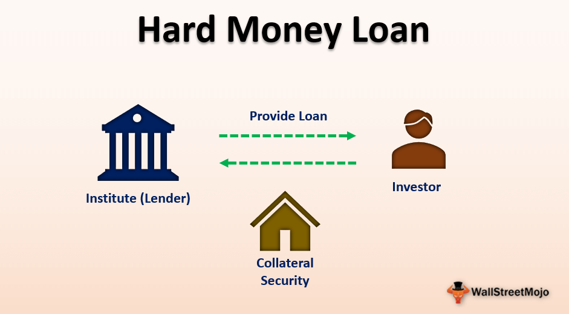

The financial landscape is an intricate network of various loan types, each tailored to meet specific needs and manage distinct risk profiles. This complexity reflects the diverse requirements of individuals, corporations, and governments as they navigate economic opportunities and challenges. Loans play a pivotal role in providing the necessary capital for growth, development, and stability, making it imperative to understand their different forms and implications. This article examines several types of loans, with a particular focus on hard loans, providing insights into their characteristics and financial examples. Furthermore, it explores the relevance of algorithmic trading, a modern innovation that is reshaping financial strategies by enhancing the efficiency and effectiveness of financial processes. By grasping these elements, individuals and organizations can make well-informed decisions, optimizing their financial strategies to suit their goals and risk tolerances.

## Table of Contents

## What is a Hard Loan?

A hard loan refers to a type of foreign loan that must be repaid in a hard currency, such as the U.S. dollar, Euro, or Japanese yen. These currencies are considered "hard" due to their stability and widespread acceptance in international markets. Hard loans are frequently utilized by borrowers in developing countries, as they provide access to funds denominated in stable currencies, which can be advantageous for financing economic development projects. However, this benefit comes with the inherent risk of currency devaluation.

The risk associated with hard loans is primarily due to fluctuations in foreign exchange rates. For instance, if a borrower's domestic currency depreciates against the hard currency in which the loan is denominated, the cost of repaying the loan in local terms can increase significantly. This scenario can put substantial financial pressure on the borrower and potentially lead to difficulties in meeting repayment obligations.

In comparison to soft loans, which typically feature concessional terms such as lower interest rates and longer repayment periods, hard loans tend to emphasize fiscal responsibility and the borrower's financial stability. This focus is because the lending institutions, often based in economically stable countries, need assurance that borrowers possess the capacity to uphold their repayment commitments without falling into financial distress. 

Hard loans serve as a crucial financial mechanism, providing borrowers in less economically stable regions the necessary capital to undertake vital projects. Nonetheless, the associated currency risk demands a comprehensive understanding and meticulous risk management strategy from borrowers to mitigate potential financial challenges.

## Types of Loans in Financial Markets

Loans in financial markets encompass a broad range of options designed to meet diverse needs and financial circumstances. Personal loans, mortgages, and hard money loans all exhibit distinct characteristics that cater to specific borrower profiles.

Personal loans are typically unsecured loans, meaning they do not require collateral. They are used for a wide range of purposes, from debt consolidation to covering unexpected expenses. The interest rates for personal loans are generally fixed, and their repayment terms can vary depending on the lender and the borrower’s creditworthiness.

Mortgages are secured loans specifically used to finance the purchase of real estate. The property being purchased serves as collateral for the loan, reducing the risk for the lender. Mortgages usually have longer repayment terms, ranging from 15 to 30 years, and can offer fixed or variable interest rates. The interest rates on mortgages are typically lower than those for unsecured personal loans, reflecting the reduced risk to lenders due to the secured nature of the loan.

Hard money loans are another type of secured loan, primarily used for real estate transactions. These loans are often issued by private lenders rather than traditional banks and are known for their high-interest rates and short repayment terms. Hard money loans are based on the value of the property used as collateral rather than the borrower’s creditworthiness, making them an option for borrowers with less-than-perfect credit or for those needing quick financing.

Loan syndication is an increasingly popular mechanism within financial markets, particularly for distributing large-scale financial risks. In loan syndication, multiple lenders come together to provide portions of a loan to a single borrower, effectively spreading the risk associated with the loan. This practice is widely used for corporate or government loans that require significant capital. By involving several lenders, syndication allows for larger and riskier loans than a single lender might be willing to provide.

Algorithmic trading, which leverages computational algorithms to execute trading strategies swiftly and accurately, is playing an innovative role in the evaluation and management of syndicated loans. It can be used to assess risk, optimize pricing, and improve the overall efficiency of loan syndication processes. Through sophisticated data analysis and modeling, [algorithmic trading](/wiki/algorithmic-trading) tools can help determine the probability of default, assess credit risk, and even predict market movements, thereby enabling more informed decision-making and better risk management in syndicated loan markets. 

The integration of algorithmic trading with loan syndication processes allows stakeholders to make data-driven decisions, enhancing both market precision and [liquidity](/wiki/liquidity-risk-premium). It represents a growing intersection of technology and finance, offering significant advantages in managing complex financial instruments like syndicated loans.

## Algorithmic Trading in Financial Processes

Algorithmic trading employs computer algorithms to autonomously execute trading strategies with remarkable speed and precision. This approach has revolutionized trading by enabling the efficient processing of vast amounts of market data to identify and exploit trading opportunities that may arise within seconds. By capitalizing on this speed and precision, algorithmic trading contributes significantly to market liquidity, ensuring there is enough depth in the market to facilitate transactions without causing substantial price changes.

The reduction of transaction costs is another critical contribution of algorithmic trading. High-frequency trading systems can execute a large [volume](/wiki/volume-trading-strategy) of trades with minimal delay, reducing the bid-ask spread and, consequently, transaction costs. This efficiency is particularly beneficial in the context of complex financial transactions, including those involving syndicated loans.

In the loan syndication process, a group of lenders collectively funds a borrower, thereby sharing the risk. Algorithmic trading can enhance this process by providing sophisticated risk management tools and precise pricing models. Algorithms can swiftly analyze a multitude of variables, such as interest rates, currency fluctuations, and credit ratings, enabling lenders to make informed decisions. This data-driven approach ensures accurate loan pricing and risk assessment, aligning with the syndication's objective of distributing large-scale financial risk.

Moreover, integrating algorithmic trading with loan syndication leads to optimized financial decision-making. Algorithms can continuously monitor the syndication portfolio, assessing market conditions and adjusting strategies in real-time. The automation from algorithmic systems means adjustments are not only timely but also based on comprehensive market analysis, reducing human error.

Thus, the synergetic effect of combining algorithmic trading with loan syndication fosters a robust framework for managing large-scale financial operations, benefiting all participants through improved outcomes and enhanced financial stability.

## Financial Example: Hard Loans

A practical example of a hard loan situation can be seen when a Brazilian company opts to secure a loan in U.S. dollars from an Argentine bank. This strategic financial decision is often pursued for the perceived economic stability associated with the U.S. dollar, which is considered a hard currency due to its widespread international acceptance and relative resistance to inflation and devaluation. However, such a transaction is not devoid of complexities and risks.

The primary risk associated with hard loans, specifically in this context, is the potential for foreign exchange rate fluctuations. Suppose the Brazilian real depreciates against the U.S. dollar after the loan agreement is established. In that case, the cost for the Brazilian company to repay the loan and its interest in U.S. dollars will increase, thereby imposing a higher financial burden than initially anticipated. Conversely, if the Brazilian real appreciates against the U.S. dollar, the company could benefit from reduced repayment costs.

To effectively manage these foreign exchange risks, borrowers often adopt hedging strategies, such as using financial derivatives like options, futures, or forward contracts. These instruments can lock in exchange rates for future transactions, providing a hedge against potential adverse currency movements.

Consider a simplified scenario where a Brazilian company borrows $1,000,000 from an Argentine bank, with the exchange rate at the time of the loan at 5 BRL/USD (Brazilian real per U.S. dollar). The company expects future repayments over the loan's duration. If the real drops to 6 BRL/USD, the company will need 6,000,000 BRL instead of the initial 5,000,000 BRL to meet the same dollar-denominated loan repayment, clearly illustrating the impact of currency fluctuations.

Understanding these currency dynamics is critical for companies engaged in hard loans. It involves not only tracking economic indicators and central bank policies that might influence currency values but also establishing robust financial strategies that mitigate potential currency-related losses. Thus, a comprehensive grasp of both current market conditions and sophisticated financial instruments is indispensable for effective risk management in hard loans.

## Synergy between Loan Syndication and Algorithmic Trading

The integration of loan syndication and algorithmic trading represents a significant advancement in financial market operations, leveraging technology to enhance efficiency and risk mitigation. Loan syndication involves pooling resources from multiple lenders to finance large-scale projects, thereby distributing financial risk. Typically, these loans can be complex, involving multiple parties and terms that require sophisticated management approaches to ensure effective risk allocation and compliance.

Algorithmic trading introduces the capability of executing transactions at high speeds through the use of advanced mathematical models and computer algorithms. This technology is instrumental in optimizing the evaluation and distribution processes within loan syndication, providing precise and rapid assessments of risk and pricing. By processing vast amounts of financial data, algorithmic trading can identify patterns and correlations that may not be apparent through traditional assessment methods, hence improving the predictive accuracy of loan performance and default probabilities.

Platforms such as Octaura exemplify the benefits of merging loan syndication with algorithmic trading. These platforms create a unified digital ecosystem where financial instruments are traded, monitored, and managed. The enhanced market efficiency stems from the ability of these platforms to present detailed analysis and real-time data to participants, thereby fostering informed decision-making.

One of the critical advantages of using standardized platforms is the improvement in transparency. With clearly defined protocols and data structures, these platforms allow all participants to have a consistent view of transaction details and risk exposure. This transparency builds trust among financial institutions, as it lessens the likelihood of asymmetric information – a common issue in syndication markets.

Furthermore, these platforms support collaborative efforts among involved parties, which enhances mutual understanding and cooperation. By standardizing data formats and processes, institutions can streamline their operations, reducing administrative overheads and increasing the speed and accuracy of loan syndication processes. 

Ultimately, the synergy between loan syndication and algorithmic trading offers a comprehensive approach to managing syndicated loans. It provides a robust structure for risk management, thereby enhancing the security and appeal of syndicated loans within the financial markets. As technology continues to evolve, the capacity for algorithmic trading to integrate even deeper into financial processes will likely further optimize and revolutionize loan syndication frameworks.

## Conclusion

In today's complex financial ecosystem, understanding and managing diverse loan types is critical for mitigating associated risks. Hard loans, in particular, necessitate a strategic approach because they require repayment in stable, major currencies, posing risks like foreign exchange fluctuations. Proper risk management strategies are fundamental in ensuring that borrowers can navigate potential economic shifts effectively.

Algorithmic trading has emerged as a pivotal advancement that intertwines with various financial processes to optimize outcomes. By utilizing computer algorithms to execute trades with high speed and precision, algorithmic trading enhances market liquidity and minimizes transaction costs. This, in turn, impacts loan pricing and risk assessment, providing a more robust framework for financial decision-making.

For financial stakeholders, adapting to such innovations is not just beneficial but necessary. The ability to leverage technology and data analytics insights can uncover new opportunities and streamline operations. As financial instruments and markets continue to evolve, staying abreast of technological advancements will enable stakeholders to maintain a competitive edge and capitalize on the dynamic financial landscape.

## References & Further Reading

[1]: ["Hard Loan Definition"](https://www.financestrategists.com/mortgage-broker/hard-money-lending/) by Investopedia

[2]: ["The Impact of Algorithmic Trading on Market Liquidity"](https://www.sciencedirect.com/science/article/pii/S0927538X16300956) by Albert J. Menkveld, National Bureau of Economic Research

[3]: ["Algorithmic Trading: Winning Strategies and Their Rationale"](https://books.google.com/books/about/Algorithmic_Trading.html?id=WAlFDwAAQBAJ) by Ernie Chan

[4]: ["Loan Syndication and Algorithmic Trading"](https://paperswithbacktest.com/wiki/loan-syndication-mechanisms-types-examples) by Y. K. Lee and C. Zhang

[5]: ["Financial Market Analytics Using Machine Learning"](https://www.researchgate.net/publication/378287610_Machine_learning_in_financial_markets_A_critical_review_of_algorithmic_trading_and_risk_management) by Towards Data Science