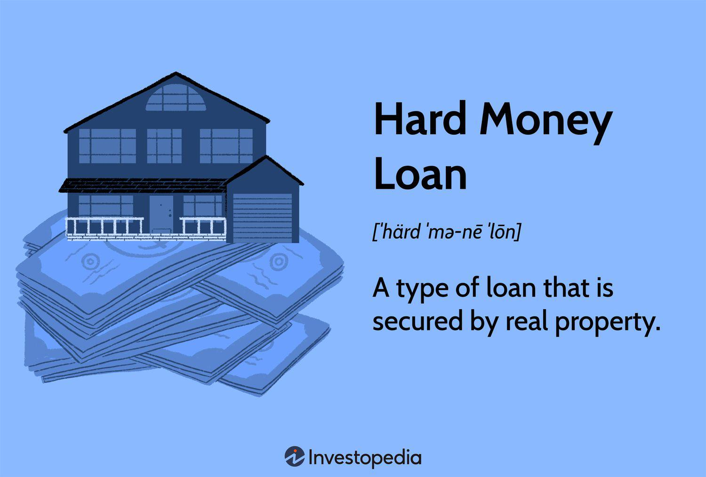

## Table of Contents

## What is a hard money loan?

A hard money loan is a type of loan that is secured by real property. Unlike traditional bank loans, hard money loans are typically issued by private investors or companies and are based on the value of the property being used as collateral rather than the borrower's creditworthiness.

These loans are often used by real estate investors who need quick financing to buy, renovate, and sell a property. Hard money loans usually have higher interest rates and shorter repayment terms than conventional loans, but they can be a good option for borrowers who can't qualify for traditional financing or need money fast.

## How do hard money loans differ from traditional bank loans?

Hard money loans and traditional bank loans are different in a few big ways. Hard money loans come from private investors or companies, not banks. They focus on the value of the property you're using as collateral, not how good your credit is. This means you can get a hard money loan even if your credit isn't great. On the other hand, traditional bank loans are from banks and they look at your credit score a lot. If your credit is bad, it's harder to get a bank loan.

Another difference is how fast you can get the money and what it costs. Hard money loans can be quicker to get because the lenders care more about the property than your financial history. But, these loans usually have higher interest rates and you have to pay them back in a shorter time. Traditional bank loans take longer to get approved, but they often have lower interest rates and longer repayment periods. So, hard money loans are good if you need money fast or can't get a bank loan, but they cost more.

## What are the typical interest rates for hard money loans?

Hard money loans usually have higher interest rates than traditional bank loans. The rates can range from about 8% to 15% or even more. This is because hard money lenders take more risk. They lend money based on the value of the property, not the borrower's credit. So, they charge more to cover that risk.

The exact rate you get depends on a few things. It can depend on where the property is, how much money you're borrowing, and how long you need the loan. Lenders might also look at the property's condition and how easy it is to sell. Because of all these factors, the [interest rate](/wiki/interest-rate-trading-strategies) can change a lot from one loan to another.

## What types of properties can be financed with hard money loans?

Hard money loans can be used to finance many different types of properties. Most often, they are used for residential properties, like houses or condos. These can be single-family homes, multi-family units, or even fixer-uppers that need some work before they can be sold or rented out. Investors often use hard money loans to buy these properties quickly and then flip them for a profit.

Besides residential properties, hard money loans can also be used for commercial properties. This includes office buildings, retail spaces, warehouses, and even land that hasn't been developed yet. These types of loans are great for investors who want to buy, fix up, or develop these properties and then sell them or lease them out. The key thing is that the property has to have enough value to secure the loan, no matter what type it is.

## What are the eligibility criteria for obtaining a hard money loan?

Getting a hard money loan is easier than getting a traditional bank loan because hard money lenders care more about the property than your credit score. The main thing you need is a property that has enough value to cover the loan. This means the lender wants to know they can sell the property for at least as much as they lent you if you can't pay back the loan.

You don't need a great credit score to get a hard money loan, but having some money to put down as a down payment helps. Lenders usually want you to have at least 20% to 30% of the property's value to show you're serious about the investment. Also, you'll need to show that you have a plan for the property, like fixing it up and selling it or renting it out, so the lender knows you can pay back the loan.

Hard money loans are often used by people who need money fast or can't get a bank loan. They're great for real estate investors who want to buy, fix, and sell properties quickly. As long as you have a good property and a solid plan, you can usually get a hard money loan even if your financial situation isn't perfect.

## How quickly can one secure a hard money loan?

You can get a hard money loan really fast, usually in just a few days to a couple of weeks. Hard money lenders don't spend a lot of time checking your credit like banks do. They care more about the property you're using as collateral. So, if the property looks good and has enough value, they can approve the loan quickly.

This speed is great for real estate investors who need to buy a property fast. Maybe they want to fix it up and sell it for a profit. Or maybe they need to grab a good deal before someone else does. Hard money loans are perfect for these situations because they don't make you wait a long time to get the money you need.

## What are the repayment terms of hard money loans?

Hard money loans usually have shorter repayment terms than traditional bank loans. They often last from six months to a few years, depending on the lender and the deal. This means you need to pay back the loan faster than you would with a bank loan. The shorter term is because hard money lenders want to get their money back quickly so they can lend it out again.

The repayment plan can be set up in different ways. Sometimes, you might have to pay interest every month and then pay back the whole loan amount at the end of the term. Other times, you might make payments that include both interest and part of the loan amount throughout the term. It depends on what you agree with the lender. The key thing is to know the terms and be ready to pay back the loan on time, or you could lose the property you used as collateral.

## Can hard money loans be used for flipping houses?

Yes, hard money loans are a popular choice for people who want to flip houses. Flipping a house means buying a property, fixing it up, and then selling it for a profit. Hard money loans are perfect for this because they can be approved quickly. When you find a good deal on a house that needs work, you don't want to wait a long time to get the money to buy it. Hard money lenders can give you the loan in just a few days, which is much faster than a bank loan.

The loan is based on the value of the house you're buying, not your credit score. This means you can get the loan even if your credit isn't great. But, hard money loans have higher interest rates and shorter repayment times. You usually have to pay back the loan in six months to a few years. So, when you flip a house with a hard money loan, you need to fix it up and sell it fast to make a profit and pay back the loan on time.

## What are the risks associated with hard money loans?

Hard money loans can be risky because they have high interest rates and short repayment times. If you can't pay back the loan quickly, you might lose the property you used as collateral. This is because hard money lenders care more about the property than your ability to pay. If you're flipping a house, you need to fix it up and sell it fast to make enough money to cover the loan. If something goes wrong, like the house takes longer to fix or doesn't sell for as much as you hoped, you could be in trouble.

Another risk is that hard money loans might not give you enough time to finish your project. If you're renovating a property, unexpected problems can pop up and take longer to fix than you planned. With a short repayment term, you might run out of time before you can sell the property and pay back the loan. This can put a lot of pressure on you and make the whole process more stressful. It's important to think about these risks and have a good plan before you decide to use a hard money loan.

## How can hard money loans be used to leverage real estate investments?

Hard money loans can help real estate investors make more money by letting them buy properties quickly. When you find a good deal on a house that needs fixing up, you don't want to wait a long time to get the money to buy it. Hard money lenders can give you the loan in just a few days. This means you can grab the property before someone else does. Once you have the house, you can fix it up and sell it for a profit. This quick access to money can help you do more deals and make more money in real estate.

But using hard money loans also means taking on some risk. These loans have higher interest rates and you have to pay them back faster than regular bank loans. If you can't sell the house quickly enough or if the repairs take longer than you thought, you might not be able to pay back the loan on time. If that happens, you could lose the property. So, it's important to have a good plan and be ready for things that might go wrong. If you can manage the risks, hard money loans can be a powerful tool to grow your real estate investments.

## What are the best practices for managing a hard money loan?

When you get a hard money loan, it's important to have a clear plan for how you'll use the money and pay it back. Since these loans have high interest rates and short repayment times, you need to make sure you can finish your project, like fixing up a house, and sell it quickly. Always have some extra money saved up in case something unexpected happens, like repairs taking longer or costing more than you thought. This can help you avoid losing the property if you can't pay back the loan on time.

It's also a good idea to keep talking to your lender. Let them know how your project is going and if you run into any problems. They might be able to help you find a solution, like giving you a little more time to pay back the loan. And remember, hard money loans are a tool to help you make money in real estate, but they come with risks. So, always think carefully about the risks and make sure you have a solid plan before you take out a hard money loan.

## How do regulations affect hard money lending in real estate?

Regulations can affect hard money lending in real estate in different ways depending on where you are. Some places have strict rules about who can lend money and how much interest they can charge. These rules are made to protect people from getting loans that are too hard to pay back. Hard money lenders need to follow these rules, which can make it harder for them to do business. They might need to do more paperwork or get special licenses to lend money.

In some areas, the rules might be less strict, which can make it easier for hard money lenders to work. But even then, they need to be careful about how they lend money. They have to make sure they're not breaking any laws about lending or they could get in trouble. No matter where they are, hard money lenders need to know the rules and follow them to keep doing business and help real estate investors get the money they need.

## What are the benefits of real estate financing?

Real estate financing represents a critical tool for investors aiming to maximize returns and strategically scale their portfolios. By leveraging various types of loans, investors can gain significant advantages that directly enhance their financial standings and investment strategies.

**Leveraging Loans for Property Acquisition**

One of the primary benefits of real estate financing is the ability to leverage loans to acquire property. This process allows investors to purchase properties that might otherwise be inaccessible due to budget constraints. By using borrowed capital, investors can enter lucrative markets and benefit from potential appreciation in property value over time. The principle of leverage enables investors to enhance the potential return on investment (ROI) by using fewer of their own funds while acquiring additional assets.

**Amplifying Investment Returns Through Financing**

Financing can amplify investment returns, a concept often expressed through the formula:

$$
\text{ROE} = \frac{\text{Net Income}}{\text{Equity}}
$$

Here, leveraging financing means a smaller equity portion results in higher returns whether the property generates income through rent or appreciates. An investor using mortgage financing to secure a property allows a relatively small initial investment to potentially yield substantial profits, assuming the income exceeds interest and other costs. This amplified return is a considerable advantage of applying strategic financing methods to real estate investments.

**Diversification Opportunities with Real Estate Financing**

Financing also presents valuable diversification opportunities. Utilizing different forms of credit, such as hard money loans, traditional mortgages, or home equity loans, enables investors to spread their risk across multiple properties or even multiple sectors within real estate, such as residential, commercial, or industrial. Diversification minimizes the risk associated with a single asset or market downturn affecting the entire investment portfolio, providing stability and long-term growth potential.

**Understanding the Role of Financing in Scaling Investments**

For investors looking to scale their real estate portfolios, understanding the role of financing is essential. By reinvesting cash flow generated from existing investments or refinancing properties with increased equity, investors can continuously roll capital into new opportunities. This scaling strategy facilitates the expansion of asset holdings without the immediate need for significant personal capital infusion.

In summary, real estate financing is a powerful mechanism that, when used judiciously, allows investors to acquire properties, amplify returns, diversify holdings, and scale investments efficiently. The strategic use of financing can significantly enhance the potential for wealth accumulation and long-term investment success.

## References & Further Reading

[1]: [Hard Money Lending for Real Estate Investors: What You Need to Know](https://benworthcapital.com/understanding-hard-money-lending-real-estate-investors/) - Investopedia

[2]: Jansen, S. (2020). ["Machine Learning for Algorithmic Trading."](https://github.com/stefan-jansen/machine-learning-for-trading) Packt Publishing.

[3]: De Prado, M. L. (2018). ["Advances in Financial Machine Learning."](https://www.amazon.com/Advances-Financial-Machine-Learning-Marcos/dp/1119482089) Wiley.

[4]: Chan, E. (2009). ["Quantitative Trading: How to Build Your Own Algorithmic Trading Business."](https://github.com/ftvision/quant_trading_echan_book) Wiley.

[5]: Aronson, D. R. (2006). ["Evidence-Based Technical Analysis: Applying the Scientific Method and Statistical Inference to Trading Signals."](https://www.amazon.com/Evidence-Based-Technical-Analysis-Scientific-Statistical/dp/0470008741) Wiley.

[6]: ["Real Estate Market Analysis: Methods and Case Studies"](https://www.amazon.com/Real-Estate-Market-Analysis-Methods/dp/0874203651) by Deborah L. Brett and Adrienne Schmitz

[7]: Bergstra, J., Bardenet, R., Bengio, Y., & Kégl, B. (2011). ["Algorithms for Hyper-Parameter Optimization."](https://dl.acm.org/doi/10.5555/2986459.2986743) Advances in Neural Information Processing Systems 24.