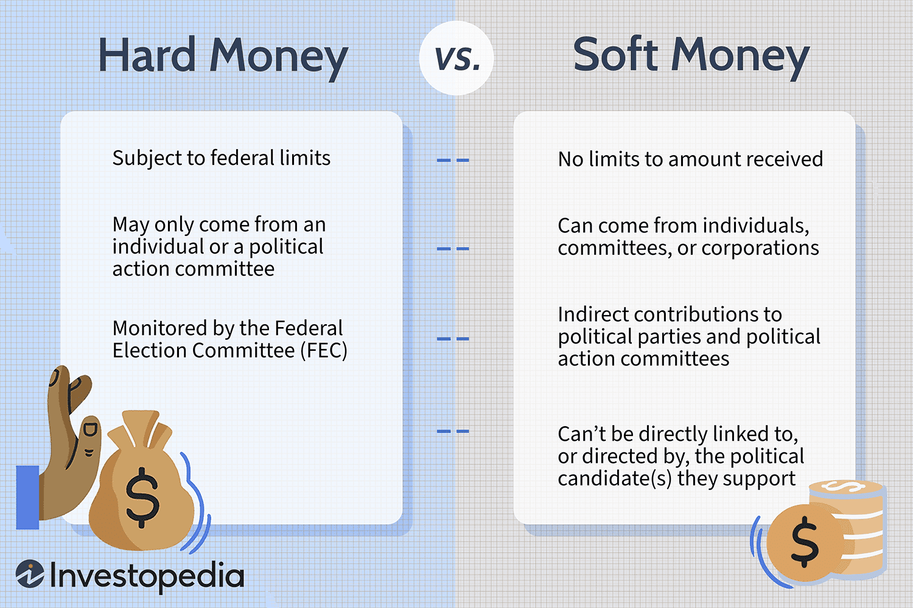

## Table of Contents

## What is hard money?

Hard money is a term used to describe currency that is backed by a tangible asset, like gold or silver. This is different from regular money, which governments say is worth something even though it's not backed by anything physical. Hard money is seen as more stable because its value comes from something real, not just what people think it's worth.

People who like hard money believe it helps keep the economy steady. They think that if money is tied to something like gold, it can't be printed endlessly by governments, which can lead to inflation. On the other hand, some people argue that hard money can be too strict and might not allow the economy to grow as easily as it could with regular money.

## How does hard money differ from soft money?

Hard money and soft money are two different ideas about what money should be. Hard money is money that is backed by something real, like gold or silver. This means that if you have a dollar, you can trade it for a certain amount of gold. People who like hard money think it's good because it can't be made out of thin air by governments, which helps keep its value stable.

Soft money, on the other hand, is money that isn't backed by anything physical. It's what we use every day, like dollars and euros. Governments can print as much of this money as they want, which some people worry can lead to inflation, where the money becomes worth less over time. People who support soft money think it's better because it gives governments more flexibility to help the economy grow.

In simple terms, hard money is seen as more stable but less flexible, while soft money is seen as more flexible but less stable. Both have their pros and cons, and people often debate which is better for the economy.

## What are the typical sources of hard money loans?

Hard money loans come from private investors or companies that specialize in lending money for real estate. These lenders are often more interested in the value of the property being used as collateral than in the borrower's credit history. This makes hard money loans a good option for people who might not qualify for traditional bank loans.

These loans are usually short-term, lasting from a few months to a few years. They are often used by real estate investors who want to buy, fix up, and sell a property quickly. Because hard money loans are riskier for the lender, they come with higher interest rates and fees than traditional loans.

## What are the common uses of hard money loans?

Hard money loans are often used by people who want to buy and fix up houses to sell them for a profit. These loans are popular with real estate investors because they can get the money quickly, without having to go through a long approval process like with a bank. Since hard money lenders care more about the property's value than the borrower's credit, it's easier for investors to get these loans even if they have bad credit.

Another common use for hard money loans is to help people who need money fast to buy a property at an auction. These loans can be a good option when time is short, and a traditional loan wouldn't be available in time. However, because hard money loans have higher interest rates and fees, they are usually seen as a short-term solution, not a long-term way to borrow money.

## What are the advantages of using hard money for real estate investments?

Using hard money for real estate investments can be really helpful because it's fast and easy to get. When you want to buy a house to fix up and sell, you need money quickly. Hard money lenders can give you the money in just a few days, not weeks like a bank might take. They also don't care as much about your credit score. Instead, they look at the value of the house you want to buy. This makes it easier for people who might not get a regular loan to still buy and invest in real estate.

Another big advantage is flexibility. Hard money loans can be used for all sorts of real estate projects, like buying a house at an auction or fixing up a property to sell it for more money. These loans are usually short-term, which fits well with the quick turnaround times of real estate flipping. Even though hard money loans have higher interest rates, the short-term nature and fast funding can make them a smart choice for investors looking to make quick profits in real estate.

## What are the risks associated with hard money loans?

Hard money loans can be risky because they have high interest rates and fees. Since these loans are seen as riskier by lenders, they charge more to make up for it. This means that if you use a hard money loan, you'll end up paying a lot more in the end than you would with a regular bank loan. If you can't sell the property quickly or if the costs of fixing it up are higher than you expected, you might find yourself in a tough spot, struggling to pay back the loan.

Another risk is that hard money loans are usually short-term. This means you have to pay them back quickly, often within a few months to a couple of years. If your real estate project takes longer than planned, you might not be able to pay back the loan on time. If that happens, you could lose the property you used as collateral. So, while hard money loans can help you get started on a project fast, they come with the risk of losing your investment if things don't go as planned.

## How do interest rates on hard money loans compare to traditional loans?

Interest rates on hard money loans are usually much higher than those on traditional loans. This is because hard money lenders see these loans as riskier. They don't look at your credit score as much as they look at the value of the property you want to buy. Because of this, they charge more to make up for the risk they're taking. So, while a traditional loan might have an [interest rate](/wiki/interest-rate-trading-strategies) of around 3% to 5%, a hard money loan could have an interest rate of 10% or even higher.

The higher interest rates on hard money loans mean you'll pay more over time. If you're using a hard money loan to buy and fix up a house, you need to make sure you can sell it quickly and for enough money to cover the loan and the extra interest. If you can't, the high interest rates can make it hard to make a profit or even pay back the loan. That's why hard money loans are usually seen as a short-term solution, not something you'd use for a long time like a traditional mortgage.

## What are the typical terms and conditions of a hard money loan?

Hard money loans usually have short terms, often lasting from a few months to a couple of years. This is because they are meant for quick projects like fixing up a house to sell it. The lender will look at the value of the property you want to buy, not so much your credit score. They want to make sure that if you can't pay back the loan, they can sell the property to get their money back. Because hard money loans are seen as riskier, lenders will charge higher interest rates and fees. You might see interest rates of 10% or more, which is a lot higher than what you'd pay for a regular bank loan.

The loan amount for a hard money loan is usually a percentage of the property's value, often around 60% to 70%. This is called the loan-to-value ratio. Lenders do this to protect themselves in case they need to sell the property. Hard money loans also come with points, which are fees you pay upfront. Each point is usually 1% of the loan amount. So, if you're borrowing $100,000 and the lender charges 2 points, you'll pay $2,000 in fees right away. Because of these high costs, hard money loans are best used for short-term projects where you can make enough money to cover the loan and the extra costs.

## How can one qualify for a hard money loan?

To qualify for a hard money loan, you don't need to have a great credit score like you would for a regular bank loan. Instead, hard money lenders care more about the value of the property you want to buy. They want to make sure that if you can't pay back the loan, they can sell the property and get their money back. So, you'll need to show the lender that the property is worth enough to cover the loan amount. This means having a good idea of the property's value and being able to prove it with things like a recent appraisal or a purchase agreement.

The process to get a hard money loan is usually faster and simpler than getting a traditional loan. You'll need to fill out an application and provide some basic information about yourself and the property. The lender will then look at the property's value and decide if they want to give you the loan. Because hard money loans are riskier for the lender, they will charge higher interest rates and fees. So, even though it's easier to qualify for a hard money loan, you need to be sure you can pay it back quickly to avoid paying too much in interest and fees.

## What documentation is required to secure a hard money loan?

To get a hard money loan, you don't need as many documents as you would for a regular bank loan. The main thing you need to show is that the property you want to buy is worth enough to cover the loan. You'll need to give the lender proof of the property's value, like a recent appraisal or a purchase agreement. You might also need to show the lender a plan for how you're going to use the money, like fixing up the house and selling it.

Besides the property value, you'll need some basic documents about yourself. This usually includes a copy of your ID and some information about your income or other assets. The lender wants to know a bit about you to make sure you're serious about the loan, but they're not as worried about your credit score as a bank would be. The whole process is quicker and simpler than getting a traditional loan, but because hard money loans are riskier for the lender, they will charge higher interest rates and fees.

## How do hard money lenders evaluate the value of collateral?

Hard money lenders look at the value of the property you want to buy to decide if they will give you a loan. They usually hire someone to do an appraisal, which means figuring out how much the property is worth. They might also look at what similar houses in the area have sold for recently. This helps them understand if the property's value is good enough to cover the loan amount if you can't pay it back.

The lender will use something called the loan-to-value ratio to decide how much money to lend you. This is a percentage of the property's value. For example, if the property is worth $100,000 and the lender's loan-to-value ratio is 70%, they might lend you up to $70,000. They do this to make sure they can still get their money back by selling the property if things don't go as planned. So, the value of the property is really important when you're trying to get a hard money loan.

## What strategies can be used to mitigate the risks of using hard money?

One way to lower the risks of using hard money is to have a good plan for your real estate project. You should know exactly how much it will cost to fix up the house and how much you can sell it for. This way, you can make sure you'll make enough money to pay back the loan, even with the high interest rates. It's also a good idea to have some extra money saved up, just in case something goes wrong or the project takes longer than you thought. This can help you avoid losing the property if you can't pay back the loan on time.

Another strategy is to work with a reliable hard money lender. Some lenders might have better terms or lower fees than others. It's important to shop around and compare different lenders to find the best deal. You should also read the loan agreement carefully and make sure you understand all the terms and conditions. This can help you avoid any surprises later on. By being prepared and choosing the right lender, you can make hard money loans less risky and more likely to help you succeed in your real estate project.

## References & Further Reading

[1]: ["Advances in Financial Machine Learning"](https://www.amazon.com/Advances-Financial-Machine-Learning-Marcos/dp/1119482089) by Marcos Lopez de Prado

[2]: ["Quantitative Trading: How to Build Your Own Algorithmic Trading Business"](https://www.amazon.com/Quantitative-Trading-Build-Algorithmic-Business/dp/1119800064) by Ernest P. Chan

[3]: ["Machine Learning for Algorithmic Trading"](https://github.com/stefan-jansen/machine-learning-for-trading) by Stefan Jansen

[4]: Biais, B., Foucault, T., & Moinas, S. (2015). ["Equilibrium High-Frequency Trading"](https://papers.ssrn.com/sol3/papers.cfm?abstract_id=2024360). Journal of Financial Economics, 116(2), 292-313.

[5]: Nakamoto, S. (2008). ["Bitcoin: A Peer-to-Peer Electronic Cash System."](https://nakamotoinstitute.org/library/bitcoin/)

[6]: Gandal, N., Hamrick, J. T., Moore, T., & Oberman, T. (2018). ["Price Manipulation in the Bitcoin Ecosystem."](https://www.sciencedirect.com/science/article/pii/S0304393217301666) Journal of Monetary Economics, 95, 86-96.