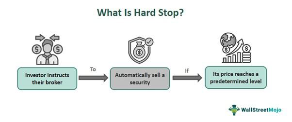

The increasing complexity of financial markets has necessitated the evolution of sophisticated trading mechanisms, one of which is algorithmic trading. Algorithmic trading involves the use of computer programs to automate the process of trading financial securities, using pre-defined strategies that can execute orders at speeds and frequencies beyond human capability. A core component of this type of trading is the use of risk management tools. Hard stops stand out as a crucial method, designed to mitigate the risks associated with this high-speed trading environment.

A hard stop is a risk management tool that involves setting a predetermined exit point for a trade, which is automatically activated to curb further losses. These stops are implemented at a specific price level and can be configured by traders or integrated directly into trading algorithms. The primary goal of a hard stop is to protect trading capital from the volatility that inherently characterizes financial markets.



The function of hard stops is particularly vital in the context of mechanical stop algorithmic trading. Mechanical stops consist of a set of predefined rules that automatically execute trades without the need for human intervention. They ensure that trading operations adhere strictly to established risk parameters, maintaining discipline and consistency in an otherwise emotion-driven marketplace.

This article examines the role of hard stops within algorithmic trading frameworks, highlighting their importance in contemporary trading strategies. By exploring how they function and their impact on performance, we aim to underscore the significance of hard stops in preserving capital and enhancing trading stability.

## Table of Contents

## What is a Hard Stop?

A hard stop is a critical concept in trading, particularly within algorithmic frameworks. It refers to a predetermined price point at which a trade is automatically exited, minimizing potential financial losses. This mechanism ensures that traders and algorithms set a limit beyond which they are unwilling to endure further losses, thereby safeguarding capital in turbulent market environments.

In practice, a hard stop is established at a specific price level, determined either manually by traders or programmatically by algorithms. This price level acts as a boundary; if the market price reaches this point, the trading system automatically triggers a sell or buy order to close the position. For instance, consider a trader who purchases a stock at $100 and sets a hard stop at $95. If the stock price falls to $95, the hard stop is activated, and the position is closed, thus limiting the loss to $5 per share.

The function of hard stops within trading systems is essential for rigorous risk management. By curtailing the extent of possible losses, they preserve the trader's capital and maintain financial stability even amid market [volatility](/wiki/volatility-trading-strategies). This is particularly important in highly volatile trading environments, where prices can fluctuate significantly, leading to substantial losses without the protection of well-placed hard stops. Consequently, hard stops serve as a vital risk mitigation tool, providing traders with a structured approach to [exit](/wiki/exit-strategy) trades proactively before losses mount uncontrollably.

## Understanding Mechanical Stops in Algorithmic Trading

Mechanical stops are a core component of [algorithmic trading](/wiki/algorithmic-trading), acting as the automatic triggers that facilitate the execution of trades without any human intervention. These stops are embedded within trading algorithms, ensuring that decisions adhere strictly to pre-established rules. The primary function of mechanical stops is to maintain discipline in the trading process, thus preventing emotional biases that can lead to suboptimal trading decisions.

Algorithmic trading systems utilize mechanical stops to preset conditions under which trades are executed or exited. The process involves a combination of mathematical models, historical data analysis, and real-time market data. For instance, a mechanical stop can be programmed to exit a position when a certain percentage loss is detected or when a specific price level is breached.

These stops are integral to a broader system known as algorithmic strategy, which encompasses various parameters and constraints under which the trading process must operate. By adhering to these parameters, the strategy optimizes the performance of the trading system within defined risk boundaries. This risk management aspect is crucial, as it delineates how much capital can be exposed to the market and under what conditions trades should be terminated to prevent further losses.

A typical implementation within a trading algorithm may look as follows in Python:

```python
def check_stop_loss(current_price, stop_loss_price):
    if current_price <= stop_loss_price:
        exit_trade()

def exit_trade():
    print("Trade exited at stop loss price.")

# Example usage
check_stop_loss(current_price=95, stop_loss_price=100)
```

In this example, a function `check_stop_loss` monitors the current price against a predetermined stop loss level. If the current price falls below the stop loss level, the trade is automatically exited by calling the `exit_trade()` function. This simple automation encapsulates the mechanical nature of stop implementations, which can be expanded to include more complex logical conditions and parameter adjustments.

Mechanical stops contribute significantly to consistent trading behavior, as they ensure that trading decisions abide by the strategy's predefined risk parameters. By automating these critical decisions, traders can focus on refining strategy performance, adjusting for market conditions, and improving the overall robustness of the trading system. The efficiencies brought about by mechanical stops underline their importance in contemporary algorithmic trading frameworks, providing a systematic approach to managing risk and enhancing reliablity in decision-making processes.

## Advantages of Implementing Hard Stops

Hard stops provide several advantages that significantly enhance risk management in algorithmic trading. Primarily, they serve as a critical mechanism for capping potential losses. By identifying a preset exit point, traders ensure that losses do not exceed a level that they deem acceptable. This approach is particularly essential in volatile markets, where price movements can be swift and unpredictable. With a hard stop, a trade is automatically exited as soon as the price reaches the specified threshold, thus preserving capital and preventing excessive drawdowns.

Another crucial benefit of hard stops is the facilitation of emotional detachment from trading decisions. Emotional responses can often lead to irrational decision-making, as traders might hold onto losing positions in the hope that the market will turn in their favor. Hard stops eliminate this possibility by enforcing a disciplined, logical approach, ensuring that trading decisions are dictated by pre-established rules rather than emotions.

Implementing hard stops also enables traders to automate their exit strategies. This automation allows for better focus on strategic trading aspects, such as analyzing market trends and developing new strategies, without the distraction of monitoring individual trades constantly. Automation through hard stops thus streamlines the trading process, optimizing efficiency and allowing for the management of multiple trades simultaneously. By using algorithms to set and manage hard stops, traders can ensure consistency and reliability in their trading practices, leading to improved overall performance.

## Challenges and Potential Risks

One of the challenges associated with using hard stops in trading is the phenomenon known as "whipsaws." In volatile markets, prices can fluctuate rapidly, sometimes triggering hard stops prematurely. This can lead to a situation where a trade is closed at a loss only for the market to reverse direction soon after, potentially resulting in missed profit opportunities. The quick reversals can be attributed to temporary [liquidity](/wiki/liquidity-risk-premium) voids or high-frequency trading activities, which often contribute to price swings that may not reflect the true market trend.

Another significant issue is slippage. This occurs when the execution price of a trade differs from the expected price set by the hard stop. Slippage is particularly prevalent in markets with low liquidity or during periods of high volatility. For instance, if a stop-loss is set at a specific price, but a sharp market movement occurs, the order may be filled at a worse price due to the time lag between signaling the trade and its execution. This deviation can affect the overall trading strategy, leading to higher-than-anticipated losses.

Over-relying on hard stops without considering broader market analysis can also be detrimental. Traders who focus exclusively on hard stops might overlook important market indicators or fail to adapt to underlying changes in market conditions. For example, a hard stop could be set based solely on technical chart levels without considering macroeconomic events or news announcements that could impact price movements. An inflexible approach could result in trades being exited prematurely or losses not being minimized effectively if broader, more nuanced risk management strategies are ignored.

To mitigate these challenges, it is crucial for traders to use hard stops as part of a comprehensive risk management strategy that incorporates market analysis, volatility assessments, and regular strategy reviews. This ensures that hard stops enhance trading performance rather than hinder it.

## Best Practices for Hard Stop Implementation

Setting hard stops at strategic levels that take into account market volatility is a critical practice in effective risk management for algorithmic trading. Volatility, often measured by indicators like the Average True Range (ATR), influences how wide the stop levels should be set to prevent premature exits during normal price fluctuations. For instance, during periods of high volatility, a broader stop might be necessary to accommodate larger price swings without triggering an exit.

Regularly reviewing and adjusting hard stops in response to changing market conditions is advisable. Markets are dynamic, and factors such as economic news, earnings reports, or geopolitical events can lead to shifts in market sentiment and volatility. Consequently, a stop level that is effective under one market condition may not be suitable when the market environment changes. Regular review ensures that the stop-loss points remain aligned with current market conditions, thereby maintaining their effectiveness as a risk management tool.

Incorporating a risk-reward ratio is another best practice to ensure that the potential rewards justify the risks undertaken. The risk-reward ratio is calculated by dividing the total potential profit by the total potential loss:

$$
\text{Risk-Reward Ratio} = \frac{\text{Potential Profit}}{\text{Potential Loss}}
$$

A favorable risk-reward ratio for a trade often falls within the range of 2:1 or 3:1, indicating that the potential reward is at least double or triple the potential loss. This approach helps traders to make more informed decisions by ensuring that each trade aligns with their risk tolerance and investment objectives.

These best practices collectively contribute to a more disciplined trading approach, reducing emotional decision-making and ensuring that hard stops serve their intended purpose without being undermined by external factors. Through judicious implementation, traders can improve their resilience against adverse market movements, ultimately enhancing their trading performance and safeguarding their financial capital.

## Real-World Examples of Hard Stops

Hedge funds and proprietary trading firms frequently incorporate hard stops within their sophisticated risk management frameworks to mitigate potential losses and ensure strategy execution aligns with predetermined risk parameters. By automating exit points, these institutional entities enhance their capacity to respond swiftly to market fluctuations, thereby preserving capital. For instance, large hedge funds may implement algorithmic systems configured to activate hard stops when a security's price drops below a specific threshold, thus securing profits or limiting losses in line with their broader strategic goals.

Retail traders, utilizing platforms like [Interactive Brokers](/wiki/interactive-brokers-api), also have access to tools that allow for the easy integration of hard stops. These platforms often provide user-friendly interfaces where traders can set hard stop levels, ensuring their trades conform to pre-established risk tolerance levels. This accessibility empowers individual traders to incorporate professional-grade risk management techniques into their trading processes.

Automated trading systems frequently embed hard stops as fundamental components of their programming logic. These systems are designed to execute trades automatically, ensuring optimal adherence to risk management strategies without the need for manual intervention. For example, a Python-based trading bot might include a segment of code such as:

```python
def check_hard_stop(current_price, stop_price):
    if current_price <= stop_price:
        execute_sell_order()
```

This simple function checks whether the current price of a security has hit the stop price, triggering a sell order to limit exposure to further downside risk. Through such mechanisms, automated systems can react to market conditions with precision and consistency, safeguarding against the financial impact of adverse price movements.

## Conclusion

Hard stops are crucial components of algorithmic trading systems, designed to protect against substantial financial losses by automatically exiting trades at predetermined levels. They establish a foundational layer of risk management, ensuring that losses are capped, which is especially vital in the unpredictable and often volatile market environment. Implementing hard stops allows traders and trading algorithms to operate within defined risk parameters, preventing uncontrolled losses that could otherwise devastate trading accounts.

Despite their advantages, such as reducing emotional decision-making and fostering disciplined trading, hard stops also present potential challenges. Traders must recognize the risk of being prematurely stopped out due to market volatility, often referred to as 'whipsaws', and consider the impact of market slippage on execution price versus target levels. These risks underscore the importance of a balanced approach to strategy development, where hard stops are used in conjunction with broader market analysis and adaptive trading strategies.

By continuously refining these strategies and integrating comprehensive market assessments, traders can effectively harness the benefits offered by hard stops while mitigating associated risks. Diligent implementation, along with regular evaluation and adjustment, allows for optimization of trading performance and enhancement of risk management. These practices ensure that hard stops not only serve as a defensive mechanism but also contribute to the overall robustness and success of algorithmic trading operations.

## References & Further Reading

[1]: Bergstra, J., Bardenet, R., Bengio, Y., & Kégl, B. (2011). ["Algorithms for Hyper-Parameter Optimization."](https://dl.acm.org/doi/10.5555/2986459.2986743) Advances in Neural Information Processing Systems 24.

[2]: ["Advances in Financial Machine Learning"](https://www.amazon.com/Advances-Financial-Machine-Learning-Marcos/dp/1119482089) by Marcos Lopez de Prado

[3]: ["Evidence-Based Technical Analysis: Applying the Scientific Method and Statistical Inference to Trading Signals"](https://www.amazon.com/Evidence-Based-Technical-Analysis-Scientific-Statistical/dp/0470008741) by David Aronson

[4]: ["Machine Learning for Algorithmic Trading"](https://github.com/stefan-jansen/machine-learning-for-trading) by Stefan Jansen

[5]: ["Quantitative Trading: How to Build Your Own Algorithmic Trading Business"](https://www.amazon.com/Quantitative-Trading-Build-Algorithmic-Business/dp/1119800064) by Ernest P. Chan