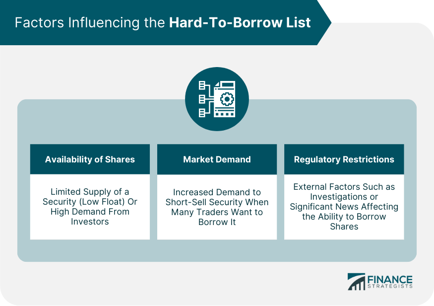

## Table of Contents

## What is a Hard-To-Borrow List in financial markets?

A Hard-To-Borrow List is a tool used by brokerages to keep track of stocks that are difficult to lend out for short selling. When someone wants to short sell a stock, they need to borrow shares first. If a stock is on the Hard-To-Borrow List, it means there are not many shares available to borrow, making it hard for people to short sell that stock.

This list is important because it helps investors and traders understand which stocks might be harder to short. If a stock is hard to borrow, it can be more expensive to short sell because the broker might charge a higher fee for borrowing those shares. Knowing which stocks are on this list can help traders plan their strategies better and avoid unexpected costs.

## Why do some securities end up on the Hard-To-Borrow List?

Some securities end up on the Hard-To-Borrow List because there aren't many shares available to lend out. This can happen when a lot of people want to short sell the same stock at the same time. When demand for borrowing a stock is high, but the supply of shares to lend is low, that stock becomes hard to borrow.

Another reason is that the company that issued the stock might have rules that make it harder to lend out their shares. For example, some companies have policies that limit how their shares can be used for short selling. This can make their stock harder to borrow, even if there isn't a high demand for short selling it.

Overall, being on the Hard-To-Borrow List usually means there's either a high demand to short sell the stock or the company has put restrictions on lending their shares. This makes it tougher for traders to find shares to borrow and can lead to higher borrowing fees.

## How does the Hard-To-Borrow List affect short selling?

When a stock is on the Hard-To-Borrow List, it means there aren't many shares available to borrow for short selling. This makes it harder for traders who want to bet that the stock's price will go down. They have to look harder to find shares to borrow, and this can take more time and effort.

Also, being on the Hard-To-Borrow List can make short selling more expensive. When shares are hard to find, brokers might charge higher fees to lend them out. So, if a trader wants to short sell a stock on this list, they might have to pay more money just to borrow the shares. This can affect their decision to short sell and how much profit they might make.

## Who maintains the Hard-To-Borrow List?

The Hard-To-Borrow List is usually kept by brokerage firms. They watch the market and see which stocks are hard to lend out for short selling. When they find a stock that is hard to borrow, they put it on their list. This helps them manage their lending business and let their clients know which stocks might be tough to short sell.

The list can change often because the supply and demand for stocks can shift quickly. If a lot of people want to short sell a stock at the same time, it might go on the list. But if more shares become available to lend, the stock might come off the list. Brokerage firms update the Hard-To-Borrow List to keep it current and helpful for traders.

## How often is the Hard-To-Borrow List updated?

The Hard-To-Borrow List is updated by brokerage firms quite often. This is because the supply and demand for stocks can change quickly. If more people want to short sell a stock, it might go on the list. But if more shares become available to lend, the stock might come off the list. So, to keep the list helpful for traders, brokerages usually update it every day or even more often.

These updates help traders know which stocks are hard to borrow at any given time. If a stock is on the list, it might be harder and more expensive to short sell. By checking the list often, traders can plan their short selling strategies better and avoid surprises. Keeping the list current is important for both the brokerage firms and the traders who use it.

## What criteria are used to determine if a security is hard to borrow?

A security ends up on the Hard-To-Borrow List when there aren't enough shares available to lend out for short selling. This can happen when a lot of people want to short sell the same stock at the same time. When the demand to borrow a stock is high, but the supply of shares to lend is low, that stock becomes hard to borrow. It's like trying to rent a popular movie that everyone wants to watch but there are only a few copies available.

Another reason a security might be hard to borrow is if the company that issued the stock has rules that make it harder to lend out their shares. Some companies have policies that limit how their shares can be used for short selling. This can make their stock harder to borrow, even if there isn't a high demand for short selling it. So, being on the Hard-To-Borrow List usually means there's either a high demand to short sell the stock or the company has put restrictions on lending their shares.

## How can investors access the Hard-To-Borrow List?

Investors can access the Hard-To-Borrow List through their brokerage firms. Most big brokerages keep a list of stocks that are hard to borrow and share it with their clients. If you want to see the list, you can usually find it on your brokerage's website or by asking your broker directly. They might have it on a special page or in a report that they update every day.

Checking the Hard-To-Borrow List can help investors plan their short selling better. If a stock is on the list, it means there aren't many shares to borrow, so it might be harder and more expensive to short sell. By knowing which stocks are hard to borrow, investors can make smarter choices and avoid surprises. It's a good idea to check the list often because it can change quickly based on what's happening in the market.

## What are the implications of borrowing a security that is on the Hard-To-Borrow List?

When an investor borrows a security that is on the Hard-To-Borrow List, it means they might have to pay more money. This is because there aren't many shares available to lend out, so the broker might charge a higher fee for borrowing those shares. It's like trying to rent a popular movie that everyone wants to watch but there are only a few copies available. The high demand and low supply make it more expensive to borrow the stock.

Also, borrowing a stock from the Hard-To-Borrow List can take more time and effort. Since there aren't many shares to borrow, the investor might have to look harder to find them. This can slow down their trading plans. It's important for investors to check the Hard-To-Borrow List often because it can change quickly based on what's happening in the market. Knowing which stocks are hard to borrow can help them make better choices and avoid surprises.

## How does the Hard-To-Borrow List impact the cost of borrowing securities?

When a stock is on the Hard-To-Borrow List, it means there aren't many shares available to lend out. This makes the stock more expensive to borrow. It's like trying to rent a popular movie that everyone wants to watch but there are only a few copies available. Because a lot of people want to borrow the stock at the same time, the broker can charge a higher fee. This higher fee is what investors have to pay if they want to short sell the stock.

The cost of borrowing a stock from the Hard-To-Borrow List can affect an investor's decision to short sell. If the fee is too high, it might not be worth it for them to go through with the short sale. They have to think about how much they might make from the short sale compared to how much it will cost them to borrow the stock. So, the Hard-To-Borrow List helps investors know which stocks might be more expensive to short sell, and they can plan their strategies accordingly.

## Can the Hard-To-Borrow List influence market liquidity?

When a stock is on the Hard-To-Borrow List, it means it's hard for people to borrow that stock to short sell. This can make the market for that stock less liquid. Liquidity means how easily you can buy or sell a stock without affecting its price much. If a lot of people want to short sell a stock but can't find shares to borrow, fewer people might be trading that stock. This can make it harder for everyone to buy or sell the stock quickly, which can affect how the stock's price moves.

The Hard-To-Borrow List can also make people think twice before trying to short sell a stock. If the stock is hard to borrow, the fees to borrow it might be high. This might make some investors decide not to short sell that stock at all. When fewer people are short selling, it can change how much the stock is traded. So, the Hard-To-Borrow List can play a big role in how liquid a stock is and how easy it is for people to trade it.

## What strategies can traders employ when dealing with securities on the Hard-To-Borrow List?

When traders come across securities on the Hard-To-Borrow List, they can use a few strategies to manage the situation. One approach is to look for other stocks that might be similar to the one they want to short sell but are easier to borrow. This way, they can still make a bet on the market without having to deal with high borrowing fees. Another strategy is to wait and see if the stock comes off the list. If fewer people want to short sell it, more shares might become available to borrow, and the fees could go down.

Traders can also consider the cost of borrowing against the potential profit from the short sale. If the fee to borrow the stock is too high, it might not be worth it to short sell, even if they think the stock's price will go down. They need to do the math to see if the possible profit is bigger than the borrowing cost. By keeping an eye on the Hard-To-Borrow List and understanding these strategies, traders can make better decisions and handle the challenges of short selling more effectively.

## How do regulatory changes affect the Hard-To-Borrow List and its management?

Regulatory changes can have a big impact on the Hard-To-Borrow List. When rules about short selling or stock lending change, it can make it harder or easier for people to borrow stocks. For example, if new rules say that companies can put more limits on how their shares are used for short selling, more stocks might end up on the Hard-To-Borrow List. This is because there would be fewer shares available to lend out. On the other hand, if rules make it easier to lend stocks, fewer stocks might be on the list because more shares would be available.

Brokerage firms have to keep up with these regulatory changes to manage their Hard-To-Borrow Lists properly. If the rules change, they need to update their lists to reflect which stocks are now harder or easier to borrow. This helps them give their clients the most current information so traders can make smart decisions about short selling. Keeping the list accurate and up-to-date is important for both the brokerages and the investors who use it to plan their trading strategies.

## What are the fees and costs associated with borrowing?

Borrowing fees associated with hard-to-borrow (HTB) securities are a significant consideration for traders engaged in short selling. These fees are primarily driven by the supply and demand dynamics of the market. In general, when a stock is classified as hard-to-borrow, it indicates a limited supply available for borrowing, often resulting in elevated borrowing fees. These fees reflect the cost of accessing shares needed to facilitate a short sale.

Market events and conditions, such as increased market [volatility](/wiki/volatility-trading-strategies) or corporate announcements, can cause borrowing fees to fluctuate. For instance, times of heightened volatility might lead to a surge in short selling activity, thereby increasing the demand for available shares. This heightened demand can exacerbate the scarcity of shares, leading to an uptick in borrowing fees. Conversely, periods of market stability might reduce short selling interest and thereby lower borrowing fees.

Effective management of borrowing fees is crucial for traders aiming to minimize costs and enhance their profit margins. Traders must take into account these additional costs when formulating their trading strategies. In some cases, the elevated borrowing fees can significantly erode potential profits, making the short sale less attractive. 

To effectively manage borrowing fees, traders can:

1. **Monitor Fee Fluctuations**: Regularly track borrowing fee changes to adjust trading strategies accordingly. This might involve calculating the net profit by incorporating expected borrowing costs:
$$
   \text{Net Profit} = (\text{Selling Price} - \text{Purchase Price}) - \text{Borrowing Fees} - \text{Other Costs}

$$

2. **Optimize Timing**: Initiate short sales when borrowing fees are lower, if possible, to increase profit margins.

3. **Incorporate Algorithms**: Use algorithmic trading systems to automatically factor in borrowing costs when executing trades. This might involve programming conditions into a trading algorithm that adjust positions based on real-time borrowing fee data. Here is a simple Python example of how such an algorithm might be structured:

   ```python
   def calculate_net_profit(selling_price, purchase_price, borrow_fee, other_costs):
       return (selling_price - purchase_price) - borrow_fee - other_costs

   def should_initiate_short(selling_price, purchase_price, borrow_fee, threshold):
       return calculate_net_profit(selling_price, purchase_price, borrow_fee, other_costs) > threshold

   # Example application
   selling_price = 150
   purchase_price = 100
   borrow_fee = 5
   other_costs = 2
   threshold = 30

   if should_initiate_short(selling_price, purchase_price, borrow_fee, threshold):
       print("Initiate short sale")
   else:
       print("Do not initiate short sale")
   ```

By understanding and effectively managing these borrowing fees, traders can better position themselves to make informed decisions and optimize their short selling strategies.

## References & Further Reading

[1]: ["Advances in Financial Machine Learning"](https://www.amazon.com/Advances-Financial-Machine-Learning-Marcos/dp/1119482089) by Marcos Lopez de Prado

[2]: ["Machine Learning for Algorithmic Trading"](https://github.com/stefan-jansen/machine-learning-for-trading) by Stefan Jansen

[3]: ["Quantitative Trading: How to Build Your Own Algorithmic Trading Business"](https://www.amazon.com/Quantitative-Trading-Build-Algorithmic-Business/dp/1119800064) by Ernest P. Chan

[4]: ["Evidence-Based Technical Analysis: Applying the Scientific Method and Statistical Inference to Trading Signals"](https://www.amazon.com/Evidence-Based-Technical-Analysis-Scientific-Statistical/dp/0470008741) by David Aronson

[5]: ["Short Selling: Strategies, Risks, and Rewards"](https://www.amazon.com/Short-Selling-Strategies-Risks-Rewards/dp/0471660205) by Carol J. Loomis, Wiley Trading Series