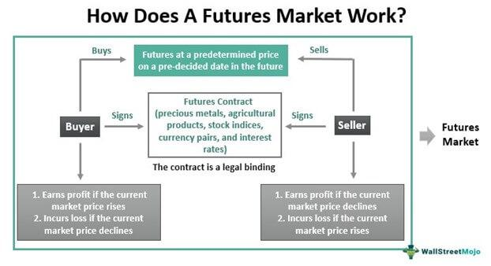

The trading world has experienced profound changes with the rise of algorithmic trading, a technological advancement that has redefined how financial markets operate. Speculators, who have traditionally played a significant role, continue to be pivotal in contemporary markets, closely interacting with algorithmic trading (algo trading) systems. These two forces—speculators and algo trading—are essential to understanding the current landscape of financial markets, chiefly due to their impacts on economic stability and market volatility.

Speculators are known for entering markets primarily to profit from price fluctuations. Their presence is crucial as they contribute to market liquidity and facilitate efficient price discovery, reflecting the latest market information and sentiments. However, with the integration of algo trading, the role of speculators has evolved. Algo trading uses sophisticated computer programs that can execute trades at speeds and volumes beyond the capabilities of human traders. Algorithms can follow various strategies like arbitrage, trend following, or statistical arbitrage, leading to increased liquidity but also potential risks such as market fragmentation and flash crashes.

The economic impact of these agents—speculators using algo trading strategies—encompasses the amplification of market movements and liquidity. As their actions shape market dynamics, they affect pricing structures and influence market conditions, such as creating hardening market effects characterized by reduced volatility and potentially rising prices. These emergent market conditions have significant implications for market participants.

Understanding the impact of speculators and algo trading helps anticipate future market behaviors and informs regulatory decisions designed to maintain market integrity and stability. As financial markets continue to evolve with technology, comprehending these dynamics is crucial for investors, traders, and policymakers alike, providing insights necessary for navigating the complexities of modern financial systems.

## Table of Contents

## Understanding Speculators: Their Role in the Market

Speculators, serving as pivotal players in financial markets, engage in trading activities aimed at capitalizing on price movements rather than employing strategies for risk mitigation, such as hedging. By participating in markets solely for the potential gains derived from fluctuations in asset prices, speculators contribute significantly to the liquidity and depth of these markets. Their presence ensures that there are always buyers and sellers, thereby facilitating smoother transactions and helping markets function efficiently.

The influence of speculators extends beyond mere liquidity provision. By actively engaging in buying and selling assets, they contribute to the dynamic movement of prices, often intensifying short-term market volatility. This heightened volatility can be a double-edged sword; while it introduces risks, it also supports the crucial market function of price discovery. Price discovery reflects how market prices evolve to reflect the collective inputs of various market participants about an asset's value.

Speculators' activities can result in swift market reactions to new information and shifts in market sentiments. For example, when new economic data is released or when unexpected geopolitical events occur, speculators rapidly assess the implications of this information and adjust their positions accordingly. This behavior leads to near-instantaneous changes in asset prices as speculators act on their expectations about future price directions. Consequently, market prices tend to swiftly incorporate new information, ensuring that they remain relevant representations of the underlying economic realities.

Moreover, speculators often focus on exploiting temporary mispricings in the market. These mispricings can arise from a variety of factors, including investor sentiment, macroeconomic announcements, or geopolitical events. By exploiting such opportunities, speculators help drive prices back to their equilibrium levels. This ability to identify and act on short-term price inefficiencies further underscores their role in facilitating efficient market operations.

Overall, while the activities of speculators can induce increased short-term [volatility](/wiki/volatility-trading-strategies), they play an indispensable role in ensuring [liquidity](/wiki/liquidity-risk-premium), enhancing price discovery, and enabling rapid market adaptation to new information. Their actions, which reflect and shape market sentiments, are critical for the dynamic and efficient functioning of financial markets.

## Algorithmic Trading: Mechanisms and Influence

Algorithmic trading employs computer algorithms to execute transactions at speeds and scales that surpass human capabilities. This form of trading calculates signals, decides on the optimal timing of orders, and minimizes trading costs by using complex algorithms and data-driven strategies.

Algos can be configured to follow a variety of strategies. One common approach is [arbitrage](/wiki/arbitrage), where the algorithm seeks to exploit price differentials in different markets or instruments. Arbitrage requires rapid action, making [algorithmic trading](/wiki/algorithmic-trading) particularly suited due to its ability to process vast amounts of data and execute trades in milliseconds. Another strategy is [trend following](/wiki/trend-following), where algorithms identify and capitalize on market movements by detecting trends over various time frames. Statistical arbitrage employs statistical models to identify and trade on minor price discrepancies among assets that are usually correlated.

High-frequency trading ([HFT](/wiki/high-frequency-trading-strategies)) is a subset that has gained popularity due to its capability to execute thousands of trades per second. This has raised concerns regarding market stability and fairness, particularly in contexts where speed potentially offers an undue advantage. HFT can cause severe fluctuations and is often cited for contributing to incidents like the "Flash Crash" of 2010. Such crashes occur when rapid sell-offs trigger a cascade of algorithmic responses, leading to temporary but dramatic market declines.

While algorithmic trading enhances market liquidity by increasing the number of transactions and narrowing bid-ask spreads, it can also lead to market fragmentation. Algorithms trading in different venues can create disparities in prices and liquidity across markets, impacting price formation and efficiency. Additionally, the rapid pace of algorithmic transactions complicates order management and execution, creating challenges such as the "ghost liquidity" issue, where displayed liquidity disappears faster than it can be transacted upon.

The dual role of algo trading in providing liquidity and contributing to market fragmentation highlights the need for careful consideration of its implications. As the complexity and prevalence of algorithmic trading grow, concerns about its impact will necessitate balanced approaches to harness its benefits while mitigating associated risks.

## Economic Impact of Speculators in Algo Trading

Speculators employing algorithmic trading strategies significantly influence market movements and liquidity. As algorithmic trading has evolved, speculators have harnessed the power of high-frequency trading (HFT) to capitalize on minute price fluctuations, thus amplifying both market liquidity and volatility. High-frequency speculators execute trades at incredibly high speeds, often completing transactions within microseconds. This rapid trading capability can exert a considerable impact on the underlying market structure and pricing dynamics.

The influence of algo-driven speculators can manifest in hardening effects, which are characterized by a reduction in market volatility and a gradual increase in asset prices. Hardening markets typically result from increased trading activity, where speculators continuously inject liquidity by being active buyers and sellers. This injection of liquidity tends to stabilize price movements over time, leading to a perceived sense of market stability. However, despite seeming stability, the underlying risks might be masked. The reduction in observable volatility could lull investors into a false sense of security, potentially enhancing systemic risk due to an underestimation of potential market shocks.

Furthermore, the activities of algorithmic speculators might lead to new equilibrium pricing levels. They continuously seek to exploit inefficiencies, thus pushing prices towards what could be perceived as their true market value. Although this process is crucial for efficient market functioning, there is a risk of forming asset bubbles if the price discovery process is predominantly driven by speculative trading rather than fundamental value. Hence, while the presence of algo-driven speculators can signal market stabilization through liquidity and reduced volatility, it is critical to consider the broader implications for market oversight and the real economy. Understanding these dynamics is essential for investors and policymakers to ensure a balanced approach to financial market regulation and stability.

## Volatility and Price Formation in Hardening Markets

Hardening markets, characterized by rising prices and declining volatility, create distinct conditions for traders. These conditions often indicate a stabilized market environment where price fluctuations are less frequent, accommodating those seeking steady and predictable investments. However, the reduced price variability limits opportunities for high returns, which are typically derived from significant market movements. In this context, traders aiming for substantial gains may need to adopt new strategies or explore alternative markets where price swings are more pronounced.

Speculators, known for capitalizing on volatility, may find hardening markets less conducive to their traditional strategies. With diminished volatility, the rapid price changes they rely on for trading opportunities become scarce. Consequently, these traders might turn to markets with more variability or engage in innovative trading practices to exploit minute price differences.

In hardening markets, price formation becomes more predictable, as stabilized conditions reduce the frequency and magnitude of unpredictable price shifts. This predictability can lead to adjustments in market entry and [exit](/wiki/exit-strategy) strategies. Traders might opt for long-term positions with lower risk, as the anticipated price stability reduces the likelihood of adverse market movements impacting their investments. However, it is crucial for traders to remain vigilant, as the apparent stability may obscure underlying risks that can suddenly manifest and disrupt the calm market environment.

Overall, the dynamics of hardening markets necessitate strategic adaptations by traders and speculators to continue achieving desired returns while managing risk effectively.

## The Regulatory Landscape and Challenges

Algorithmic trading, especially high-frequency trading (HFT), has transformed financial markets, necessitating the evolution of regulatory frameworks to ensure fairness and stability. As trading speeds increase and strategies become more sophisticated, regulators face unprecedented challenges in monitoring and controlling these activities.

One of the primary concerns in the context of increasing algo trading is market manipulation. Trading algorithms can execute thousands of transactions per second, making it difficult for regulators to detect manipulation and fraudulent behavior in real time. Potential manipulations include spoofing, where a trader places large orders they never intend to execute to alter stock prices. To counter these risks, regulators use advanced analytics and [machine learning](/wiki/machine-learning) tools to monitor trading activities and detect patterns indicative of manipulative strategies. This requires substantial computational resources and expertise.

Moreover, the potential for AI collusion and algorithmic bias has raised concerns. Algorithms, designed to identify profitable patterns, may inadvertently exploit or exacerbate biases in the data they analyze, leading to distorted market outcomes. Regulators must ensure transparency in algorithmic operations, possibly by mandating disclosure of the algorithms' decision-making criteria and trade execution processes.

Balancing innovation with market integrity remains a critical policy challenge. As algorithmic and high-frequency trading continue to evolve, regulatory principles must encourage technological advancements while safeguarding market participants from potential risks. Policies might include establishing latency floors to level the playing field for different types of traders or employing transaction taxes to limit excessive trading.

An illustration of regulatory adaptations is the European Union's Markets in Financial Instruments Directive II (MiFID II), implemented to increase transparency and reduce the risks of algorithmic and high-frequency trading. MiFID II requires trading venues to implement circuit breakers to temporarily halt trading during significant market movements, aiming to prevent flash crashes induced by rapid algorithmic trades.

Regulatory efforts need to be dynamic and adaptive, incorporating continuous feedback from market trends and technological shifts. By adopting a proactive regulatory stance and leveraging advanced technological tools, policymakers can strive to maintain an equilibrium between innovation and market stability, effectively addressing the intricate challenges posed by algorithmic trading.

## Conclusion

The interplay between speculators, hardening markets, and algorithmic trading is pivotal in shaping economic stability. Speculators, who actively seek to profit from market fluctuations, enhance liquidity and facilitate efficient price discovery. By entering and exiting markets based on perceived opportunities, they contribute to the rapid incorporation of new information into asset prices, thereby making markets more informative for all participants. Algorithmic trading, with its speed and precision, further amplifies these effects by executing trades at fractions of a second, thus enhancing market liquidity even further.

However, these benefits are not without challenges. The increased volatility due to speculative activities and the sheer speed of algorithmic trading can exacerbate market instability during periods of financial stress. Algorithm-driven trading strategies, particularly high-frequency trading (HFT), have been linked to incidents of excessive volatility, such as flash crashes, where prices plummet temporarily before quickly recovering. Such events can undermine confidence in financial markets and pose systemic risks.

The regulatory landscape must evolve in response to these developments. Ensuring market fairness and stability necessitates robust oversight mechanisms to detect and prevent potential manipulations associated with high-frequency and algorithmic trading. Transparency in trading algorithms and their operations is crucial for maintaining trust in market integrity, particularly given concerns about AI collusion and algorithmic bias. Effective regulation should strike a balance between fostering innovation in trading technologies and safeguarding the financial system from potential disruptions.

Understanding the dynamics of speculators and algorithmic trading is crucial for investors, traders, and policymakers aiming to navigate the complex financial landscape effectively. Continuous monitoring of market conditions and trading behaviors will be essential for anticipating and mitigating adverse effects, while strategic regulations can enhance the resilience of financial markets.

To fully leverage the benefits while minimizing the risks associated with algorithmic trading and speculative activities, ongoing research and development of regulatory frameworks are paramount. Future research should focus on understanding the long-term impacts of these trading strategies on market stability and efficiency, while regulatory frameworks should adapt to address the novel challenges posed by evolving trading technologies.

## References & Further Reading

[1]: MacKenzie, D. (2018). ["Material markets: How economic agents are constructed."](https://academic.oup.com/book/52341) Oxford University Press.

[2]: Aldridge, I. (2013). ["High-Frequency Trading: A Practical Guide to Algorithmic Strategies and Trading Systems,"](https://www.amazon.com/High-Frequency-Trading-Practical-Algorithmic-Strategies/dp/1118343506) 2nd Edition, Wiley.

[3]: Bouchaud, J.-P., Farmer, J. D., & Lillo, F. (2009). ["How markets slowly digest changes in supply and demand."](https://arxiv.org/abs/0809.0822) In Handbook of Financial Markets: Dynamics and Evolution.

[4]: Cartea, Á., Jaimungal, S., & Penalva, J. (2015). ["Algorithmic and High-Frequency Trading."](https://assets.cambridge.org/97811070/91146/frontmatter/9781107091146_frontmatter.pdf) Cambridge University Press.

[5]: Kirilenko, A. A., & Lo, A. W. (2013). ["Moore's Law versus Murphy's Law: Algorithmic Trading and Its Discontents."](https://www.aeaweb.org/articles?id=10.1257/jep.27.2.51) Journal of Economic Perspectives.