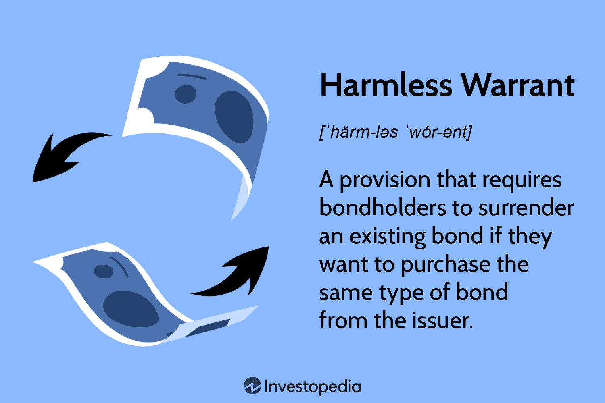

Understanding the intricacies of legal and financial terms is crucial for effective navigation within both fields. Harmless warrants, a lesser-known financial instrument, play a significant role in the financial markets, particularly within algorithmic trading frameworks. These warrants offer a mechanism for issuers to manage debt while simultaneously impacting investment strategies, thus holding importance for traders and issuers alike.

Warrants, in general, are derivatives that confer the right, but not the obligation, to buy or sell an asset at a predetermined price before expiration. They come in various forms, each with unique implications for both issuers and investors. Equity warrants, for instance, provide rights to purchase company stock, whereas index warrants relate to the performance of stock indices. Covered warrants are backed by issuers, thus offering lower risk, while naked warrants are issued without such backing, increasing potential volatility.

Harmless warrants are specifically characterized by requiring investors to surrender an existing bond before obtaining another with similar terms from the same issuer. This feature is pivotal in managing the issuer's debt levels and ensuring strategic investment alignment. They are particularly relevant in algorithmic trading, where automated platforms leverage these instruments to optimize hedging strategies and minimize risks inherent to financial market participation.

Understanding harmless warrants within both legal and algorithmic trading contexts is essential for ensuring compliance with regulatory frameworks. Legal bodies, such as the Securities and Exchange Commission (SEC) in the United States, enforce fair trading practices and regulate the use and trade of these derivatives. Being informed of the legal considerations and potential ramifications can help in mitigating risks and maximizing the benefits these instruments offer.

In conclusion, while harmless warrants serve as critical tools in balancing issuer debt with investor flexibility, their integration into automated trading systems underscores their importance in modern financial markets. Equipped with a comprehensive understanding of their function and impact, investors and traders can make informed and strategic decisions, navigating the complexities of today's financial landscape with greater confidence.

## Table of Contents

## What Is a Harmless Warrant?

A harmless warrant is a specific clause found in bond agreements. It mandates that an investor must relinquish an existing bond if they wish to acquire a new bond with similar terms from the same issuer. This mechanism serves as a critical debt management tool for the issuer. By ensuring investors surrender previous bonds before purchasing new ones, issuers can effectively control and maintain their overall debt levels. The importance of this mechanism lies in its ability to stabilize an issuer’s financial commitments without increasing total outstanding debt.

The concept of harmless warrants significantly influences investment strategies. Investors are compelled to consider the implications of bond exchanges and how these actions align with their broader investment goals. This requirement shapes strategic decisions and encourages investors to only purchase new bonds when they are truly aligned with their portfolio needs.

One of the defining features of harmless warrants is their non-detachability. Unlike other financial instruments that can be separated and traded independently of their original agreement, harmless warrants are inseparable from the bond agreements they accompany. This non-detachable nature ensures that the conditions set by the issuer remain strictly upheld, thereby preserving the intended debt constraints and avoiding unauthorized expansion of the issuer's financial liabilities. This ensures consistent adherence to the planned debt levels, providing a predictable financial environment for both issuers and investors.

## Understanding Different Types of Warrants

Warrants are financial instruments that provide the holder with the right, but not the obligation, to purchase or sell underlying securities at a predetermined price before expiration. These derivatives are categorized into various types, each serving unique purposes and possessing distinct characteristics.

**Equity Warrants**: Equity warrants are perhaps the most common type, granting holders the right to purchase shares of the issuing company at a specified price before the warrant's expiration. This feature allows investors to potentially benefit from stock price appreciation. If the market price of the company's stock exceeds the exercise price of the warrant, the holder can purchase the stock at the lower, predetermined price, potentially realizing a profit. Equity warrants are often used by companies to raise capital without immediately diluting ownership, as the dilution occurs only when the warrant is exercised.

**Index Warrants**: Unlike equity warrants, index warrants are based on stock indices rather than individual company shares. This type of warrant allows investors to gain exposure to the performance of a specific market index, such as the S&P 500. Index warrants are beneficial for diversifying investment portfolios and are often used by traders seeking to capitalize on broader market movements. The value of index warrants fluctuates with changes in the underlying index, and they are settled in cash rather than through the delivery of physical assets.

**Covered Warrants**: Covered warrants are issued by financial institutions and are backed by the issuer. The backing by the issuer provides a layer of security, reducing the risk associated with counterparty default. These warrants can be based on stocks, indices, commodities, or other financial instruments. The coverage ensures that the issuer is capable of fulfilling its obligations, thereby lowering the risk for investors. This type of warrant is particularly attractive to risk-averse investors.

**Naked Warrants**: In contrast, naked warrants do not have any backing, making them a riskier option. These warrants are typically issued without the assets being in the possession of the issuer, which can lead to higher potential rewards alongside increased risks. Investors dealing with naked warrants are exposed to the risk of the issuer being unable to meet its obligations, which can occur if market conditions change unfavorably or if the issuer experiences financial difficulty. Naked warrants are often leveraged, providing the possibility of significant gains along with potential losses.

In summary, warrants can be tailored to suit a variety of investment strategies, offering differing benefits and risks dependent on the type. Understanding the nuances of each warrant type can help investors make informed choices aligned with their risk tolerance and investment goals. Each warrant type, whether equity, index, covered, or naked, provides distinct opportunities that can be strategically employed within investment portfolios.

## The Role of Harmless Warrants in Algorithmic Trading

Algorithmic trading, which utilizes pre-programmed trading instructions to execute orders at high speed, increasingly relies on financial derivatives such as warrants. Harmless warrants, in particular, play an essential role in this context by minimizing risks and offering hedging benefits. This section explores the application of financial strategies such as market-making, trend-following, and [arbitrage](/wiki/arbitrage) in conjunction with harmless warrants.

Harmless warrants, as financial derivatives, provide strategic advantages by allowing traders to manage risk while engaging in high-frequency trading. One of their primary uses in [algorithmic trading](/wiki/algorithmic-trading) is in market-making strategies. Market-making involves providing [liquidity](/wiki/liquidity-risk-premium) to the market by continuously quoting buy and sell prices for a financial instrument. By incorporating harmless warrants, traders can effectively hedge against adverse price movements. For instance, if a trader holds warrants in a volatile market, they can offset potential losses by taking an opposite position with other financial instruments, often automatically executed by trading algorithms.

Another area where harmless warrants prove beneficial is in trend-following strategies. These strategies attempt to capitalize on market movements in the direction of the trend. By using harmless warrants, traders can enhance their trend-following strategies by reducing exposure to abrupt trend reversals. For example, if a trading algorithm identifies an upward trend in a stock, it might use harmless warrants to lock in the gains while simultaneously reducing risk exposure in case of a sudden downward movement. This approach optimizes returns while maintaining a balanced risk profile.

Arbitrage opportunities also present a significant application for harmless warrants within algorithmic trading. Arbitrage involves exploiting price discrepancies of the same asset across different markets. Harmless warrants can augment such strategies by enabling traders to capitalize on short-term inefficiencies without significantly increasing their risk. Trading algorithms can automatically identify and execute these arbitrage opportunities, using harmless warrants to offload any undesirable position or to hedge the arbitrage position itself.

In summary, harmless warrants are integral components in the landscape of algorithmic trading. Their ability to offer risk mitigation and hedging benefits complement various trading strategies, including market-making, trend-following, and arbitrage. Consequently, traders utilizing algorithmic platforms can leverage harmless warrants to enhance the efficiency and profitability of their trading activities.

## Legal Considerations of Harmless Warrants

Legal frameworks play an essential role in governing the issuance and trading of financial derivatives, such as harmless warrants. These frameworks are designed to maintain the integrity and stability of financial markets by ensuring transparency and protecting investors from malpractices.

In the United States, the Securities and Exchange Commission (SEC) is a primary regulatory body overseeing the trading of financial derivatives, including warrants. The SEC enforces regulations that require issuers to provide full disclosure of material information to investors, which helps in maintaining fair trading practices. Compliance with these regulations is critical for issuers and traders to avoid legal penalties and to preserve market trust.

Harmless warrants, by design, require investors to surrender an existing bond before acquiring a new one with similar terms from the same issuer. This mechanism is intended to help issuers manage their debt levels effectively. However, it also introduces certain legal considerations. For instance, the non-detachable nature of harmless warrants, which ties them to specific bonds, must align with disclosure requirements and anti-fraud provisions under securities law.

Understanding the legal implications of harmless warrants is pivotal for both issuers and investors. Issuers must ensure their warrant agreements comply with regulations to prevent misrepresentation and potential legal conflicts. Investors, on the other hand, must be vigilant about the terms and conditions associated with these financial instruments to mitigate risks such as liquidity constraints and potential violations of securities law.

Adherence to these legal standards not only ensures compliance but also enhances the issuer's and investor's reputability in the market. By navigating the regulatory landscape adeptly, traders and issuers can effectively manage legal risks while leveraging harmless warrants to achieve financial stability and growth.

## Benefits and Risks of Using Harmless Warrants

Harmless warrants serve as a strategic tool within the financial domain, offering significant advantages for both issuers and traders. For issuers, these warrants function as an effective debt management mechanism. By requiring investors to exchange an existing bond for another of similar terms, issuers can regulate and stabilize their debt portfolios. This aspect ensures that issuers can maintain a balanced approach to managing their financial obligations, thereby safeguarding against excessive leverage.

For traders, the investment advantages of harmless warrants are multifaceted. These instruments allow traders to engage in strategic positions that can be leveraged for better returns. Since harmless warrants often come with lower initial costs compared to direct stock purchases, traders can access favorable market positions without substantial capital outlay. Additionally, traders benefit from the flexibility that harmless warrants offer, enabling them to tailor their investment strategies to align with market movements and anticipated trends.

However, inherent risks accompany the use of harmless warrants, primarily stemming from potential [volatility](/wiki/volatility-trading-strategies) and liquidity concerns. The non-detachable nature of these warrants means that investors are limited in their ability to separate the warrant from the underlying bond, which can introduce liquidity issues. In volatile market conditions, these non-detachable warrants may prove difficult to trade, thus increasing potential risks and impacting investor strategy adversely.

Managing these risks within automated trading systems is crucial for optimizing trading outcomes. Algorithmic strategies can be employed to navigate the complexities associated with harmless warrants. For instance, employing trend-following algorithms can help in predicting favorable market conditions for executing trades involving harmless warrants. Additionally, implementing sophisticated market-making algorithms can aid in providing liquidity, ensuring that trades can be executed efficiently despite possible market fluctuations.

Furthermore, risk management algorithms can be programmed to monitor key market indicators and model scenarios to mitigate potential losses. By utilizing factors such as the Black-Scholes model or other derivative pricing models, traders can estimate the value and volatility of harmless warrants. Python code, leveraging frameworks such as NumPy and SciPy, is commonly used in developing these algorithms to process large datasets and enhance decision-making processes. Ultimately, with a robust automated system, traders can minimize risks and maximize the benefits associated with harmless warrants, paving the way for informed and strategic financial operations.

## Conclusion

Harmless warrants are instrumental in aligning the interests of issuers and investors by balancing issuer debt allocations and ensuring flexibility for investors. These financial instruments allow issuers to manage their debt more effectively, providing a mechanism for investors to switch bond holdings without increasing the issuer's debt burden. This balance is critical in maintaining fiscal stability for issuers and optimizing investment portfolios for traders.

In financial trading, particularly within algorithmic trading systems, harmless warrants are vital for risk management. Their integration into trading strategies can serve as a protective measure against market volatility, offering hedging capabilities that stabilize trading outcomes. The automatic execution of trades in algorithmic platforms, coupled with the protective nature of harmless warrants, allows for sophisticated risk management approaches that can minimize losses and maximize gains.

Being well-informed about harmless warrants and their operational dynamics is essential for making sound investment and trading decisions. Understanding their impact on both debt management and trading strategies provides investors and traders with the tools needed to navigate financial markets effectively. As these instruments can influence portfolio strategies and offer unique hedging benefits, knowledge of their characteristics and implications is indispensable for anyone involved in trading or investment planning.

## References & Further Reading

[1]: Natenberg, S. (1994). ["Option Volatility and Pricing: Advanced Trading Strategies and Techniques."](https://www.amazon.com/Option-Volatility-Pricing-Strategies-Techniques/dp/0071818774) McGraw-Hill.

[2]: Hull, J. C. (2017). ["Options, Futures, and Other Derivatives."](https://www.semanticscholar.org/paper/Options%2C-Futures%2C-and-Other-Derivatives-Hull/89bdee500c8623864fc9eb7a471546aa713acc44) Pearson.

[3]: Bos, R. (2002). ["The Complete Guide to Investing in Derivatives."](https://www.amazon.com/Complete-Guide-Investing-Derivatives-Return/dp/1601382952) McGraw-Hill Education.

[4]: Lopez de Prado, M. (2018). ["Advances in Financial Machine Learning."](https://www.amazon.com/Advances-Financial-Machine-Learning-Marcos/dp/1119482089) Wiley.

[5]: Chan, E. (2008). ["Quantitative Trading: How to Build Your Own Algorithmic Trading Business."](https://github.com/ftvision/quant_trading_echan_book) Wiley.