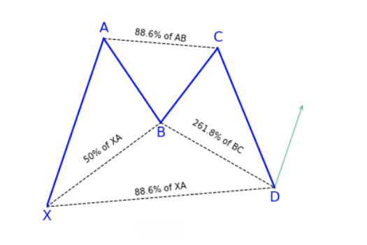

## Table of Contents

## What is the Harmonic Bat Pattern in trading?

The Harmonic Bat Pattern is a specific type of chart pattern used in trading to predict potential price movements. It is part of a group of patterns known as harmonic patterns, which are based on Fibonacci numbers. The Bat Pattern looks like the outline of a bat and helps traders find good times to buy or sell. It has specific points labeled X, A, B, C, and D. The pattern is complete when the price reaches point D, which is where traders often make their move.

To spot a Harmonic Bat Pattern, traders look for certain ratios between the price movements at these points. The key ratios are based on Fibonacci numbers. For example, the move from X to A should be in a specific ratio to the move from B to D. If these ratios match up correctly, it suggests that the pattern is valid and that the price might reverse at point D. Traders use this information to decide when to enter or exit a trade, hoping to profit from the expected price change.

## How does the Harmonic Bat Pattern differ from other harmonic patterns?

The Harmonic Bat Pattern is different from other harmonic patterns mainly because of its specific Fibonacci ratios and the shape it makes on the chart. While all harmonic patterns use Fibonacci numbers, the Bat Pattern has unique ratios that set it apart. For example, the move from point X to A should be about 0.886 of the move from X to D. This ratio is different from other patterns like the Gartley or Butterfly, which have their own specific ratios.

Another way the Bat Pattern differs is in its overall shape. It looks like a bat, with the wings formed by the price movements between points B, C, and D. This shape is more compact compared to other patterns like the Butterfly, which has a wider range. The Bat Pattern's compact nature means it can form in a shorter time frame, making it useful for traders who want to spot quick opportunities. In contrast, other patterns might take longer to develop, which can be better for traders looking at longer-term trends.

## What are the key Fibonacci levels used in identifying the Bat Pattern?

The Bat Pattern uses specific Fibonacci levels to help traders spot it on a chart. The main level to look for is the 0.886 retracement from the X to D move. This means that the price at point D should be about 88.6% of the distance from X to A. Another important level is the 0.382 to 0.50 retracement from the A to B move. This means that the price at point B should be between 38.2% and 50% of the distance from A to X.

The next key level is the 0.382 to 0.886 retracement from the B to C move. This means that the price at point C should be between 38.2% and 88.6% of the distance from B to A. Finally, the D point should be a 1.618 to 2.618 extension of the B to C move. This means that the price at D should be between 161.8% and 261.8% of the distance from B to C. These levels help traders confirm that they are looking at a real Bat Pattern and not just a random price movement.

## Can you explain the structure and formation of the Bat Pattern?

The Bat Pattern is a special shape that traders look for on price charts. It starts at a point called X and goes up or down to point A. From A, the price moves back a bit to point B, but not all the way back to X. It usually goes back about 38% to 50% of the distance from X to A. Then, the price moves again from B to C, going in the same direction as the move from X to A. This move from B to C can go back between 38% to 88% of the distance from A to B. Finally, the price makes a big move from C to D, which is the most important part of the pattern. The move from C to D should be about 161% to 261% of the distance from B to C, and it should end at a point that is about 88% of the distance from X to A.

When the price reaches point D, it's a signal for traders to pay attention. If the pattern is correct, the price might start to go the other way at D. Traders use this signal to decide when to buy or sell. The Bat Pattern is useful because it can form quickly on the chart, so traders can spot it and act fast. It's different from other patterns because of the specific distances between the points, which are based on special numbers called Fibonacci numbers. By looking for these distances, traders can tell if they're seeing a real Bat Pattern or just a random price move.

## What are the entry points for trading the Bat Pattern?

When trading the Bat Pattern, the main entry point is at point D. This is where the pattern finishes, and it's a good time to buy or sell. If the pattern is going up, you would buy at point D because you think the price will keep going up. If the pattern is going down, you would sell at point D because you think the price will keep going down. The key is to wait until the price reaches point D and then make your move.

Sometimes, traders also look for other entry points. One option is to enter the trade a bit before point D, maybe when the price is close to the 88.6% Fibonacci level. This can be a good idea if you want to get in early, but it's riskier because the pattern might not finish as expected. Another option is to wait for a little bit after point D, to see if the price really does start to move the other way. This can be safer, but you might miss out on some of the price move.

## How do you set stop-loss and take-profit levels when trading the Bat Pattern?

When trading the Bat Pattern, setting your stop-loss is important to limit how much money you could lose. For a bullish Bat Pattern, where you're buying at point D, you should put your stop-loss just below point D. This way, if the price goes down instead of up, you'll get out of the trade before losing too much. For a bearish Bat Pattern, where you're selling at point D, you should put your stop-loss just above point D. This protects you if the price goes up instead of down.

Setting your take-profit levels is about deciding when to get out of the trade to make a profit. A common way is to aim for the price to go back to point X. If you're in a bullish Bat Pattern, you'd want the price to go up to where it was at point X. If you're in a bearish Bat Pattern, you'd want the price to go down to where it was at point X. Another way is to use Fibonacci levels again. You could set take-profit levels at the 38.2%, 61.8%, or even 100% retracement of the move from X to D. This gives you different chances to take some profit as the price moves in your favor.

## What are the common mistakes traders make when using the Bat Pattern?

One common mistake traders make when using the Bat Pattern is not waiting for the pattern to fully form before entering a trade. They might get excited and jump in too early, before the price reaches point D. This can lead to false signals and losses because the pattern might not finish as expected. It's important to be patient and wait for the price to hit the 88.6% Fibonacci level at point D before making a move.

Another mistake is setting stop-losses too far away from point D. If the stop-loss is too far, it might not protect the trader from big losses if the price moves against them. It's better to set the stop-loss just below point D for a bullish pattern or just above point D for a bearish pattern. This way, the trader can limit their risk if the pattern fails. Also, some traders forget to use take-profit levels or set them too far away, which can lead to missing out on profits if the price doesn't reach the expected target.

## How can the Bat Pattern be used in different market conditions?

The Bat Pattern can be used in different market conditions, like when the market is going up, going down, or staying the same. In a trending market, where prices are clearly moving up or down, the Bat Pattern can help traders find good times to buy or sell. For example, if the market is going up and you see a bullish Bat Pattern, you might buy at point D because you think the price will keep going up. If the market is going down and you see a bearish Bat Pattern, you might sell at point D because you think the price will keep going down. The key is to use the pattern to spot where the trend might continue.

In a sideways market, where prices are not moving much in one direction, the Bat Pattern can still be useful. Traders can use it to find short-term opportunities to make money. For example, if the price is moving up and down in a small range, a Bat Pattern might form within that range. Traders can buy at point D of a bullish pattern hoping for a small upward move, or sell at point D of a bearish pattern hoping for a small downward move. This way, even in a market that's not trending, the Bat Pattern can help traders make profits from small price changes.

## What are the psychological aspects to consider when trading with the Bat Pattern?

When trading with the Bat Pattern, it's important to think about how you feel. Trading can make you feel excited or scared, and these feelings can make you do things you might not normally do. For example, if you see the Bat Pattern forming, you might get excited and want to jump into the trade before it's fully formed. But waiting until the pattern is complete is really important. If you rush in too early, you might lose money because the pattern might not finish the way you expect. So, it's good to stay calm and patient, even when you feel like you want to act quickly.

Another thing to think about is how you handle losing money. When you set your stop-loss and take-profit levels, you're trying to protect yourself from big losses and make sure you take some profit. But if the price moves against you and hits your stop-loss, it can feel bad. It's normal to feel upset or disappointed, but it's important not to let those feelings make you change your plan. Stick to your trading plan and don't let your emotions make you do something different. By staying calm and following your plan, you can trade the Bat Pattern more successfully.

## How can the Bat Pattern be combined with other technical indicators for better results?

The Bat Pattern can work even better if you use it with other technical indicators. One good one is the Relative Strength Index (RSI). The RSI helps you see if a stock is overbought or oversold. If you see a bullish Bat Pattern and the RSI is low, it might be a good time to buy because the stock could be ready to go up. On the other hand, if you see a bearish Bat Pattern and the RSI is high, it might be a good time to sell because the stock could be ready to go down. Using the RSI with the Bat Pattern can help you make better trading decisions.

Another helpful indicator to use with the Bat Pattern is moving averages. Moving averages smooth out price data to help you see the overall trend. If you see a bullish Bat Pattern and the price is above a key moving average, like the 50-day or 200-day moving average, it might be a stronger sign that the price will keep going up. If you see a bearish Bat Pattern and the price is below a key moving average, it might be a stronger sign that the price will keep going down. By combining the Bat Pattern with moving averages, you can get a clearer picture of the market and make smarter trades.

## What are some real-life examples of successful trades using the Bat Pattern?

One real-life example of a successful trade using the Bat Pattern happened in the stock market with a company called Apple. A trader noticed a bullish Bat Pattern forming on Apple's stock chart. The price moved from point X to A, then back to B, and then up to C. When the price reached point D, which was about 88.6% of the move from X to A, the trader bought the stock. The price then started to go up, just like the pattern predicted. The trader set a take-profit at the previous high at point X and made a good profit when the price reached that level.

Another example was in the [forex](/wiki/forex-system) market with the EUR/USD currency pair. A trader saw a bearish Bat Pattern forming. The price moved from point X to A, then back up to B, and then down to C. When the price hit point D, which was about 88.6% of the move from X to A, the trader sold the currency pair. The price then started to go down, following the pattern. The trader set a take-profit at the previous low at point X and made a profit when the price reached that level. Both of these examples show how the Bat Pattern can help traders make money if they follow the pattern carefully.

## How can one backtest and optimize the Bat Pattern trading strategy?

To backtest and optimize the Bat Pattern trading strategy, you need to look at past price data to see how well the pattern would have worked. You can use special software or trading platforms that let you go back in time and see if buying or selling at point D would have made money. You should also try different settings for your stop-loss and take-profit levels to see which ones work best. For example, you might find that setting your take-profit at the 61.8% Fibonacci level instead of at point X gives you better results. By testing the pattern on lots of different charts and time periods, you can learn what works best and make your strategy better.

Once you have backtested the Bat Pattern, you can start to optimize it. This means making small changes to see if you can make more money or lose less. You might try using the pattern with different time frames, like looking at hourly charts instead of daily charts, to see if it works better on one than the other. You can also combine the Bat Pattern with other indicators, like the RSI or moving averages, to see if they help you make better trades. By trying out these different ideas and seeing what works, you can fine-tune your strategy to fit your trading style and the markets you trade in.

## References & Further Reading

[1]: Carney, S. M. (2010). ["Harmonic Trading, Volume One: Profiting from the Natural Order of the Financial Markets."](https://www.amazon.com/Harmonic-Trading-One-Profiting-Financial/dp/0137051506) FT Press.

[2]: Carney, S. M. (2010). ["Harmonic Trading, Volume Two: Advanced Strategies for Profiting from the Natural Order of the Financial Markets."](https://www.amazon.com/Harmonic-Trading-Two-Strategies-Profiting/dp/0137051514) FT Press.

[3]: J. J. Murphy. (1999). ["Technical Analysis of the Financial Markets: A Comprehensive Guide to Trading Methods and Applications."](https://www.amazon.com/Technical-Analysis-Financial-Markets-Comprehensive/dp/0735200661) New York Institute of Finance.

[4]: ["Algorithmic Trading: Winning Strategies and Their Rationale"](https://www.wiley.com/en-us/Algorithmic+Trading%3A+Winning+Strategies+and+Their+Rationale-p-9781118460146) by Ernest P. Chan

[5]: Pesavento, L. R., & Jouflas, R. (2009). ["Fibonacci Ratios with Pattern Recognition."](https://books.google.com/books/about/Trade_What_You_See.html?id=_iiPDwAAQBAJ) Traders Press.