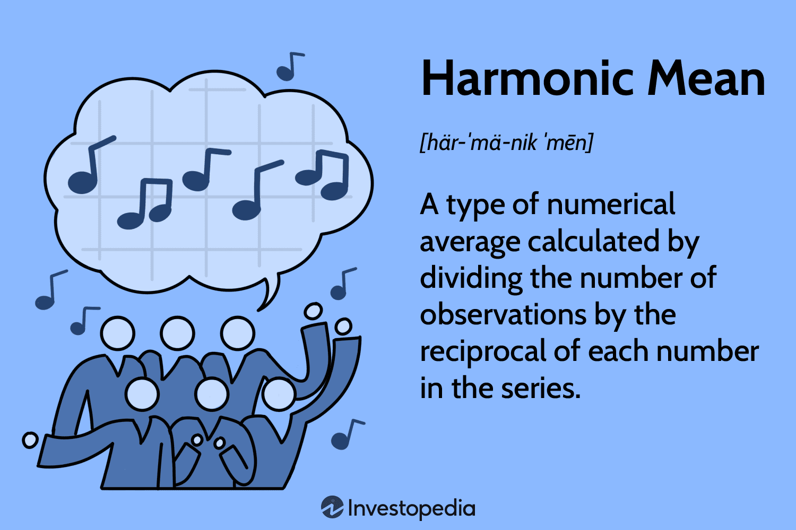

## Table of Contents

## What is the harmonic mean and how is it defined mathematically?

The harmonic mean is a type of average that is used when dealing with rates or ratios. It is especially useful when you want to find the average of numbers that represent speeds or other quantities that are measured over time. The harmonic mean gives less weight to larger numbers and more weight to smaller numbers, which makes it different from the arithmetic mean, where all numbers are treated equally.

Mathematically, the harmonic mean is calculated by taking the reciprocal of the numbers you are averaging, finding the arithmetic mean of these reciprocals, and then taking the reciprocal of that result. For example, if you have the numbers 1, 2, and 3, you would first find the reciprocals, which are 1/1, 1/2, and 1/3. Then, you find the arithmetic mean of these reciprocals, which is (1 + 1/2 + 1/3) divided by 3. This equals about 0.579. Finally, you take the reciprocal of 0.579, which gives you the harmonic mean of about 1.727.

## How does the harmonic mean differ from the arithmetic and geometric means?

The harmonic mean is different from the arithmetic and geometric means in how it calculates the average of a set of numbers. The arithmetic mean, or what we usually call the average, is found by adding up all the numbers and then dividing by how many numbers there are. It treats all numbers the same, so big numbers have the same impact as small numbers. The geometric mean, on the other hand, is used for numbers that grow at a steady rate, like population growth or investment returns. You find it by multiplying all the numbers together and then taking the root of that product that matches the number of values you started with. It's good for smoothing out extreme values and is often used in finance and biology.

The harmonic mean, however, focuses on rates and ratios. It's calculated by taking the reciprocals of the numbers, finding the arithmetic mean of those reciprocals, and then taking the reciprocal of that result. This method gives more weight to smaller numbers and less to larger ones. For example, if you're looking at the average speed of a trip where you travel different distances at different speeds, the harmonic mean would give you a better idea of your overall average speed than the arithmetic mean. It's why the harmonic mean is often used in situations where you're dealing with rates, like fuel efficiency or speed.

## Can you provide a simple example of calculating the harmonic mean?

Let's say you want to find the harmonic mean of the numbers 2, 3, and 6. First, you need to find the reciprocals of these numbers. The reciprocal of 2 is 1/2, the reciprocal of 3 is 1/3, and the reciprocal of 6 is 1/6. Now, you add these reciprocals together: 1/2 + 1/3 + 1/6. To add these fractions, you need a common denominator. The least common denominator for 2, 3, and 6 is 6, so you can rewrite the fractions as 3/6, 2/6, and 1/6. Adding them up gives you 3/6 + 2/6 + 1/6, which equals 6/6, or 1.

Next, you find the arithmetic mean of these reciprocals. Since you have three numbers, you divide the sum of the reciprocals (which is 1) by 3. So, 1 divided by 3 is 1/3. The last step is to take the reciprocal of this result. The reciprocal of 1/3 is 3. Therefore, the harmonic mean of the numbers 2, 3, and 6 is 3.

## In what types of problems or scenarios is the harmonic mean most useful?

The harmonic mean is really handy when you're dealing with rates or ratios. Imagine you're figuring out the average speed of a trip where you drive different distances at different speeds. The harmonic mean helps you get a better idea of your overall average speed than just using the regular average. It's also great for things like figuring out average fuel efficiency, because it takes into account how the rate changes over different parts of a journey.

Another place where the harmonic mean is useful is in finance, especially when you're looking at investment returns over time. If you have investments that grow at different rates, the harmonic mean can give you a clearer picture of the average growth rate. It's all about understanding how rates work together, which makes the harmonic mean a key tool in situations where the size of the numbers matters less than how they relate to each other.

## How is the harmonic mean used in statistics?

In statistics, the harmonic mean is often used when you're dealing with rates or ratios. For example, if you're trying to find the average speed of a trip where you drive different distances at different speeds, the harmonic mean gives you a better idea of your overall average speed than the regular average. This is because it focuses on the rate at which you're traveling, not just the total distance or time.

Another way the harmonic mean is used in statistics is in finance, like when you're looking at investment returns over time. If you have investments that grow at different rates, the harmonic mean can help you figure out the average growth rate more accurately. It's all about understanding how rates work together, which makes the harmonic mean a useful tool in situations where the size of the numbers matters less than how they relate to each other.

## What are the properties of the harmonic mean?

The harmonic mean is a special kind of average that works well when you're looking at rates or ratios. It's different from the regular average, which is called the arithmetic mean, because it gives more weight to smaller numbers and less weight to bigger ones. This means if you have a set of numbers with one really big number, the harmonic mean won't be pulled as much toward that big number as the regular average would be. For example, if you're figuring out the average speed of a trip where you drive different distances at different speeds, the harmonic mean gives you a better idea of your overall average speed.

Another important thing about the harmonic mean is that it's always smaller than or equal to the arithmetic mean. This is because the harmonic mean focuses on the rates, not just the numbers themselves. It's especially useful in situations where you're dealing with things like speed, fuel efficiency, or investment returns. If you have numbers that grow at different rates, the harmonic mean helps you understand the average growth rate more accurately. It's a great tool when you need to balance out the impact of different numbers in a set.

## How does the harmonic mean behave with respect to outliers compared to other means?

The harmonic mean is good at dealing with outliers, which are numbers that are much bigger or smaller than the others. When you have an outlier in your set of numbers, it can really change the regular average, or arithmetic mean. But the harmonic mean doesn't let outliers pull the average as much. It does this by focusing on the rates or ratios of the numbers instead of their actual size. So if you have one really big number in your set, the harmonic mean will still give you a result that's closer to the smaller numbers.

This makes the harmonic mean really useful in situations where you're looking at things like speed or fuel efficiency. Imagine you're figuring out the average speed of a trip where you drive different distances at different speeds. If you have one part of the trip where you go really fast, that might make the regular average speed seem higher than it really is for the whole trip. But the harmonic mean will balance that out by paying more attention to the slower parts of the trip. So it gives you a better idea of your overall average speed.

## Can you explain the relationship between the harmonic mean and rates, such as speed or rate of work?

The harmonic mean is really useful when you're dealing with rates, like speed or how fast you can do work. Imagine you're driving a car and you go different speeds for different parts of your trip. The harmonic mean helps you figure out your overall average speed better than the regular average. It does this by looking at how long you spend at each speed, not just the total distance you traveled. So if you drive really fast for a short distance and then slow down for a longer distance, the harmonic mean will give you a more accurate average speed for the whole trip.

Another way the harmonic mean works well with rates is when you're looking at how fast you can do different jobs. Let's say you can paint a room in 2 hours and then another room in 3 hours. The harmonic mean can help you find out how long it would take you to paint both rooms if you worked at a steady pace. It does this by looking at the rates at which you work, not just the total time. So it's a great tool for understanding how different rates combine to give you an overall average rate.

## How is the harmonic mean applied in finance, particularly in the context of investment returns?

The harmonic mean is really helpful when you're looking at investment returns over time. Imagine you have different investments that grow at different rates. The harmonic mean can help you figure out the average growth rate of all your investments together. It does this by focusing on the rates of return, not just the total amount of money you make. So if you have one investment that grows really fast for a short time and another that grows slower but for longer, the harmonic mean will give you a better idea of your overall average return.

In finance, this is important because it helps you understand how your money is growing over time. If you just use the regular average, or arithmetic mean, a really high return from one investment might make it look like your overall returns are better than they really are. But the harmonic mean balances that out by giving more weight to the slower-growing investments. This way, you get a clearer picture of how your portfolio is doing, which can help you make better decisions about where to put your money.

## What are some limitations or potential misuses of the harmonic mean?

The harmonic mean can be tricky to use because it's not always the best choice for every situation. It works really well when you're looking at rates or ratios, like figuring out average speed or investment returns. But if you try to use it with numbers that don't have anything to do with rates, you might get a result that doesn't make sense. For example, if you're trying to find the average height of a group of people, using the harmonic mean instead of the regular average could give you a number that's too low and not useful.

Another thing to watch out for is that the harmonic mean can be really sensitive to small numbers. If you have a set of numbers and one of them is very close to zero, the harmonic mean can get really big or even go to infinity. This is because you have to take the reciprocal of the numbers, and the reciprocal of a number close to zero is a very big number. So, you need to be careful when using the harmonic mean with data that includes very small numbers, because it might not give you a good picture of what's going on.

## How can the harmonic mean be generalized to more than two numbers, and what is the formula for this?

The harmonic mean can be used with more than two numbers. It's a way to find the average of a bunch of numbers that works well when you're looking at rates or ratios. To find the harmonic mean of a set of numbers, you first take the reciprocal of each number. The reciprocal is just 1 divided by the number. Then, you find the regular average of these reciprocals. Finally, you take the reciprocal of that average to get the harmonic mean.

The formula for the harmonic mean of a set of numbers is simple. If you have numbers like a, b, c, and so on, the harmonic mean is 1 divided by the average of the reciprocals of these numbers. So, if you have n numbers, the formula looks like this: Harmonic Mean = n / (1/a + 1/b + 1/c + ... + 1/n). This formula helps you figure out the harmonic mean no matter how many numbers you have, as long as none of them are zero.

## Are there any advanced applications or theoretical extensions of the harmonic mean in fields like signal processing or information theory?

In signal processing, the harmonic mean can be used to analyze and process signals that involve rates or frequencies. For example, when dealing with audio signals, the harmonic mean can help smooth out the impact of extreme values in the signal, which can be useful for noise reduction or enhancing certain aspects of the sound. It's particularly handy when you need to average the frequencies of different parts of a signal to get a clearer picture of the overall frequency content. This can be important in applications like speech processing or music analysis, where understanding the harmonic structure of the signal is key.

In information theory, the harmonic mean can be applied to measure the average rate of information flow in a system. When you're looking at how information is transmitted or processed, the harmonic mean helps you understand the overall rate more accurately, especially when different parts of the system operate at different speeds. This can be useful in designing communication systems or analyzing data networks, where you need to balance out the rates at which information is being sent and received. By using the harmonic mean, you can get a better sense of the system's performance and make more informed decisions about how to optimize it.

## What is the Harmonic Mean?

The harmonic mean is a statistical measure used to determine the central tendency of a data set. It is classified as one of the Pythagorean means, which also includes the arithmetic and geometric means. Unlike other means, the harmonic mean is particularly suited for situations involving rates or ratios, such as financial markets where averaging price multiples like the price-to-earnings ratio is necessary.

Mathematically, the harmonic mean $H$ of a dataset containing $n$ numbers $x_1, x_2, \ldots, x_n$ is calculated using the formula:

$$
H = \frac{n}{\frac{1}{x_1} + \frac{1}{x_2} + \cdots + \frac{1}{x_n}}
$$

In simpler terms, the harmonic mean is the reciprocal of the arithmetic mean of the reciprocals of the dataset values. This property makes it a valuable tool for dealing with variables and rates that are better expressed in relation to other quantities, providing a more appropriate average in these contexts. For instance, if two stocks have price-to-earnings (P/E) ratios that differ significantly, the harmonic mean will give more weight to the smaller values, thereby providing a truer reflection of the average ratio.

Here is a Python function that calculates the harmonic mean for a given list of numbers:

```python
def harmonic_mean(data):
    n = len(data)
    if n == 0:
        return 0
    sum_of_reciprocals = sum(1/x for x in data if x != 0)
    return n / sum_of_reciprocals if sum_of_reciprocals != 0 else 0

# Example usage
numbers = [16, 8, 4]
print("Harmonic Mean:", harmonic_mean(numbers))
```

This computation highlights the harmonic mean's sensitivity to small values, contrasting it with the arithmetic mean, which might skew higher due to larger numbers in the dataset. This sensitivity is critical in applications like [algorithmic trading](/wiki/algorithmic-trading), where precise mean calculation can influence trading strategies significantly.

## What are the Calculation and Formula?

To compute the harmonic mean of a dataset, follow a systematic approach involving the reciprocals of the data values. The process consists of three main steps:

1. **Calculate the reciprocals:** For each number in the dataset, compute its reciprocal. For instance, if the dataset contains the values $x_1, x_2, \ldots, x_n$, the reciprocals are $\frac{1}{x_1}, \frac{1}{x_2}, \ldots, \frac{1}{x_n}$.

2. **Find the arithmetic mean of the reciprocals:** Sum the calculated reciprocals and divide by the number of observations. Mathematically, this is expressed as:
$$
   \text{Arithmetic mean of reciprocals} = \frac{\sum_{i=1}^{n} \left(\frac{1}{x_i}\right)}{n}

$$

   where $n$ is the total number of data points.

3. **Take the reciprocal of the arithmetic mean:** Finally, take the reciprocal of the mean obtained in the second step to get the harmonic mean:
$$
   \text{Harmonic Mean} = \frac{n}{\sum_{i=1}^{n} \left(\frac{1}{x_i}\right)}

$$

For example, consider a dataset with the numbers 1, 4, and 4. The calculation proceeds as follows:

- Step 1: Calculate reciprocals: $\frac{1}{1} = 1$, $\frac{1}{4} = 0.25$, $\frac{1}{4} = 0.25$.
- Step 2: Find the arithmetic mean of reciprocals: 
$$
  \text{Arithmetic mean} = \frac{1 + 0.25 + 0.25}{3} = \frac{1.5}{3} = 0.5

$$
- Step 3: Take the reciprocal: 
$$
  \text{Harmonic Mean} = \frac{3}{1.5} = 2

$$

Alternatively, you can compute this in Python:

```python
def harmonic_mean(data):
    n = len(data)
    reciprocal_sum = sum(1/x for x in data)
    return n / reciprocal_sum

data = [1, 4, 4]
print(harmonic_mean(data))  # Output: 2.0
```

This method is particularly useful where the dataset involves rates or ratios, ensuring a balanced average when some values are significantly smaller compared to others.

## What are the applications in algorithmic trading?

In algorithmic trading, incorporating statistical measures is critical for effective market analysis and subsequent decision-making. The harmonic mean is particularly advantageous in averaging price multiples, such as the price-to-earnings (P/E) ratio, due to its unique ability to prioritize smaller numbers within a dataset. This property is crucial when handling datasets with significant outliers or extreme values, which are common in financial markets.

Unlike the arithmetic mean, which can be skewed by large numbers, the harmonic mean offers a more balanced view by reducing the impact of extreme values. This characteristic makes it a desirable tool for algorithmic traders who need accurate and reliable averages to guide their strategies. The harmonic mean is mathematically represented as:

$$
H = \frac{n}{\sum_{i=1}^{n} \frac{1}{x_i}}
$$

where $H$ is the harmonic mean, $n$ is the number of terms, and $x_i$ represents each individual value in the dataset. For instance, in a scenario where a trader analyzes a set of rate-based data points, using the harmonic mean would result in smaller rates having a stronger influence on the average, thereby mitigating the effect of outlier values.

Algorithmic traders employ the harmonic mean to detect potential market trends and reversals. Its focus on smaller values is ideal when assessing datasets involving rates and multiples, allowing traders to obtain a realistic picture of market conditions without the distortion caused by unusually high values. The application of the harmonic mean in algorithmic trading can be implemented in Python as follows:

```python
def harmonic_mean(data):
    if not data or any(x == 0 for x in data):
        return None  # Return None for invalid data with zeros
    return len(data) / sum(1/x for x in data)

# Example usage
rates = [1.2, 1.5, 3.0, 0.5]
h_mean = harmonic_mean(rates)

print("Harmonic Mean:", h_mean)
```

In this Python code, the `harmonic_mean` function calculates the harmonic mean of a list of rate data, providing a practical example of its use in algorithmic trading scenarios. By prioritizing smaller values, traders can gain insights into potential market reversals and trends that could be missed with other types of averages. Understanding and integrating the harmonic mean into trading algorithms allows for nuanced analyses and contributes to more informed trading decisions in the highly dynamic financial markets.

## How does it compare with other means?

The harmonic mean, arithmetic mean, and geometric mean each have distinct applications and characteristics, making them suitable for different types of datasets.

The arithmetic mean is the most commonly used measure of central tendency, especially suitable for datasets with a uniform distribution. It is calculated by summing the values of the dataset and dividing by the number of observations:

$$
\text{Arithmetic Mean} = \frac{\sum_{i=1}^{n} x_i}{n}
$$

where $x_i$ represents each individual value in the dataset, and $n$ is the total number of observations. This mean is straightforward and effective for datasets where all values contribute equally to the average.

In contrast, the geometric mean is particularly effective for datasets that involve multiplicative processes or growth rates. It is calculated by taking the $n$-th root of the product of the dataset values:

$$
\text{Geometric Mean} = \left(\prod_{i=1}^{n} x_i \right)^{\frac{1}{n}}
$$

This mean is beneficial in scenarios like calculating compound interest, where rates are multiplied over time.

The harmonic mean, meanwhile, is most suitable for datasets characterized by rates or ratios. Its value is computed as the reciprocal of the arithmetic mean of the reciprocals of the dataset values:

$$
\text{Harmonic Mean} = \frac{n}{\sum_{i=1}^{n} \frac{1}{x_i}}
$$

This mean is particularly impactful for datasets with significant variations, where smaller values influence the mean more substantially. For example, when averaging speed or price-to-earnings ratios in finance, the harmonic mean tends to provide a more balanced perspective than the arithmetic mean, especially in the presence of outliers.

Traders often choose among these means based on the data nature and specific trading strategy requirements. For instance, while analyzing price-to-earnings ratios, the harmonic mean is preferred due to its sensitivity to changes in smaller values—contrasting the arithmetic mean, which might skew results towards higher values. Understanding these differences allows traders and analysts to employ the most appropriate method for accurate market analysis and effective decision-making.

## What are examples of harmonic mean in trading?

In trading, calculating the harmonic mean offers a nuanced approach to averaging that can emphasize smaller values and rates, providing more balanced insights when dealing with financial data. One practical example involves calculating the harmonic mean of price-to-earnings (P/E) ratios for an index comprised of stocks with varying market capitalizations and earnings. The harmonic mean here provides a more balanced view than the weighted arithmetic mean. Given the P/E ratios of two stocks, $\text{P/E}_1$ and $\text{P/E}_2$, the harmonic mean can be calculated using the formula:

$$
\text{Harmonic Mean} = \frac{2}{\left(\frac{1}{\text{P/E}_1} + \frac{1}{\text{P/E}_2}\right)}
$$

This method proves useful when smaller P/E ratios hold more significance in the overall calculation, as the harmonic mean is particularly sensitive to small values.

Traders also integrate harmonic patterns like the Gartley or Bat pattern in technical market analysis using Fibonacci retracement levels. The Gartley pattern, characterized by specific Fibonacci measurements, helps traders identify potential market reversals. The Bat pattern, another derivative of this approach, uses more stringent Fibonacci levels to anticipate movements. These harmonic patterns assist traders in predicting key turning points in the market, optimizing entry and [exit](/wiki/exit-strategy) strategies to capitalize on potential reversals more effectively.

Incorporating harmonic means and patterns, traders can improve the precision of their market analysis, thereby strengthening decision-making processes in trading environments.

## What are the advantages and challenges?

The harmonic mean provides a nuanced approach to handling datasets that often include skewed distributions or significant outliers. In financial contexts, particularly algorithmic trading, this feature is incredibly advantageous. The harmonic mean’s sensitivity to smaller values makes it effective for emphasizing lower rates and ratios, which can be crucial for identifying trading opportunities that might be overlooked by using arithmetic or geometric means. This characteristic is particularly useful when dealing with financial ratios like the price-to-earnings (P/E) ratio, where smaller values can signify undervaluation opportunities.

However, employing the harmonic mean is not without its challenges. One primary issue is the complexity involved in its calculation. The harmonic mean is computed by the formula:

$$

HM = \frac{n}{\sum_{i=1}^{n}\frac{1}{x_i}}
$$

where $n$ is the number of data points and $x_i$ represents each individual data point. This calculation mandates that none of the values in the dataset be zero. The presence of a zero would cause division by zero, rendering the harmonic mean undefined. Consequently, traders and analysts must exercise diligence in pre-processing data to ensure no zero values exist, which can complicate data handling, especially in large datasets.

Moreover, the harmonic mean is less intuitive than the arithmetic mean, which makes it harder to communicate insights to audiences less familiar with its mathematical properties. Care must be taken to contextualize the use of the harmonic mean, ensuring that its implications are clearly understood within the broader analytical framework.

These challenges underscore the importance of understanding the conditions and scenarios that justify the application of the harmonic mean, enabling practitioners to maximize its benefits while navigating its complexities effectively.

## References & Further Reading

[1]: Bergstra, J., Bardenet, R., Bengio, Y., & Kégl, B. (2011). ["Algorithms for Hyper-Parameter Optimization."](https://dl.acm.org/doi/10.5555/2986459.2986743) Advances in Neural Information Processing Systems 24.

[2]: ["Advances in Financial Machine Learning"](https://www.amazon.com/Advances-Financial-Machine-Learning-Marcos/dp/1119482089) by Marcos Lopez de Prado

[3]: ["Evidence-Based Technical Analysis: Applying the Scientific Method and Statistical Inference to Trading Signals"](https://www.amazon.com/Evidence-Based-Technical-Analysis-Scientific-Statistical/dp/0470008741) by David Aronson

[4]: ["Machine Learning for Algorithmic Trading"](https://github.com/PacktPublishing/Machine-Learning-for-Algorithmic-Trading-Second-Edition) by Stefan Jansen

[5]: ["Quantitative Trading: How to Build Your Own Algorithmic Trading Business"](https://books.google.com/books/about/Quantitative_Trading.html?id=j70yEAAAQBAJ) by Ernest P. Chan