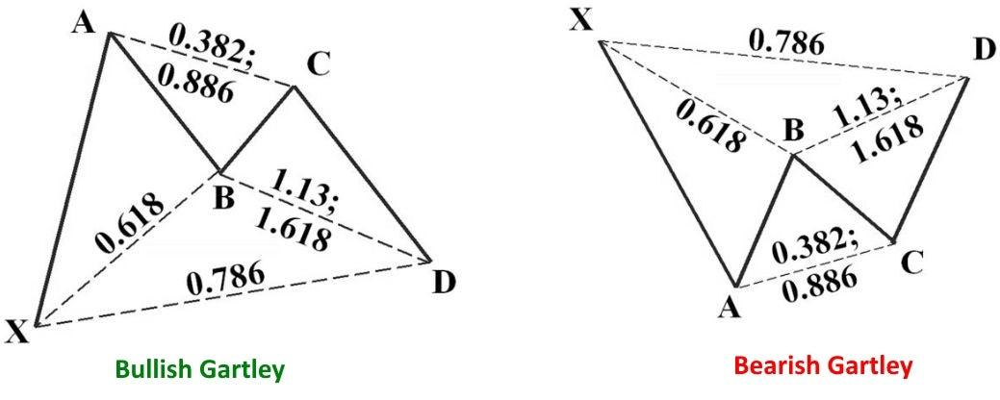

Harmonic patterns have become an indispensable tool in the arsenal of currency market traders, particularly within algorithmic trading. These patterns involve geometric price formations that are based on Fibonacci retracement and extension levels. By analyzing past price movements, harmonic patterns aim to forecast potential reversal zones where currency pairs might turn direction. Traders often rely on these patterns to identify entry and exit points with higher accuracy.

The use of harmonic patterns in algorithmic trading provides a structured methodology for predicting market movements. Given their reliance on Fibonacci numbers, these patterns can be effectively coded into trading systems. Fibonacci numbers play a crucial role in defining the harmonic patterns, as they establish the mathematical ratios that dictate pattern formation. For example, common ratios like 0.618 (the Golden Ratio) are often used to determine key points in a pattern.



The integration of harmonic patterns into automated trading strategies offers significant benefits. Algorithmic systems can consistently scan the market to detect the emergence of these patterns, thus enabling traders to capitalize on trading opportunities promptly. This method reduces the emotional bias inherent in manual trading and allows for precise execution of trades based on predefined rules.

As we explore the mechanics of harmonic patterns, we'll address how traders can optimize their trading strategies by incorporating these patterns into algorithmic systems. This involves understanding the specific criteria that define each pattern, such as the Gartley, Butterfly, Bat, and Crab patterns, and how these can provide valuable insights for making informed trading decisions. By mastering the techniques associated with harmonic patterns, traders can enhance their ability to predict market reversals and trends, ultimately leading to improved trading performance.

## Table of Contents

## Understanding Harmonic Patterns in Currency Markets

Harmonic patterns in currency markets are sophisticated tools used by traders to predict market movements and identify potential reversal zones. These geometric patterns are rooted in Fibonacci numbers, which are a sequence of numbers where each number is the sum of the two preceding ones, commonly starting with 0 and 1. The application of Fibonacci numbers in harmonic patterns involves calculating retracement and extension levels, which help determine the potential support and resistance levels in currency trading.

Harmonic patterns like the Gartley, Butterfly, Bat, and Crab are some of the most popular configurations used by traders to analyze market trends. Each pattern is unique in its structure and interpretation but shares a common foundation in Fibonacci-based geometry.

1. **The Gartley Pattern**: This pattern is a reliable indicator for identifying continuation or reversal trends. It is constructed based on Fibonacci ratios such as 0.618 and 0.786, which help traders anticipate potential corrections within a prevailing market trend.

2. **The Butterfly Pattern**: Known for its ability to show extreme market reversals, the Butterfly pattern extends beyond the initial point of the pattern, involving Fibonacci levels like 1.272 and 1.618.

3. **The Bat Pattern**: Characterized by its precise retracement levels, the Bat pattern uses specific Fibonacci ratios to determine entry points with lower risk. Its geometric structure allows traders to forecast potential market reversals effectively.

4. **The Crab Pattern**: This pattern is similar to the Butterfly pattern but with deeper retracement levels, often incorporating Fibonacci extensions like 2.618. Its long leg structure helps in identifying very exact reversal points and is known for its accuracy in high volatility situations.

Understanding these harmonic patterns requires a comprehensive knowledge of Fibonacci retracement and extension levels. Traders frequently use these levels to predict price movements and reversals. The calculation of these levels is easily facilitated by many trading platforms, but the underlying logic can be expressed through mathematical expressions and programming logic, often using a software tool like Python for automation and analysis. Here is a basic example of calculating Fibonacci retracement levels in Python:

```python
def fibonacci_retracement(high, low):
    difference = high - low
    levels = {
        '23.6%': high - difference * 0.236,
        '38.2%': high - difference * 0.382,
        '50.0%': high - difference * 0.500,
        '61.8%': high - difference * 0.618,
        '76.4%': high - difference * 0.764,
    }
    return levels

# Example usage:
high = 1.2040
low = 1.1940
retracement_levels = fibonacci_retracement(high, low)
print(retracement_levels)
```

In summary, harmonic patterns are a pivotal part of [forex](/wiki/forex-system) trading, offering a way to map market price patterns through Fibonacci ratios. This not only aids traders in recognizing potential trading opportunities but also enhances decision-making with a structured approach to market analysis.

## Types of Harmonic Patterns

Harmonic patterns are pivotal in technical analysis and are favored for their ability to predict future price movements in the currency markets. These patterns rest on the principle of Fibonacci ratios, which dictate the geometry of price action. Here, we explore the four primary harmonic patterns: the Gartley, Butterfly, Bat, and Crab.

1. **The Gartley Pattern**: This pattern is one of the earliest and most recognized harmonic patterns, introduced by H.M. Gartley in his 1935 book "Profits in the Stock Market." The pattern is characterized by its reliance on specific Fibonacci ratios and is utilized to identify potential upward corrections within a bearish trend. It is identified by the sequence of five points (X, A, B, C, D) that create the pattern. The key Fibonacci ratios include:

   - AB retracement of XA should be 61.8%.
   - BC retracement of AB should be between 38.2% and 88.6%.
   - CD retracement of BC should be either 127.2% or 161.8%.

   The completion of the pattern at point D offers potential entry points for traders to anticipate reversals.

2. **The Butterfly Pattern**: This pattern is known for its distinctive shape that extends beyond its initial starting point, often suggesting significant price reversals. Developed by Bryce Gilmore, the Butterfly pattern indicates market reversals via a four-leg structure defined by Fibonacci levels:

   - AB retracement of XA should be 78.6%.
   - BC retracement of AB ranges between 38.2% and 88.6%.
   - CD projection may extend from 161.8% to even 261.8% of the BC leg.

   The pattern is completed when the price reaches the D point, indicating a potential trading opportunity.

3. **The Bat Pattern**: Scott Carney introduced the Bat pattern, emphasizing its precision in structure, which allows traders to identify optimal entry points with controlled risk levels. The Bat pattern involves:

   - AB retracement of XA is typically 38.2% or 50%.
   - BC can retrace between 38.2% to 88.6% of AB.
   - The CD extension is usually 161.8% to 261.8% of BC, with D offering a strong reversal signal.

   The Bat pattern, due to its stringent Fibonacci alignments, often results in highly favorable risk-reward ratios.

4. **The Crab Pattern**: Also conceptualized by Scott Carney, the Crab pattern stands out for its long legs, providing precise reversal points. It is recognized as one of the most accurate but also complex patterns to identify. Its components include:

   - AB retracement of XA around 88.6%.
   - BC retracement between 38.2% and 88.6%.
   - CD extension is dramatic, often reaching 224% or more of the BC leg.

   The unique aspect of the Crab pattern is its extreme CD extension compared to other harmonic formations, providing distinct reversal signals.

These harmonic patterns offer traders a framework to anticipate potential market reversals, enhancing their strategic approach to trading. Understanding and applying these patterns require keen attention to Fibonacci ratios, which are integral to their construction and execution.

## Implementing Harmonic Patterns in Algorithmic Trading

Algorithmic trading systems are increasingly utilizing harmonic patterns to enhance trading strategies through automation. These patterns, which rely heavily on geometric shapes and Fibonacci numbers to anticipate market moves, can be seamlessly integrated into algorithmic systems. By leveraging pre-defined rules based on Fibonacci retracement and extension levels, traders can create robust algorithms capable of identifying and acting on these patterns swiftly.

Software for [algorithmic trading](/wiki/algorithmic-trading) is equipped to scan vast amounts of market data, identifying harmonic patterns such as the Gartley, Butterfly, Bat, and Crab efficiently. Once detected, these algorithms enable swift execution of trades, capitalizing on potential reversal points that these patterns predict. For instance, a typical algorithm could be programmed to trigger a buy order when a complete Gartley pattern is identified, indicating a potential market reversal.

```python
# Example of a simplified algorithmic trigger in Python for a Gartley pattern
def detect_gartley(price_data):
    # price_data is a list of historical prices
    # Check for specific Fibonacci retracements typical of a Gartley pattern:
    # AB retracement should be 0.618 of XA, BC should be 0.382 or 0.886 of AB, etc.

    for i in range(len(price_data)-5):
        XA = price_data[i+1] - price_data[i]
        AB = price_data[i+2] - price_data[i+1]
        BC = price_data[i+3] - price_data[i+2]
        CD = price_data[i+4] - price_data[i+3]

        if 0.618*XA <= AB <= 0.786*XA and 0.382*AB <= BC <= 0.886*AB:
            # Further conditions for CD leg can be added
            print("Potential Gartley pattern detected")
            return i+4  # Returns point of pattern completion
    return None

# Sample call to the function assuming some price data
price_data = [1.1000, 1.1050, 1.1030, 1.1080, 1.1060, 1.1095]
pattern_position = detect_gartley(price_data)
if pattern_position:
    print(f"Gartley pattern detected ending at position {pattern_position}")
```

Risk management is a crucial [factor](/wiki/factor-investing) when implementing harmonic patterns algorithmically. Since these patterns are predictive by nature, it is vital to incorporate risk management measures such as setting accurate stop-loss levels. These stop-loss levels are ideally based on Fibonacci extensions derived from the pattern’s calculated potential reversal zone (PRZ). Such a practice minimizes potential losses from false signals or unexpected market [volatility](/wiki/volatility-trading-strategies).

Automated systems thus allow for executing trades at optimal points without the need for constant manual monitoring. With algorithmic trading, traders can capture opportunities continuously, even outside normal trading hours, providing an advantage over manual trading strategies. However, it is essential to continually refine these algorithms to adapt to changing market conditions and ensure they maintain high efficacy.

## Backtesting and Fine-Tuning Strategies

Backtesting plays a vital role in assessing the validity of harmonic patterns in algorithmic trading systems. This process involves evaluating trading strategies against historical data to ascertain their performance before actual market application. The primary objective is to determine the reliability and profitability of these strategies.

One significant challenge in [backtesting](/wiki/backtesting) harmonic patterns lies in their subjective interpretation. Unlike clear-cut indicators, harmonic patterns require the identification of specific geometric formations within price data, often influenced by individual judgment. This subjectivity can lead to inconsistencies, making it essential for traders to standardize pattern recognition through algorithms that remove human bias.

Moreover, these algorithms must adapt to dynamic market conditions. Markets are not static; they evolve due to various external factors, such as economic indicators and geopolitical events. Successful backtesting requires an algorithm capable of adjusting its parameters to align with current market behavior. This adaptability can be achieved through [machine learning](/wiki/machine-learning), enabling systems to refine their approach as new data and outcomes are reviewed.

The continuous review and refinement of strategies based on historical data are crucial. Backtesting is not a one-time procedure; it demands ongoing experimentation and optimization. By analyzing historical performance, traders can spot weaknesses in their strategies and adjust accordingly. A feedback loop should be established where strategies are consistently tested and fine-tuned, ensuring robust trading performance.

Implementing machine learning techniques offers a promising avenue for improving pattern recognition and forecasting accuracy. For instance, neural networks can be trained to recognize harmonic patterns by learning from large datasets, which improves their ability to identify potential trading signals. Python libraries such as TensorFlow or PyTorch can be utilized to build and train these models, allowing for sophisticated pattern detection.

In conclusion, the backtesting of harmonic patterns in algorithmic trading systems is multifaceted, requiring attention to subjectivity, adaptability, and continuous enhancement. By leveraging machine learning, traders can develop systems capable of precise pattern recognition, leading to improved trading outcomes.

## Conclusion: Mastering Harmonic Patterns in Algo Trading

Harmonic patterns, when effectively integrated into algorithmic trading systems, provide traders with a structured framework for predicting market movements. By offering a systematic approach to identifying potential price reversals using geometric shapes and Fibonacci sequences, these patterns enhance trading strategies and provide the precision necessary for exploiting high-probability setups.

The successful application of harmonic patterns in algorithmic trading begins with a solid understanding of Fibonacci ratios and how they form the backbone of these geometric formations. A deep technical knowledge of these mathematical principles allows traders to recognize the subtle symmetries and relationships embedded in price charts, enabling more accurate predictions of market behavior.

Strategic insight is another essential component for mastering harmonic patterns. Traders must develop a comprehensive strategy that accounts for the intricacies of the currency markets, incorporating elements such as entry and [exit](/wiki/exit-strategy) points, risk management, and adaptive techniques that respond to ever-changing market dynamics. This involves not only setting rules and parameters for pattern recognition but also being ready to modify strategies based on real-time market feedback.

Platform proficiency is equally essential. Trading platforms equipped with advanced charting tools can significantly aid in the visualization and identification of harmonic patterns. Moreover, algorithmic traders should harness software capabilities to automate the detection and execution of trades, reducing the emotional and cognitive biases that can impair decision-making in fast-paced trading environments.

Ultimately, in the rapidly evolving landscape of currency markets, continuous learning and adaptation are crucial. Staying updated with the latest advancements in algorithmic trading technologies, data analysis techniques, and pattern recognition methodologies ensures that traders remain competitive. Engaging with continued education and market research allows traders to refine their skills and possibly explore the integration of innovative technologies such as machine learning to enhance pattern recognition capabilities.

In conclusion, mastering harmonic patterns within algorithmic trading is a multifaceted endeavor. It demands technical proficiency, strategic planning, and a commitment to ongoing development to effectively capitalize on high-probability trading opportunities in the volatile currency markets.

## FAQs

### What is the role of Fibonacci numbers in harmonic patterns?

Fibonacci numbers are foundational to harmonic patterns as they determine the precise ratios at which price movements can potentially reverse. These numbers manifest in the form of Fibonacci retracement and extension levels, which are used to identify critical points of resistance and support. Fibonacci ratios such as 0.618, 0.786, 1.618, and others define the geometric structure of harmonic patterns like the Gartley, Butterfly, Bat, and Crab. Each pattern has specific Fibonacci levels that must be met for it to be considered valid, ensuring that harmonic patterns are grounded in quantifiable and reproducible criteria.

### How do harmonic patterns differ from other chart patterns?

Harmonic patterns distinguish themselves by their reliance on specific Fibonacci ratios to forecast potential market reversals, whereas other chart patterns, such as head and shoulders or double tops, typically rely on more subjective interpretations of price movements. This mathematically grounded approach makes harmonic patterns more rule-based, allowing for precision in identifying entry and exit points. Unlike most traditional chart patterns, which often provide qualitative insights into market psychology, harmonic patterns offer traders a structured and quantifiable methodology to anticipate price movements based on historical and geometric principles.

### Can harmonic patterns be reliably used for automated trading?

Yes, harmonic patterns can be reliably employed within automated trading systems due to their rule-based nature. By encoding the specific Fibonacci retracement and extension criteria that define each harmonic pattern, algorithmic trading systems can automatically detect these patterns in real-time. This allows for swift execution of trades based on predefined conditions, minimizing human error and emotional bias. However, it is crucial to ensure that these algorithms account for market volatility and are supplemented with robust risk management strategies.

### How important is backtesting for refining harmonic pattern strategies?

Backtesting is essential for validating the effectiveness of harmonic pattern strategies in algorithmic trading. It involves running an algorithm on historical market data to assess how well a trading strategy would have performed in the past. This process helps traders identify any weaknesses in their methodology and ensure that their algorithms accurately interpret harmonic patterns. By continuously testing and refining strategies with historical data, traders can enhance the robustness and predictive power of their systems, reducing the likelihood of false signals and improving overall trading outcomes.

### Are there specific tools that aid in the identification of these patterns in real-time trading?

Yes, there are several tools and software platforms specifically designed to identify harmonic patterns in real-time trading environments. Advanced charting software, such as MetaTrader, TradingView, and proprietary platforms of various brokerage firms, offer indicators and plugins that automatically detect harmonic patterns based on predefined Fibonacci ratios. These tools not only simplify the recognition process but also provide alerts and visualization aids, enabling traders to take timely action. Additionally, custom algorithms and scripts can be developed in programming languages like Python to further enhance pattern detection capabilities as per the trader's unique requirements.

## References & Further Reading

[1]: Pesavento, L., & Jouflas, D. (1997). ["Fibonacci Ratios with Pattern Recognition."](https://www.wiley.com/en-us/Trade+What+You+See%3A+How+To+Profit+from+Pattern+Recognition-p-9780470106761) Traders Press, Inc.

[2]: Carney, S. (2003). ["Harmonic Trading, Volume One: Profiting from the Natural Order of the Financial Markets."](https://www.amazon.com/Harmonic-Trading-One-Profiting-Financial/dp/0137051506) FT Press.

[3]: Gartley, H. M. (1935). ["Profits in the Stock Market."](https://books.google.com/books/about/Profits_in_the_Stock_Market.html?id=sZ33snOTpTYC) Lambert-Gann Publishing Co.

[4]: J. Ehlers, C. (2001). ["Rocket Science for Traders: Digital Signal Processing Applications."](https://www.wiley.com/en-us/Rocket+Science+for+Traders%3A+Digital+Signal+Processing+Applications-p-9780471405672) Wiley.

[5]: Carney, S. (2010). ["Harmonic Trading, Volume Two: Advanced Strategies for Profiting from the Natural Order of the Financial Markets."](https://www.academia.edu/43278159/Harmonic_Trading_Volume_Two_Advanced_Strategies_for_Profiting_from_the_Natural_Order_of_the_Financial_Markets) FT Press.