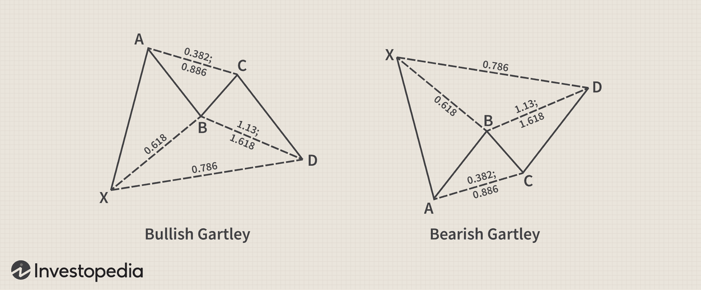

## Table of Contents

## What are harmonic patterns in currency markets?

Harmonic patterns in currency markets are special shapes that traders look for on price charts. These patterns help traders predict where the price might go next. They are based on the idea that price movements often repeat in certain ways. Traders use these patterns to find good times to buy or sell currencies. The most common harmonic patterns are called Gartley, Butterfly, Bat, and Crab. Each pattern has specific rules about how the price should move to form the pattern.

To spot a harmonic pattern, traders need to look at the highs and lows of the price over time. They measure the distances between these points and check if they fit the rules of the pattern. For example, in a Gartley pattern, the price goes up, then down, then up again, but not as high as before, and finally down again. If the distances between these points follow certain ratios, like 0.618 or 1.618, then it might be a Gartley pattern. Traders use these ratios, which come from something called the Fibonacci sequence, to help them find and confirm the patterns. Once they spot a pattern, they can make a guess about where the price might go next and plan their trades accordingly.

## How do harmonic patterns differ from other technical analysis tools?

Harmonic patterns are different from other technical analysis tools because they focus on specific shapes and ratios. Most other tools, like moving averages or trend lines, look at the general direction of the price or how it's moving over time. Harmonic patterns, on the other hand, are all about finding exact patterns that follow certain rules. These rules are based on the Fibonacci sequence, which is a series of numbers where each number is the sum of the two before it. Traders use these numbers to find the right distances between the highs and lows of the price, which helps them spot the patterns.

Another way harmonic patterns differ is that they are used to predict very specific turning points in the price. Tools like support and resistance levels or chart patterns like head and shoulders can also predict where the price might change direction, but they are not as precise as harmonic patterns. With harmonic patterns, traders can pinpoint exact levels where they think the price will turn around. This makes harmonic patterns a bit more complex to use, but they can be very powerful for traders who take the time to learn them.

## What are the most common types of harmonic patterns?

The most common types of harmonic patterns are the Gartley, Butterfly, Bat, and Crab patterns. Each of these patterns has its own unique shape and rules about how the price should move to form the pattern. The Gartley pattern, for example, looks like the letter 'M' or 'W' on the chart. It starts with a big move up or down, followed by smaller moves in the opposite direction, and then another move back in the original direction. The Butterfly pattern is similar but has different ratios that help traders spot it. The Bat and Crab patterns also follow specific rules and ratios but have their own unique shapes.

These patterns all use the Fibonacci sequence to help traders find them. The Fibonacci sequence is a series of numbers where each number is the sum of the two before it. Traders use these numbers to measure the distances between the highs and lows of the price. For example, in the Gartley pattern, the second move should be about 61.8% of the first move. This 61.8% comes from the Fibonacci sequence. By looking for these specific ratios, traders can spot the patterns and use them to predict where the price might go next.

## How can a beginner identify a harmonic pattern on a currency chart?

To identify a harmonic pattern on a currency chart, a beginner should first learn about the most common patterns like the Gartley, Butterfly, Bat, and Crab. These patterns look like special shapes on the chart, such as the letter 'M' or 'W'. Start by looking at the highs and lows of the price over time. For example, in a Gartley pattern, the price goes up, then down, then up again but not as high as before, and finally down again. It's important to measure the distances between these points to see if they fit the rules of the pattern.

Next, beginners need to use the Fibonacci sequence to check if the distances between the highs and lows match the pattern's rules. The Fibonacci sequence is a series of numbers where each number is the sum of the two before it. For example, in a Gartley pattern, the second move should be about 61.8% of the first move. This 61.8% comes from the Fibonacci sequence. By drawing lines on the chart to measure these distances, beginners can spot the patterns. Once a pattern is found, it can help predict where the price might go next, making it easier to decide when to buy or sell.

## What is the significance of Fibonacci ratios in harmonic patterns?

Fibonacci ratios are very important in harmonic patterns because they help traders find these patterns on a chart. These ratios come from the Fibonacci sequence, which is a series of numbers where each number is the sum of the two before it. Traders use these numbers to measure the distances between the highs and lows of the price. For example, in a Gartley pattern, the second move should be about 61.8% of the first move. This 61.8% comes from the Fibonacci sequence. By checking if the distances between the price points match these ratios, traders can spot the patterns and use them to predict where the price might go next.

Using Fibonacci ratios helps make harmonic patterns more reliable. When the distances between the highs and lows fit these specific ratios, it gives traders more confidence that they have found a real pattern. This can help them make better decisions about when to buy or sell. For example, if a trader sees a Butterfly pattern with the right Fibonacci ratios, they might expect the price to turn around at a certain point. This makes Fibonacci ratios a key part of using harmonic patterns in trading.

## Can you explain the structure and formation of a Gartley pattern?

The Gartley pattern is a special shape that traders look for on a price chart. It looks like the letter 'M' or 'W', depending on whether the price is going up or down. To form a Gartley pattern, the price first makes a big move up or down. This is called the X to A leg. After that, the price moves back in the opposite direction, but not all the way back to where it started. This is the A to B leg. Then, the price moves in the same direction as the first move, but it doesn't go as far as the first move. This is the B to C leg. Finally, the price moves back in the opposite direction again, and this last move is the C to D leg. If all these moves fit certain rules, it might be a Gartley pattern.

The key to spotting a Gartley pattern is using the Fibonacci sequence. This is a series of numbers where each number is the sum of the two before it. Traders use these numbers to measure the distances between the highs and lows of the price. For a Gartley pattern, the A to B leg should be about 61.8% of the X to A leg. The B to C leg should be about 38.2% or 88.6% of the A to B leg. And the C to D leg should be about 78.6% of the X to A leg. When the distances between the price points match these Fibonacci ratios, it gives traders more confidence that they have found a real Gartley pattern. This can help them predict where the price might go next and make better trading decisions.

## How do traders use harmonic patterns to predict market movements?

Traders use harmonic patterns to predict market movements by looking for special shapes on price charts. These shapes, like the Gartley, Butterfly, Bat, and Crab patterns, help traders guess where the price might go next. They do this by measuring the distances between the highs and lows of the price and checking if these distances fit certain rules. These rules come from the Fibonacci sequence, which is a series of numbers where each number is the sum of the two before it. By using these numbers, traders can spot the patterns and use them to make predictions.

Once a trader finds a harmonic pattern, they can use it to decide when to buy or sell. For example, if they see a Gartley pattern, they know the price might turn around at a certain point. This point is where the last move in the pattern, called the C to D leg, ends. By knowing this, traders can plan their trades to take advantage of the expected price change. This makes harmonic patterns a useful tool for predicting market movements and making better trading decisions.

## What are the key differences between a Butterfly and a Crab pattern?

The Butterfly and Crab patterns are both harmonic patterns that traders use to predict where the price might go next. The main difference between them is the shape and the Fibonacci ratios they use. The Butterfly pattern looks like a stretched-out version of the letter 'M' or 'W'. It starts with a big move up or down, then a smaller move back, then another move in the original direction, and finally a big move back again. The key Fibonacci ratio for the Butterfly pattern is that the last move, called the C to D leg, should be about 127% or 161.8% of the first move, called the X to A leg.

The Crab pattern, on the other hand, looks even more stretched out than the Butterfly pattern. It also starts with a big move up or down, followed by smaller moves in the opposite direction, and then another big move back. The big difference is in the Fibonacci ratio for the last move. For the Crab pattern, the C to D leg should be about 161.8% or even 224% of the X to A leg. This makes the Crab pattern's final move much longer than the Butterfly pattern's. By knowing these differences, traders can spot each pattern and use them to predict where the price might turn around.

## How can advanced traders adjust harmonic patterns for different market conditions?

Advanced traders can adjust harmonic patterns for different market conditions by changing the Fibonacci ratios they use. In a fast-moving market, the price might move more quickly than usual. To account for this, traders might use slightly different ratios to spot the patterns. For example, instead of using the standard 61.8% for the A to B leg in a Gartley pattern, they might use 65% or 70%. This helps them find the patterns even when the market is moving quickly. By being flexible with the ratios, traders can still use harmonic patterns to predict where the price might go next, even in different market conditions.

Another way advanced traders adjust harmonic patterns is by looking at different time frames. In a volatile market, they might look at shorter time frames to spot the patterns more quickly. For example, instead of looking at daily charts, they might use hourly or even 15-minute charts. This can help them find the patterns and make trading decisions faster. On the other hand, in a slow-moving market, they might use longer time frames like weekly charts to spot the patterns. By adjusting the time frames, traders can adapt harmonic patterns to different market conditions and still use them effectively.

## What are the potential risks and limitations of trading with harmonic patterns?

Trading with harmonic patterns can be risky because these patterns are not always perfect. Sometimes, the price might not move the way the pattern predicts. This can lead to losses if traders rely too much on the patterns without considering other factors. Also, harmonic patterns can be hard to spot, especially for beginners. It takes a lot of practice to get good at finding them on a chart. If traders make mistakes in spotting the patterns, they might make bad trading decisions.

Another limitation is that harmonic patterns work best in markets that move in clear trends. If the market is moving up and down a lot without a clear direction, the patterns might not be as useful. Traders also need to be careful not to overuse the patterns. If they see a pattern everywhere, they might end up making too many trades, which can lead to more losses. It's important to use harmonic patterns along with other tools and always be ready for the market to do something unexpected.

## How can harmonic patterns be integrated with other trading strategies for better results?

Harmonic patterns can be used with other trading strategies to make better trading decisions. For example, traders can use harmonic patterns along with trend lines to see if the price is moving in a clear direction. If a harmonic pattern shows up in a strong trend, it can give traders more confidence that the price will move the way the pattern predicts. Another way to use harmonic patterns with other strategies is by looking at support and resistance levels. If a harmonic pattern points to a price turning around at a support or resistance level, it can be a strong sign that the price will actually change direction there.

Traders can also combine harmonic patterns with indicators like moving averages or the Relative Strength Index (RSI). Moving averages can help traders see the overall direction of the price, and if a harmonic pattern lines up with a moving average, it can make the pattern more reliable. The RSI can show if the price is overbought or oversold, which can help traders decide if a harmonic pattern's prediction is likely to happen. By using harmonic patterns along with other tools, traders can get a better picture of what the market might do next and make smarter trading choices.

## What software tools are recommended for analyzing harmonic patterns in currency markets?

For analyzing harmonic patterns in currency markets, traders often use software like MetaTrader 4 (MT4) and MetaTrader 5 (MT5). These platforms are popular because they have special tools called indicators that can help find harmonic patterns on the charts. Traders can download these indicators for free or buy more advanced ones. MT4 and MT5 also let traders set up alerts, so they know when a pattern might be forming. This can save time and help traders make quick decisions.

Another good tool is TradingView. It's a website where traders can look at charts and use different indicators to spot harmonic patterns. TradingView has a big community of traders who share their own indicators and ideas, which can be helpful for learning more about harmonic patterns. The platform is easy to use and works well on different devices like computers and phones. By using these tools, traders can find harmonic patterns more easily and use them to make better trading choices.

## References & Further Reading

[1]: Pesavento, L., & Jouflas, D. (1997). ["Fibonacci Ratios with Pattern Recognition."](https://www.wiley.com/en-us/Trade+What+You+See%3A+How+To+Profit+from+Pattern+Recognition-p-9780470106761) Traders Press, Inc.

[2]: Carney, S. (2003). ["Harmonic Trading, Volume One: Profiting from the Natural Order of the Financial Markets."](https://www.amazon.com/Harmonic-Trading-One-Profiting-Financial/dp/0137051506) FT Press.

[3]: Gartley, H. M. (1935). ["Profits in the Stock Market."](https://books.google.com/books/about/Profits_in_the_Stock_Market.html?id=sZ33snOTpTYC) Lambert-Gann Publishing Co.

[4]: J. Ehlers, C. (2001). ["Rocket Science for Traders: Digital Signal Processing Applications."](https://www.wiley.com/en-us/Rocket+Science+for+Traders%3A+Digital+Signal+Processing+Applications-p-9780471405672) Wiley.

[5]: Carney, S. (2010). ["Harmonic Trading, Volume Two: Advanced Strategies for Profiting from the Natural Order of the Financial Markets."](https://www.academia.edu/43278159/Harmonic_Trading_Volume_Two_Advanced_Strategies_for_Profiting_from_the_Natural_Order_of_the_Financial_Markets) FT Press.