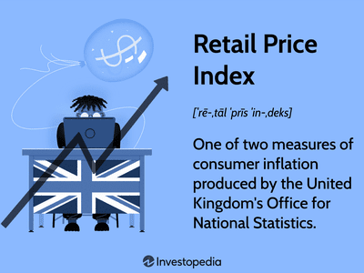

Understanding how inflation is measured is crucial for both economists and investors due to its profound influence on the economy. Inflation directly impacts purchasing power, which refers to the quantity of goods and services that can be bought with a unit of currency. This, in turn, affects individual and corporate investment decisions, as well as broader economic policy-making. Central banks, for instance, may adjust interest rates to curb inflation or stimulate economic activity.

The Harmonized Index of Consumer Prices (HICP) is a critical tool for tracking inflation within the European Union (EU). Managed by Eurostat, the HICP provides a consistent and comparable measure of inflation across EU member states, allowing policymakers and economists to assess economic health uniformly. It reflects changes over time in the prices of a chosen set of goods and services that typify the spending habits of European consumers. This standardization is essential for the European Central Bank (ECB) in setting monetary policy, primarily targeting an inflation rate of close to, but below, 2%.

Algorithmic trading, which leverages computer algorithms to automate and optimize trading strategies, increasingly considers inflation indicators like the HICP in its processes. These indicators are vital as they help predict market trends and movements, enabling traders to make informed decisions. By incorporating HICP data, traders can optimize their algorithms to manage risks more effectively and identify potential investment opportunities associated with inflationary trends. This integration highlights the growing importance of economic indicators in technology-driven financial markets.

This article explores how the HICP influences consumer prices and discusses its expanding role in algorithmic trading. By understanding these dynamics, stakeholders can better navigate the complexities of inflation within the EU and capitalize on associated market phenomena.

## Table of Contents

## What is the Harmonized Index of Consumer Prices (HICP)?

The Harmonized Index of Consumer Prices (HICP) is a critical instrument for measuring inflation within the European Union (EU). Designed to provide a standardized and consistent approach across member states, the HICP facilitates a clear comparison of inflation rates. This index reflects the time-related changes in the prices of a carefully selected basket of consumer goods and services, which serves as a representative sample of the typical consumer expenditure.

The basket composition includes a wide range of items, encompassing categories such as food, clothing, healthcare, education, and transportation. The selection of these items considers their relative importance to household consumption patterns in each member state, ensuring that the index accurately reflects regional consumer habits and economic conditions.

The HICP's role is vital for the European Central Bank (ECB), which uses the index to guide its monetary policy decisions. The ECB's primary objective is to maintain price stability within the Eurozone, aiming for an inflation rate close to, but under, 2%. By relying on the HICP, the ECB can make informed decisions regarding interest rates and other monetary instruments, striving to balance economic growth with inflation control.

The standardized nature of the HICP allows for effective cross-country comparisons, assisting not only in policymaking but also in economic analysis and forecasting. The index is considered a reliable measure due to its harmonized methodology, which ensures that inflation data are comparable across the EU, despite the diversity in economic conditions and consumer behaviors among the member states.

In summary, the HICP is an indispensable tool for tracking inflation in a consistent and comparable manner across the EU, playing a crucial role in the ECB's efforts to regulate the monetary environment and maintain economic stability.

## How HICP is Calculated

Each European Union (EU) country compiles the Harmonized Index of Consumer Prices (HICP) following a standardized methodology, which captures the price changes in a carefully selected basket of goods and services. This standardization ensures consistency and comparability of inflation measurements across the member states. The basket of goods and services is designed to reflect the spending habits of the average consumer in each respective country. As consumer preferences and spending patterns can vary significantly from one nation to another, the basket's composition is periodically updated to accurately incorporate these differences.

The methodology for calculating the HICP involves several key steps. Price data is collected on a regular basis from a wide range of retail outlets and service providers, covering goods and services that households primarily consume. The prices obtained feed into national statistical offices' systems, where they are processed to compute the national HICP.

The process uses a Laspeyres-type formula, which is a common technique for calculating price indices. This involves using base-period quantities to weigh current-period prices. Mathematically, the Laspeyres price index (L) for a given period can be expressed as:

$$

L = \left( \frac{\sum (p_t \cdot q_0)}{\sum (p_0 \cdot q_0)} \right) \times 100 
$$

where:
- $p_t$ represents the price in the current period,
- $p_0$ denotes the price in the base period,
- $q_0$ is the quantity in the base period.

After individual country indices are calculated, Eurostat, the statistical office of the EU, compiles these national indices to produce the Monetary Union Index of Consumer Prices (MUICP) for the Eurozone. The MUICP represents a weighted average of the HICPs from each of the euro area countries, with weights assigned based on each country's share of the total euro area consumption expenditure.

The resulting MUICP provides policymakers, economists, and investors with an aggregate measure of inflation across the Eurozone, forming a key input in evaluating the economic conditions and informing monetary policy decisions by entities such as the European Central Bank (ECB).

## Importance of HICP in Measuring Consumer Prices

The Harmonized Index of Consumer Prices (HICP) serves as a critical indicator of inflation trends in the European Union (EU), exerting significant influence on consumer behavior and purchasing power. As an instrument designed to measure the price changes of a representative basket of consumer goods and services, the HICP provides vital insights into the economic health of EU member states. By effectively capturing inflationary patterns, it assists policymakers and investors in making informed financial decisions.

One of the primary roles of HICP is to offer a clear perspective on the trajectory of inflation, a key determinant of consumer purchasing power. An upward trend in HICP signifies increasing prices, which can diminish the purchasing capacity of consumers if wages do not rise correspondingly. Conversely, a stable or declining HICP suggests stable or falling prices, potentially boosting consumer confidence and spending.

For policymakers, HICP is instrumental in assessing the economic environment and making decisions related to interest rates, taxation, and public expenditure. Central banks, such as the European Central Bank (ECB), closely monitor HICP trends to set monetary policy. The ECB's inflation target, typically set at close to but below 2%, is largely informed by the HICP. If inflation deviates from this target, the ECB may adjust interest rates in response. For instance, an unexpected rise in the HICP might prompt an increase in interest rates to curb inflationary pressures, whereas a drop might lead to a rate cut to stimulate the economy.

HICP also influences salary negotiations and pension adjustments. In many EU countries, wage indexation mechanisms are linked to inflation indicators such as the HICP. By tracking the general increase in consumer prices, the HICP helps ensure that wage and pension adjustments reflect real economic conditions, protecting the real incomes of employees and retirees.

Overall, the HICP is not merely a statistical measure; it acts as a key tool in shaping economic strategies and responses. Its ability to encapsulate inflationary trends extends far beyond mere price reporting, affecting vital elements such as interest rates, salaries, and pensions, thereby playing a crucial role in maintaining economic stability and confidence within the EU.

## The Role of HICP in Automated Trading

Algorithmic trading, a method of executing orders using automated pre-programmed trading instructions, relies heavily on data for its decision-making processes. Among the crucial datasets is the Harmonized Index of Consumer Prices (HICP), which provides essential insights into inflation trends within the European Union. For traders, leveraging HICP data becomes vital for predicting market movements, setting automated triggers for buy or sell orders, and managing associated risk.

Firstly, the HICP serves as a predictive tool for market movements. Inflation indicators such as HICP can significantly influence economic outlooks, impacting currency valuations, bond yields, and equity price movements. A higher than expected HICP may indicate rising inflation, prompting traders to anticipate potential [interest rate](/wiki/interest-rate-trading-strategies) hikes by the European Central Bank (ECB). This anticipation can lead to adjustments in currency positions, as higher interest rates generally strengthen a currency. Conversely, a lower than expected HICP might signal more accommodative monetary policies, influencing traders to take opposite positions.

Algorithmic trading systems can efficiently use HICP data by setting conditional triggers based on inflation trends. These systems can automate the execution of trades once pre-set HICP thresholds are crossed, enabling rapid responses to market dynamics. For instance, a trading algorithm might be programmed to buy European government bonds if the HICP indicates sluggish inflation, expecting the ECB to keep interest rates low, or to sell equities if inflationary pressures mount, anticipating a negative impact on corporate profits.

Moreover, risk management is a critical component of [algorithmic trading](/wiki/algorithmic-trading) that can be informed by HICP data. Inflation trends reflected through the HICP can help traders assess economic [volatility](/wiki/volatility-trading-strategies) and adjust their risk exposure accordingly. For example, sustained inflation might signal the need to diversify trading portfolios to hedge against potential losses in fixed-income securities, which are sensitive to inflation and interest rate changes.

The influence of HICP extends across multiple financial markets. In the currency market, inflation data can affect exchange rates as it impacts central bank policies and investor expectations. In bond markets, changes in inflation expectations can lead to interest rate adjustments, affecting bond prices and yields. Additionally, equity markets respond to inflationary pressures due to their impact on corporate earnings and consumer spending.

In conclusion, the HICP plays a pivotal role in algorithmic trading by providing essential data for predicting market movements, automating trading actions, and managing risks. As markets become increasingly data-driven, the systematic incorporation of inflation indicators like the HICP into trading algorithms will continue to be indispensable for optimizing investment strategies.

## Challenges and Limitations

The Harmonized Index of Consumer Prices (HICP), while serving as a crucial tool for measuring inflation across the European Union, encounters several challenges and limitations that can affect its accuracy and utility. One major limitation is its exclusion of owner-occupied housing costs. This omission can result in an incomplete depiction of cost-of-living fluctuations, as housing represents a significant portion of consumer expenses in many EU countries. Consequently, while HICP provides a standardized metric for gauging inflation, it may not fully encapsulate the financial pressures experienced by homeowners.

Data revisions and updates pose another significant challenge, particularly for short-term trading strategies that are sensitive to timely information. As economic data is refined and corrected, initial releases can be subject to changes that may alter previously made trading decisions. This aspect necessitates caution among traders and investors who integrate HICP data into their financial models, as reliance on preliminary data may introduce volatility in trading strategies.

In addition, there is often a time lag between the release of HICP data and its integration into algorithmic trading systems. This delay can diminish the effectiveness of automated trading strategies that depend on up-to-date economic indicators to generate optimal results. The dynamic nature of financial markets demands that trading algorithms quickly adapt to the latest information. However, the inherent delay in processing and incorporating economic data such as the HICP can impair the adaptability and responsiveness of these systems.

Overall, while the HICP offers a harmonized approach to measuring inflation, these challenges highlight the need for continuous improvement in data collection and processing. Enhanced methodologies and technological advancements could potentially mitigate these limitations and bolster the efficacy of HICP in economic analysis and automated trading scenarios.

## Conclusion

The Harmonized Index of Consumer Prices (HICP) is essential for understanding inflation dynamics within the European Union, affecting decisions by consumers and investors alike. Its role as a consistent and comparable measure of inflation across EU member states offers valuable insight into economic conditions. For consumers, HICP provides a clear indicator of purchasing power fluctuations, influencing personal financial planning and consumption choices. This measure is integral to the European Central Bank's monetary policy, which aims to maintain price stability by targeting a near 2% inflation rate.

For investors, particularly those involved in algorithmic trading, HICP data is invaluable. By incorporating this inflation measure into trading algorithms, traders can optimize their strategies to respond effectively to market shifts. Inflation trends impact various asset classes, including currency, bond, and equity markets. Accurate and timely HICP information can improve decision-making processes, enabling traders to set precise buy/sell triggers and manage risk more effectively.

The evolving field of data processing and algorithmic sophistication holds promise for enhancing the utilization of HICP data. As computational capabilities advance, the integration of inflation metrics like HICP in automated systems will likely become more seamless and predictive, yielding deeper insights and improved trading outcomes. Consequently, HICP remains a cornerstone in both economic analysis and the development of sophisticated trading algorithms.

## References & Further Reading

[1]: ["Eurostat: Harmonized Index of Consumer Prices (HICP)"](https://ec.europa.eu/eurostat/web/hicp) - Eurostat's official page providing detailed information about HICP, including methodology, data access, and updates.

[2]: Lane, P. R. (2020). ["The Phillips Curve at the ECB."](https://onlinelibrary.wiley.com/doi/full/10.1111/manc.12339) European Central Bank Working Paper Series.

[3]: Blinder, A. S., & Rudd, J. B. (2012). ["The Supply-Shock Explanation of the Great Stagflation Revisited."](https://www.nber.org/system/files/working_papers/w14563/w14563.pdf) National Bureau of Economic Research Working Paper Series.

[4]: ["Algorithmic Trading and DMA: An Introduction to Direct Access Trading Strategies"](https://www.amazon.com/Algorithmic-Trading-DMA-introduction-strategies/dp/0956399207) by Barry Johnson

[5]: Reuters Editorial. (2021). ["The Impact of Inflation Measures on Bond Markets."](https://www.reuters.com/business/inflation-revival-is-victory-not-defeat-central-banks-2021-10-13/) Reuters. 

[6]: ECB Staff. (2021). ["The Role of the Harmonized Index of Consumer Prices (HICP) in Monetary Policy."](https://www.ecb.europa.eu/stats/macroeconomic_and_sectoral/hicp/html/index.en.html) European Central Bank Occasional Paper Series.