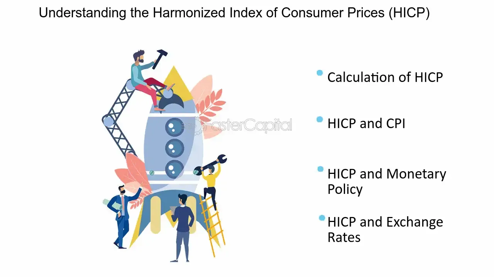

## Table of Contents

## What is the Harmonized Index of Consumer Prices (HICP)?

The Harmonized Index of Consumer Prices (HICP) is a measure of inflation that is used across the European Union. It tracks changes in the prices of goods and services that people buy, like food, clothes, and transportation. The HICP helps countries in the EU compare their inflation rates because it uses the same methods and rules everywhere.

Different countries might have different ways to measure inflation, but the HICP makes sure these measurements are similar. This is important for the European Central Bank, which uses the HICP to make decisions about money and interest rates. By having a common measure, the bank can better understand how inflation is affecting the whole EU and make policies that help keep prices stable.

## Who developed the HICP and why was it created?

The HICP was developed by the European Union, with help from the European Central Bank and Eurostat, which is the EU's statistics office. They created it because they needed a way to measure inflation that was the same across all EU countries. Before the HICP, each country had its own way of measuring inflation, which made it hard to compare prices and make decisions about the economy across the whole EU.

The main reason for creating the HICP was to help the European Central Bank manage the euro, the currency used by many EU countries. The bank needed a reliable way to see if prices were going up or down in the same way everywhere. By using the HICP, the bank can make better decisions about interest rates and other policies to keep the economy stable and make sure the euro stays strong.

## How does the HICP differ from other consumer price indices?

The HICP, or Harmonized Index of Consumer Prices, is different from other consumer price indices because it is made to be the same across all countries in the European Union. Other consumer price indices, like the Consumer Price Index (CPI) in the United States, might be calculated differently in each country. For example, they might include different goods and services or use different ways to weigh the importance of each item. The HICP, however, follows strict rules set by the EU to make sure every country measures inflation the same way.

Another big difference is that the HICP is used specifically to help manage the euro and the economy of the European Union. The European Central Bank uses the HICP to make decisions about interest rates and other policies. Other consumer price indices might be used by national governments for their own purposes, like adjusting wages or benefits. So, while the HICP focuses on helping the EU as a whole, other indices might focus more on individual countries.

## What are the main components that make up the HICP?

The HICP includes a wide range of goods and services that people typically buy. These are grouped into different categories, such as food and non-alcoholic beverages, alcohol and tobacco, clothing and footwear, housing and utilities, household goods and services, health, transport, communication, recreation and culture, education, restaurants and hotels, and miscellaneous goods and services. Each of these categories is weighted based on how much people spend on them, so items that people buy more often have a bigger impact on the HICP.

The weights are updated regularly to reflect changes in spending habits. For example, if people start spending more on technology and less on traditional goods, the weights will shift to show this. This helps the HICP stay accurate and useful for understanding inflation. By covering a broad range of what people buy and updating the weights, the HICP gives a good picture of how prices are changing across the European Union.

## How is the HICP calculated?

The HICP is calculated by looking at the prices of a lot of different things that people buy, like food, clothes, and services. Each item is put into a group, like "food and non-alcoholic beverages" or "transport." The price of each item is checked regularly, usually every month, to see if it has gone up or down. These price changes are then used to figure out the overall change in prices for each group.

To get the final HICP number, the changes in each group are added together, but not all groups are counted the same way. Some groups, like food, might be more important because people spend more money on them, so they get a bigger "weight" in the calculation. These weights are based on how people spend their money and are updated to make sure the HICP stays accurate. By doing this, the HICP shows how prices are changing across the whole European Union in a way that reflects what people actually buy.

## What is the geographic coverage of the HICP?

The HICP covers all the countries in the European Union. This means it includes places like Germany, France, Italy, and many others. By using the same methods everywhere, the HICP helps these countries compare their inflation rates easily.

The HICP is important because it helps the European Central Bank manage the euro, which is the currency used by many of these countries. Even though not all EU countries use the euro, the HICP still helps give a full picture of inflation across the whole EU. This makes it easier for the bank to make decisions that affect the whole region.

## How frequently is the HICP updated and published?

The HICP is updated and published every month. This means that new numbers come out each month to show how prices have changed in the European Union. By doing this every month, the HICP helps people and governments see how inflation is going and make decisions based on the latest information.

The monthly updates are important because they give a regular check on prices. This helps the European Central Bank and other groups keep track of inflation and make sure the economy stays stable. If prices are going up too fast, they can take action to slow things down, and if prices are not changing much, they might decide to do something different.

## What are the uses of the HICP in economic policy and analysis?

The HICP is very important for making decisions about the economy in the European Union. It helps the European Central Bank figure out if prices are going up too fast or not enough. If prices are rising too quickly, the bank might decide to raise interest rates to slow things down. If prices are not changing much, they might lower interest rates to help the economy grow. This helps keep the euro strong and makes sure people can afford things.

The HICP is also used by governments and businesses to understand how inflation is affecting them. For example, if the HICP shows that prices are going up a lot, a government might decide to give more money to people who need help. Businesses use the HICP to plan for the future, like deciding how much to charge for their products or how much to pay their workers. By looking at the HICP, everyone can make better choices about money and the economy.

## How does the HICP influence monetary policy decisions?

The HICP helps the European Central Bank decide what to do with interest rates. If the HICP shows that prices are going up too fast, the bank might raise interest rates. This makes it more expensive to borrow money, which can slow down spending and help control inflation. On the other hand, if the HICP shows that prices are not going up much, the bank might lower interest rates. This makes borrowing cheaper, which can encourage people and businesses to spend more and help the economy grow.

The HICP also helps the bank make sure the euro stays strong. By keeping an eye on the HICP, the bank can see if the whole European Union is facing the same inflation problems. This helps them make decisions that work for everyone, not just one country. Keeping inflation stable is important for making sure people can afford things and that the economy runs smoothly.

## What are the challenges and limitations in compiling the HICP?

Compiling the HICP can be tricky because it needs to be the same across all countries in the European Union. Each country has its own way of doing things, like how they collect prices or what they include in their index. To make sure the HICP is fair, everyone has to follow the same rules, but this can be hard. Sometimes, countries might not have the same kind of data or their data might not be as good, which can make the HICP less accurate.

Another challenge is keeping the HICP up to date. People's spending habits change over time, so the HICP needs to change too. This means updating the weights, or how important each item is in the index, regularly. It can be hard to do this quickly and correctly because it takes a lot of time and effort to collect new data. If the weights are not right, the HICP might not show the real changes in prices, which can make it harder for the European Central Bank to make good decisions about the economy.

## How does the HICP account for changes in consumer behavior and product quality?

The HICP tries to keep up with changes in what people buy and how much they spend on different things. It does this by updating the weights, which are like scores that show how important each item is in the index. These weights are changed every year to match how people are spending their money. If people start buying more technology and less traditional stuff, the HICP will give technology a bigger weight. This way, the HICP can show how prices are changing in a way that matches what people actually buy.

When it comes to changes in product quality, the HICP has a way to handle that too. If a product gets better but costs the same, the HICP tries to figure out how much of the price is because of the better quality. They do this by looking at how much the product has improved and taking that into account when they measure the price change. This helps make sure the HICP is showing real price changes and not just changes because things are better or worse. By doing these things, the HICP stays useful for understanding inflation.

## What future developments or enhancements are planned for the HICP?

The people who make the HICP are always trying to make it better. One thing they want to do is use new technology to collect prices faster and more accurately. They are looking into using things like online shopping data to see how prices are changing in real time. This could help the HICP show what's happening with prices more quickly, which would be useful for making decisions about the economy.

Another thing they are thinking about is how to better account for changes in what people buy. As people's habits change, like buying more things online or choosing different kinds of products, the HICP needs to keep up. They are working on ways to update the weights more often so the HICP can show the real changes in prices better. By doing these things, the HICP can stay a helpful tool for understanding inflation in the European Union.

## How is HICP calculated?

Each European Union (EU) country compiles the Harmonized Index of Consumer Prices (HICP) following a standardized methodology, which captures the price changes in a carefully selected basket of goods and services. This standardization ensures consistency and comparability of inflation measurements across the member states. The basket of goods and services is designed to reflect the spending habits of the average consumer in each respective country. As consumer preferences and spending patterns can vary significantly from one nation to another, the basket's composition is periodically updated to accurately incorporate these differences.

The methodology for calculating the HICP involves several key steps. Price data is collected on a regular basis from a wide range of retail outlets and service providers, covering goods and services that households primarily consume. The prices obtained feed into national statistical offices' systems, where they are processed to compute the national HICP.

The process uses a Laspeyres-type formula, which is a common technique for calculating price indices. This involves using base-period quantities to weigh current-period prices. Mathematically, the Laspeyres price index (L) for a given period can be expressed as:

$$

L = \left( \frac{\sum (p_t \cdot q_0)}{\sum (p_0 \cdot q_0)} \right) \times 100 
$$

where:
- $p_t$ represents the price in the current period,
- $p_0$ denotes the price in the base period,
- $q_0$ is the quantity in the base period.

After individual country indices are calculated, Eurostat, the statistical office of the EU, compiles these national indices to produce the Monetary Union Index of Consumer Prices (MUICP) for the Eurozone. The MUICP represents a weighted average of the HICPs from each of the euro area countries, with weights assigned based on each country's share of the total euro area consumption expenditure.

The resulting MUICP provides policymakers, economists, and investors with an aggregate measure of inflation across the Eurozone, forming a key input in evaluating the economic conditions and informing monetary policy decisions by entities such as the European Central Bank (ECB).

## References & Further Reading

[1]: ["Eurostat: Harmonized Index of Consumer Prices (HICP)"](https://ec.europa.eu/eurostat/web/hicp) - Eurostat's official page providing detailed information about HICP, including methodology, data access, and updates.

[2]: Lane, P. R. (2020). ["The Phillips Curve at the ECB."](https://onlinelibrary.wiley.com/doi/full/10.1111/manc.12339) European Central Bank Working Paper Series.

[3]: Blinder, A. S., & Rudd, J. B. (2012). ["The Supply-Shock Explanation of the Great Stagflation Revisited."](https://www.nber.org/system/files/working_papers/w14563/w14563.pdf) National Bureau of Economic Research Working Paper Series.

[4]: ["Algorithmic Trading and DMA: An Introduction to Direct Access Trading Strategies"](https://www.amazon.com/Algorithmic-Trading-DMA-introduction-strategies/dp/0956399207) by Barry Johnson

[5]: Reuters Editorial. (2021). ["The Impact of Inflation Measures on Bond Markets."](https://www.reuters.com/business/inflation-revival-is-victory-not-defeat-central-banks-2021-10-13/) Reuters. 

[6]: ECB Staff. (2021). ["The Role of the Harmonized Index of Consumer Prices (HICP) in Monetary Policy."](https://www.ecb.europa.eu/stats/macroeconomic_and_sectoral/hicp/html/index.en.html) European Central Bank Occasional Paper Series.