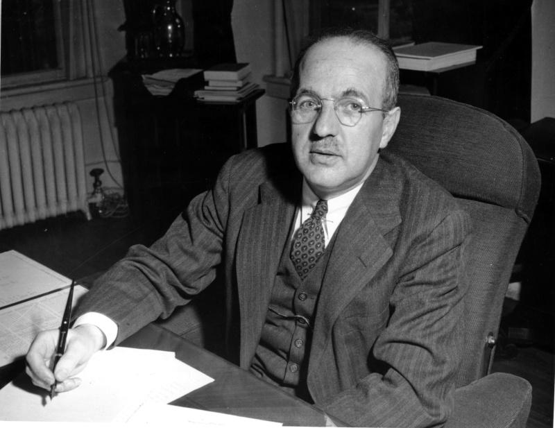

## Table of Contents

## Who was Harry Dexter White?

Harry Dexter White was an American economist and government official. He was born in 1892 and died in 1948. White worked for the U.S. Treasury Department and helped create the International Monetary Fund (IMF) and the World Bank. These organizations help countries work together on money matters.

Some people believed that White was a spy for the Soviet Union. They thought he gave secret information to the Soviets during World War II. However, there is no clear proof that he did this. Despite these accusations, White is still remembered for his important work in shaping the world's financial systems.

## What was Harry Dexter White's role in the U.S. Treasury Department?

Harry Dexter White worked at the U.S. Treasury Department and had a big job there. He started working there in the 1930s and became a top advisor. He helped make important decisions about money and the economy. During World War II, he was in charge of making sure the U.S. had enough money to fight the war. He also helped plan what the world's money system would look like after the war.

White was a key person in making the Bretton Woods system. This system decided how countries would work together on money matters after the war. He helped create the International Monetary Fund (IMF) and the World Bank. These groups help countries with their money problems and make the world's economy stronger. Even though some people said he might have been a spy, his work at the Treasury Department was very important.

## What were the key contributions of Harry Dexter White to the Bretton Woods system?

Harry Dexter White was very important in making the Bretton Woods system. This system was about how countries would work together with their money after World War II. White helped write the rules for this system. He worked with other countries to make sure everyone agreed on how to handle money. His big idea was to create a way for countries to help each other if they had money problems.

One of the main things White did was help start the International Monetary Fund (IMF) and the World Bank. The IMF helps countries that are having trouble with their money by giving them loans. The World Bank gives money to help countries build things like roads and schools. These two groups are still important today. They help make the world's economy stronger and more stable. White's work on these organizations was a big part of his contribution to the Bretton Woods system.

## How did Harry Dexter White influence the creation of the International Monetary Fund (IMF)?

Harry Dexter White played a big role in creating the International Monetary Fund (IMF). He worked hard to make sure countries could help each other with money problems after World War II. White helped write the rules for the IMF. He wanted it to be a place where countries could go if they needed money to fix their economies. He worked with other countries to make sure everyone agreed on how the IMF would work.

White's ideas were important because they helped make the world's money system more stable. The IMF gives loans to countries that are having trouble with their money. This helps them get back on their feet. Because of White's work, the IMF became a key part of the Bretton Woods system. It still helps countries today, showing how important White's contributions were.

## What was Harry Dexter White's involvement in the establishment of the World Bank?

Harry Dexter White helped start the World Bank. He worked at the U.S. Treasury Department and was a big part of making the Bretton Woods system. This system was about how countries would work together with their money after World War II. White wanted to make sure countries could help each other if they needed money to build things like roads and schools. He helped write the rules for the World Bank and worked with other countries to make sure everyone agreed on how it would work.

Because of White's work, the World Bank was created to give money to countries that needed it. This helped them build important things and make their economies stronger. The World Bank is still important today, helping countries all over the world. White's ideas and hard work were a big part of why the World Bank was made and why it helps so many people.

## What were the allegations of espionage against Harry Dexter White during the Cold War?

During the Cold War, some people said that Harry Dexter White was a spy for the Soviet Union. They thought he gave secret information to the Soviets during World War II. These accusations came out after White had already helped create the International Monetary Fund and the World Bank. People who believed he was a spy said he passed on important secrets that could have helped the Soviets.

However, there was never clear proof that White was a spy. Many people who worked with him said he was a good person and a hard worker. Even though the accusations were serious, they did not stop White from being remembered for his important work in shaping the world's financial systems. The debate about whether he was a spy or not continues, but his contributions to the Bretton Woods system are still recognized today.

## How did the U.S. government respond to the allegations against Harry Dexter White?

The U.S. government took the allegations against Harry Dexter White very seriously. They started investigations to find out if White had really been spying for the Soviet Union. The House Committee on Un-American Activities (HUAC) looked into the claims. They questioned people who knew White and tried to find evidence. The FBI also got involved and looked at secret documents and talked to people who might know something. Even though they looked hard, they did not find clear proof that White was a spy.

After the investigations, the U.S. government still had doubts about White. Some people in the government thought he might have been a spy, but they could not be sure. Because of this, White's reputation was hurt. He lost his job at the International Monetary Fund. Even though he was never charged with spying, the allegations made it hard for him to work in the government. White died in 1948, and the debate about whether he was a spy or not continued after his death.

## What was the impact of the House Un-American Activities Committee (HUAC) on Harry Dexter White's career?

The House Un-American Activities Committee (HUAC) had a big impact on Harry Dexter White's career. They started looking into claims that White was a spy for the Soviet Union. This made a lot of people question if he could be trusted. The HUAC questioned people who knew White and tried to find evidence against him. Even though they did not find clear proof that he was a spy, the investigation hurt White's reputation. People started to doubt him, and it made it hard for him to keep working in the government.

Because of the HUAC's investigation, White lost his job at the International Monetary Fund. The allegations made it difficult for him to continue his work in the government. Even though he was never charged with spying, the damage to his career was done. White died in 1948, and the questions about whether he was a spy or not continued after his death. The HUAC's actions left a lasting mark on his career and how people remembered him.

## What are the different historical perspectives on Harry Dexter White's alleged espionage activities?

Some people believe that Harry Dexter White was a spy for the Soviet Union. They think he gave secret information to the Soviets during World War II. These people point to evidence like secret documents and testimonies from people who said White was involved in spying. They believe that White's actions helped the Soviets and hurt the United States. This view was supported by some government investigations, like those by the House Un-American Activities Committee (HUAC), which looked into the allegations but did not find clear proof.

On the other hand, many people think that Harry Dexter White was not a spy. They say that the evidence against him is not strong enough and that he was a good person who worked hard for the United States. People who worked with White and knew him well often defended him, saying he was loyal and dedicated to his country. They believe that the accusations against him were part of the fear and suspicion during the Cold War, and that White's important work in creating the International Monetary Fund and the World Bank should be remembered more than the spying allegations.

The debate about whether Harry Dexter White was a spy or not continues today. Historians and researchers still argue about the evidence and what it means. Some think that new information might come out that could change how we see White's actions. But for now, there is no clear answer, and people have different opinions about what really happened.

## How did Harry Dexter White's economic policies affect post-World War II international relations?

Harry Dexter White's economic policies had a big impact on how countries worked together after World War II. He helped create the Bretton Woods system, which was a plan for countries to work together on money matters. White's ideas led to the creation of the International Monetary Fund (IMF) and the World Bank. The IMF helps countries that are having money problems by giving them loans. The World Bank gives money to help countries build things like roads and schools. These organizations made it easier for countries to help each other and made the world's economy more stable.

Because of White's work, countries started to trust each other more when it came to money. The Bretton Woods system helped countries agree on how to handle their money and trade with each other. This made it easier for countries to work together and avoid big money problems. Even though some people said White might have been a spy, his economic policies helped shape the world's financial systems and made international relations stronger after the war.

## What were the long-term effects of Harry Dexter White's work on global financial systems?

Harry Dexter White's work had a big impact on the world's money systems. He helped create the International Monetary Fund (IMF) and the World Bank. These groups help countries when they have money problems. The IMF gives loans to countries that need help, and the World Bank gives money to build things like roads and schools. Because of White's work, countries can work together better and help each other out. This makes the world's economy more stable and helps countries grow.

Even though some people said White might have been a spy, his ideas about money helped shape how countries work together today. The systems he helped create are still used all over the world. They help make sure that countries can trust each other with money and trade. White's work made a big difference in how countries handle their economies and work together to solve money problems. His ideas are still important and help keep the world's financial systems strong.

## What are some of the most significant books and resources for further reading on Harry Dexter White?

If you want to learn more about Harry Dexter White, a good book to read is "The Battle of Bretton Woods: John Maynard Keynes, Harry Dexter White, and the Making of a New World Order" by Benn Steil. This book talks about how White and John Maynard Keynes worked together to create the Bretton Woods system. It explains how their ideas helped shape the world's money systems after World War II. The book also talks about the spying allegations against White and how they affected his life and work.

Another helpful resource is "Treasonable Doubt: The Harry Dexter White Spy Case" by R. Bruce Craig. This book looks closely at the evidence about whether White was a spy for the Soviet Union. It explains the different views people have about White and what really happened. The book is good for understanding the debate about White's spying and how it has been seen over time. Both of these [books](/wiki/algo-trading-books) are important for learning more about Harry Dexter White and his impact on the world.

## References & Further Reading

[1]: Steil, B. (2013). ["The Battle of Bretton Woods: John Maynard Keynes, Harry Dexter White, and the Making of a New World Order."](https://press.princeton.edu/books/hardcover/9780691149097/the-battle-of-bretton-woods) Princeton University Press.

[2]: Bordo, M. D., & Eichengreen, B. (Eds.). (1993). ["A Retrospective on the Bretton Woods System: Lessons for International Monetary Reform."](https://www.nber.org/books-and-chapters/retrospective-bretton-woods-system-lessons-international-monetary-reform) University of Chicago Press.

[3]: Hitchens, C. (2000). ["The Trial of Henry Kissinger."](https://en.wikipedia.org/wiki/The_Trial_of_Henry_Kissinger) Verso. *[While not specifically about White, this book discusses Cold War espionage and political controversies similar to those in which White was involved.]*

[4]: United States Department of State. (1948). ["The Conference at Bretton Woods, New Hampshire."](https://history.state.gov/historicaldocuments/frus1948v09/d74) Foreign Relations of the United States: Diplomatic Papers, 1944, Volume II.

[5]: Haynes, J. E., & Klehr, H. (1999). ["Venona: Decoding Soviet Espionage in America."](https://www.jstor.org/stable/j.ctt1npk87) Yale University Press.

[6]: Goodfriend, M. (1996). ["The Role of a Regional Bank in a System of Central Banks."](https://www.richmondfed.org/~/media/richmondfedorg/publications/research/economic_quarterly/2000/winter/pdf/goodfriend.pdf) Federal Reserve Bank of Richmond Economic Review. *[Discusses monetary systems in a context that sheds light on White's contributions at Bretton Woods.]*