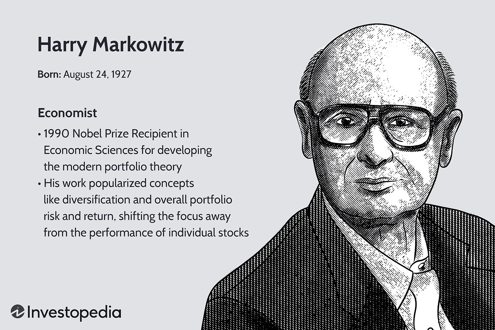

## Table of Contents

## Who is Harry Markowitz?

Harry Markowitz is a famous economist and a Nobel Prize winner. He was born in 1927 in Chicago, USA. He is best known for creating something called Modern Portfolio Theory. This theory helps people understand how to mix different investments to lower risk and possibly make more money.

Markowitz's big idea was that by spreading money across different types of investments, like stocks and bonds, people could reduce the chance of losing money. This idea changed how people think about investing. Because of his work, he won the Nobel Prize in Economics in 1990. Today, many people and big companies use his ideas to manage their money.

## What is Modern Portfolio Theory (MPT)?

Modern Portfolio Theory (MPT), created by Harry Markowitz, is a way to help people invest their money smarter. It says that instead of just picking one stock or one type of investment, you should mix different investments together. This mix can help lower the risk of losing money. The main idea is that different investments go up and down at different times. So, if one investment goes down, another might go up, and this balance can protect your money.

The theory uses something called diversification. Diversification means spreading your money across many different types of investments, like stocks, bonds, and real estate. By doing this, you're not putting all your eggs in one basket. MPT also talks about something called the efficient frontier. This is a way to find the best mix of investments that gives you the highest return for the least amount of risk. People use MPT to build investment portfolios that aim to get the best balance between risk and reward.

## When was Modern Portfolio Theory developed?

Modern Portfolio Theory (MPT) was developed by Harry Markowitz in the early 1950s. He wrote about it in a paper called "Portfolio Selection," which was published in 1952. This paper laid the foundation for how people think about investing today.

Markowitz was a young student at the University of Chicago when he came up with the idea. He realized that by mixing different types of investments, people could reduce the risk of losing money. This was a big change from the old way of thinking, where people just picked single stocks or bonds. His work on MPT earned him a Nobel Prize in Economics in 1990.

## What are the key principles of Modern Portfolio Theory?

Modern Portfolio Theory (MPT) is all about making smart choices with your money by mixing different investments. The main idea is diversification, which means spreading your money across lots of different things like stocks, bonds, and real estate. By doing this, you reduce the risk of losing money because if one investment goes down, another might go up. This balance can protect your savings and help you make more money over time. MPT says that instead of just [picking](/wiki/asset-class-picking) one stock or one type of investment, you should create a mix that works well together.

Another key principle of MPT is the efficient frontier. This is a way to find the best mix of investments that gives you the highest return for the least amount of risk. The efficient frontier is like a map that shows you different combinations of investments and how much risk and return each one gives. By using this map, you can pick the mix that fits your goals and how much risk you're willing to take. MPT helps people build investment portfolios that aim to get the best balance between risk and reward, and it's used by many people and big companies today.

## How does Modern Portfolio Theory define risk?

Modern Portfolio Theory (MPT) defines risk as the chance that your investments will lose value. It measures risk using something called standard deviation. Standard deviation shows how much the returns of an investment can go up and down over time. If an investment's returns move a lot, it has a high standard deviation, which means it's riskier. If the returns don't move much, it has a low standard deviation, which means it's less risky.

MPT looks at the risk of the whole portfolio, not just single investments. It says that by mixing different types of investments, you can lower the overall risk of your portfolio. This is because different investments don't always go up and down at the same time. For example, when stocks go down, bonds might go up. By having both in your portfolio, you can balance out the ups and downs, making your overall investment less risky.

## What is the efficient frontier in MPT?

The efficient frontier in Modern Portfolio Theory (MPT) is like a special map that helps you pick the best mix of investments. It shows you different combinations of investments and how much risk and return each one gives. The idea is to find the mix that gives you the highest return for the least amount of risk. If a portfolio is on the efficient frontier, it means you can't get a better return without taking more risk, or you can't lower the risk without also lowering the return.

Imagine you're trying to climb a mountain, and the efficient frontier is the path that gets you to the top the fastest without taking unnecessary risks. Every point on this path represents a different mix of investments. The goal is to find the spot on this path that matches your comfort with risk and your goals for making money. By using the efficient frontier, you can make smarter choices about where to put your money, aiming for the best balance between risk and reward.

## How does diversification work within Modern Portfolio Theory?

Diversification in Modern Portfolio Theory is all about spreading your money across many different types of investments. The idea is that if you put all your money in one stock or one type of investment, you could lose a lot if that investment does badly. But if you spread your money around, you lower the risk. For example, if you have money in stocks, bonds, and real estate, and the stock market goes down, your bonds and real estate might still do well. This balance can help protect your savings and help you make more money over time.

In MPT, diversification works because different investments don't always go up and down at the same time. When stocks go down, bonds might go up, and real estate might stay the same. By having a mix of these investments, you can reduce the ups and downs in your portfolio. This is what MPT calls reducing the overall risk of your investments. It's like not putting all your eggs in one basket. By spreading your money around, you're more likely to have a smoother ride and reach your financial goals.

## What is the Capital Asset Pricing Model (CAPM) and its relation to MPT?

The Capital Asset Pricing Model (CAPM) is a way to figure out how much return you should expect from an investment compared to its risk. It helps investors see if an investment is worth it by looking at how risky it is. CAPM says that the return on an investment should be based on how much risk it has compared to the overall market. If an investment is riskier than the market, it should give you a higher return. If it's less risky, it should give you a lower return. This model uses something called beta to measure the risk of an investment. Beta shows how much an investment moves with the market. If an investment has a high beta, it's more sensitive to market changes and is considered riskier.

CAPM is closely related to Modern Portfolio Theory (MPT) because both are about understanding and managing risk in investments. MPT says that by mixing different investments, you can lower the risk of your whole portfolio. CAPM builds on this idea by helping you figure out what kind of return you should expect from each part of your portfolio. In MPT, you use diversification to spread your money around and reduce risk. CAPM helps you decide which investments to pick by looking at their risk and expected return. Together, MPT and CAPM help investors make smarter choices about where to put their money to balance risk and reward.

## Can you explain the concept of portfolio optimization in MPT?

Portfolio optimization in Modern Portfolio Theory (MPT) is all about finding the best mix of investments that gives you the highest return for the least amount of risk. It's like trying to solve a puzzle where you want to make as much money as possible without taking too many chances. To do this, you look at different investments and see how they work together. You want to pick a mix that balances out the ups and downs, so when one investment goes down, another might go up. This way, your overall portfolio stays more stable and you can still make money.

The key to portfolio optimization is using something called the efficient frontier. This is like a special map that shows you all the possible mixes of investments and how much risk and return each one gives. The efficient frontier helps you find the best spot on this map that matches your goals and how much risk you're willing to take. By using the efficient frontier, you can make smarter choices about where to put your money, aiming for the best balance between risk and reward. This is how portfolio optimization helps you build a strong investment plan.

## What are the criticisms and limitations of Modern Portfolio Theory?

Modern Portfolio Theory (MPT) has some critics who say it's not perfect. One big problem is that MPT assumes that how investments have done in the past will be the same in the future. But we know that's not always true. The stock market can be unpredictable, and what worked before might not work again. Also, MPT uses numbers like standard deviation to measure risk, but this doesn't always tell the whole story. Some people think that risk is more about losing money than just numbers going up and down.

Another criticism is that MPT can be hard to use in real life. It needs a lot of data and math to work right, and not everyone has access to that. Plus, MPT doesn't think about things like taxes or the costs of buying and selling investments, which can make a big difference in how much money you make. Some people also say that MPT doesn't work well during big market crashes because everything can go down at the same time, and diversification doesn't help as much. So, while MPT is a useful tool, it's not perfect and has its limits.

## How has MPT influenced modern investment strategies and financial markets?

Modern Portfolio Theory (MPT) has changed the way people think about investing by showing that spreading money across different types of investments can lower risk. Before MPT, many people just picked single stocks or bonds. But MPT taught them that by mixing things like stocks, bonds, and real estate, they could balance out the ups and downs. This idea of diversification is now a big part of how people and big companies manage their money. They use MPT to build investment portfolios that aim to get the best balance between risk and reward.

MPT has also influenced the creation of new financial products and tools. For example, mutual funds and exchange-traded funds (ETFs) often use the ideas of MPT to offer diversified investment options to people. These funds mix many different investments together, so people can easily spread their money around without having to pick each investment themselves. Also, MPT has helped shape how financial advisors and investment managers work. They use the efficient frontier and other MPT tools to help clients build portfolios that match their goals and how much risk they're willing to take. Overall, MPT has made investing smarter and more accessible for everyone.

## What are some advanced applications of Modern Portfolio Theory in current financial practices?

Modern Portfolio Theory (MPT) has found advanced applications in areas like robo-advisors and algorithmic trading. Robo-advisors are computer programs that use MPT to build and manage investment portfolios for people. They take information about someone's goals and how much risk they want to take, and then use MPT to pick the best mix of investments. This makes it easier for people to invest their money without having to do all the work themselves. Algorithmic trading also uses MPT by creating computer programs that can quickly buy and sell investments based on MPT principles. These programs can look at a lot of data and make decisions faster than humans, which can help them find the best investment mixes.

Another advanced use of MPT is in risk management for big companies and financial institutions. These organizations use MPT to figure out how to spread their money across different investments to lower the chance of losing money. They use complex computer models and data to find the best balance between risk and reward. MPT also helps them understand how different investments move together, which can help them plan for different situations. By using MPT, these companies can make smarter choices about where to put their money and how to protect it.

## What is Understanding Modern Portfolio Theory?

Modern Portfolio Theory (MPT) proposes that investors can construct an "efficient portfolio" that maximizes expected returns for a specified level of risk, reflecting a paradigm shift in investment management. Central to MPT is the concept of mean-variance optimization, a method that assesses potential returns and associated risks to identify the most advantageous combination of assets. This approach to portfolio management seeks to balance the trade-off between risk and return efficiently. 

The efficient frontier, a key component of MPT, defines the set of portfolios offering the highest expected return for a given level of risk. Represented as an upward-sloping curve on a graph where risk is on the x-axis and expected return on the y-axis, the efficient frontier illustrates that any portfolio lying below the curve is suboptimal, as a higher return could be achieved for the same risk. Mathematically, the optimization problem can be expressed through the minimization of portfolio variance:

$$
\min \sigma_p^2 = \mathbf{w}^T \Sigma \mathbf{w}
$$

Subject to:

$$
E(R_p) = \mathbf{w}^T \mathbf{\mu} = R_t
$$

$$
\mathbf{w}^T \mathbf{1} = 1
$$

where $\mathbf{w}$ represents the weight vector of asset allocation, $\Sigma$ is the covariance matrix of asset returns, $\mathbf{\mu}$ is the expected return vector of the assets, and $R_t$ is the target return of the portfolio.

Diversification, another fundamental principle of MPT, focuses on reducing unsystematic risk by holding a variety of assets, which theoretically mitigates individual asset [volatility](/wiki/volatility-trading-strategies) without compromising expected returns. Unsystematic risk, specific to individual investments, can be minimized through diversification, allowing investors to reduce the impact of isolated price movements on the overall portfolio. However, MPT acknowledges that systematic risk, affecting all investments, is inherent and cannot be eliminated through diversification alone.

By providing a mathematical foundation for asset allocation strategies, MPT empowers investors to construct more efficient portfolios, aligning returns with their risk tolerance, and encourages a holistic view of investment decisions rather than an isolated focus on individual assets.

## How does the integration of MPT and algorithmic trading work?

Algorithmic trading represents one of the most significant advancements in modern financial markets, offering increased efficiency and precision in executing trades. Modern Portfolio Theory (MPT) has been seamlessly integrated into these algorithmic systems, harnessing its principles to construct diversified portfolios efficiently.

Algorithmic trading utilizes highly sophisticated algorithms to process vast amounts of financial data at unprecedented speeds. Through these algorithms, MPT's framework of diversification and risk optimization can be executed almost instantaneously. By automating the portfolio construction process, [algorithmic trading](/wiki/algorithmic-trading) systems can identify optimal asset allocations based on the principles of the efficient frontier—a graphical representation devised by MPT that plots the set of portfolios offering the maximum expected return for a given level of risk.

Real-time portfolio optimization is a crucial advantage that algorithmic trading provides, making it possible to continuously adjust portfolios in response to changing market conditions. This capability is particularly valuable in volatile markets, where rapid adjustments can mitigate potential losses and capitalize on emerging opportunities. Algorithms can recalibrate the asset weights within a portfolio, ensuring adherence to MPT's strategy of minimizing unsystematic risk while managing systematic risk.

To integrate MPT with algorithmic trading, mathematical optimization is employed. For example, suppose an investor aims to achieve a specific return while minimizing risk. In that case, algorithms can solve for the optimal asset weights $w_i$ in a portfolio by minimizing the portfolio variance $\sigma_p^2$ given the target return $E(R_p)$:

$$
\text{Minimize: } \sigma_p^2 = \sum_{i=1}^{n}\sum_{j=1}^{n} w_i w_j \sigma_{ij}
$$

$$
\text{Subject to: } \sum_{i=1}^{n} w_i \mu_i = E(R_p) \quad \text{and} \quad \sum_{i=1}^{n} w_i = 1
$$

where $\mu_i$ is the expected return of asset $i$, and $\sigma_{ij}$ is the covariance between assets $i$ and $j$.

In practical applications, dynamic algorithmic trading platforms often incorporate additional factors to tailor portfolios to specific investment goals. These may include constraints on sector exposures, target volatility levels, or ethical investing criteria. By doing so, algorithmic traders can align their strategies with broader investment policies, while still leveraging the risk-return optimization paradigm defined by MPT.

Overall, the integration of MPT into algorithmic trading empowers investors to manage risk more effectively and pursue targeted financial objectives with precision, setting the stage for continued innovation in portfolio management.

## References & Further Reading

[1]: Markowitz, H. M. (1952). ["Portfolio Selection."](https://onlinelibrary.wiley.com/doi/abs/10.1111/j.1540-6261.1952.tb01525.x) The Journal of Finance, 7(1), 77-91.

[2]: Malkiel, B. G. (2019). ["A Random Walk Down Wall Street: The Time-Tested Strategy for Successful Investing."](https://www.amazon.com/Random-Walk-Down-Wall-Street/dp/0393358380) W. W. Norton & Company.

[3]: Sharpe, W. F. (1964). ["Capital Asset Prices: A Theory of Market Equilibrium under Conditions of Risk."](https://onlinelibrary.wiley.com/doi/full/10.1111/j.1540-6261.1964.tb02865.x) The Journal of Finance, 19(3), 425-442.

[4]: Elton, E. J., Gruber, M. J., Brown, S. J., & Goetzmann, W. N. (2009). ["Modern Portfolio Theory and Investment Analysis."](https://books.google.com/books/about/Modern_Portfolio_Theory_and_Investment_A.html?id=181CEAAAQBAJ) Wiley.

[5]: Ritter, J. R. (2003). ["Behavioral Finance."](https://www.sciencedirect.com/science/article/pii/S0927538X03000489) Pacific-Basin Finance Journal, 11(4), 429-437.

[6]: Lhabitant, F.-S., & Learned, M. (2002). ["Hedge Fund Diversification: How Much is Enough?"](https://www.semanticscholar.org/paper/Hedge-Fund-Diversification%3A-How-Much-is-Enough-Lhabitant-Learned/6538876d0488cad897eadf1203ab1ef12b78e176) The Journal of Alternative Investments, 5(3), 23-49.

[7]: Fabozzi, F. J., Gupta, F., & Markowitz, H. M. (2002). ["The Legacy of Modern Portfolio Theory."](http://www.simonemariotti.com/downloads/Papers%20finanziari/Fabozzi-Gupta-Mar.pdf) Journal of Investing, 2(11), 7-22.

[8]: Ang, A. (2014). ["Asset Management: A Systematic Approach to Factor Investing."](https://academic.oup.com/book/3342) Oxford University Press.