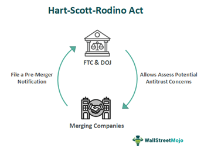

Understanding antitrust legislation, such as the Hart-Scott-Rodino Act of 1976, is essential in the field of corporate law and finance. It holds particular significance when considering its impact on algorithmic trading, an area characterized by rapid data-driven decision-making. This article examines the role of the Hart-Scott-Rodino (HSR) Act in regulating mergers and acquisitions, focusing on its premerger notification requirements that affect large corporate transactions.

The HSR Act plays a pivotal role in shaping the financial landscape by establishing procedures to notify and scrutinize potential mergers. By mandating premerger filing requirements with the Federal Trade Commission (FTC) and the Department of Justice (DOJ), it ensures that large-scale mergers do not compromise market competitiveness or consumer interests. The intersection of the HSR Act with algorithmic trading platforms is particularly relevant. These platforms rely heavily on cutting-edge technology, and any regulatory hurdles introduced by the Act can significantly influence transaction timelines and strategies.

For professionals in finance and law, as well as businesses contemplating substantial acquisitions, understanding the dynamics set forth by the HSR Act is vital. It aids in navigating the complex regulatory environment designed to encourage fair competition and avert monopolistic practices. As we evaluate the regulatory frameworks that bolster a competitive market, it becomes clear that the HSR Act is not merely a legal formality but an instrument crucial for fostering transparent and dynamic market conditions.

## Table of Contents

## Overview of the Hart-Scott-Rodino Act of 1976

The Hart-Scott-Rodino Antitrust Improvements Act of 1976 (HSR Act) is a pivotal legislative measure in the sphere of U.S. antitrust law. It necessitates that companies Lodge notifications with the Federal Trade Commission (FTC) and the Department of Justice before proceeding with specific mergers and acquisitions that meet certain size criteria. This premerger notification process is intended to allow federal regulators an opportunity to intercept potentially anti-competitive mergers that could negatively impact consumers and markets before they occur.

Enacted as an amendment to existing antitrust statutes, including the Clayton Act, the HSR Act was designed to enhance government oversight in commercial transactions that could lead to undue concentrations of market power. The Act introduces mandatory waiting periods, providing time during which regulators can scrutinize the proposed deals. If a merger is deemed potentially harmful, additional data submissions may be required from the companies involved, thereby allowing a more comprehensive evaluation.

The HSR Act plays an essential role in safeguarding market competitiveness. By regulating mergers and acquisitions, the Act prevents the formation of monopolies and oligopolies. The principles underlying the HSR Act align with its broader objective of maintaining a competitive marketplace—crucial for promoting consumer choice, price fairness, and innovation. Through these mechanisms, the Hart-Scott-Rodino Act continues to be an effective tool in the preservation of economic balance and the prevention of monopolistic practices.

## Mechanics of the Act

Once companies submit the necessary premerger forms according to the Hart-Scott-Rodino (HSR) Act, a standard waiting period of 30 days is triggered. This period allows the Federal Trade Commission (FTC) and the Department of Justice (DOJ) to evaluate the merger proposal's potential impact on market competition. In situations involving cash tender offers or bankruptcy, the waiting period may be shortened to 15 days to accommodate urgent transactions.

During this timeframe, the regulatory bodies meticulously examine the submitted information to determine if the merger harbors anti-competitive risks. This examination often involves assessing whether the proposed merger could lead to a significant lessening of competition or create a monopoly. The agencies have the authority to request additional information from the involved parties if the initial submission does not sufficiently clarify the potential competitive issues. This request is known as a "second request," extending the waiting period until the companies comply.

In some cases, regulators may negotiate conditions that the companies must satisfy for the merger to proceed. These conditions may include divestitures or other structural remedies to mitigate anti-competitive concerns. If the assessment indicates severe anti-competitive risks that cannot be resolved through negotiation, the regulators may decide to block the transaction altogether.

Companies must be prepared for the possibility of extensions to the standard waiting period. Such extensions are necessary for regulators to conduct a comprehensive analysis of the merger's potential implications. Therefore, strategic planning should incorporate the likelihood of regulatory scrutiny and the need for compliance with additional information requests, ensuring that the merger process runs as smoothly as possible. Understanding the mechanics of the HSR Act is vital for companies to navigate the complexities of regulatory requirements efficiently.

## Significance of the Act in Algorithmic Trading

Algorithmic trading has transformed financial markets by utilizing complex algorithms to automate trading decisions, capitalizing on speed and precision. This rapid evolution is underpinned by significant technological investments, making mergers and acquisitions (M&A) a strategic tool for [algorithmic trading](/wiki/algorithmic-trading) firms seeking to acquire cutting-edge technologies and expand their capabilities. However, these transactions must navigate the regulatory landscape, particularly the Hart-Scott-Rodino (HSR) Act of 1976, which plays an essential role in preserving market competitiveness.

The HSR Act requires certain M&A activities to be reported to regulatory bodies such as the Federal Trade Commission (FTC) and the Department of Justice (DOJ) before completion. This premerger notification process provides regulators the opportunity to evaluate potential anti-competitive risks associated with the merger. For algorithmic trading platforms, understanding these requirements is crucial as they directly influence transaction timelines and strategic merger planning.

Algorithmic trading firms are often at the forefront of technological innovation, seeking acquisitions of firms with proprietary trading technologies, data analytics capabilities, or software infrastructure. These strategic acquisitions potentially enhance market reach and optimize trading efficiency. Nonetheless, they also possess the potential to alter competitive dynamics by concentrating market power within a few large entities.

The HSR Act aims to prevent such excessive concentration, ensuring that no single entity can monopolize technological advancements to the detriment of fair competition. For example, if an algorithmic trading firm were to acquire a company that held a leading proprietary algorithm critical for high-frequency trading ([HFT](/wiki/high-frequency-trading-strategies)), the acquisition could create significant competitive barriers for other firms. Thus, by prompting a premerger review, the HSR Act seeks to prevent scenarios where market access and competition might be unfairly restricted.

By requiring transparency and allowing for regulatory scrutiny, the HSR Act assists in maintaining a level playing field in the financial markets. Compliance demands meticulous planning and legal expertise from algorithmic trading firms to address any potential antitrust issues proactively. Firms must assess whether their transaction strategies align with antitrust regulations, considering both current and projected market conditions, to navigate the complexities of the HSR Act effectively.

In summary, the HSR Act's significance for algorithmic trading lies in its ability to balance the rapid advancement of trading technologies with the need to maintain competitive and open markets. Adhering to the Act not only mitigates legal risks associated with mergers but also supports a dynamic market environment where technological progress aligns with fair competition principles.

## Implications for Businesses and Compliance Strategies

Businesses involved in mergers must strategically navigate the complexities of the Hart-Scott-Rodino (HSR) Act to ensure compliance and avoid potential pitfalls during the merger and acquisition process. Effective compliance strategies are essential to meet all filing requirements and prepare for regulatory scrutiny. This necessitates a comprehensive understanding of the thresholds and criteria that trigger the need for a premerger notification.

### Understanding Thresholds and Criteria

The HSR Act mandates that companies must file a premerger notification with the Federal Trade Commission (FTC) and the Department of Justice if they meet certain size thresholds. As of recent updates, these thresholds include an acquisition price of $92 million or more, or if one party to the transaction has annual sales or assets of $184 million or more and the other party has sales or assets of $18.4 million or more. These values are subject to periodic adjustment based on changes in the economy. Understanding these figures is crucial for early planning and risk assessment.

### Importance of Legal Expertise

Navigating the legal complexities of the HSR Act can be daunting without specialized expertise. Legal professionals can provide invaluable guidance on compliance issues, helping businesses prepare robust responses to regulatory inquiries. This includes assisting in the preparation and submission of accurate premerger notifications and ensuring that all relevant information is disclosed. Legal counsel can also help negotiate terms with regulators or address any concerns that may arise during the review process, ensuring that transactions proceed smoothly.

### Compliance Benefits

Effective compliance with the HSR Act offers multiple advantages beyond mere legal protection. It mitigates risks associated with regulatory violations, which can include hefty fines and delays in transaction timelines. Additionally, compliance fosters a competitive business environment by promoting transparency and preventing anti-competitive mergers, encouraging innovation and fair market play. For businesses, maintaining rigorous compliance practices not only safeguards against legal repercussions but also bolsters their reputation as responsible corporate entities in the marketplace.

Overall, developing a comprehensive understanding of the HSR Act and implementing effective compliance strategies are vital for businesses engaged in mergers and acquisitions. This proactive approach ensures that companies are well-prepared to meet regulatory demands, thereby facilitating smoother transactions and contributing to a healthy competitive landscape.

## Conclusion

The Hart-Scott-Rodino Act of 1976 remains integral to U.S. antitrust law, significantly affecting financial sectors and algorithmic trading. By mandating premerger notifications, the Act safeguards market competition, ensuring it remains both equitable and dynamic, thus protecting consumers and businesses alike. As algorithmic trading continues to evolve, comprehending and adhering to the regulatory frameworks that the HSR Act establishes is crucial for maintaining sustainable business operations. With the increasing intricacies of the digital marketplace, the balance between legal compliance and technological innovation is becoming progressively important, signifying the need for businesses to be agile and informed within this regulatory environment.

## References & Further Reading

[1]: ["The Antitrust Revolution: Economics, Competition, and Policy"](https://www.amazon.com/Antitrust-Revolution-Economics-Competition-Policy/dp/0199315493) by John E. Kwoka and Lawrence J. White

[2]: ["U.S. Merger Review Antitrust Law"](https://www.ftc.gov/news-events/topics/competition-enforcement/merger-review) by the American Bar Association

[3]: ["The Hart-Scott-Rodino Antitrust Improvements Act of 1976"](https://www.ftc.gov/legal-library/browse/statutes/hart-scott-rodino-antitrust-improvements-act-1976) - Federal Trade Commission

[4]: ["Merger Control Worldwide"](https://www.cambridge.org/core/books/merger-control-worldwide/AC69B2D79425F47F75C3157D139F0A36/listing) by Global Competition Review

[5]: ["Algorithmic Trading and DMA: An Introduction to Direct Access Trading Strategies"](https://www.amazon.com/Algorithmic-Trading-DMA-introduction-strategies/dp/0956399207) by Barry Johnson