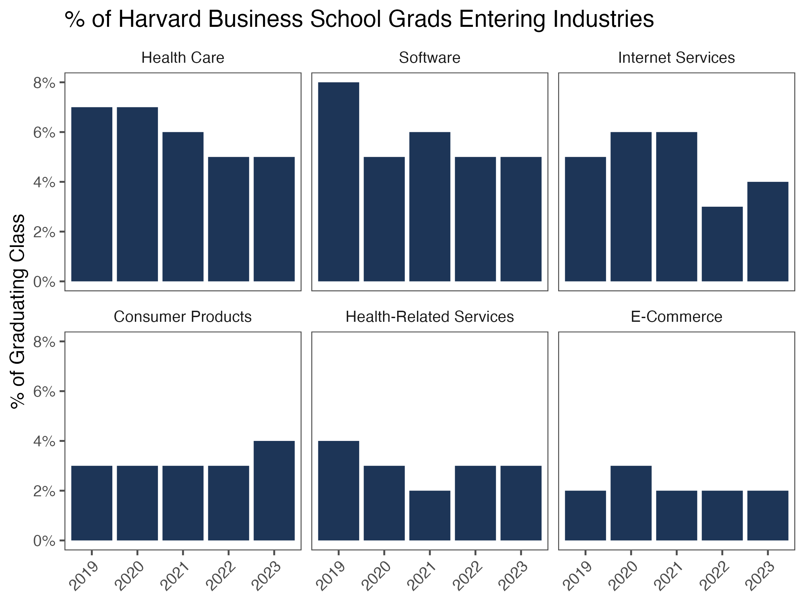

## Table of Contents

## What is the Harvard MBA Index?

The Harvard MBA Index is a tool that helps measure how satisfied graduates are with their MBA experience at Harvard Business School. It looks at things like how happy they are with their jobs after graduation, how much they earn, and how they feel about the education they received. The index is important because it gives future students an idea of what to expect from the program and helps them decide if it's the right choice for them.

The index is made up of several parts, including surveys filled out by alumni a few years after they graduate. These surveys ask about their career success, personal growth, and overall satisfaction with the MBA program. By putting all this information together, the Harvard MBA Index gives a clear picture of the program's impact on its graduates' lives. This helps the school see what it's doing well and where it might need to make improvements.

## Who created the Harvard MBA Index?

The Harvard MBA Index was created by the team at Harvard Business School. They wanted a way to see how well their MBA program was doing and how happy their graduates were. The index helps them understand if the program is meeting its goals and if it's helping students succeed in their careers.

The team at Harvard Business School worked together to design the index. They included different parts like surveys that ask alumni about their jobs, how much they earn, and how they feel about their education. By using this information, the school can see what they are doing right and where they might need to improve.

## How is the Harvard MBA Index calculated?

The Harvard MBA Index is calculated by looking at information from surveys filled out by Harvard Business School MBA graduates. These surveys ask alumni about their jobs, how much money they make, and how happy they are with their education. The school uses this information to see if the MBA program is helping students succeed and if they are happy with their experience.

To calculate the index, the school takes all the answers from the surveys and puts them together. They look at things like how many graduates got good jobs, how much their salaries increased, and how satisfied they are with their careers. By combining all these pieces of information, the school can figure out a single number that shows how well the MBA program is doing. This helps them understand what they are doing well and where they might need to make changes.

## What data sources are used to compile the Harvard MBA Index?

The Harvard MBA Index uses surveys filled out by Harvard Business School MBA graduates to gather information. These surveys ask alumni about their jobs, how much money they make, and how happy they are with their education. The school sends these surveys to alumni a few years after they graduate to see if the MBA program helped them succeed in their careers.

By collecting all the answers from the surveys, the school can put the information together to calculate the index. They look at things like how many graduates got good jobs, how much their salaries increased, and how satisfied they are with their careers. This helps the school see if the MBA program is working well and where they might need to make improvements.

## How often is the Harvard MBA Index updated?

The Harvard MBA Index is updated every year. This means that every year, Harvard Business School asks its MBA graduates to fill out a survey. The survey asks about their jobs, how much money they make, and how happy they are with their education.

By collecting this information every year, the school can see how well the MBA program is doing over time. They can also see if they need to make changes to the program to help students succeed even more.

## What is the purpose of the Harvard MBA Index?

The Harvard MBA Index helps measure how happy Harvard Business School MBA graduates are with their experience. It looks at things like how well they are doing in their jobs, how much money they earn, and if they feel good about the education they got. This index is important because it gives future students an idea of what to expect from the program and helps them decide if it's the right choice for them.

The index is made by asking alumni to fill out a survey a few years after they graduate. The survey asks about their careers, salaries, and how satisfied they are with their MBA. By putting all this information together, the school can see if the program is working well and where it might need to improve. This helps the school make the MBA program better for future students.

## How does the Harvard MBA Index compare to other business school rankings?

The Harvard MBA Index is different from other business school rankings because it focuses on how happy Harvard MBA graduates are with their experience. It looks at things like how well they are doing in their jobs, how much money they earn, and how they feel about their education. Other rankings might look at things like how famous the school is, how hard it is to get in, and what students think of the school right after they finish. The Harvard MBA Index is special because it asks alumni a few years after they graduate, so it shows the long-term effects of the MBA program.

Other business school rankings, like those from U.S. News & World Report or the Financial Times, often use a mix of different data. They might look at how much money the school has, how good the teachers are, and what students say about the school right after they graduate. These rankings give a broad view of many business schools and help people compare them. The Harvard MBA Index, on the other hand, is just for Harvard and focuses on the real-life success and happiness of its graduates, which can be more important for people thinking about going to Harvard.

## What are the key factors that influence the Harvard MBA Index?

The Harvard MBA Index is influenced by how well Harvard MBA graduates are doing in their jobs. This includes things like how much money they make and if they got good jobs after finishing the program. The index also looks at how happy the graduates are with their careers. If they feel successful and satisfied, it helps the index go up.

Another important [factor](/wiki/factor-investing) is how the graduates feel about the education they got at Harvard. If they think the MBA program helped them learn a lot and grow as people, it makes the index higher. The school asks alumni to fill out a survey a few years after they graduate to get this information. By looking at all these things together, the Harvard MBA Index shows how well the MBA program is working and if it's helping students succeed in the long run.

## How can the Harvard MBA Index be used by prospective students?

The Harvard MBA Index can help students who are thinking about going to Harvard Business School. It shows how happy past students are with their jobs and how much money they make after finishing the MBA program. By looking at the index, future students can see if the program helps people get good jobs and feel successful. This can make it easier for them to decide if Harvard is the right school for them.

The index also tells students about how past graduates feel about the education they got at Harvard. If the index is high, it means that the MBA program helped students learn a lot and grow as people. This can be important for students who want to make sure they will get a good education that will help them in the future. By using the Harvard MBA Index, students can make a better choice about whether to go to Harvard Business School.

## What trends have been observed in the Harvard MBA Index over the past decade?

Over the past ten years, the Harvard MBA Index has shown a steady increase. This means that more and more Harvard MBA graduates are happy with their jobs and how much money they make. The index has gone up because more alumni are getting good jobs and feeling successful in their careers. This trend shows that the Harvard MBA program is doing a good job of helping students succeed after they graduate.

Another trend we've seen is that graduates are feeling better about the education they got at Harvard. The index shows that more alumni think the MBA program helped them learn a lot and grow as people. This is important because it means the program is not just about getting a job, but also about becoming a better person. Overall, the Harvard MBA Index has been going up over the past decade, which is good news for anyone thinking about going to Harvard Business School.

## How does the Harvard MBA Index impact the reputation of Harvard Business School?

The Harvard MBA Index helps make Harvard Business School look good. It shows that people who finish the MBA program are happy with their jobs and how much money they make. When the index is high, it tells everyone that the school is doing a great job of helping students succeed. This makes more people want to go to Harvard because they see that it can help them get good jobs and feel successful.

The index also shows that graduates think the education at Harvard is good. When alumni say they learned a lot and grew as people, it makes the school's reputation even better. People who are thinking about going to business school see that Harvard not only helps with careers but also with personal growth. This makes Harvard Business School more attractive to future students.

## What criticisms or limitations are associated with the Harvard MBA Index?

Some people say the Harvard MBA Index has problems. One big problem is that it only looks at Harvard graduates. This means it can't be used to compare Harvard with other schools. Also, the index depends a lot on what alumni say in surveys. If not many people fill out the surveys, or if they don't answer honestly, the index might not be very accurate.

Another issue is that the index focuses on things like jobs and money. It might not show other important parts of the MBA experience, like how much students learn or how they grow as people. Some people think the index should look at more than just careers and salaries to really show how good the program is.

## References & Further Reading

[1]: Soifer, R. A. (1999). "The Harvard MBA Indicator: Filling in the Details". Business Economics, 34(3), 39-41.

[2]: Malkiel, B. G. (2007). ["A Random Walk Down Wall Street: The Time-tested Strategy for Successful Investing"](https://yourknowledgedigest.org/wp-content/uploads/2020/04/a-random-walk-down-wall-street.pdf). W. W. Norton & Company.

[3]: Shiller, R. J. (2000). ["Irrational Exuberance"](https://www.amazon.com/Irrational-Exuberance-Robert-J-Shiller/dp/0767923634). Princeton University Press.

[4]: Baker, M., & Wurgler, J. (2007). "Investor Sentiment in the Stock Market". Journal of Economic Perspectives, 21(2), 129-151.

[5]: Fama, E. F., & French, K. R. (1993). "Common Risk Factors in the Returns on Stocks and Bonds". Journal of Financial Economics, 33(1), 3-56.