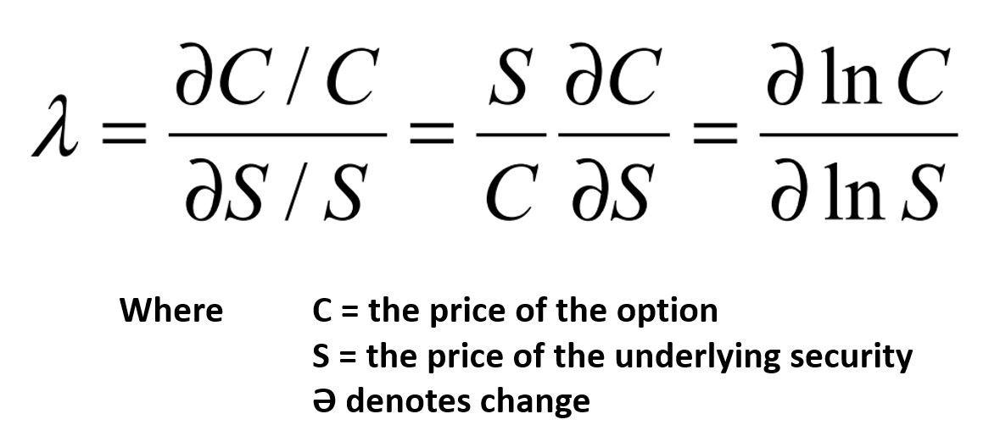

## Table of Contents

## What is Hasbrouck's lambda?

Hasbrouck's lambda is a measure used in finance to understand how much a stock's price moves when someone buys or sells it. It helps us see if the price goes up a lot when someone buys, or down a lot when someone sells. This measure is important because it shows how easy or hard it is to trade a stock without affecting its price too much.

The way Hasbrouck's lambda works is by looking at the price changes that happen right after a trade. If the price jumps a lot after a buy, or drops a lot after a sell, then the lambda value will be high. This means the stock is less liquid, or harder to trade without moving the price. If the price doesn't change much after a trade, the lambda value will be low, showing the stock is more liquid and easier to trade.

## Who is Joel Hasbrouck and why did he develop the lambda?

Joel Hasbrouck is a professor at the New York University Stern School of Business. He is known for his work in the field of finance, especially in market microstructure. This is the study of how markets work at a very detailed level, like how trades happen and how prices are set.

Hasbrouck developed the lambda measure to help understand how buying and selling affect stock prices. He wanted a way to see how much the price of a stock would move after someone traded it. This is important because it tells us how easy or hard it is to trade a stock without making its price go up or down a lot. Lambda helps investors and traders know how liquid a stock is, which means how easily it can be bought or sold.

## How does Hasbrouck's lambda measure market liquidity?

Hasbrouck's lambda measures market liquidity by looking at how much a stock's price changes after someone buys or sells it. If the price goes up a lot after a buy or down a lot after a sell, the lambda value will be high. This means the stock is not very liquid, which means it's harder to trade without affecting the price much. On the other hand, if the price doesn't change much after a trade, the lambda value will be low. This shows that the stock is more liquid and easier to trade without big price changes.

This measure helps investors and traders understand how easy it is to buy or sell a stock without causing big price movements. High lambda values mean the market for that stock is less liquid, making it riskier to trade because even small trades can move the price a lot. Low lambda values show a more liquid market, where trades can happen without much impact on the price, making it easier and safer to trade.

## What is the formula for calculating Hasbrouck's lambda?

Hasbrouck's lambda is calculated using a special formula that looks at how stock prices change after trades. The basic idea is to see how much the price moves when someone buys or sells. The formula is a bit complicated, but it's based on something called regression analysis. You take the price changes that happen right after trades and use them to figure out lambda. The exact math is: lambda = σ / √(2π), where σ is the standard deviation of the price changes caused by trades.

This formula helps us understand how easy or hard it is to trade a stock without making the price go up or down a lot. If lambda is high, it means the stock's price can move a lot after even small trades, showing the stock is not very liquid. If lambda is low, the stock's price doesn't change much after trades, which means it's more liquid and easier to trade. So, lambda gives us a number that tells us about the liquidity of a stock in the market.

## Can you explain the components of the Hasbrouck's lambda formula?

Hasbrouck's lambda formula has two main parts that help us understand how a stock's price moves after trades. The first part is sigma (σ), which is the standard deviation of the price changes that happen right after someone buys or sells the stock. Think of sigma as a way to measure how much the price usually jumps around after trades. If the price changes a lot after trades, sigma will be a bigger number.

The second part of the formula is √(2π), which is the square root of two times pi. This number is always the same and comes from math used in [statistics](/wiki/bayesian-statistics). When we divide sigma by √(2π), we get lambda. This formula tells us how sensitive the stock's price is to trades. A high lambda means the price can change a lot even with small trades, showing the stock is not very liquid. A low lambda means the price stays pretty stable after trades, showing the stock is more liquid and easier to trade.

## How is Hasbrouck's lambda different from other liquidity measures?

Hasbrouck's lambda is different from other liquidity measures because it focuses on how much a stock's price moves right after a trade happens. Other measures, like bid-ask spread, look at the difference between the highest price someone is willing to pay and the lowest price someone is willing to sell. Lambda, on the other hand, tells us how sensitive the price is to trades. This means it helps us see how much the price will jump up or down after someone buys or sells, which is useful for understanding how easy or hard it is to trade without affecting the price a lot.

Another way lambda is different is that it uses a special formula that looks at the standard deviation of price changes after trades. This is different from measures like trading volume, which just count how many shares are traded. Lambda gives us a number that shows how liquid a stock is by looking at the impact of each trade on the price. This can be more helpful for traders and investors who want to know how their trades might affect the price, compared to just knowing how many shares are being traded.

## What are the practical applications of Hasbrouck's lambda in financial markets?

Hasbrouck's lambda is really useful for people who trade stocks. It helps them understand how much a stock's price might change when they buy or sell it. If lambda is high, it means the price can move a lot even with small trades. This tells traders that the stock is not very liquid, so they need to be careful because their trades could make the price go up or down a lot. On the other hand, if lambda is low, the price doesn't change much after trades. This means the stock is more liquid and easier to trade without big price swings. Traders can use this information to decide when and how to trade, making their decisions smarter and safer.

Another way Hasbrouck's lambda is used is by investors who want to know how easy it is to buy or sell a stock. If they see a high lambda, they might think twice before investing because it could be hard to sell the stock later without losing money. But if lambda is low, they might feel more comfortable investing because they know they can sell the stock more easily without big price changes. This helps investors pick stocks that fit their plans and risk levels, making their investment choices better and more informed.

## How can Hasbrouck's lambda be used to assess the impact of trades on price?

Hasbrouck's lambda helps traders and investors see how much a stock's price might change when they buy or sell it. It does this by looking at how the price moves right after a trade happens. If lambda is high, it means the price can go up or down a lot even with small trades. This tells people that the stock is not very liquid, so they need to be careful because their trades could make the price move a lot. On the other hand, if lambda is low, the price doesn't change much after trades. This means the stock is more liquid and easier to trade without big price swings.

Traders can use this information to make smarter decisions about when and how to trade. If they know a stock has a high lambda, they might decide to trade smaller amounts or wait for a better time to trade. This helps them avoid big price changes that could lose them money. Investors also use lambda to pick stocks that fit their plans. If they see a high lambda, they might think twice before investing because it could be hard to sell the stock later without losing money. But if lambda is low, they might feel more comfortable investing because they know they can sell the stock more easily without big price changes.

## What are the limitations and criticisms of using Hasbrouck's lambda?

Hasbrouck's lambda is a helpful tool, but it has some limits. One big limit is that it only looks at how the price moves right after a trade. It doesn't tell us about other things that can affect the price, like news or big events in the market. This means lambda might not give us the full picture of why prices change. Also, lambda needs a lot of data to work well. If there aren't enough trades, the lambda number might not be very accurate. This can make it hard to use for stocks that don't trade often.

Another criticism is that lambda can be hard to understand and use for people who aren't experts in finance. The formula and the idea behind it are a bit complicated. This means that regular investors might not find it very helpful because they might not know how to use it right. Also, some people think that other ways to measure liquidity, like the bid-ask spread or trading volume, might be easier to use and understand. So, while lambda can give us good information, it's not perfect and might not be the best choice for everyone.

## How has Hasbrouck's lambda been implemented in empirical studies?

Hasbrouck's lambda has been used in many studies to understand how trades affect stock prices. Researchers often use it to see how liquid different stocks are. They look at lots of data from stock trades and use the lambda formula to find out how much the price moves after someone buys or sells. This helps them learn which stocks are easier to trade without making big price changes. For example, in one study, researchers used lambda to compare the liquidity of stocks in different markets and found that some markets had stocks that were easier to trade than others.

In another study, people used Hasbrouck's lambda to see how trading rules and regulations affect how easy it is to buy and sell stocks. They found that when rules make it harder to trade, lambda goes up, meaning the price moves more after trades. This tells us that the stocks become less liquid. Researchers also use lambda to check how well different trading strategies work. They can see if a strategy makes the price move a lot or a little, which helps them decide if it's a good strategy to use. These studies show how useful lambda can be for understanding the stock market better.

## What are some advanced techniques for estimating Hasbrouck's lambda more accurately?

To estimate Hasbrouck's lambda more accurately, researchers use more data and better math. They look at a lot more trades over a longer time to get a better idea of how the price usually moves after someone buys or sells. This helps make the lambda number more reliable. They also use special math called "maximum likelihood estimation" to find the best lambda value. This math helps them use all the data in the best way to get a more accurate answer.

Another way to improve lambda estimates is by using computers to run simulations. These simulations can show how the price might move in different situations, which helps researchers see how well their lambda number works. They can also use other information, like how often people trade and how big the trades are, to make their lambda estimate better. By using these advanced techniques, researchers can get a more accurate picture of how liquid a stock is and how trades affect its price.

## How does Hasbrouck's lambda relate to other market microstructure theories?

Hasbrouck's lambda is a part of market microstructure, which is all about how trades happen and how prices are set in markets. It fits well with other ideas in this area because it helps us understand how buying and selling affect stock prices. For example, lambda is related to the idea of the bid-ask spread, which is the difference between the highest price someone is willing to pay and the lowest price someone is willing to sell. A high lambda often means a wider bid-ask spread, showing that the stock is less liquid and harder to trade without moving the price a lot. This connection helps traders and investors see how easy or hard it is to trade a stock.

Lambda also connects to theories about how information moves in markets. When new information comes out, like a company's earnings report, it can make people want to buy or sell the stock. Lambda helps us see how much the price might move because of this information. If lambda is high, the price can change a lot even with small trades, which means the market might be reacting quickly to new information. This fits with ideas about how markets process information and how quickly prices adjust to new news. So, lambda is a useful tool that works well with other market microstructure theories to help us understand how markets work.

## What is Hasbrouck’s Lambda and how can it be understood?

Hasbrouck’s Lambda is a quantitative metric designed to assess the price impact of trades within financial markets. It serves as a crucial tool for traders and financial analysts by providing detailed insights into how trades of varying sizes can influence the market price of an asset. Understanding Hasbrouck's Lambda involves a comprehensive analysis of the relationship between trade sizes and the resultant price changes, offering a clearer picture of market [liquidity](/wiki/liquidity-risk-premium). 

This metric is integral for evaluating how easily an asset can be bought or sold without causing significant price movement. When liquidity is high, a market can absorb large trades with minimal impact on price, signifying a low Lambda value. Conversely, a high Lambda value indicates that even relatively small trades can lead to significant price deviations, a hallmark of a less liquid market.

The calculation of Lambda requires a statistical approach to understanding the correlation between trade volumes and price changes. Specifically, it assesses the elasticity of price movements with respect to trade size. Financial analysts and traders typically leverage historical trade and quote data to conduct this analysis, which involves complex modeling to quantify the expected price impact correlating with different trade sizes. 

The formula for calculating Hasbrouck's Lambda can be represented as:

$$
\lambda = \frac{\Delta P}{Q}
$$

where:
- $\Delta P$ is the change in price resulting from a trade,
- $Q$ is the trade size.

By computing Lambda, traders gain an advantage in predicting potential market reactions to large trades, thereby enabling more strategic decision-making processes. This predictive capability is invaluable for minimizing unforeseen costs associated with price slippage and executing trades more efficiently. Consequently, Hasbrouck's Lambda stands as a powerful tool to anticipate and manage the dynamics of price movements in trading environments.

## How do you calculate Hasbrouck's Lambda?

Calculating Hasbrouck’s Lambda involves a systematic approach utilizing trade and quote (TAQ) data to quantify the impact of trade sizes on market prices. This measurement requires comprehensive historical TAQ data for the specific security under analysis. Traders and financial analysts typically start by collecting high-frequency data encompassing both trade prices and corresponding volumes. 

The next step in calculating Hasbrouck's Lambda is to statistically analyze this data to discern patterns of average price changes relative to variations in trade volumes. This analysis generally necessitates the use of econometric or statistical models to establish the relationship between trade size and price impact. A common approach might involve regression models where price changes are regressed on trade volumes to determine the Lambda value, which can be formulated as:

$$
\lambda = \frac{\Delta P}{V}
$$

where $\Delta P$ represents the change in price and $V$ is the trade volume. This formula provides a baseline understanding of how much a single unit of volume affects price changes.

The deployment of Hasbrouck’s Lambda in real-time trading systems requires access to high-frequency trading data and robust computation platforms capable of processing and analyzing large data sets quickly. High-performance computing resources and technologies that can handle streaming data efficiently are essential in this context. 

Python and R are popular programming languages used to compute and monitor Lambda due to their extensive libraries for data analysis. For example, Python libraries such as Pandas and NumPy can be used to handle large datasets, while libraries like StatsModels can assist in performing regression analyses necessary to derive Lambda. An example in Python might look like:

```python
import pandas as pd
import statsmodels.api as sm

# Load trade and quote data
data = pd.read_csv('taq_data.csv')
X = data['[volume](/wiki/volume-trading-strategy)']
y = data['price_change']

# Add a constant to the model
X = sm.add_constant(X)

# Perform the regression
model = sm.OLS(y, X).fit()

# Retrieve the Lambda coefficient
lambda_value = model.params[1]
print(f'Calculated Lambda: {lambda_value}')
```

In summary, the calculation of Hasbrouck’s Lambda requires a detailed analysis of transaction data to derive meaningful insights into how trade sizes impact market prices. The process is supported by high-frequency data, statistical modeling, and computational tools like Python and R to facilitate the necessary calculations and inform trading strategies.

## References & Further Reading

[1]: Hasbrouck, J. (1991). ["Measuring the Information Content of Stock Trades"](https://www.jstor.org/stable/2328693). The Journal of Finance, 46(1), 179-207.

[2]: Lopez de Prado, M. (2018). ["Advances in Financial Machine Learning"](https://www.amazon.com/Advances-Financial-Machine-Learning-Marcos/dp/1119482089). Wiley.

[3]: Hasbrouck, J. (2007). ["Empirical Market Microstructure: The Institutions, Economics, and Econometrics of Securities Trading"](https://academic.oup.com/book/52241). Oxford University Press.

[4]: Chan, E. P. (2009). ["Quantitative Trading: How to Build Your Own Algorithmic Trading Business"](https://github.com/ftvision/quant_trading_echan_book). Wiley.

[5]: Almgren, R., & Chriss, N. (2001). ["Optimal Execution of Portfolio Transactions"](https://www.risk.net/journal-risk/2161150/optimal-execution-portfolio-transactions). The Journal of Risk, 3(2), 5-39.