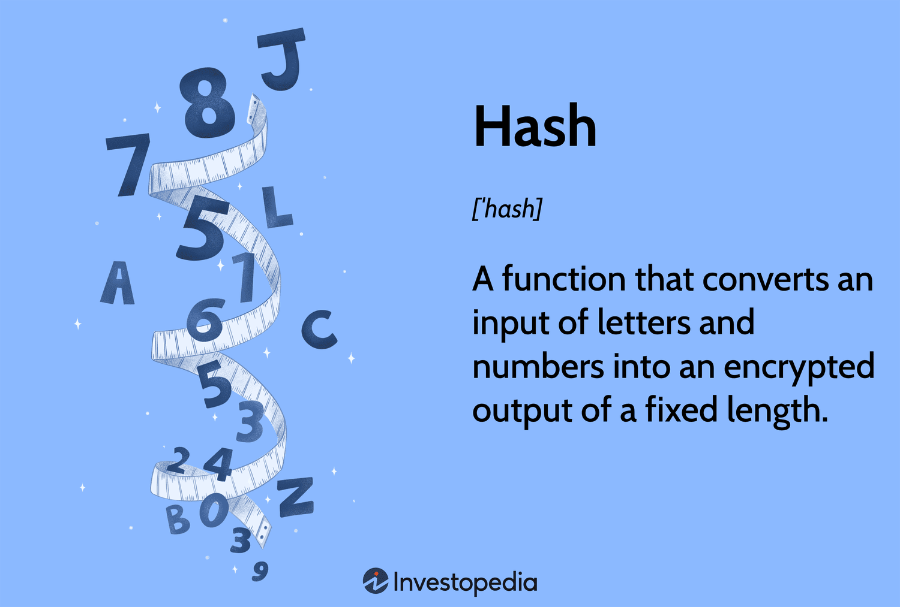

Cryptocurrency mining is a fundamental component of the blockchain ecosystem. It involves the process of validating and recording transactions on a blockchain network, which is critical for maintaining the integrity and security of the overall system. Through mining, new cryptocurrency coins are also minted, incentivizing individuals and organizations to contribute computational resources to this process.

A key aspect of cryptocurrency mining is the use of hash functions. These cryptographic functions convert data of any size into a fixed-size string of characters, which is usually a sequence of numbers and letters. Hash functions play a crucial role in ensuring data integrity and security. They are used extensively in mining to solve cryptographic puzzles that validate new transactions and add them to the blockchain, a method commonly known as proof-of-work (PoW). The difficulty of these puzzles is adjusted to maintain balance and security within the network.

Hash algorithms, which are used to execute and compute hash functions, have significant relevance in algorithmic trading (algo trading). Algo trading utilizes mathematical models and software to make high-speed and automatized trading decisions. The efficiency and speed of these algorithms can significantly influence the performance of trading strategies by allowing rapid processing of large volumes of data, which is often required in cryptocurrency markets characterized by high volatility and rapid price movements.

This article explores the intricate relationship between cryptocurrency mining, hash functions, and algorithmic trading. As cryptocurrencies gain popularity and the demand for efficient mining and trading technologies increases, understanding these interactions becomes crucial for participants in the crypto market. Emphasizing both the technical and strategic implications, this article seeks to provide insights into how these elements converge to shape the future of cryptocurrency markets.

## Table of Contents

## Understanding Cryptocurrency Mining

Cryptocurrency mining is a critical process that supports the decentralized nature of blockchain ecosystems, ensuring both transaction validation and network security. At its core, mining is the mechanism through which transactions are verified and added to a blockchain ledger, making it an integral aspect of cryptocurrency operations.

The primary purpose of mining is to validate new transactions by grouping them into blocks and appending these blocks to the blockchain. Each new transaction within a cryptocurrency network, such as Bitcoin, is broadcast to all participants (or nodes). Miners collect these transactions, verify their legitimacy based on the cryptographic protocols of the network, and compile them into blocks. This process not only records transactions on the blockchain but also secures the network against fraudulent activities, as each block is cryptographically linked to the previous block, forming an immutable chain.

Miners also play a crucial role in the creation of new coins. For example, in Bitcoin mining, miners are rewarded with newly created bitcoins for successfully adding a block to the blockchain. This incentive is designed to encourage participation and maintain the security and functionality of the [cryptocurrency](/wiki/cryptocurrency) network.

There are different consensus mechanisms employed in cryptocurrency mining, most notably proof-of-work (PoW) and proof-of-stake (PoS). In a PoW system, such as Bitcoin, miners compete to solve complex mathematical puzzles, with the first miner to solve the puzzle [earning](/wiki/earning-announcement) the right to add the block to the blockchain and claim the reward. The puzzle usually involves finding a nonce such that the hash of the block's header is less than a specified target, which requires significant computational effort expressed as $H(n) < T$, where $H$ is the hash function, $n$ is the nonce, and $T$ is the target difficulty.

On the other hand, PoS is an alternative consensus algorithm designed to address the high energy consumption associated with PoW. In PoS, the creator of a new block is chosen deterministically based on the wealth (stake) they hold in the cryptocurrency, reducing the need for energy-intensive computations. This approach encourages long-term participation and sustainability in blockchain networks.

Energy efficiency and computational power are essential considerations in mining operations. The computational power needed for mining, particularly under PoW systems, necessitates specialized hardware, such as Application-Specific Integrated Circuits (ASICs), which are optimized for mining efficiency. The immense energy consumption associated with mining has sparked discussions about environmental impacts, driving innovations towards renewable energy sources and more efficient mining technologies.

In summary, cryptocurrency mining is not only crucial for transaction validation and network security but also for the introduction of new coins within the market. The mining process, predominantly governed by PoW and PoS mechanisms, highlights the importance of computational capabilities and energy efficiency in sustaining a viable and environmentally conscious cryptocurrency ecosystem.

## The Role of Hash Functions in Mining

Hash functions play a pivotal role in cryptocurrency mining by ensuring data integrity, security, and facilitating the mining process. At their core, hash functions are mathematical algorithms that take an input and produce a fixed-size string of characters, which appears random. This output, referred to as the hash value, is unique to each unique input, akin to a digital fingerprint.

The cryptographic importance of hash functions lies in their ability to maintain data integrity and security. These functions ensure that any alteration to the input data, even minimal, results in a drastically different hash value, thereby providing a reliable means to verify the authenticity and integrity of data. Due to this property, hash functions are instrumental in securing blockchain transactions, as they prevent tampering and guarantee that transaction records remain unaltered.

In cryptocurrency mining, hash functions serve a dual purpose: solving cryptographic puzzles and assisting in the creation of new blocks in a blockchain. The most prominent of these cryptographic puzzles is the proof-of-work problem, where miners compete to find a hash value that meets a specific target. This target is determined by the network's difficulty level and is adjusted periodically to ensure that block generation occurs at a stable rate.

Commonly used hash functions in cryptocurrency mining include SHA-256 and Ethash. SHA-256, utilized by Bitcoin, generates a 256-bit hash and is renowned for its security and reliability. Ethash, used by Ethereum, is designed to be memory hard, meaning it requires significant memory resources, thereby reducing the advantage that specialized hardware, like ASICs, might have over general-purpose hardware.

Despite their robust design, hash functions face challenges and limitations in sustaining mining operations. One primary concern is their computational expense, which translates to a high demand for energy. This energy consumption has environmental impacts and imposes operational costs on miners. Additionally, the resilience of hash functions is continually tested by advances in computational capabilities and cryptographic research, necessitating ongoing innovation and adaptation.

In conclusion, while hash functions are foundational to cryptocurrency mining, understanding their functions, applications, and limitations is crucial for sustaining mining operations and upholding the security of blockchain networks. Their continued evolution will be vital to addressing current challenges and enhancing the efficiency and security of cryptocurrency systems.

## Exploring Hash Algorithms

Hash algorithms are mathematical constructs that transform input data into a fixed-size string of characters, known as a hash value or hash code. Their primary function is to facilitate rapid data retrieval and verification by providing a unique representation of input data, akin to a digital fingerprint. Unlike encryption, which is reversible, hash algorithms are designed to be one-way functions, ensuring that the original input cannot be feasibly reconstructed from the hash value alone. This property is crucial in ensuring data integrity and security.

### Difference between Hash Functions and Hash Algorithms

While the terms "hash function" and "hash algorithm" are often used interchangeably, they denote distinct concepts. A hash function refers to the specific mathematical or logical operation that transforms input data into a hash value. In contrast, a hash algorithm encompasses the broader procedural approach, including preprocessing and any iterative operations, that governs how the hash function is applied to data. In summary, hash functions form the core operations within hash algorithms used in computing hash values.

### Common Hash Algorithms Used in Cryptocurrency Mining

Cryptocurrency mining relies heavily on specific hash algorithms to verify transactions and maintain blockchain integrity. SHA-256, utilized by Bitcoin, is among the most prevalent algorithms. It generates a 256-bit fixed-size hash and offers substantial security through its computational complexity. Ethash, used by Ethereum, is another critical algorithm, designed to be memory-hard, making it resistant to the advantages of specialized hardware like ASICs (Application-Specific Integrated Circuits). Other notable algorithms include Scrypt, used by Litecoin, which emphasizes high memory usage to deter parallel cracking.

### Impact of Hash Algorithms on Mining Speed and Efficiency

The choice of hash algorithm directly impacts the speed and efficiency of mining operations. Algorithms such as SHA-256 are computationally intensive, necessitating significant processing power to solve cryptographic puzzles. However, they provide high security and resistance to attacks. In contrast, algorithms like Ethash are intentionally designed to favor general-purpose computing hardware (such as GPUs), promoting more decentralized mining. The efficiency of an algorithm therefore influences the hardware requirements and overall cost of mining operations.

### Security Considerations

Security is a paramount concern in selecting hash algorithms for cryptocurrency mining. A secure hash algorithm should be resistant to collision attacks, where two different inputs produce the same hash value. It should also be preimage resistant, meaning that given a hash value, it should be infeasible to reverse-engineer the original input. The bit length of the hash output (e.g., 256-bit for SHA-256) typically correlates with its security level; longer bit lengths generally offer greater security. Nonetheless, quantum computing poses a potential future threat, as it could undermine the current security assumptions underlying many hash algorithms. 

Continuous advancements in hash algorithms are vital in sustaining the security and efficiency of cryptocurrency mining against evolving threats, ensuring they remain robust against both conventional and emerging technological attacks.

## Hash Algorithms in Algo Trading

Algorithmic trading, commonly known as algo trading, represents a significant development in the cryptocurrency market, utilizing algorithms to automate trading strategies and decisions. In this context, hash algorithms play a crucial role, contributing to the optimization of both speed and precision in executing trades. By processing enormous volumes of data efficiently, hash algorithms help traders manage portfolios and assess market trends more effectively.

Hash algorithms are integral to executing trading strategies quickly. They provide a mechanism for encrypting and verifying data integrity, which is essential when assessing real-time market conditions. In the highly volatile and fast-paced cryptocurrency market, milliseconds can make a significant difference. Thus, optimizing hash algorithms enhances traders' ability to execute orders rapidly, reducing latency and the risk of slippage—a condition where trades are executed at prices not expected by traders.

The primary benefit of leveraging hash algorithms is the increased accuracy in trading executions. By ensuring data integrity and quick hash computations, traders can rely on precise and updated data to make informed decisions. This results in more reliable [backtesting](/wiki/backtesting) and real-time strategy adjustments, enhancing the predictability of outcomes and profits.

Various hash-based strategies are employed in algo trading, including [arbitrage](/wiki/arbitrage), market-making, and [momentum](/wiki/momentum)-based strategies. Arbitrage strategies exploit price differences of cryptocurrencies across different markets, whereas market-making strategies involve providing [liquidity](/wiki/liquidity-risk-premium) by maintaining buy and sell limits near market prices. Momentum-based strategies capitalize on the continuation of existing market trends. Hash algorithms facilitate the rapid analysis of market data required for these strategies, optimizing computational tasks and reducing execution times.

Several trading platforms have integrated hash algorithms for market analysis, including quantitative analysis platforms and exchanges that specialize in [algorithmic trading](/wiki/algorithmic-trading). For instance, platforms like QuantConnect and AlgoTrader offer tools that use advanced hash algorithms to assess market data patterns and identify potential trade opportunities. By utilizing efficient hashing techniques, these platforms enhance their analytical capabilities, offering features that support backtesting, optimization, and deployment of trading strategies.

Overall, the integration of hash algorithms into algo trading significantly impacts the efficacy and precision of trading operations in the cryptocurrency market. By improving data integrity, speeding up execution processes, and supporting various trading strategies, hash algorithms help traders optimize their performance in navigating the dynamic cryptocurrency landscape.

## Challenges and Innovations

Cryptocurrency mining and algorithmic trading face a suite of challenges rooted in the use of hash functions and algorithms. Understanding these challenges can guide the development of more efficient technologies, inform innovation in mining and trading operations, and shape future trends in the crypto industry.

### Challenges Faced by Miners and Traders

Hash functions, while integral to the integrity and security of cryptocurrencies, pose significant energy consumption challenges. The computational effort associated with solving cryptographic puzzles in mining affects both the environment and operational costs. Moreover, the competitive nature of mining demands continuous advancements in computational power and efficiency.

Traders, on the other hand, face the challenge of latency in executing trades, where speed is paramount. Hash algorithms that enable rapid data processing are essential for executing trading strategies efficiently. Ensuring the security of transactions while maintaining speed and accuracy is a constant balancing act.

### Evolution of Technologies

The evolution of technologies designed to enhance mining and trading efficiency focuses on increasing computational power while reducing energy usage. Notable advancements include the development of Application-Specific Integrated Circuits (ASICs) designed explicitly for mining purposes, which outperform traditional GPU-based systems in terms of speed and efficiency. These technological advancements have contributed significantly to optimizing mining operations.

In the trading arena, the transition from manual to algorithmic trading has revolutionized how trades are executed. Modern trading platforms leverage sophisticated hash algorithms to analyze massive datasets in real-time, providing traders with insights that are both timely and precise.

### Innovations in Hardware and Software

Hardware innovations play a pivotal role in optimized mining operations. ASIC miners represent a primary innovation, engineered for one specific mining algorithm, which allows for a drastic increase in efficiency and performance.

On the software side, mining pool software has evolved to better distribute workloads among miners, thus improving efficiency and resource utilization. For traders, advanced algorithmic trading software uses hash algorithms to parse and analyze trends and variations in market data, enabling faster and improved decision-making.

### Future Developments in Hash Algorithms

The future of hash algorithms holds potential modifications that could further enhance security and efficiency. Quantum-resistant algorithms are under exploration, aimed at safeguarding cryptocurrencies against the emerging threat of quantum computing, which could theoretically overpower traditional cryptographic systems.

New algorithmic frameworks are being researched to offer enhanced scalability and security, which could transform methodologies in both mining and trading. These developments are seen as essential, ensuring that the crypto industry can adapt to evolving security threats and maintain its integrity.

### Case Studies and Lessons Learned

Numerous case studies illustrate successful implementations of hash functions and algorithms. For instance, the transition by Bitcoin miners to use ASICs has resulted in substantial increases in mining efficiency and hash rates. This shift underscores the importance of matching hardware design closely with the specific demands of a given algorithm.

In algorithmic trading, the adoption of [machine learning](/wiki/machine-learning) models to process hash algorithm outputs has showcased high-speed, high-accuracy trade executions. These case studies reveal the critical role of combining computational power with intelligent software to meet industry demands.

In summary, the challenges and innovations associated with hash functions and algorithms are central to the ongoing evolution of cryptocurrency mining and trading technologies. Addressing these challenges with creative innovations not only strengthens operational efficiency but also ensures the resilience and robustness of the broader crypto ecosystem.

## Conclusion

Cryptocurrency mining, hash functions, and algorithmic trading together form an intricate network that underpins the digital currency ecosystem. Mining is the bedrock that maintains blockchain security and integrity through a decentralized consensus mechanism. Hash functions, with their cryptographic significance, ensure the validity and tamper-resistance of blockchain operations. They are instrumental in solving cryptographic puzzles that validate and record transactions. Algorithmic trading, by leveraging hash algorithms, further enhances trading efficiency, precision, and speed.

As cryptocurrency technologies advance, so do the methods and tools associated with them. Mining has evolved from individual computing efforts to large-scale operations emphasizing energy efficiency and computational power. Concurrently, improved hash algorithms have bolstered speed and security, addressing some challenges like collision resistance and computational efficiency that once limited their application.

For crypto market participants, understanding hash functions and algorithms isn't just an academic exercise; it's fundamental for thriving in this competitive landscape. Insight into these technologies empowers market actors to make informed decisions—from optimizing mining operations to crafting effective trading strategies. Developing robust knowledge in this area promotes the innovative use of technologies, driving progress and adaptability.

Looking ahead, cryptocurrency mining and trading are likely to see further advancements. Novel consensus mechanisms may reduce energy consumption, and emerging algorithms could address existing security concerns. The perpetual cycle of challenge and response fuels innovation.

The cryptocurrency sector is at the forefront of technological evolution, providing vast opportunities for exploration and development. Individuals and organizations that engage in understanding and advancing these innovations remain well-positioned to harness the potential of the digital currency market, shaping the future of the financial landscape.

## References & Further Reading

[1]: Nakamoto, S. (2008). ["Bitcoin: A Peer-to-Peer Electronic Cash System."](https://nakamotoinstitute.org/library/bitcoin/)

[2]: Conti, M., Kumar, S., Lal, C., & Ruj, S. (2018). ["A Survey on Security and Privacy Issues of Bitcoin."](https://ieeexplore.ieee.org/document/8369416) IEEE Communications Surveys & Tutorials, 20(4), 3416-3452.

[3]: Bonneau, J., Miller, A., Clark, J., Narayanan, A., Kroll, J. A., & Felten, E. W. (2015). ["Sok: Research Perspectives and Challenges for Bitcoin and Cryptocurrencies."](https://ieeexplore.ieee.org/document/7163021) In IEEE Symposium on Security and Privacy, IEEE.

[4]: Tschorsch, F., & Scheuermann, B. (2016). ["Bitcoin and Beyond: A Technical Survey on Decentralized Digital Currencies."](https://ieeexplore.ieee.org/document/7423672) IEEE Communications Surveys & Tutorials, 18(3), 2084-2123.

[5]: Dwork, C., & Naor, M. (1992). ["Pricing via Processing or Combatting Junk Mail"](https://link.springer.com/chapter/10.1007/3-540-48071-4_10) in Advances in Cryptology (CRYPTO 92), Lecture Notes in Computer Science, vol 740. Springer, Berlin, Heidelberg.

[6]: Narayanan, A., Bonneau, J., Felten, E., Miller, A., & Goldfeder, S. (2016). ["Bitcoin and Cryptocurrency Technologies."](https://press.princeton.edu/books/hardcover/9780691171692/bitcoin-and-cryptocurrency-technologies) Princeton University Press.