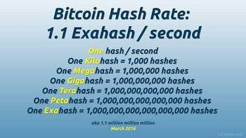

## Table of Contents

## What is hash rate and why is it important in cryptocurrency?

Hash rate is a measure of the computing power used to process transactions and mine new coins in a cryptocurrency network. It is calculated in hashes per second, showing how many calculations a computer or network can perform in a second. In simple terms, the hash rate tells us how fast a cryptocurrency network can solve the complex math problems needed to validate transactions and add them to the blockchain.

The hash rate is important because it shows how secure and healthy a cryptocurrency network is. A higher hash rate means more computers are working together, making the network more secure against attacks. If someone wants to harm the network, they would need more computing power than the entire network combined, which is very hard if the hash rate is high. Also, a stable or growing hash rate can mean that more people are interested in the cryptocurrency, which can be a good sign for its future.

## How is hash rate measured and what units are used?

Hash rate is measured by counting how many times a computer can solve a math problem in one second. This math problem is used to check and add transactions to the blockchain. The more problems a computer can solve, the higher the hash rate. People use different units to talk about hash rate, depending on how big the number is. The smallest unit is one hash per second, which is written as H/s. As the number gets bigger, we use bigger units like kilo hashes per second (KH/s), mega hashes per second (MH/s), giga hashes per second (GH/s), tera hashes per second (TH/s), peta hashes per second (PH/s), and exa hashes per second (EH/s).

For example, if a computer can solve 1,000 math problems in one second, we say it has a hash rate of 1 KH/s. If it can solve 1,000,000 problems, it's 1 MH/s. These units help us understand and compare the power of different computers or the whole network easily. A high hash rate means the network is strong and secure because it shows many computers are working together to keep the [cryptocurrency](/wiki/cryptocurrency) safe.

## What factors affect the hash rate of a mining operation?

The hash rate of a mining operation can be affected by several things. One big [factor](/wiki/factor-investing) is the type and number of mining hardware used. Some computers, called ASICs, are made just for mining and can do a lot more calculations than regular computers. If a mining operation uses a lot of these powerful machines, the hash rate will be higher. Another thing that matters is how well the machines are taken care of. If they get too hot or are not working right, they won't be able to do as many calculations, which means a lower hash rate.

Another important factor is the electricity supply. Mining uses a lot of power, so if the electricity is not strong or steady, the machines might not work at their best. Also, the software used for mining can make a difference. Good software can help the machines work better and faster, which can increase the hash rate. Lastly, the overall health of the network can affect the hash rate. If the cryptocurrency is doing well and more people are interested, more miners might join in, which can boost the total hash rate of the network.

## Can you explain the relationship between hash rate and network difficulty?

Hash rate and network difficulty are closely related in a cryptocurrency network. The hash rate is how fast the computers in the network can solve the math problems needed to add new blocks to the blockchain. Network difficulty, on the other hand, is a measure of how hard these math problems are. The network adjusts the difficulty to keep the time it takes to add a new block about the same, usually around 10 minutes for Bitcoin. If the hash rate goes up because more miners join or they use more powerful machines, the network will make the math problems harder to solve. This keeps the block time steady even though the computers are working faster.

If the hash rate goes down, maybe because some miners leave or their machines are not working as well, the network will make the math problems easier. This helps to keep the block time the same even though fewer computers are working on the problems. So, the hash rate and network difficulty work together to make sure the cryptocurrency network runs smoothly and stays secure. When the hash rate changes, the difficulty adjusts to balance things out, making sure new blocks are added at a regular pace.

## How does hash rate impact the security of a blockchain network?

Hash rate is really important for keeping a blockchain network safe. It shows how much computing power is working to check and add new transactions to the blockchain. When the hash rate is high, it means a lot of computers are working together. This makes it very hard for someone to attack the network because they would need more power than all those computers combined. So, a high hash rate helps keep the network secure by making it tough for bad people to mess with the transactions.

If the hash rate goes down, the network might not be as safe. With fewer computers working, it's easier for someone to try and take over the network. They might try to change past transactions or add fake ones. But if the hash rate stays high and keeps growing, it shows that more people are interested in the cryptocurrency and are helping to keep it secure. This is good because it means the network is strong and less likely to be attacked.

## What tools or software can be used to measure hash rate?

There are several tools and software that people use to measure hash rate. One popular tool is mining software like CGMiner and EasyMiner. These programs not only help with mining but also show how fast your computer is working by displaying the hash rate. Another tool is online platforms like WhatToMine, which can calculate the hash rate of your mining setup by entering details about your hardware. These tools are easy to use and give you a clear idea of how well your mining operation is performing.

Another way to measure hash rate is by using specialized hardware monitoring software like GPU-Z or HWiNFO. These programs can show detailed information about your computer's performance, including the hash rate of your graphics cards if they are being used for mining. For people who want to keep an eye on the whole network's hash rate, websites like Blockchain.com or Coinwarz provide real-time data on the hash rate of major cryptocurrencies like Bitcoin and Ethereum. These tools help miners and investors understand the health and security of the network.

## How do different types of mining hardware affect hash rate?

Different types of mining hardware can make a big difference in hash rate. The most powerful type of hardware for mining is called an ASIC, which stands for Application-Specific Integrated Circuit. ASICs are made just for mining and can do a lot more calculations than regular computers. This means they have a much higher hash rate. For example, a single ASIC miner can have a hash rate in the range of TH/s (tera hashes per second), while a regular computer might only reach MH/s (mega hashes per second). So, if a mining operation uses a lot of ASICs, the total hash rate will be much higher than if they used regular computers.

Another type of hardware used for mining is GPUs, or Graphics Processing Units. GPUs are the parts of a computer that handle graphics and can also be used for mining. They are not as powerful as ASICs but are still much better than using just the CPU (Central Processing Unit) of a regular computer. A GPU might have a hash rate in the range of GH/s (giga hashes per second). Using a lot of GPUs together can still give a good hash rate, but it won't be as high as using ASICs. The choice of hardware really depends on what cryptocurrency you are mining and how much you want to spend, but in general, better hardware means a higher hash rate.

## What is the significance of hash rate in proof-of-work consensus mechanisms?

Hash rate is very important in proof-of-work consensus mechanisms because it shows how much computing power is being used to keep the network safe and working well. In proof-of-work systems, like the one used by Bitcoin, miners compete to solve hard math problems to add new blocks to the blockchain. The hash rate tells us how fast these miners can solve these problems. A high hash rate means more miners are working together, making the network stronger and harder to attack. This is good because it keeps the cryptocurrency safe and helps make sure that transactions are checked and added to the blockchain quickly.

If the hash rate goes down, it can be a problem. A lower hash rate means fewer miners are working, which can make the network less secure. If someone wants to attack the network, it's easier for them to do it when the hash rate is low because they need less power to take over. So, keeping a high and stable hash rate is important for the health of the network. It shows that people trust the cryptocurrency and are willing to use their computers to help keep it running smoothly.

## How can miners optimize their hash rate to improve efficiency?

Miners can optimize their hash rate to improve efficiency by choosing the right mining hardware. ASICs are the best choice for many cryptocurrencies because they are made just for mining and can do a lot more calculations than regular computers or GPUs. Using a lot of ASICs can make the total hash rate much higher. Also, miners need to keep their hardware cool and well-maintained. If the machines get too hot or are not working right, they won't be able to do as many calculations, which means a lower hash rate. So, keeping the machines in good shape and in a cool place can help them work better and faster.

Another way to optimize hash rate is by using good mining software. The right software can help the machines work more efficiently and can even help miners join mining pools, where they work together with other miners to share the work and the rewards. This can make the overall hash rate of the network higher and more stable. Also, miners should think about the cost of electricity. Mining uses a lot of power, so if the electricity is cheap and steady, the machines can work at their best without interruptions. By focusing on these things, miners can get a higher hash rate and make their mining operation more efficient.

## What are the global trends in hash rate distribution and what do they indicate?

Global trends in hash rate distribution show that more and more mining power is coming from places like China, the United States, and Kazakhstan. China used to have the most hash rate, but new rules there made a lot of miners move to other countries. Now, the United States is becoming a big player in mining, with more miners setting up there because of cheaper electricity and good places to put their machines. Kazakhstan also saw a big jump in hash rate because miners moved there for the same reasons. These changes show that miners are always looking for the best places to mine, where they can make the most money.

These trends tell us a lot about the health and security of the cryptocurrency network. When the hash rate is spread out across different countries, it makes the network stronger and harder to attack. If one country has too much control over the hash rate, it could be a risk because that country could try to mess with the network. But when the hash rate is shared more evenly, it's safer. Also, seeing the hash rate grow in new places shows that more people are getting interested in mining and believe in the future of the cryptocurrency. This is good news for the network because it means more people are working together to keep it running well.

## How does hash rate influence the profitability of mining operations?

Hash rate is a big deal when it comes to how much money miners can make. The higher the hash rate, the more calculations a miner can do in a second. This means they have a better chance of solving the math problem needed to add a new block to the blockchain and get the reward. But, it's not just about having a high hash rate. Miners also need to think about how much it costs to run their machines. If the hash rate is high but the electricity is expensive, it might not be worth it because the costs could be more than the money they make from mining.

The hash rate of the whole network also matters. If the total hash rate of the network goes up, it means more miners are working, and the math problems get harder. This can make it tougher for individual miners to make money because they have to compete with more people. But if the hash rate stays stable or grows in a good way, it can be a sign that the cryptocurrency is doing well. Miners can use this information to decide if it's a good time to keep mining or if they should wait for better conditions. So, hash rate is really important for figuring out if mining will be profitable or not.

## What advanced techniques are used to predict and analyze hash rate fluctuations?

People use special methods to guess and study how the hash rate might change. One way is by looking at past data. They use computers to find patterns in how the hash rate has gone up and down before. This can help them predict what might happen next. Another way is by watching what's happening in the world that could affect mining, like new laws or changes in the price of electricity. If a country makes new rules about mining, it might make miners move to other places, which can change the hash rate.

Another technique is using [machine learning](/wiki/machine-learning). This is when computers learn from a lot of information to make better guesses about the future. They can look at things like how many miners are joining or leaving the network, how much it costs to mine, and even what people are saying on the internet about the cryptocurrency. By putting all this together, the computers can make smart predictions about where the hash rate might go. This helps miners and investors make better choices about what to do next.

## References & Further Reading

[1]: Aggarwal, S., & Jain, S. (2019). ["Understanding Blockchain Technology and Its Application."](https://www.semanticscholar.org/paper/Blockchain-for-smart-communities%3A-Applications%2C-and-Aggarwal-Chaudhary/d2b5eec036d9b5094a1e242e0d9a7c3e26c00d4b) In: B. S. Miglani (eds) Emerging Technologies for Agriculture and Environment. 

[2]: Antonopoulos, A. M. (2017). ["Mastering Bitcoin: Unlocking Digital Cryptocurrencies."](https://books.google.com/books/about/Mastering_Bitcoin.html?id=IXmrBQAAQBAJ) O'Reilly Media.

[3]: Narayanan, A., Bonneau, J., Felten, E., Miller, A., & Goldfeder, S. (2016). ["Bitcoin and Cryptocurrency Technologies: A Comprehensive Introduction."](https://press.princeton.edu/books/hardcover/9780691171692/bitcoin-and-cryptocurrency-technologies) Princeton University Press.

[4]: Vigna, P., & Casey, M. J. (2016). ["The Age of Cryptocurrency: How Bitcoin and Digital Money Are Challenging the Global Economic Order."](https://archive.org/details/ageofcryptocurre0000vign) St. Martin's Griffin.

[5]: Biau, G., & Scornet, E. (2016). ["A Random Forest Guided Tour."](https://link.springer.com/article/10.1007/s11749-016-0481-7) Test, 25(2), 197-227.