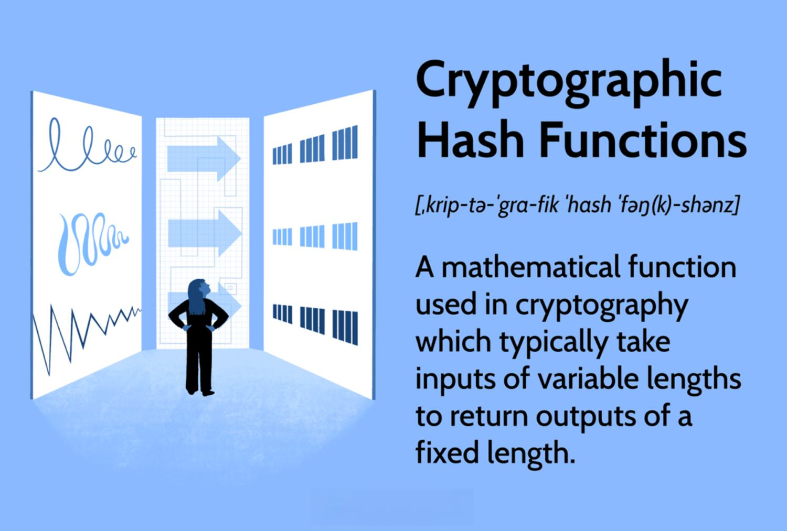

The cryptocurrency sector has experienced remarkable growth and an increasing level of interest over the past few years. This expansion can be attributed to several key factors, notably advancements in blockchain technology, the proliferation of cryptocurrency mining, and significant progress in algorithmic trading. Blockchain technology, the foundational framework for cryptocurrencies, has evolved to offer enhanced security and transparency, making it a formidable tool for numerous applications beyond digital currencies. The innovation and scalability provided by blockchains have catalyzed the rapid adoption of cryptocurrencies as both stores of value and mediums of exchange.

Cryptocurrency mining, another critical component, plays a vital role by facilitating transaction verification and security within blockchain networks. Miners, using sophisticated hardware, compete to solve cryptographic puzzles, which are crucial in maintaining the integrity and accuracy of transaction records. The emergence of algorithmic trading represents a transformative development in the financial aspects of cryptocurrencies. By leveraging complex algorithms, traders can execute transactions at optimized speeds and prices, capitalizing on market inefficiencies and price discrepancies with unprecedented precision.



To fully engage with the cryptocurrency space, understanding key concepts such as hash rate, mining, blockchain, and algorithmic trading is essential. These elements form the foundation of the crypto ecosystem, influencing market trends and investment decisions. As the cryptocurrency industry continues to mature, a solid grasp of these concepts will not only aid in navigating this dynamic landscape but also contribute to the ongoing evolution and stability of the crypto environment.

## Table of Contents

## Understanding Hash Rate

Hash rate is a crucial metric in cryptocurrency mining, representing the computational power of a miner or network. It quantifies the number of hash operations a miner or mining pool can perform per second. In essence, a hash rate measures how fast a miner can solve cryptographic puzzles necessary for verifying transactions and adding them to the blockchain. The unit for hash rate is typically expressed in hashes per second (H/s), with larger scales like kilohashes (kH/s), megahashes (MH/s), gigahashes (GH/s), terahashes (TH/s), or even exahashes (EH/s) commonly used due to the high computational power involved.

A higher hash rate is synonymous with a more potent and secure network. This is because increased computational power makes it more difficult for malicious actors to mount successful attacks, such as the 51% attack where an entity controls a majority of the network's mining power. The robustness provided by a high hash rate is crucial for maintaining the network's integrity and trustworthiness.

Several factors influence the hash rate:

1. **Number of Miners**: The total number of miners participating in the network significantly impacts the overall hash rate. As more miners join the network, the collective computational power increases, typically resulting in a higher hash rate. The decentralized nature of mining, where multiple participants contribute processing power, enhances the security and stability of the blockchain.

2. **Efficiency of Mining Equipment**: The type and efficiency of mining hardware directly affect hash rates. Modern mining operations often utilize specialized hardware such as Graphics Processing Units (GPUs) and Application-Specific Integrated Circuits (ASICs) designed specifically for high-speed hashing. These devices offer superior performance compared to traditional CPUs, increasing the hash rate significantly. For instance, ASICs are tailored for specific algorithms, greatly enhancing energy efficiency and computational speed, thus raising the overall hash rate.

3. **Technological Advancements**: Ongoing developments in mining technology also play a role in improving hash rates. As hardware becomes more advanced, energy consumption decreases while processing power increases, contributing to higher hash rates. This technological evolution is central to sustaining mining operations and adapting to increasing mining difficulty levels over time.

In summary, the hash rate is a pivotal element of [cryptocurrency](/wiki/cryptocurrency) mining, reflecting the network's computational strength and security. Understanding and optimizing the factors influencing hash rate are essential for enhancing the resilience and efficiency of blockchain networks.

## Cryptocurrency Mining: The Backbone of Blockchain

Cryptocurrency mining serves as a pivotal mechanism for securing and managing blockchain networks. It involves the validation and verification of blockchain transactions, culminating in their addition to a distributed ledger. Miners, who are participants in the network, utilize powerful computational resources to solve intricate cryptographic puzzles. This process is fundamental for confirming new transactions and attaching them to prior entries in the chain, ensuring the integrity and continuity of the blockchain.

A significant aspect of cryptocurrency mining is the competitive nature whereby miners aim to be the first to solve these puzzles. The first miner to successfully compute a valid hash for a new block is awarded newly minted cryptocurrency. This process is known as "Proof of Work" (PoW) and is integral to incentivizing participation and maintaining network security. The computational nature of these puzzles acts as a deterrent to malicious actions, as altering a transaction would require immense computational resources.

The computational demand of mining highlights the importance of hash rate – a measure of mining performance expressed as the number of hash calculations executed per second. A higher hash rate signifies a miner's or network's elevated capability to solve cryptographic puzzles and secure more rewards. This further enhances the network's security as a high cumulative hash rate reduces the risk of successful attacks, such as the 51% attack, where adversaries could potentially control a majority of the network's computing power.

Mining hardware plays a pivotal role in the efficiency and profitability of mining operations. Two predominant types of hardware are Graphics Processing Units (GPUs) and Application-Specific Integrated Circuits (ASICs). Each has distinct attributes: 

- **GPUs** are favored for their versatility and ability to handle a variety of computational tasks, making them suitable for mining multiple types of cryptocurrencies. They are particularly advantageous in mining new or less popular cryptocurrencies, where the network difficulty is relatively low.

- **ASICs**, on the other hand, are specialized equipment designed specifically for mining certain cryptocurrencies. While they offer superior performance and energy efficiency for specific hashing algorithms, such as Bitcoin's SHA-256, they lack the flexibility of GPUs and become obsolete if the algorithm or mining environment changes.

Ultimately, the economics of mining are shaped by factors such as electricity costs, hardware efficiency, and market conditions of the mined cryptocurrency. These elements determine whether mining ventures yield profitable outcomes over time. As cryptocurrencies become more mainstream, there is continuous innovation and optimization in mining technology and strategies, aimed at enhancing both economic viability and network security.

## Blockchain: What it Means for Security and Transparency

Blockchain technology provides a decentralized and secure method of recording and verifying transactions, fundamentally transforming the way data is stored and shared. At its core, blockchain operates as a distributed ledger system, where each participant in the network has access to the entire history of transactions, ensuring transparency and reducing the risk of fraud.

Each block in the blockchain contains a list of transactions, a timestamp, and a cryptographic hash of the previous block. This hashing process is fundamental to the blockchain’s security. The hash acts as a digital fingerprint for a block, ensuring that any changes to the block will result in a different hash value. The relation between blocks is therefore sequential, creating an immutable chain. Any alteration to a single block would necessitate the alteration of every subsequent block, making it computationally impractical for malicious actors to tamper with the data.

The transparency and immutability offered by blockchain technology have broad applications beyond cryptocurrencies. For example, in supply chain management, blockchain can enhance accountability by providing an unalterable record of product provenance. In finance, it can streamline processes by facilitating secure and verified transfers of funds without the need for intermediaries. Similarly, in healthcare, blockchain can ensure that patient records are accurate and accessible only to authorized individuals, thereby enhancing privacy while maintaining data integrity.

The combination of these features makes blockchain an ideal choice for situations where security, transparency, and trust in the data are paramount. By removing the need for a central authority and allowing for collective verification, blockchain decreases the potential for corruption and human error, fostering trust in digital ecosystems globally. As blockchain technology continues to evolve, its potential applications are expanding, offering promising advancements in various industries.

## Algorithmic Trading in Cryptocurrencies

Algorithmic trading employs sophisticated computer algorithms to execute cryptocurrency trades based on pre-established criteria. This method harnesses the power of computational analysis to make trading decisions at speeds unattainable by human traders, offering an array of advantages in the fast-paced and highly volatile cryptocurrency market.

One primary benefit of [algorithmic trading](/wiki/algorithmic-trading) is the ability to execute trades at optimal prices swiftly. In markets characterized by rapid price fluctuations, executing orders quickly can significantly impact profitability. Algorithms are designed to monitor multiple market conditions simultaneously and can execute trades the instant opportunities arise, thereby minimizing slippage and optimizing entry and [exit](/wiki/exit-strategy) points.

Moreover, algorithmic trading facilitates the exploitation of market inefficiencies and [volatility](/wiki/volatility-trading-strategies). Cryptocurrencies, lacking the stringent regulation found in traditional financial markets, often display price discrepancies across different exchanges. Algorithms can be programmed to identify and capitalize on these [arbitrage](/wiki/arbitrage) opportunities—buying low on one exchange while selling high on another, thus securing profits from price differentials.

Several strategies underpin algorithmic trading in crypto markets:

1. **Arbitrage**: Exploiting price differences for a given cryptocurrency across various exchanges, ensuring risk-free profit from price discrepancies. For example, if Bitcoin is priced at $55,000 on one exchange and $55,200 on another, an algorithm can simultaneously buy on the cheaper and sell on the more expensive exchange to gain profit.

2. **Mean Reversion**: This strategy is based on the statistical probability that the price of a cryptocurrency will tend to revert to its historical mean. The algorithm identifies deviation from the mean price and places trades anticipating a reversion, thus exploiting short-term fluctuations.

3. **Momentum Trading**: Algorithms identify currencies that demonstrate significant price movement and trade in the direction of the trend. This strategy assumes that those prices will continue to move in the same direction, capitalizing on market inertia.

Implementing algorithmic trading requires a robust understanding of both market dynamics and technological infrastructure. Python has emerged as a preferred language due to its extensive libraries that facilitate data analysis, [backtesting](/wiki/backtesting) of trading strategies, and real-time market data processing. Below is a simple Python code snippet illustrating a basic [momentum](/wiki/momentum) trading strategy using a moving average crossover:

```python
import pandas as pd

def moving_average_crossover(data, short_window, long_window):
    signals = pd.DataFrame(index=data.index)
    signals['price'] = data['Close']
    signals['short_mavg'] = data['Close'].rolling(window=short_window, min_periods=1, center=False).mean()
    signals['long_mavg'] = data['Close'].rolling(window=long_window, min_periods=1, center=False).mean()
    signals['signal'] = 0.0
    signals['signal'][short_window:] = \
        np.where(signals['short_mavg'][short_window:] > signals['long_mavg'][short_window:], 1.0, 0.0)
    signals['positions'] = signals['signal'].diff()

    return signals

# Example usage:
# data = pd.read_csv('crypto_prices.csv', index_col='Date', parse_dates=True)
# signals = moving_average_crossover(data, short_window=40, long_window=100)
```

Algorithmic trading in cryptocurrencies represents a cutting-edge approach to trading, integrating rapid decision-making processes with disciplined execution of complex strategies. As technology and market structures evolve, the ability to design and implement these algorithms will be pivotal for investors looking to achieve a competitive edge in the cryptocurrency space.

## The Interplay Between Hash Rate, Mining, and Trading

A higher hash rate directly affects the cryptocurrency mining process by increasing mining difficulty and impacting the probability of [earning](/wiki/earning-announcement) rewards. Mining difficulty is adjusted according to the collective hash rate of the network to ensure that blocks are mined at a consistent rate. As the hash rate rises, the mining difficulty escalates, making it more challenging for miners to solve the complex mathematical problems required to validate transactions and add blocks to the blockchain. This increased difficulty often necessitates more advanced and efficient mining hardware, leading to elevated operational costs for miners.

As mining becomes increasingly competitive and costly, some miners may opt to transition to trading, including algorithmic trading (algo trading), as an alternative method to maintain profitability. Algorithmic trading utilizes sophisticated algorithms to execute trades based on pre-defined criteria, allowing traders to capitalize on market inefficiencies and volatility. This can provide an appealing alternative to the resource-intensive mining process, especially in times of high mining difficulty when profits from mining may diminish.

Both miners and traders rely heavily on the security and transparency provided by blockchain technology. The decentralized nature of blockchain ensures that transactions are tamper-proof, fostering trust and transparency across the network. This secure environment is crucial for both parties; miners depend on it to ensure their computations lead to immutable transactions, while traders require it to execute reliable and accurate trades.

The rapidly changing landscape of blockchain presents numerous opportunities and challenges for both miners and traders. Innovations in blockchain technology, such as the development of new consensus mechanisms and decentralized applications, continually reshape the industry, presenting new avenues for profitability and efficiency. However, these advancements also introduce complexities and uncertainties, necessitating that both miners and traders remain informed and adaptable to thrive in this dynamic environment.

## Conclusion

The cryptocurrency market is characterized by its dynamic nature, requiring a comprehensive understanding of core components such as hash rate, mining, blockchain, and algorithmic trading. As this sector evolves, staying informed and adaptable offers significant advantages to both investors and enthusiasts. Familiarity with these concepts not only aids in maximizing returns but also contributes to the overall growth and stability of the crypto ecosystem. 

Hash rate, for instance, impacts both the security of a blockchain network and the efficiency of cryptocurrency mining. A robust hash rate enhances network security by reducing vulnerability to attacks, thereby fostering a stable environment for transactions. Concurrently, innovative advancements in mining hardware and strategies directly affect mining profitability and sustainability. Miners need to constantly adapt to technological changes to maintain competitive efficiency.

Simultaneously, blockchain technology continues to underpin the security and transparency vital to cryptocurrencies and a multitude of other applications. Its decentralized nature ensures data integrity and promotes trust among users, solidifying its role in a variety of sectors beyond digital currencies.

In parallel, algorithmic trading becomes increasingly pivotal, leveraging computational power and predefined criteria to optimize trading activities. These algorithms can swiftly exploit market inefficiencies, allowing traders to capitalize on the substantial volatility present in cryptocurrency markets.

As the blockchain landscape continues to expand, the interplay between these elements creates new opportunities and challenges. For those involved in this space, vigilance is key. Technological advancements and emerging market trends necessitate a proactive approach to adapting strategies accordingly. Investors and enthusiasts should remain attuned to these developments to effectively navigate and succeed in this exciting and rapidly changing domain.

## References & Further Reading

[1]: Aggarwal, S., & Jain, S. (2019). ["Understanding Blockchain Technology and Its Application."](https://www.semanticscholar.org/paper/Blockchain-for-smart-communities%3A-Applications%2C-and-Aggarwal-Chaudhary/d2b5eec036d9b5094a1e242e0d9a7c3e26c00d4b) In: B. S. Miglani (eds) Emerging Technologies for Agriculture and Environment. 

[2]: Antonopoulos, A. M. (2017). ["Mastering Bitcoin: Unlocking Digital Cryptocurrencies."](https://books.google.com/books/about/Mastering_Bitcoin.html?id=IXmrBQAAQBAJ) O'Reilly Media.

[3]: Narayanan, A., Bonneau, J., Felten, E., Miller, A., & Goldfeder, S. (2016). ["Bitcoin and Cryptocurrency Technologies: A Comprehensive Introduction."](https://press.princeton.edu/books/hardcover/9780691171692/bitcoin-and-cryptocurrency-technologies) Princeton University Press.

[4]: Vigna, P., & Casey, M. J. (2016). ["The Age of Cryptocurrency: How Bitcoin and Digital Money Are Challenging the Global Economic Order."](https://archive.org/details/ageofcryptocurre0000vign) St. Martin's Griffin.

[5]: Biau, G., & Scornet, E. (2016). ["A Random Forest Guided Tour."](https://link.springer.com/article/10.1007/s11749-016-0481-7) Test, 25(2), 197-227.