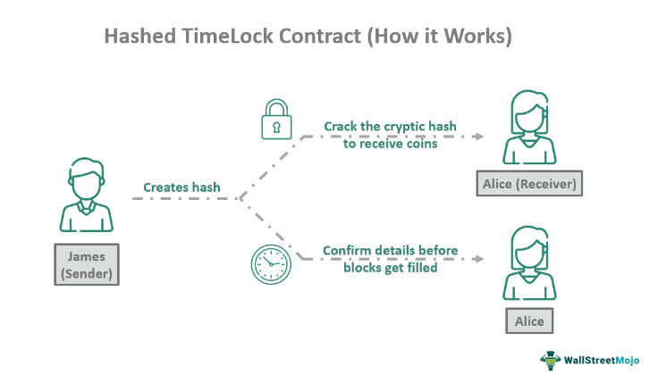

Cryptocurrency and blockchain technology continue to revolutionize how transactions are conducted by offering innovative, decentralized solutions that empower peer-to-peer exchanges without the need for intermediaries. At the forefront of these innovations is the Hashed Timelock Contract (HTLC), a specialized type of smart contract that enhances security and efficiency by applying cryptographic hash functions and specified time constraints. HTLCs provide a mechanism by which transactions can occur conditionally, thus minimizing risks associated with counterparty default or fraud.

The growing prominence of algorithmic trading in the crypto market underscores the significance of HTLCs. Algorithmic trading involves executing orders using pre-programmed, automated strategies that benefit from high-speed decision-making capabilities and the ability to handle complex operations. HTLCs facilitate such strategies through secure, rapid cross-platform transactions that are crucial in a dynamic and fast-paced trading environment. By implementing HTLCs, traders can automate transactions in a manner that is both more secure and efficient, reducing human errors and counterparty risks.

This article will explore the functionalities and advantages of HTLCs, such as their ability to enable cross-chain atomic swaps without trusted intermediaries, and their role in the burgeoning field of cryptocurrency algorithmic trading. The use of HTLCs is amplifying the potential of decentralized finance, enabling transactions to be not only secure but also cost-effective and swift. As the landscape of crypto trading evolves, HTLCs represent a critical tool for achieving seamless and secure transactions, paving the way for future advancements in blockchain technology.

## Table of Contents

## What is a Hashed Timelock Contract (HTLC)?

A Hashed Timelock Contract (HTLC) is a specialized smart contract framework pivotal in the blockchain space, particularly for enabling secure and conditional payment mechanisms between parties. HTLCs integrate the use of cryptographic hash functions and time constraints to curtail counterparty risks, thereby ensuring that all transactions are performed securely and efficiently. The foundational element of HTLCs involves setting up a conditional transaction dependent on the revelation of a specific piece of data — often referred to as a cryptographic preimage.

In practical terms, this process begins with the generation of a cryptographic hash. The recipient in the transaction must provide the correct preimage that matches this hash to claim the funds. This requirement acts as a hashlock, a cryptographic barrier ensuring that only the party with the correct preimage can unlock the funds. Coupled with this is the concept of a timelock, which introduces a temporal condition into the contract. This condition mandates that the recipient acknowledges the transaction within a predetermined timeframe. If this condition is not met, the funds are automatically reverted to the sender, providing an additional security layer against unclaimed or unacknowledged transactions.

HTLCs are indispensable in decentralized finance (DeFi) networks and cross-blockchain transactions. They facilitate atomic swaps, which are entirely reliant on these contracts for enabling the exchange of different cryptocurrencies across various blockchain networks without the need for a trusted third party. By doing so, HTLCs help reduce the dependency on centralized exchanges and mitigate associated risks such as fraud or default, significantly reinforcing the integrity and autonomy of blockchain transactions.

## How Does HTLC Work in Cryptocurrency?

Hashed Timelock Contracts (HTLCs) are essential for securing transactions in [cryptocurrency](/wiki/cryptocurrency) by utilizing both hashlocks and timelocks. The process begins with the hashlock mechanism, where the sender generates a secret value, often a random number. This secret value is hashed to produce a cryptographic hash, known as the hashlock. In order to redeem the funds, the recipient must present the original preimage that corresponds to this hashlock. This ensures that only the intended recipient, who has knowledge of the preimage, can successfully claim the funds. This step effectively reduces the risk of unauthorized parties interfering with the transaction.

In conjunction with hashlocks, timelocks add another layer of security by imposing a specific timeframe within which the transaction must be acknowledged. Timelocks operate by setting a deadline, after which the transaction is reversed if the necessary conditions are not met. This characteristic prevents transactions from lingering indefinitely and provides a fail-safe to revert funds if the conditions are not satisfied in time. This mechanism is particularly beneficial in scenarios where trust between parties is limited, as it eliminates the need for a trusted intermediary while ensuring that transactions are executed reliably.

An HTLC transaction can be understood through a typical cross-chain payment scenario. Suppose Alice wants to send Bitcoin to Bob, who will provide a corresponding value in Ethereum. Alice and Bob can set up an HTLC so that Alice's Bitcoin is locked under a hashlock known only to Bob. Bob must provide the hashlock's preimage within the specified time to claim the Bitcoin. Concurrently, Bob gifts the Ethereum under an HTLC, mirroring the process such that Alice can access Ethereum only by revealing the preimage, a detail initially known only to Alice. This exchange mechanism ensures that neither party can cheat, as failing to fulfill the conditions results in both parties regaining control of their original assets.

By leveraging these mechanisms, HTLCs facilitate secure and trustless transactions in the cryptocurrency ecosystem, empowering users to transact across different blockchains efficiently.

## The Role of HTLC in Algorithmic Trading

Algorithmic trading in cryptocurrency is characterized by the execution of trading orders through automated and pre-programmed instructions. This method leverages speed, precision, and the ability to simultaneously evaluate vast datasets. Hashed Timelock Contracts (HTLCs) play a pivotal role in enhancing the security and efficacy of [algorithmic trading](/wiki/algorithmic-trading), particularly when cross-platform transactions are involved.

HTLCs facilitate automated systems in performing secure cross-chain transactions. This is achieved by employing smart contracts that ensure conditions are met before a transaction proceeds. In algorithmic trading, where high-frequency transactions and rapid cross-chain operations are typical, HTLCs help by ensuring each transaction is securely verified without needing trusted intermediaries. This minimizes the potential for human error and significantly reduces counterparty risks.

For traders seeking to execute complex strategies that involve multiple assets and trading platforms, the integration of HTLCs can be transformative. These smart contracts ensure that all trading orders are fulfilled only if specific cryptographic preconditions are satisfied. As such, HTLCs optimize the trading process by offering a reliable mechanism to handle trustless exchanges, even across different blockchain networks. This not only allows for more sophisticated trading strategies but also enables transactions to settle faster, which is crucial in the fast-paced environment of cryptocurrency markets.

Furthermore, HTLCs help in addressing scalability issues often encountered in blockchain networks. By configuring transactions to occur only when certain pre-set criteria are met, they minimize unnecessary on-chain transactions, reducing network congestion and transaction costs. This aligns well with the needs of algorithmic trading systems that demand high throughput and low-latency execution.

By ensuring that all parties within a trade adhere to predetermined conditions without reliance on intermediaries, HTLCs provide a significant improvement in transactional security and efficiency. This enhances trust between parties, which is vital for fostering broader adoption of algorithmic trading in the decentralized cryptocurrency landscape. As the technology continues to advance, HTLCs are expected to play an increasingly crucial role in the development of more secure and streamlined algorithmic trading frameworks.

## Benefits of Using HTLC in Crypto Trading

Hashed Timelock Contracts (HTLCs) offer several benefits that significantly enhance cryptocurrency trading, particularly by fortifying transaction security and efficiency. HTLCs ensure that transactions are executed only when all predefined conditions are met, thus minimizing the risks associated with fraud and counterparty default. This is achieved through a combination of hashlocks and timelocks, which collectively enforce transaction conditions and deadlines.

One of the primary advantages of HTLCs is their role in facilitating cross-chain atomic swaps. Atomic swaps are transactions that allow the exchange of different cryptocurrencies across different blockchains without the need for a trusted third party. By eliminating intermediaries, HTLCs reduce transaction costs and increase the autonomy of the trading parties. The atomic swap mechanism is dependable, as the transaction either completes successfully for both parties or reverts back to its original state if certain conditions are not satisfied, thereby ensuring a no-risk trading environment.

Moreover, HTLCs enable rapid and reliable processing of transactions, which is crucial in cryptocurrency trading that often demands swift execution. This is particularly relevant in high-frequency and algorithmic trading scenarios where transaction speed directly impacts profitability. By utilizing HTLCs, traders can achieve the desired transactional velocity without compromising on security or accuracy.

Additionally, HTLCs facilitate participation in decentralized exchanges and networks such as the Lightning Network. The Lightning Network is a second-layer solution for Bitcoin that enables instant, low-cost microtransactions through HTLCs, significantly optimizing transaction speed and fee structure. This is a major advantage in the cryptocurrency market, where transaction fees can often be prohibitive and time delays can result in losses due to market [volatility](/wiki/volatility-trading-strategies).

By integrating HTLCs into cryptocurrency trading practices, traders not only enhance their transaction security but also gain the flexibility to operate across multiple blockchain ecosystems with increased efficiency and lower costs. This positions HTLCs as a pivotal technology in the evolving landscape of digital asset trading.

## Challenges and Limitations of HTLCs

Implementing Hashed Timelock Contracts (HTLCs) offers numerous advantages for secure transaction processing in cryptocurrency markets. However, these benefits are accompanied by several challenges and limitations that users and developers must navigate.

The technical complexity of HTLCs is a significant hurdle. The contracts are designed to employ robust cryptographic mechanisms, such as hashlocks and timelocks, which demand a high level of understanding from users. These features require precise time constraints to ensure the security and efficiency of transactions, which can be particularly challenging in dynamic network environments. Network congestion can exacerbate these challenges, delaying transaction confirmations and potentially invalidating the time-sensitive conditions required by HTLCs.

Interoperability is another critical limitation. While HTLCs facilitate cross-chain transactions, not all blockchain platforms support such functionality seamlessly. This lack of standardization among blockchain protocols can hinder the execution of cross-chain atomic swaps, often necessitating additional protocols or intermediaries to bridge incompatible platforms. Consequently, users may face difficulties when attempting to implement HTLCs across different blockchain ecosystems, limiting the widespread adoption and utility of this technology.

Despite these challenges, ongoing advancements are being made to improve the usability of HTLCs. Efforts to streamline implementation processes, enhance cryptographic robustness, and develop solutions for better platform interoperability are underway. These advancements aim to reduce the technical barriers associated with HTLCs, making them more accessible and reliable for a broader range of users and applications. As these improvements continue, HTLCs have the potential to become a more integral component of secure and efficient cryptocurrency trading.

## Conclusion

Hashed Timelock Contracts (HTLCs) have emerged as a transformative technology in cryptocurrency trading, facilitating more secure and efficient transactions. These contracts enable operations across different blockchains by implementing cryptographic hash functions and time constraints, effectively minimizing counterparty risk. As decentralized finance continues to expand, HTLCs are paving the way for innovative financial transactions without the need for centralized intermediaries, thereby reducing costs and enhancing transaction security.

The evolution of HTLC technology is set to play a crucial role in the future development of cryptocurrency trading, particularly in algorithmic trading. The ability of HTLCs to securely and efficiently execute complex trading strategies across multiple platforms empowers traders to optimize their operations, reduce human errors, and lower risks associated with trading. By integrating HTLCs into algorithmic trading systems, traders can achieve better performance and reliability, enhancing both their strategic capabilities and market competitiveness.

However, for HTLCs to achieve their full potential, certain challenges must be addressed. These challenges include technical complexities, network congestion, and interoperability among blockchain platforms. As advancements in blockchain technology progress, it is expected that these limitations will be gradually overcome, further cementing the role of HTLCs in modern cryptocurrency trading frameworks.

In conclusion, Hashed Timelock Contracts provide a foundation for a more secure, efficient, and interconnected cryptocurrency trading landscape. Their continued development is likely to enhance the robustness and sustainability of decentralized finance systems, making HTLCs an increasingly indispensable component of global cryptocurrency trading. As these contracts mature, their adoption is anticipated to grow, further optimizing transaction security and efficiency on a global scale.

## References & Further Reading

[1]: ["What is Hashed Timelock Contract (HTLC) in Blockchain?"](https://www.investopedia.com/terms/h/hashed-timelock-contract.asp) - GeeksforGeeks

[2]: Narayanan, A., Bonneau, J., Felten, E., Miller, A., & Goldfeder, S. (2016). ["Bitcoin and Cryptocurrency Technologies."](https://press.princeton.edu/books/hardcover/9780691171692/bitcoin-and-cryptocurrency-technologies) Princeton University Press.

[3]: ["Atomic Swaps: How They Work and How They Could Shape the Future of Cryptocurrency."](https://www.coindesk.com/learn/atomic-swaps-what-are-they-how-do-they-work) - Investopedia

[4]: ["Mastering Bitcoin: Unlocking Digital Cryptocurrencies"](https://www.amazon.com/Mastering-Bitcoin-Unlocking-Digital-Cryptocurrencies/dp/1449374042) by Andreas M. Antonopoulos

[5]: ["The Lightning Network: Scalable Off-Chain Instant Payments"](https://nakamotoinstitute.org/library/lightning-network/) by Joseph Poon and Thaddeus Dryja

[6]: Zohar, A. (2015). ["Bitcoin: under the hood."](https://dl.acm.org/doi/10.1145/2701411) Communications of the ACM, 58(9), 104-113. 

[7]: Malekan, Y. (2020). ["The Story of Blockchain: A Beginner's Guide to the Technology That Nobody Understands."](https://www.amazon.com/Story-Blockchain-Beginners-Technology-Understands/dp/1732027307) Rowman & Littlefield.