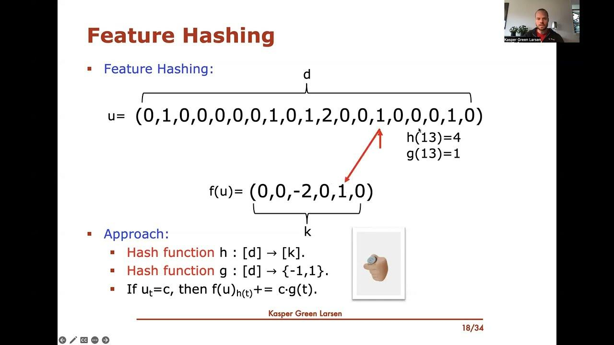

## Table of Contents

## What is hashing in the context of machine learning?

Hashing in the context of machine learning is a technique used to transform data into a fixed-size value, often for the purpose of indexing and retrieving items in a database. Imagine you have a large collection of text documents, and you want to quickly find documents that contain similar words or phrases. Hashing helps by converting these words or phrases into a shorter, fixed-length code, which can be used to group similar items together efficiently. This process is particularly useful in machine learning because it can help reduce the dimensionality of data, making it easier and faster to process and analyze.

One common application of hashing in machine learning is in the creation of feature vectors. For example, if you are working with text data, you might use a hash function to convert words into numerical values that can be used as features in a model. This is often done using a technique called "feature hashing," where each word is hashed to a position in a vector, and the corresponding value in the vector is incremented. This approach can help manage large datasets by reducing the memory required to store the feature vectors, while still maintaining the ability to distinguish between different inputs.

To illustrate, consider a simple hash function that maps a word to a position in a vector of size 10. If the word "apple" hashes to position 3, and the word "banana" hashes to position 7, the feature vector for a document containing both words would have a 1 at positions 3 and 7, and zeros elsewhere. This method allows machine learning algorithms to process and learn from the data more efficiently, even when dealing with high-dimensional input spaces.

## How does hashing help in managing large datasets?

Hashing helps manage large datasets by turning big pieces of data into smaller, fixed-size codes. This makes it easier to store and find information quickly. Imagine you have a huge library of books, and you want to organize them by their titles. Instead of writing out each full title, you can use a hash function to turn each title into a short code. This code can then be used to sort the books into groups, making it much faster to find a specific book.

In [machine learning](/wiki/machine-learning), hashing is especially useful for handling text data. When you have lots of documents, each with many words, hashing can convert these words into numbers that fit into a smaller space. For example, if you use a hash function to turn words into positions in a vector, you can create a compact representation of each document. This way, even with millions of documents, your computer can process and analyze them more efficiently, saving both time and memory.

## What are hash functions and how are they used in machine learning?

Hash functions are like special math formulas that take any piece of data, like a word or a number, and turn it into a shorter, fixed-size code. This code, called a hash, helps organize and find data quickly. In machine learning, hash functions are used to make big datasets smaller and easier to handle. For example, if you have a lot of text documents, you can use a hash function to turn each word into a number. This number can then be used to create a smaller representation of the document, which is easier for computers to process.

In machine learning, one common way to use hash functions is called feature hashing. Imagine you want to teach a computer to understand what people are saying in a bunch of text messages. Each word in these messages can be turned into a number using a hash function. If the word "hello" gets turned into the number 5, and the word "world" gets turned into the number 9, you can create a list where the 5th spot and the 9th spot have a special mark. This list, or vector, is much smaller than the original text, but it still captures important information about the messages. This makes it easier and faster for the computer to learn from the data.

## Can you explain the concept of feature hashing?

Feature hashing is a way to turn words or other pieces of data into numbers that a computer can use easily. Imagine you have a lot of text, like emails or social media posts, and you want a computer to understand them. Instead of keeping all the words as they are, you use a special math formula called a hash function to change each word into a number. For example, if the word "dog" gets turned into the number 7, and "cat" gets turned into the number 3, you can make a list where the 7th spot and the 3rd spot get a mark. This list, called a vector, is much smaller than the original text but still keeps important information.

This method helps computers work faster and use less memory. When you have millions of documents, turning each word into a number and putting them into a smaller list makes it easier for the computer to learn from the data. It's like organizing a huge library of [books](/wiki/algo-trading-books) by giving each book a short code instead of writing out the full title. This way, the computer can quickly find and compare different pieces of information, which is really helpful for teaching it to recognize patterns or make predictions.

## What are the advantages of using hashing techniques in machine learning?

Hashing techniques in machine learning help make big data easier to handle. Imagine you have a huge collection of text messages, and you want to teach a computer to understand them. Instead of keeping all the words as they are, you can use a hash function to turn each word into a number. This number can then be put into a list, called a vector, which is much smaller than the original text. This way, even if you have millions of messages, the computer can process them faster and use less memory. It's like organizing a big library by giving each book a short code instead of writing out the full title.

Another advantage of hashing is that it helps the computer learn from data more efficiently. When you turn words into numbers using a hash function, you create a smaller, simpler version of the data that the computer can work with more easily. This is especially useful when you're trying to find patterns or make predictions. For example, if you're trying to teach a computer to recognize spam emails, hashing can help it quickly compare different emails and find common features that suggest a message is spam. This makes the learning process faster and more effective, helping the computer get better at its job.

## What are some common challenges and limitations of hashing in machine learning?

Hashing in machine learning can sometimes lead to a problem called collisions. A collision happens when two different pieces of data get turned into the same number by the hash function. Imagine you have two different words, like "dog" and "cat," and the hash function turns both into the number 5. This can make it hard for the computer to tell the difference between the two words. When this happens a lot, it can make the computer's job harder because it has to deal with mixed-up data. To reduce collisions, you might need to use a bigger list to store the numbers, but that can use more memory and slow things down.

Another challenge with hashing is that it can lose some information from the original data. When you turn words into numbers and put them into a smaller list, you might miss some important details. For example, if you're trying to teach a computer to understand the difference between "happy" and "sad," and both words get turned into the same number, the computer might not learn the right lesson. This loss of information can make the computer's predictions less accurate. To fix this, you might need to use more complex hash functions or find other ways to keep more of the original data's meaning.

## How does hashing impact model performance and accuracy?

Hashing can speed up how fast a computer learns from big data. Imagine you have a huge pile of text messages, and you want to teach a computer to understand them. By turning each word into a number using a hash function, you can make a smaller list that the computer can work with more easily. This list, called a vector, helps the computer process the data faster and use less memory. When the computer can work faster, it can learn from the data more quickly, which can make the whole process of building a model go smoother.

However, hashing can also make the computer's predictions less accurate. Sometimes, different words can get turned into the same number, which is called a collision. For example, if "happy" and "sad" both get turned into the number 5, the computer might get confused and not learn the right lesson. This loss of information can make the model less accurate because it misses some important details from the original data. To make the model more accurate, you might need to use a bigger list or a more complex hash function, but that can slow things down and use more memory.

## What is the role of hash collisions in machine learning algorithms?

Hash collisions happen when different pieces of data get turned into the same number by a hash function. In machine learning, this can make things tricky. Imagine you're teaching a computer to understand text messages. If the words "happy" and "sad" both get turned into the number 5, the computer might get confused and mix them up. This can make the model less accurate because it can't tell the difference between important words.

To deal with hash collisions, you might need to use a bigger list to store the numbers. This can help spread out the data more and reduce the chance of collisions. But using a bigger list means the computer needs more memory and might work slower. So, it's a trade-off between making the model more accurate and keeping it fast and efficient. Finding the right balance is important for building good machine learning models.

## How can hashing be applied in different machine learning algorithms, such as decision trees or neural networks?

Hashing can be used in decision trees to help manage large datasets more efficiently. When you're working with a lot of text data, for example, you can use a hash function to turn each word into a number. This number can then be used to create a smaller representation of the data, which makes it easier for the decision tree to process and split the data into different branches. Imagine you have a huge collection of emails, and you want to classify them as spam or not spam. By hashing the words in the emails, you can quickly create features that the decision tree can use to make its decisions. This helps the tree work faster and use less memory, but you need to be careful about hash collisions, where different words get turned into the same number, which can make the tree less accurate.

In neural networks, hashing can be used to create compact feature vectors from high-dimensional data. For instance, if you're working with images, you can use a hash function to turn different parts of the image into numbers that fit into a smaller space. This helps the [neural network](/wiki/neural-network) process the data more efficiently, especially when dealing with large datasets. The hash function can turn each pixel or group of pixels into a number, and these numbers can be used as inputs to the neural network. However, just like with decision trees, you have to watch out for hash collisions, which can cause the network to lose some important details from the original data. Balancing the speed and efficiency of hashing with the accuracy of the model is key to getting good results.

## What are some advanced hashing techniques used in machine learning?

In machine learning, one advanced hashing technique is called Locality-Sensitive Hashing (LSH). LSH is used to find similar items in large datasets quickly. Imagine you have a huge collection of photos, and you want to find all the photos that look alike. LSH turns each photo into a short code in a way that similar photos get similar codes. This makes it much easier and faster to group similar photos together, even when you have millions of them. LSH is especially useful for tasks like finding similar text documents or detecting duplicate images, helping computers work more efficiently with big data.

Another advanced technique is called Learned Hashing. This method uses machine learning models to create better hash functions. For example, if you're working with text data, a learned hash function can be trained to turn words into numbers in a way that keeps more of the original meaning. This can help reduce the problem of hash collisions, where different words get turned into the same number. By using a neural network or another model to learn the best way to hash the data, you can make the hashing process more accurate and effective. This is particularly useful when you need to keep as much information as possible from the original data while still making it easier to process.

## How does locality-sensitive hashing work and where is it applied in machine learning?

Locality-sensitive hashing (LSH) is a smart way to find similar things in a big pile of data quickly. Imagine you have a huge collection of photos, and you want to find all the photos that look alike. LSH turns each photo into a short code in a way that similar photos get similar codes. This makes it much easier and faster to group similar photos together, even when you have millions of them. LSH works by using special hash functions that are designed to make sure that items that are close to each other in the original space end up with the same or similar hash values. This way, when you want to find similar items, you can just look at the hash values instead of comparing every single item, which saves a lot of time and effort.

In machine learning, LSH is used for tasks like finding similar text documents or detecting duplicate images. For example, if you're working with a lot of text data, LSH can help you quickly find documents that have similar words or phrases. This is really helpful for things like search engines, where you want to find relevant results fast. LSH is also used in recommendation systems, where you want to suggest items that are similar to what a user has liked before. By using LSH, these systems can work more efficiently with big data, making it easier to find and group similar items without having to compare everything directly.

## What are the future trends and research directions in hashing for machine learning?

Future trends in hashing for machine learning are focusing on making hash functions even smarter and more efficient. One big area of research is developing better ways to handle hash collisions, where different pieces of data get turned into the same number. Researchers are working on new techniques like learned hashing, where machine learning models are used to create hash functions that keep more of the original data's meaning. This can help make models more accurate by reducing the loss of information that happens with traditional hashing. Another trend is improving locality-sensitive hashing (LSH) to work even better with big data, making it faster and more effective at finding similar items.

Another important direction is using hashing to help with privacy and security in machine learning. Techniques like differential privacy are being combined with hashing to protect sensitive data while still allowing useful analysis. For example, researchers are exploring ways to hash data in a way that makes it hard to figure out the original information, but still lets machine learning models learn from it. This is important for applications like healthcare, where you want to use data to improve treatments but need to keep patient information private. As machine learning continues to grow, these trends in hashing will play a big role in making it more powerful and secure.

## References & Further Reading

[1]: Weinberger, K. Q., Dasgupta, A., Langford, J., Smola, A., & Attenberg, J. (2009). ["Feature Hashing for Large Scale Multitask Learning."](https://arxiv.org/abs/0902.2206) Proceedings of the 26th Annual International Conference on Machine Learning.

[2]: Gionis, A., Indyk, P., & Motwani, R. (1999). ["Similarity Search in High Dimensions via Hashing."](https://www.researchgate.net/publication/2634460_Similarity_Search_in_High_Dimensions_via_Hashing) Proceedings of the 25th International Conference on Very Large Data Bases.

[3]: Andoni, A., & Indyk, P. (2008). ["Near-Optimal Hashing Algorithms for Approximate Nearest Neighbor in High Dimensions."](https://people.csail.mit.edu/indyk/p117-andoni.pdf) Communications of the ACM.

[4]: Raginsky, M., & Lazebnik, S. (2009). ["Locality-Sensitive Binary Codes from Shift-Invariant Kernels."](http://maxim.ece.illinois.edu/pubs/raginsky_lazebnik_NIPS09.pdf) Advances in Neural Information Processing Systems 22.

[5]: Kanerva, P. (1988). ["Sparse Distributed Memory"](https://en.wikipedia.org/wiki/Sparse_distributed_memory) MIT Press.

[6]: Baluja, S., & Covell, M. (2008). ["Learning to Hash: Forgiving Hash Functions and Applications."](https://link.springer.com/article/10.1007/s10618-008-0096-z) Data Mining and Knowledge Discovery.

[7]: Shalev-Shwartz, S., & Ben-David, S. (2014). ["Understanding Machine Learning: From Theory to Algorithms."](https://assets.cambridge.org/97811070/57135/frontmatter/9781107057135_frontmatter.pdf) Cambridge University Press.