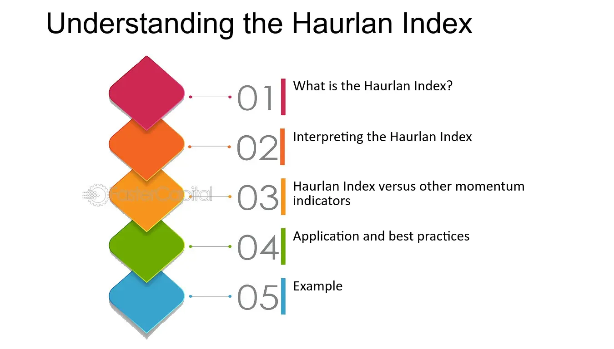

## Table of Contents

## What is the Haurlan Index?

The Haurlan Index is a tool used by people who invest in the stock market. It helps them understand how the market is doing by looking at three different parts of the market: short-term, intermediate-term, and long-term trends. By using these three parts, the Haurlan Index gives investors a complete picture of the market's health. This can help them make better decisions about when to buy or sell stocks.

The index was created by Peter Haurlan, who was a stock market analyst. He wanted to find a way to see the market's trends more clearly. The Haurlan Index uses something called "momentum" to measure how fast the market is moving in these different time periods. This helps investors spot changes in the market before they become obvious to everyone else. By paying attention to the Haurlan Index, investors can try to predict what might happen next in the stock market.

## Who developed the Haurlan Index and when?

The Haurlan Index was developed by Peter Haurlan. He was a stock market analyst who wanted to find a better way to understand how the market was doing. Peter Haurlan created this index to help investors see the market's trends more clearly by looking at short-term, intermediate-term, and long-term movements.

He introduced the Haurlan Index in the 1960s. During this time, he was working as a technical analyst and wanted to provide a tool that could give a complete picture of the market's health. By using [momentum](/wiki/momentum) to measure how fast the market was moving in different time periods, Peter Haurlan's index helped investors make smarter choices about buying and selling stocks.

## What are the main components of the Haurlan Index?

The Haurlan Index has three main parts that help investors understand the stock market. The first part is the short-term trend, which looks at how the market is doing over a few weeks. This helps investors see quick changes and make fast decisions. The second part is the intermediate-term trend, which looks at the market over a few months. This part helps investors see if the market is getting better or worse over a longer time. 

The third part of the Haurlan Index is the long-term trend, which looks at the market over many months or even years. This helps investors see big changes in the market and plan for the future. All three parts use something called "momentum" to measure how fast the market is moving. By looking at these three parts together, the Haurlan Index gives investors a complete picture of the market's health.

## How is the Haurlan Index calculated?

The Haurlan Index is calculated by looking at three different trends in the stock market: short-term, intermediate-term, and long-term. Each of these trends uses something called "momentum" to see how fast the market is moving. To find the momentum, you take the difference between the current price of a stock or an index and its price a certain number of days ago. For the short-term trend, you might look at the difference over a few weeks. The intermediate-term trend looks at the difference over a few months, and the long-term trend looks at the difference over many months or even years.

Once you have the momentum for each trend, you add them up to get the Haurlan Index. The short-term trend is usually given the most importance because it shows what's happening right now in the market. The intermediate and long-term trends are also important, but they help show bigger changes over time. By adding these three trends together, the Haurlan Index gives investors a complete picture of how the market is doing, helping them decide when to buy or sell stocks.

## What does the Haurlan Index measure in the stock market?

The Haurlan Index measures how the stock market is doing by looking at three different trends: short-term, intermediate-term, and long-term. Each trend shows how fast the market is moving over different periods of time. The short-term trend looks at changes over a few weeks, the intermediate-term trend looks at changes over a few months, and the long-term trend looks at changes over many months or even years. By using something called "momentum," the Haurlan Index can see how quickly the market is going up or down in each of these time periods.

When you add up the momentum from all three trends, you get the Haurlan Index. This helps investors see the overall health of the market. If the index is going up, it might mean the market is doing well and it could be a good time to buy stocks. If the index is going down, it might mean the market is not doing so well and it could be a good time to sell stocks. By looking at the Haurlan Index, investors can make smarter choices about when to buy or sell, based on what the market is doing in the short, intermediate, and long term.

## How can the Haurlan Index be used to identify market trends?

The Haurlan Index helps people see how the stock market is doing by looking at three different time periods: short-term, intermediate-term, and long-term. Each of these periods uses something called "momentum" to measure how fast the market is moving. By adding up the momentum from all three periods, the Haurlan Index gives a complete picture of the market's health. When the index goes up, it can mean the market is doing well and might be a good time to buy stocks. When it goes down, it might mean the market is not doing so well and could be a good time to sell stocks.

Investors can use the Haurlan Index to spot trends in the market. If the short-term trend is going up, it might mean the market is getting better quickly. If the intermediate-term trend is going up, it could mean the market is getting better over a few months. And if the long-term trend is going up, it might mean the market is on a good path for a long time. By looking at all three trends together, investors can see if the market is just having a short good time or if it's really getting better over the long run. This helps them make smart choices about when to buy or sell stocks.

## What are the differences between the short-term, intermediate-term, and long-term Haurlan Indexes?

The short-term Haurlan Index looks at how the stock market is doing over just a few weeks. It helps investors see quick changes in the market. This part of the index uses something called "momentum" to measure how fast the market is moving in a short time. If the short-term index is going up, it might mean the market is getting better quickly, and it could be a good time to buy stocks. But if it's going down, it might mean the market is getting worse fast, and it could be a good time to sell.

The intermediate-term Haurlan Index looks at the market over a few months. It helps investors see if the market is getting better or worse over a longer time than the short-term index. This part also uses momentum to see how the market is moving, but it looks at a bigger picture. If the intermediate-term index is going up, it might mean the market is improving over a few months, which can be a good sign for investors. If it's going down, it might mean the market is getting worse over time, and investors might want to be careful.

The long-term Haurlan Index looks at the market over many months or even years. It helps investors see big changes in the market and plan for the future. This part of the index uses momentum to measure how the market is moving over a long time. If the long-term index is going up, it might mean the market is on a good path for a long time, and it could be a good time to invest. If it's going down, it might mean the market is not doing well over the long run, and investors might want to think about selling their stocks.

## Can the Haurlan Index predict market reversals, and if so, how?

The Haurlan Index can help investors see when the stock market might change direction, which is called a market reversal. It does this by looking at three different time periods: short-term, intermediate-term, and long-term. Each of these periods measures how fast the market is moving, which is called momentum. If the momentum in one or more of these periods starts to change, it can be a sign that the market might be about to reverse. For example, if the short-term index starts going down while the long-term index is still going up, it might mean the market is getting ready for a short-term dip but could still be strong in the long run.

By watching these three parts of the Haurlan Index, investors can get a better idea of when the market might change. If all three parts start to go down at the same time, it could be a strong sign that a bigger market reversal is coming. On the other hand, if the short-term and intermediate-term indexes start to go up while the long-term index is still going down, it might mean the market is starting to recover. So, the Haurlan Index can help investors predict market reversals by showing changes in momentum across different time periods.

## How does the Haurlan Index compare to other market indicators like the MACD or RSI?

The Haurlan Index, MACD (Moving Average Convergence Divergence), and RSI (Relative Strength Index) are all tools that help investors understand the stock market. The Haurlan Index looks at three different time periods—short-term, intermediate-term, and long-term—and measures how fast the market is moving in each. This gives investors a complete picture of the market's health over different time frames. The MACD, on the other hand, focuses on the difference between two moving averages of a stock's price. It helps investors see if the market's trend is getting stronger or weaker. The RSI measures how fast and how much a stock's price is changing to see if it's overbought or oversold, which can signal if a price change is coming soon.

While the Haurlan Index gives a broad view of the market by looking at short, intermediate, and long-term trends, the MACD and RSI focus more on shorter-term movements. The MACD is good at showing when a trend might be changing by looking at the difference between two moving averages. It can help investors decide when to buy or sell based on these changes. The RSI is useful for spotting when a stock might be due for a price correction because it's overbought or oversold. Unlike the Haurlan Index, which looks at the overall market, the RSI can be used for individual stocks. So, while the Haurlan Index provides a comprehensive view of the market's health, the MACD and RSI are more focused on specific aspects of market movement and can be used for both the market as a whole and individual stocks.

## What are some common pitfalls or misconceptions when using the Haurlan Index?

One common pitfall when using the Haurlan Index is thinking it can predict the future perfectly. The Haurlan Index is a tool that helps investors understand what the market is doing right now by looking at short-term, intermediate-term, and long-term trends. But it can't tell you exactly what will happen next. Sometimes, the market can change quickly in ways that the Haurlan Index doesn't catch right away. So, it's important to use the Haurlan Index along with other tools and not rely on it alone to make decisions about buying or selling stocks.

Another misconception is that the Haurlan Index is easy to understand and use without any special knowledge. While the idea behind the Haurlan Index is simple, actually using it well takes some practice and understanding of how the market works. The index looks at how fast the market is moving over different time periods, and knowing how to read and use this information correctly can be tricky. Investors need to learn how to balance the information from the short-term, intermediate-term, and long-term trends to make smart choices. It's not just about looking at the numbers; it's about understanding what they mean for the market.

## How can traders and investors incorporate the Haurlan Index into their trading strategies?

Traders and investors can use the Haurlan Index to get a better picture of how the stock market is doing over different time periods. By looking at the short-term, intermediate-term, and long-term trends, they can see if the market is getting better or worse. If the short-term trend is going up, it might be a good time to buy stocks because the market is doing well right now. But if the long-term trend is going down, it might be a good idea to sell because the market might not be strong in the future. By paying attention to all three trends, traders and investors can make smarter choices about when to buy or sell stocks.

It's also helpful to use the Haurlan Index along with other tools like the MACD or RSI. The Haurlan Index can show the overall health of the market, while the MACD can help spot when a trend is changing, and the RSI can show if a stock is overbought or oversold. By combining these tools, traders and investors can get a more complete view of the market. For example, if the Haurlan Index shows a strong long-term trend and the MACD confirms a new trend is starting, it might be a good time to invest. Using the Haurlan Index this way can help traders and investors make better decisions and possibly make more money in the stock market.

## Are there any advanced techniques or modifications to the Haurlan Index used by expert traders?

Expert traders sometimes use advanced techniques to make the Haurlan Index work even better for them. One way they do this is by adjusting the time periods used for the short-term, intermediate-term, and long-term trends. Instead of using the standard time frames, they might change them to fit the specific market they're looking at. For example, if they're trading a fast-moving market, they might use shorter time periods for all three trends to catch quick changes. Another technique is to combine the Haurlan Index with other indicators like the MACD or RSI to get a more detailed picture of the market. By looking at these other indicators, they can confirm what the Haurlan Index is showing and make more confident trading decisions.

Some expert traders also use a technique called smoothing to make the Haurlan Index easier to read. Smoothing involves taking the average of the index over a few days to reduce small ups and downs, so it's easier to see the bigger trends. This can help traders avoid making quick decisions based on small changes that might not mean much in the long run. Another advanced method is to use the Haurlan Index for different parts of the market, like specific sectors or industries, instead of just looking at the whole market. By doing this, traders can find trends in smaller parts of the market that might be missed when looking at everything together. Using these advanced techniques can help expert traders get more out of the Haurlan Index and make better trading choices.

## How can the Haurlan Index be implemented in algorithmic trading?

Implementing the Haurlan Index in [algorithmic trading](/wiki/algorithmic-trading) involves several critical steps to ensure its effectiveness in automated trading systems. Selecting reliable data sources is vital for the success of any strategy utilizing the Haurlan Index, as the index relies on the accurate calculation of advanced and declined stock values. Real-time data feeds are crucial to maintain the precision of index values required for initiating trades at optimal times. The calculation of the Haurlan Index is as follows:

$$
\text{Haurlan Index} = \frac{(A - D)}{(A + D)}
$$

where $A$ is the number of advancing stocks, and $D$ is the number of declining stocks. The result is then smoothed using exponential moving averages (EMAs) for short-term, intermediate-term, and long-term insights.

Once the index is calculated, integrating it into an algorithmic trading platform requires strategic [backtesting](/wiki/backtesting). Backtesting involves running the index against historical market data to evaluate its performance under various conditions. This process helps to fine-tune the parameters of the index's EMAs, ensuring that the algorithm is optimized for future market behaviors. Python, with libraries such as Pandas and NumPy, provides a robust framework for conducting backtests effectively. Below is a sample Python code snippet for backtesting:

```python
import pandas as pd
import numpy as np

# Load historical market data into a pandas DataFrame
data = pd.read_csv('market_data.csv')

# Calculate the advancing and declining stocks
advancing = data[data['close'] > data['open']].count(axis=0)
declining = data[data['close'] < data['open']].count(axis=0)

# Compute the Haurlan Index
haurlan_index = (advancing - declining) / (advancing + declining)

# Calculate EMAs
short_ema = haurlan_index.ewm(span=10, adjust=False).mean()
intermediate_ema = haurlan_index.ewm(span=50, adjust=False).mean()
long_ema = haurlan_index.ewm(span=200, adjust=False).mean()

# Create backtesting logic here
# Example: trigger buy/sell based on EMA crossovers
```

Integrating the Haurlan Index with other technical indicators can enhance the robustness of the trading strategy. Indicators like the Moving Average Convergence Divergence (MACD) and the Relative Strength Index (RSI) provide additional validation signals, reducing false positives and improving the reliability of trade signals generated by the algorithm. This multi-indicator approach ensures that the trading algorithm benefits from a broader market perspective, allowing for more informed and accurate trading decisions.

In summary, the successful implementation of the Haurlan Index in algorithmic trading hinges on accurate real-time data, comprehensive backtesting, and integration with complementary indicators. Each of these components plays a crucial role in developing a robust and adaptive trading strategy capable of navigating dynamic market conditions.

## References & Further Reading

[1]: Lopez de Prado, M. (2018). ["Advances in Financial Machine Learning."](https://www.amazon.com/Advances-Financial-Machine-Learning-Marcos/dp/1119482089) Wiley.

[2]: Aronson, D. R. (2006). ["Evidence-Based Technical Analysis: Applying the Scientific Method and Statistical Inference to Trading Signals."](https://www.amazon.com/Evidence-Based-Technical-Analysis-Scientific-Statistical/dp/0470008741) Wiley.

[3]: Jansen, S. (2020). ["Machine Learning for Algorithmic Trading."](https://github.com/stefan-jansen/machine-learning-for-trading) Packt Publishing.

[4]: Chan, E. P. (2009). ["Quantitative Trading: How to Build Your Own Algorithmic Trading Business."](https://github.com/ftvision/quant_trading_echan_book) Wiley.

[5]: Bergstra, J., Bardenet, R., Bengio, Y., & Kégl, B. (2011). ["Algorithms for Hyper-Parameter Optimization."](https://dl.acm.org/doi/10.5555/2986459.2986743) Advances in Neural Information Processing Systems 24.