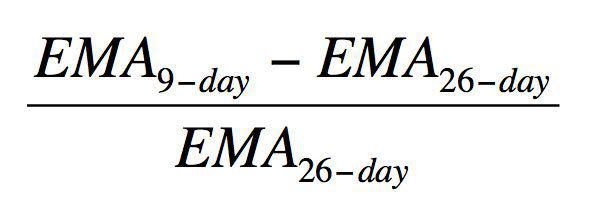

The stock market is a multifaceted system where numerous factors influence price movements and market dynamics. Traders use various tools to decipher these complexities, with technical analysis being among the most prominent. At the core of technical analysis lies a range of indicators, each offering unique insights into market behavior. One such indicator is the Haurlan Index, which distinguishes itself through its method of integrating market breadth with exponential moving averages (EMAs).

The Haurlan Index, designed to effectively measure market trends, uses advancing and declining stocks to evaluate the overall market sentiment. By considering these parameters, it provides a nuanced understanding of market movements that can be pivotal for traders. Its structure comprises short-term, intermediate-term, and long-term EMAs, each offering distinct insights into varying market horizons.



In recent years, the landscape of trading has been transformed by the advent of algorithmic trading. This method employs sophisticated algorithms to automate trading decisions, reducing the subjectivity and emotional biases inherent in manual trading. Implementing the Haurlan Index within these automated systems can lead to considerable improvements in executing trades swiftly and accurately. By employing mathematical models and real-time data, traders can enhance their decision-making processes, adapting promptly to market changes.

This article will explore the Haurlan Index's significance in technical analysis and its potential applications in algorithmic trading. By understanding its intricacies, traders can better equip themselves to operate within the fast-paced and ever-evolving arena of financial markets.

## Table of Contents

## What is the Haurlan Index?

The Haurlan Index is a technical indicator developed by P.N. "Pete" Haurlan, designed to analyze market breadth and provide traders with insights into stock market movements. It is constructed using market breadth calculations that focus on the advancing and declining stocks within the New York Stock Exchange (NYSE).

The foundation of the Haurlan Index lies in its utilization of exponential moving averages (EMAs) applied to the accumulation/distribution line. This line is derived from the net advances, which is the difference between the number of advancing stocks and declining stocks. By utilizing EMAs, the Haurlan Index smooths out short-term fluctuations, offering a clearer picture of market trends.

The Haurlan Index is divided into three components, with each corresponding to different market timeframes:

1. **Short-term Component (EMA of around 3-5 days):** This component is sensitive to recent market changes and provides quick insights into short-term market movements. It is particularly beneficial for traders who engage in short-term trading strategies.

2. **Intermediate-term Component (EMA of approximately 10-20 days):** This component offers a middle-ground perspective, balancing responsiveness with stability. It assists traders in identifying potential support and resistance levels, providing insights for medium-term trading strategies.

3. **Long-term Component (EMA of about 60-120 days):** The long-term component captures broader market trends, helping traders understand the overall market direction. It is useful for those making long-term investment decisions or trend-following strategies.

Each component of the Haurlan Index equips traders with valuable information tailored to specific timeframes, enabling them to make informed decisions based on comprehensive market analysis. By analyzing these components, traders can discern short-term [volatility](/wiki/volatility-trading-strategies), medium-term resistance or support, and long-term trends, ultimately enhancing their ability to navigate the complexities of the stock market.

## Technical Analysis of the Haurlan Index

The Haurlan Index, an advanced technical analysis tool, offers key insights into interpreting market trends by utilizing three distinct exponential moving averages (EMAs). Each component targets a specific timeframe within the market, thereby providing traders with a reliable framework for making informed decisions.

The short-term EMA is typically calculated using a 3 to 5-day period and is instrumental in identifying short-term trading opportunities. This component helps traders quickly ascertain market direction, making it particularly useful for those engaging in [day trading](/wiki/day-trading-spy) or looking for immediate entry and [exit](/wiki/exit-strategy) signals. By closely tracking the day-to-day fluctuations in advancing and declining stocks, the short-term EMA acts as a compass for navigating rapid market shifts.

Intermediate-term EMAs usually span 10 to 20 days, offering insights into medium-term support and resistance levels. These help traders assess whether a trend is likely to continue or reverse, providing a broader perspective compared to the short-term EMA. This facet of the Haurlan Index is advantageous for swing traders who focus on capturing gains from medium-term price movements over a couple of weeks.

The long-term EMA, often based on 30 to 60 days, provides a macroscopic view of the overall trend direction, making it essential for understanding the dominant market [momentum](/wiki/momentum). Investors using this configuration are typically motivated by long-term capital appreciation, drawing on this component to determine the prevailing market sentiment and whether current trends are set to persist.

Employing multiple components within the Haurlan Index enhances predictive accuracy by allowing the internal confirmation of signals, thus minimizing the need for reliance on external validation indicators. This internal cross-verification of signals suggests that when the short-term, intermediate-term, and long-term EMAs are aligned, the resultant trade signals are robust. Such reliability is crucial, as it aids traders in mitigating false positives often encountered with single-component systems.

Through this strategic application of the Haurlan Index, traders can leverage its insights to time their market entries and exits effectively, accommodating varying trading styles and objectives. This multifaceted approach underscores the Haurlan Index's utility as a comprehensive tool for understanding and predicting market dynamics across different temporal spectrums.

## Algorithmic Trading and Automation

Algorithmic trading involves using computer algorithms to execute trading decisions based on pre-defined criteria. This approach significantly reduces human emotional influence on trades and facilitates faster, more precise transactions. The integration of the Haurlan Index into [algorithmic trading](/wiki/algorithmic-trading) platforms can markedly enhance trade efficiency and speed, offering a systematic approach to evaluating market conditions.

The Haurlan Index, with its foundation in market breadth through exponential moving averages (EMAs), provides valuable data for generating trading signals. Algorithmic platforms can use the Haurlan Index to implement various strategies, such as trend-following and momentum trading, by continuously analyzing market data and executing trades based on the index’s signals.

### Enhancing Trade Efficiency

Utilizing the Haurlan Index within an algorithmic framework allows for rapid analysis of the advancing and declining stock data from which the index is derived. By converting complex market information into actionable insights, algorithms can rapidly determine the optimal timing for entering or exiting trades. 

For example, a Python script might be used to calculate the Haurlan Index:

```python
import pandas as pd

def calculate_ema(data, period):
    return data.ewm(span=period, adjust=False).mean()

def haurlan_index(df, short_period=3, inter_period=14, long_period=30):
    adv_dec_line = df['advancing'] - df['declining']
    short_ema = calculate_ema(adv_dec_line, short_period)
    intermediate_ema = calculate_ema(adv_dec_line, inter_period)
    long_ema = calculate_ema(adv_dec_line, long_period)
    return short_ema, intermediate_ema, long_ema

# `df` is a DataFrame with columns 'advancing' and 'declining'.
short_ema, int_ema, long_ema = haurlan_index(df)
```

### Automation of Trading Strategies

By automating trend-following strategies, traders can utilize the short-term EMA of the Haurlan Index to identify quick market shifts and generate buy or sell signals accordingly. Similarly, momentum trading strategies can benefit from the intermediate-term EMA, allowing traders to capture price movements resulting from the aggregated trends of advancing and declining stocks.

### Implementation Benefits

The automation provided by algorithmic trading systems ensures that trades are executed at optimal times, based on the pre-set thresholds and indicators such as the Haurlan Index. This minimizes the lag time between signal generation and execution, maximizing the potential for profitable trades. By leveraging these automated processes, traders can improve execution accuracy and benefit from the systematic and consistent application of trading strategies across various market conditions.

## Implementing the Haurlan Index in Algorithmic Trading

Implementing the Haurlan Index in algorithmic trading involves several critical steps to ensure its effectiveness in automated trading systems. Selecting reliable data sources is vital for the success of any strategy utilizing the Haurlan Index, as the index relies on the accurate calculation of advanced and declined stock values. Real-time data feeds are crucial to maintain the precision of index values required for initiating trades at optimal times. The calculation of the Haurlan Index is as follows:

$$
\text{Haurlan Index} = \frac{(A - D)}{(A + D)}
$$

where $A$ is the number of advancing stocks, and $D$ is the number of declining stocks. The result is then smoothed using exponential moving averages (EMAs) for short-term, intermediate-term, and long-term insights.

Once the index is calculated, integrating it into an algorithmic trading platform requires strategic [backtesting](/wiki/backtesting). Backtesting involves running the index against historical market data to evaluate its performance under various conditions. This process helps to fine-tune the parameters of the index's EMAs, ensuring that the algorithm is optimized for future market behaviors. Python, with libraries such as Pandas and NumPy, provides a robust framework for conducting backtests effectively. Below is a sample Python code snippet for backtesting:

```python
import pandas as pd
import numpy as np

# Load historical market data into a pandas DataFrame
data = pd.read_csv('market_data.csv')

# Calculate the advancing and declining stocks
advancing = data[data['close'] > data['open']].count(axis=0)
declining = data[data['close'] < data['open']].count(axis=0)

# Compute the Haurlan Index
haurlan_index = (advancing - declining) / (advancing + declining)

# Calculate EMAs
short_ema = haurlan_index.ewm(span=10, adjust=False).mean()
intermediate_ema = haurlan_index.ewm(span=50, adjust=False).mean()
long_ema = haurlan_index.ewm(span=200, adjust=False).mean()

# Create backtesting logic here
# Example: trigger buy/sell based on EMA crossovers
```

Integrating the Haurlan Index with other technical indicators can enhance the robustness of the trading strategy. Indicators like the Moving Average Convergence Divergence (MACD) and the Relative Strength Index (RSI) provide additional validation signals, reducing false positives and improving the reliability of trade signals generated by the algorithm. This multi-indicator approach ensures that the trading algorithm benefits from a broader market perspective, allowing for more informed and accurate trading decisions.

In summary, the successful implementation of the Haurlan Index in algorithmic trading hinges on accurate real-time data, comprehensive backtesting, and integration with complementary indicators. Each of these components plays a crucial role in developing a robust and adaptive trading strategy capable of navigating dynamic market conditions.

## Backtesting and Optimization

Backtesting with historical data is a fundamental step in evaluating the effectiveness of trading strategies, particularly when incorporating technical indicators like the Haurlan Index. The process involves applying a trading strategy to past market data to simulate how it would have performed, enabling traders to analyze potential profitability and identify weaknesses. By doing so, traders can obtain an empirical basis for their decision-making process before deploying strategies in live markets. 

Optimization of indicator parameters is critical in enhancing trading algorithms for improved risk-adjusted returns. The objective is to fine-tune the parameters of the Haurlan Index, such as the time periods for the short-term, intermediate-term, and long-term EMAs, to maximize performance metrics like the Sharpe Ratio or Return on Investment (ROI). Here’s a Python snippet illustrating a simple optimization approach using a grid search over historical data:

```python
import numpy as np
import pandas as pd
from itertools import product

def optimize_haurlan_index(data, short_ema_range, mid_ema_range, long_ema_range):
    best_params = None
    best_performance = -np.inf

    for short_ema, mid_ema, long_ema in product(short_ema_range, mid_ema_range, long_ema_range):
        # Calculate EMAs
        short_term = data['close'].ewm(span=short_ema).mean()
        mid_term = data['close'].ewm(span=mid_ema).mean()
        long_term = data['close'].ewm(span=long_ema).mean()

        # Strategy logic can be added here
        # For illustration purposes, assume a simple performance metric
        performance = np.random.rand()  # Replace with actual strategy performance measure

        if performance > best_performance:
            best_performance = performance
            best_params = (short_ema, mid_ema, long_ema)

    return best_params, best_performance

# Usage
data = pd.DataFrame({'close': np.random.randn(1000)})  # Example data
short_ema_range = range(5, 15)
mid_ema_range = range(15, 30)
long_ema_range = range(30, 60)

best_params, best_performance = optimize_haurlan_index(data, short_ema_range, mid_ema_range, long_ema_range)
print(f"Best parameters: {best_params} with performance: {best_performance}")
```

Systematic testing is vital to ensure the robustness and reliability of trading strategies across various market conditions. This involves performing stress tests where the strategies are subjected to market scenarios, such as bull and bear markets, to see how well they cope with extreme conditions. It is a form of risk management aimed at identifying potential pitfalls and mitigating them in advance.

By iteratively testing and optimizing strategies through backtesting, traders can refine their algorithms, thus improving their chances of successful outcomes in live trading environments. This methodical approach to strategy development is indispensable for consistent performance and risk reduction.

## Risk Management in Algorithmic Trading

Effective risk management in algorithmic trading is essential for ensuring the stability and longevity of trading strategies. One foundational technique is the use of stop-loss orders, which automatically sell a security when its price falls to a predetermined level. This mechanism helps limit potential losses by triggering an automatic exit before significant adverse price movements occur. Additionally, position sizing techniques play a critical role. By determining the amount of capital to allocate to each trade, traders can manage their risk exposure relative to their overall portfolio, thus avoiding over-leveraging and ensuring diversification.

Regular monitoring and strategy adjustments are crucial for adapting to market fluctuations. Algorithmic trading strategies should not remain static; instead, they must evolve in response to new data and shifting market environments. By analyzing performance metrics and market conditions, traders can refine their algorithms to maintain effectiveness. For example, a strategy might be adjusted to reduce exposure during periods of high volatility or to capitalize on emerging trends.

Advanced risk management algorithms can facilitate dynamic strategy adjustments. These algorithms integrate real-time market data to recalibrate trading parameters automatically, enhancing the strategy's resilience. For instance, they can modify stop-loss levels or position sizes based on current volatility or [liquidity](/wiki/liquidity-risk-premium) metrics. In Python, this dynamic adjustment can be implemented using libraries such as NumPy and Pandas for data manipulation, alongside [machine learning](/wiki/machine-learning) frameworks like scikit-learn for predictive analytics.

Here's a simple Python example demonstrating a dynamic adjustment of stop-loss based on market volatility:

```python
import numpy as np
import pandas as pd

# Simulated price data
prices = pd.Series([100, 102, 101, 105, 107, 106, 110])

# Calculate volatility
volatility = prices.pct_change().rolling(window=5).std()

# Initial stop-loss value
initial_stop_loss = 0.02  # 2%

# Adjust stop-loss based on volatility
adjusted_stop_loss = initial_stop_loss * (1 + volatility)

# Print adjusted stop-loss
print(adjusted_stop_loss)
```

This code snippet calculates the rolling volatility of a stock's price and adjusts the stop-loss percentage accordingly. By doing so, the algorithm dynamically responds to changing market conditions, enhancing risk management efficacy. As financial markets evolve, the incorporation of such sophisticated risk management techniques will continue to be paramount for successful algorithmic trading strategies.

## Real-Life Examples of Successful Strategies

Trend-following and momentum strategies have proven to be effective applications of the Haurlan Index in trading. By concentrating on the short-term, intermediate-term, and long-term exponential moving averages (EMAs), traders can identify significant trends and potential market reversals. The Haurlan Index's ability to combine these EMAs provides a comprehensive overview of market breadth, enabling traders to capture and act on emerging trends. For instance, when the short-term EMA indicates an upward momentum crossing a key threshold, a trader might decide to enter a long position, anticipating sustained price increases.

Another successful strategy is sector rotation, where investors capitalize on the Haurlan Index's strength in isolating outperforming sectors. During times of economic shifts or policy changes, certain sectors may exhibit superior performance. By regularly computing the Haurlan Index across different sectors, investors can discern which areas are leading the market's upward or downward movement. This allows for the reallocation of resources into sectors showing positive momentum, thus maximizing potential returns.

Furthermore, enhancing strategy robustness can be achieved by integrating the Haurlan Index with other technical indicators, such as moving averages. The moving average (MA) helps smooth out price data and can confirm signals generated by the Haurlan Index. For example, combining a 50-day moving average with the Haurlan Index may offer stronger buy or sell signals when both indicators align. In Python, a simple implementation can be constructed using libraries like Pandas and NumPy to calculate and visualize these signals:

```python
import pandas as pd
import numpy as np
import matplotlib.pyplot as plt

# Example data
data = pd.DataFrame({'Close': np.random.randn(100).cumsum() + 100})

# Calculate 50-day moving average
data['50_MA'] = data['Close'].rolling(window=50).mean()

# Example Haurlan Index calculation (simplified)
data['Haurlan'] = (data['Close'] - data['Close'].shift(3)).apply(lambda x: x if x > 0 else 0)

# Plotting
plt.figure(figsize=(12, 6))
plt.plot(data['Close'], label='Close Price')
plt.plot(data['50_MA'], label='50-Day MA', linestyle='--')
plt.legend()
plt.title('Trading Strategy with Moving Average and Haurlan Index')
plt.show()
```

In such a setup, the plotted 50-day moving average alongside the Haurlan Index-derived values can help traders validate the strength and direction of their trading decisions. Traders can observe these visualizations to decide entry or exit points, thereby making informed decisions based on comprehensive analyses. Overall, through strategic application and integration of such indicators, the Haurlan Index significantly aids in refining trading approaches and improving profitability.

## Conclusion: Enhancing Trading Efficiency

Incorporating the Haurlan Index into trading strategies enhances decision-making speed and accuracy. This technical indicator provides a unique perspective by combining market breadth with exponential moving averages, helping traders discern trends across various timeframes. By offering insights into short-term fluctuations, intermediate-term supports, and long-term trends, the Haurlan Index allows for more precise strategic adjustments. 

In the fast-paced environment of financial markets, tools like the Haurlan Index become invaluable. Their ability to process substantial amounts of data rapidly enables traders to make timely decisions, reducing the reliance on guesswork. As trading becomes increasingly automated, the speed and precision offered by such indicators are crucial for maintaining a competitive edge.

Future exploration may involve further integration with machine learning to refine trading algorithms. By deploying machine learning models, traders can develop smarter systems that adapt to market conditions dynamically. This may include using supervised learning algorithms to predict market trends or employing [reinforcement learning](/wiki/reinforcement-learning) to optimize trade execution strategies. As an illustration, integrating the Haurlan Index into a machine learning framework could look like this in Python:

```python
from sklearn.ensemble import RandomForestClassifier
import numpy as np

# Sample training data: features could include short, intermediate, long-term EMA
X_train = np.array([[...], [...], ...])
y_train = np.array([...])  # Corresponding market movement labels

# Initialize the model
model = RandomForestClassifier(n_estimators=100)

# Train the model
model.fit(X_train, y_train)

# Example function to predict market movements
def predict_market(data):
    return model.predict(data)

# Sample real-time data representing the Haurlan Index
real_time_data = np.array([...])

# Predicting the market trend
market_trend_prediction = predict_market(real_time_data)
```

By leveraging machine learning, trading strategies can evolve to become more adaptive and robust, enhancing the overall trading efficiency and enabling traders to exploit new opportunities as they arise. The continual advancement in technology promises further improvements, making the Haurlan Index and similar tools indispensable parts of modern trading strategies.

## References & Further Reading

[1]: Lopez de Prado, M. (2018). ["Advances in Financial Machine Learning."](https://www.amazon.com/Advances-Financial-Machine-Learning-Marcos/dp/1119482089) Wiley.

[2]: Aronson, D. R. (2006). ["Evidence-Based Technical Analysis: Applying the Scientific Method and Statistical Inference to Trading Signals."](https://www.amazon.com/Evidence-Based-Technical-Analysis-Scientific-Statistical/dp/0470008741) Wiley.

[3]: Jansen, S. (2020). ["Machine Learning for Algorithmic Trading."](https://github.com/stefan-jansen/machine-learning-for-trading) Packt Publishing.

[4]: Chan, E. P. (2009). ["Quantitative Trading: How to Build Your Own Algorithmic Trading Business."](https://github.com/ftvision/quant_trading_echan_book) Wiley.

[5]: Bergstra, J., Bardenet, R., Bengio, Y., & Kégl, B. (2011). ["Algorithms for Hyper-Parameter Optimization."](https://dl.acm.org/doi/10.5555/2986459.2986743) Advances in Neural Information Processing Systems 24.